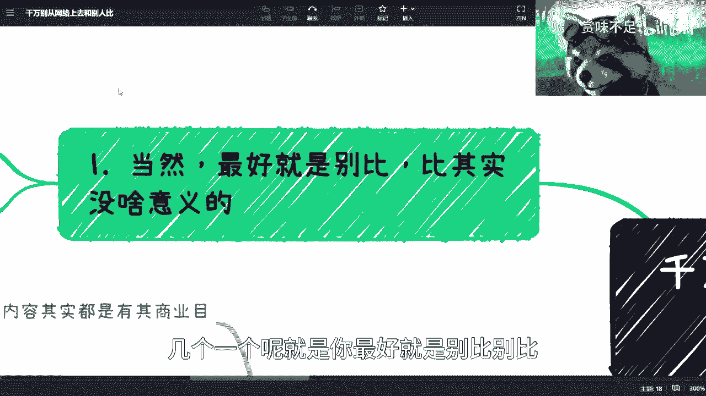

# 课程 P1：如何避免无效焦虑与攀比 🧠

在本节课中，我们将学习如何正确看待朋友圈和网络信息，避免陷入无谓的焦虑和攀比。核心观点是：**减少关注，保持客观，专注自身**。

---

## 核心观点：保持客观，减少关注

核心观点是：**不必过度关注他人动态，保持客观认知即可**。对于任何事情，能参与是幸运，不能参与也坦然接受。攀比没有上限，只会带来无尽焦虑。

---

## 朋友圈信息的本质与处理方式

上一节我们介绍了核心观点，本节中我们来看看如何处理具体的朋友圈信息。

我有数千好友和数百个群组，联系人三教九流，信息繁杂。但我基本不看朋友圈，因为大部分人发的内容都有其特定目的。

以下是处理朋友圈信息的几个要点：

*   **信息具有目的性**：无论是营销、展示生活还是单纯分享，每条内容都带有发布者的目标。了解这一点后，看一次和看十次没有区别。
*   **重要信息不会错过**：真正重要的信息，即使我当时不知道，也会通过其他渠道（如群聊）晚几天获知。如果连我广泛的人际网络都不知道，那很可能不是关键信息。
*   **建立认知标签**：为联系人建立大致印象标签。了解其发帖风格和目的后，便无需逐条细看。

因此，我刷朋友圈的时间极少，每月不超过20分钟。当有人问我是否看到其动态时，我的回答是：**不想看**。

---

## 网络信息的“一折”认知法则

处理完朋友圈，我们再来看看更广泛的网络信息。对于网络上的各类宣称，我采用 **“打一折”** 的认知方式。

**公式：网络宣称价值 × 0.1 ≈ 实际可感知价值**

这意味着：
*   若有人说融资1000万，在我看来其可支配资金可能约等于100万。
*   若有人宣称政府合作、大型项目等，我也默认其实际掌控力或变现能力只有宣称的一成。

因为很多网络展示并不代表发布者拥有主控权或一定能从中获利，可能只是为了招商、吸引合作伙伴或营造形象。不必过于在意这些内容。

---

## 攀比的陷阱：与空气斗智斗勇

了解了信息本质后，我们深入探讨攀比行为本身。攀比只会导致焦虑，这是一种 **“与空气斗智斗勇”** 的行为。

以下是攀比带来的几个问题：

*   **没有上限，徒增焦虑**：比较对象可以无限上升，从身边的人到王思聪，再到更遥不可及的人物。这只会让你越来越焦虑。
*   **忽略现实差异**：普通人的底线没别人低，上限也没别人高。既拉不下脸面，资源也可能不如别人，比较没有意义。
*   **陷入“空气斗智斗勇”**：你非常在意别人的生活和工作，但别人可能根本不关心你。你的焦虑和比较对象是“空气”，浪费大量时间精力却无实际收获。
*   **消耗宝贵时间**：沉迷于刷朋友圈和网络，可能不知不觉消耗数小时，导致一事无成。

---

## 理解差异：风光背后的多样性

每个列表前要有简短的一句话介绍，以下是理解个体差异的几个关键点，这能帮助我们更理性地看待他人展示的生活。

*   **背景资源是关键**：网络上许多“天赋异禀”、“年少有为”的故事，其基础往往是深厚的家庭资源（知识、金钱、人脉）。这不是普通人通过努力就能简单复制的路径。
*   **生活选择各不同**：有些人过得潇洒（如丁克、月光），是因为他们做出了并承担了相应的选择。如果你因为家庭、观念等原因无法做出同样选择，那就无需羡慕，更不必对比。
*   **焦虑导致行为变形**：我认识一位能力很强的朋友，但因过度与他人比较而异常焦虑。这导致他在合作中急于求成，行为浮躁，最终把好事办坏，既没赚到钱也坏了口碑，连朋友关系都难以维持。

**核心原则**：**缺了谁，地球都照转**。对于让你持续焦虑、消耗精力的人际关系或信息源，要学会断舍离。很多烦恼都源于放不下那些鸡毛蒜皮的事。

---

## 总结与行动指南

本节课中我们一起学习了如何避免无效焦虑与攀比。

1.  **核心态度**：得之我幸，失之我命。专注于自己能控制和影响的事。
2.  **信息处理**：理解朋友圈和网络信息的**目的性**，对网络宣称采用 **“打一折”** 认知法。
3.  **停止攀比**：认识到攀比**没有上限**，是 **“与空气斗智斗勇”**，只会浪费时间和制造焦虑。
4.  **理解差异**：看清他人“成功”背后的**多样性因素**（如资源、选择），不进行简单粗暴的比较。
5.  **果断取舍**：对于消耗精力的信息源和人际关系，践行 **“断舍离”** 。记住 **`缺谁地球都不会不转`**。

改变始于认知的每一个微小细节。从今天起，试着减少无关信息的摄入，把注意力放回自己的生活与成长上。