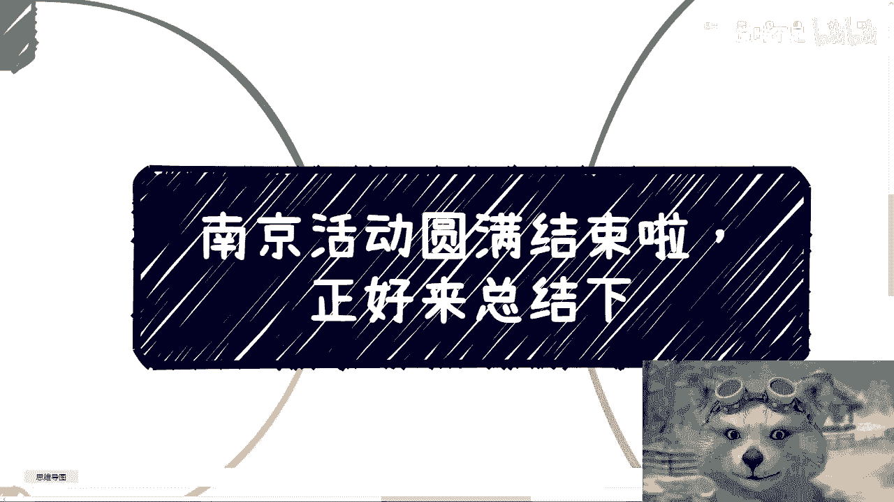
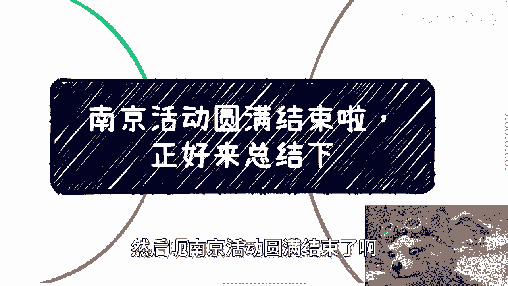
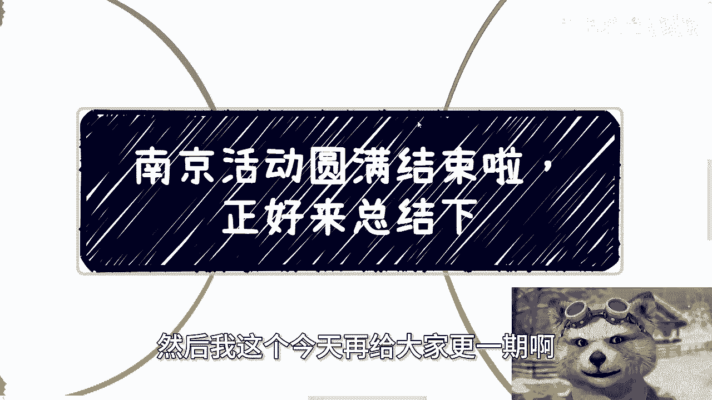
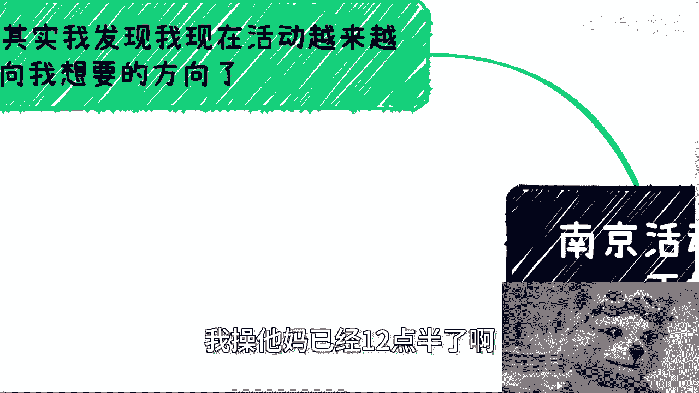
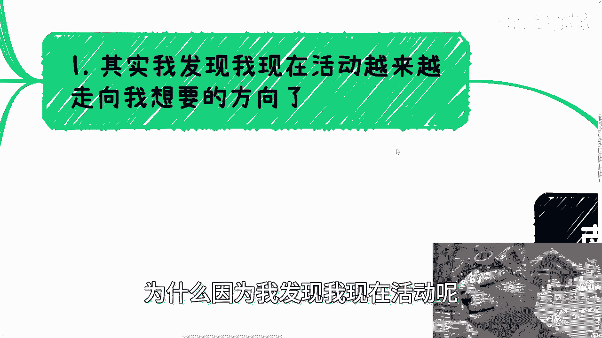
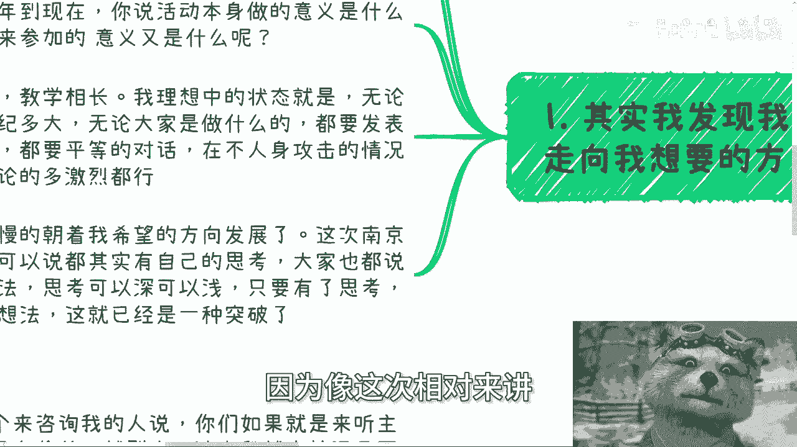
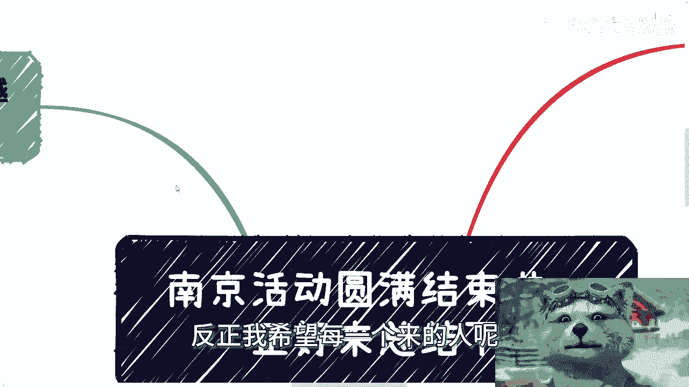
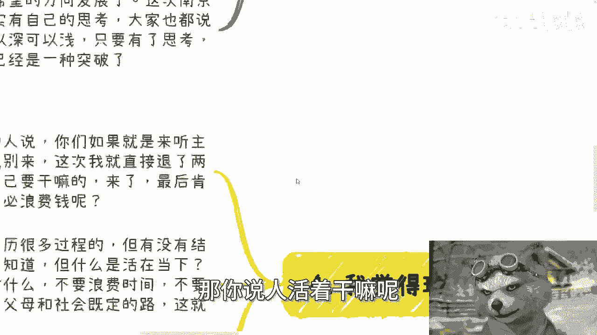
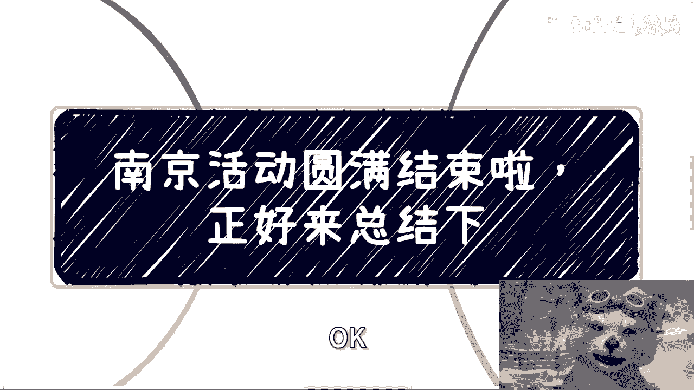

# 课程 01：从南京活动谈个人成长与商业认知 🧠

在本节课中，我们将通过分享者对南京活动的总结和几个近期故事，探讨关于有效沟通、资源利用、价值判断与个人成长的核心议题。课程旨在帮助初学者建立清晰的商业思维，并鼓励突破固有认知框架。

---

## 活动总结：走向理想的对话模式

上一节我们介绍了课程概述，本节中我们来看看分享者对南京活动的总结。他认为活动正朝着理想的方向发展，即创造一个对等、开放的对话环境。

活动的理想方向是“教学相长”。这意味着所有参与者，无论背景如何，都应勇于发表想法并进行平等辩论。对话不应因年龄或资历而产生权威压制。在不进行人身攻击的前提下，激烈的讨论是有益的。

分享者以自身经历举例，他曾与合伙人发生激烈争论，但核心是**摆事实、讲道理**。直接沟通优于背后抱怨或突然终止合作，后者是逃避和小人行径。

南京活动的参与者都展现了独立思考，并积极沟通。只要有自己的思考并愿意表达，就是一种突破。分享者希望每位参与者都能抱着自己的想法前来，并尽可能与他人交流。

---

## 故事一：审视所谓的“资源”与“大佬”

在了解了理想沟通模式后，我们来看看如何理性看待所谓的“人脉资源”。分享者最近遇到两个案例，都涉及与“资源型”伙伴的合作问题。

以下是审视这类“资源”时需要谨记的两点：

1.  **资源的真实性存疑**：对方所宣称的资源或关系网络，其真实性需要打一个问号。
2.  **缺乏商业逻辑则资源无用**：核心在于**商业逻辑**。如果你不知道如何利用对方赚钱，或不知道如何与对方合作共赢，那么认识再厉害的人（SSR级资源）也毫无用处。

许多人常说“我有很多资源，但不知道如何盘活”。这句话的潜台词是“这些资源对我没用，而且我不会用”。这就好比一个人自称天赋异禀，但考试永远不及格。

初学者不应幻想去“盘活”别人的资源。由于存在巨大的**信息差**（例如，对方可能只是四度、五度关系），你不仅难以成功，还可能被骗。成长需要一步步来，不要妄想一步登天。

---

## 故事二：关于“价值”的傲慢与束缚

上一节我们讨论了资源的有效性，本节我们来探讨一个更根本的问题：如何定义事物的“价值”。分享者曾激烈批评一位朋友，核心就在于其“价值点”的认知。

批评主要围绕两个价值认知误区：

1.  **自我设限的“英雄主义”**：那位朋友手握能高性价比赚钱的资源，却因认为“没有价值”而不愿去做。分享者指出，这并非英雄主义，而是**傲慢**。完全可以在进行高性价比商业活动的同时，去做自认为有价值的事，而非走极端、自我设限。
2.  **主观否定市场价值**：那位朋友认为高利润的事缺乏价值。分享者以金融行业（如中金公司）的高薪为例反驳：**存在即合理**。一个事物能持续产生高利润，必然有其内在逻辑和市场合理性。仅凭个人三观去否定其价值，是一种自我束缚。

这让人联想到《头文字D》的剧情：主角一度因依赖马力优势取胜而感到不光彩。但在胜利面前过分纠结方式，本身就是一种束缚和傲慢。

---

## 核心观点：活在当下，勇于探索新路

在分析了资源和价值的误区后，我们最终回归到个人行动的层面。分享者强调了活动的价值在于激发思考，而非被动听讲。

他退还了两位不明目的参与者的费用，因为对于成长而言，**清晰的自我诉求**比盲目参与更重要。我们无法控制最终结果，但可以决定当下的行动。

**活在当下**意味着：
*   不浪费当下时间。
*   不走别人走过的老路。
*   不盲从父母或社会的既定框架（如考公考编）。可以将旧有认知作为参考，但绝非唯一指南。

个人活着的意义与社会的进步，在于**不断尝试新事物**。如果每个人都只走老路、只做自己认知内“有价值”的事，社会便无法发展。每个生命都宝贵，其价值体现在对未知的探索，而非重复（Ctrl+C/Ctrl+V）他人的生活。

固然人人都有困境，但在能力范围内**迈出第一步、突破瓶颈**就是成功。成功不应被狭隘地定义为赚多少钱，更不必在意他人的定义。

---

## 课程总结

本节课我们一起学习了从一次活动延伸出的多重思考：
1.  我们探讨了**平等、辩论式沟通**的价值。
2.  我们分析了所谓“资源”的真相，指出没有**商业逻辑**支撑的资源毫无用处。
3.  我们批判了在“价值”判断上的**傲慢与自我束缚**，强调要尊重市场规律。
4.  我们最终落脚于**个人行动**，鼓励活在当下，勇于探索新路径，以此定义属于自己的成长与价值。

希望本课程能帮助你建立更务实、更开放的思维框架。