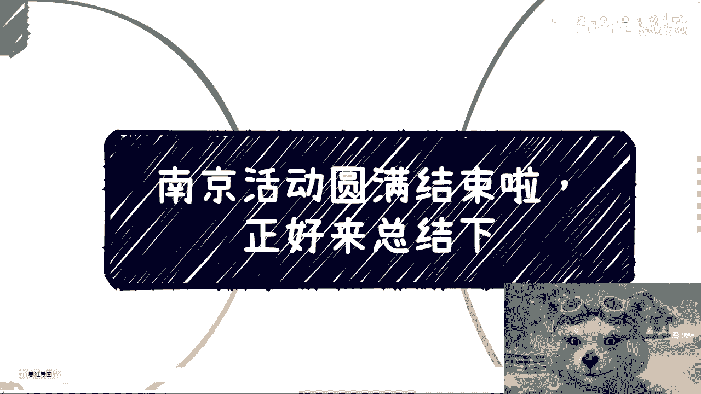
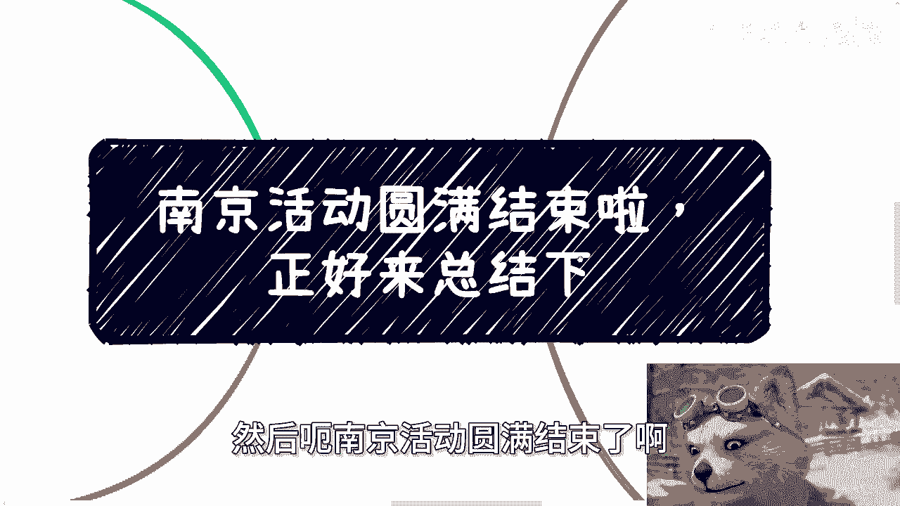
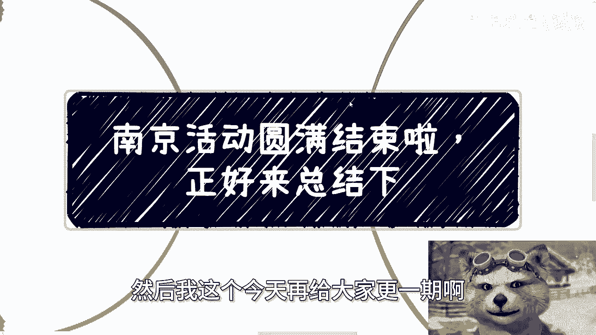
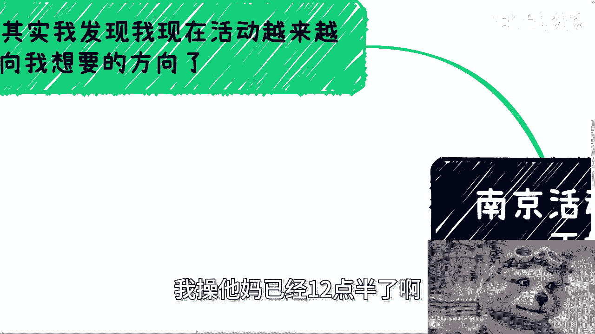
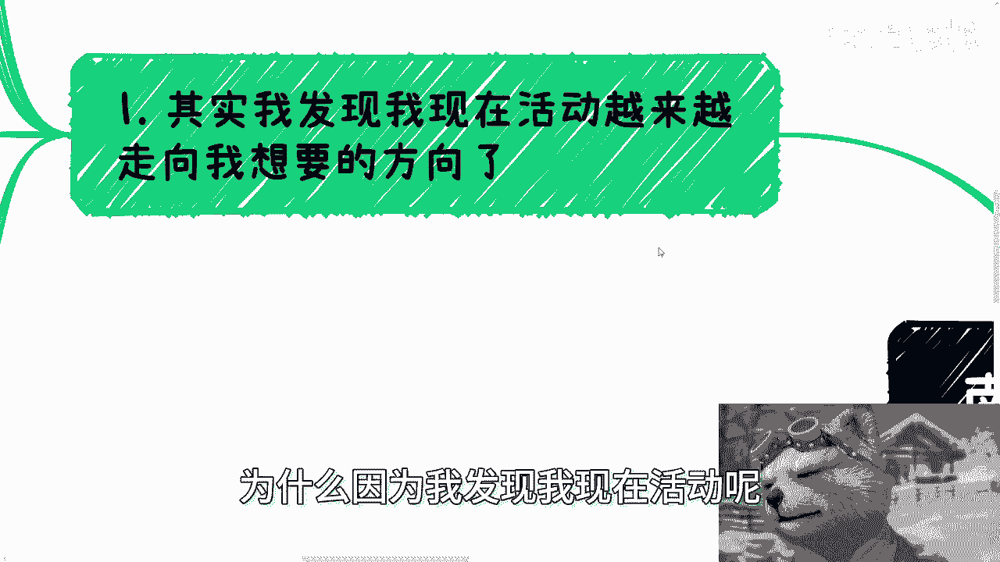
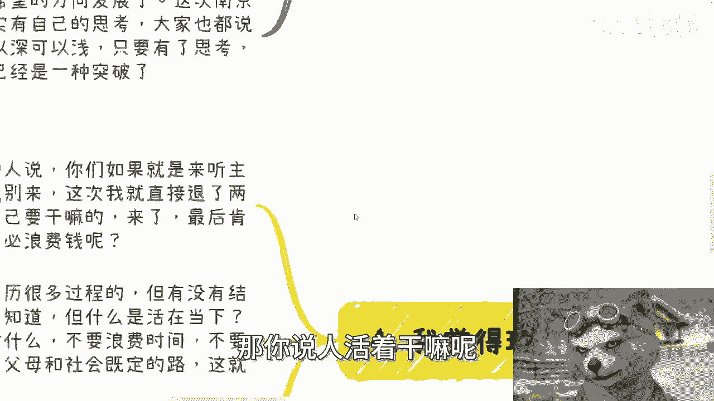
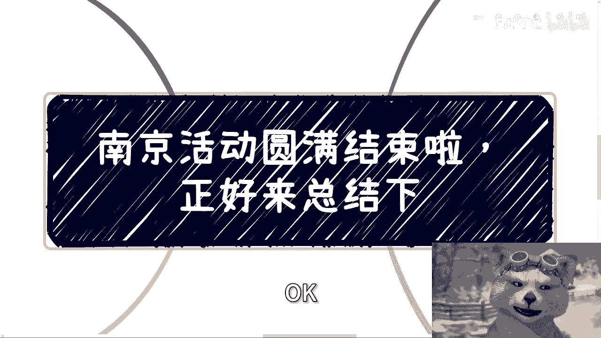

# 南京活动圆满结束，正好来分享几个故事 - P1 - 赏味不足 - BV1Nf421q7K5

好大家好，然后呃南京活动圆满结束了啊。

然后我这个今天再给大家更一期啊。

那就正好来总结一下，因为现在比较晚了，我已经12：30了哦。

呃我说实话啊，我蛮开心的，为什么，因为我发现我现在活动呢。

也越来越走向我想要的方向，什么是我想要的方向啊，就是我觉得嗯从去年到现在啊，你说有很多人啊，我相信就是不管是支持我的还是举报我的啊，我说活动本身呢，他们很多人都会觉得，做活动本身的意义是什么啊。

包括就是说大家来参加的意义又是什么啊，我觉得俗话说得好啊，就教学相长什么意思呢，就是我理想中的状态啊，就无论谁啊，无论年纪多大，无论大家是做什么的，就大家就勇来都来了嘛对吧，就勇于发表自己的想法。

就所有的对话都是对等的啊，不会因为说哦因为某个人年纪大，所以他就是用就觉得自己讲的有道理，或者来说有个某个人啊，好像就是你经历了很多对吧，或者他做过些什么，他讲的有道理，不是的，就有没有道理。

大家可以来辩论嘛对吧，就大家可以来讨论嘛，而不是说就是说啊一方来讲啊，另外一方就觉得是来听的，那我觉得这种没有意义啊，所以我觉得在不人身攻击的情况下面，就无论讨论多激烈都无所谓啊，我给你们打个比方。

你就像真的我跟你们讲啊，这不夸张的说啊，你就像我以前跟我就是很多合伙人，因为我也做过很多项目嘛，就是我会跟我以前合伙人开会的时候，我就直接指着他鼻鼻子骂我，说就是个，你明白吗，我而且我跟你们说。

我这不夸张，一一不夸张的说，我就很直接的啊，当着所有人面，我就跟他说，我说你听清楚你就是个对吧，但是啊但是我会跟他讲的，就是你摆事实讲道理嘛对吧，你得跟他说他为什么吗，对不对，那当然你表达了你的态度。

他要是冥顽不灵啊，或者说他就是就不愿意改，那无所谓对吧，但是就是说你要去跟他去讲这么一个事事情，你不是说你不是说你说啊，我事情不讲他啊，然后呢我背后说他坏话啊，或者说我就他妈的啊，突然第二天就不合作了。

你这种叫什么这种嗨，这种就是逃避啊，这种就是妈的啊，小小人质小人之行啊，所以我觉得就说实话呢，我觉得现在这个活动呢，就慢慢朝着我希望的方向发展，因为这次南京来的小伙伴呢。

我觉得可以说其实都很有自己的思考啊，然后呢大家也都说了呃，很多自己的想法呃，思考可以深啊，可以浅啊，只要有了思考，有了自己的想法，我觉得这就是一种突破，就是很好的啊，那当然了，这个可能也有很多原因嘛。

因为像这次相对来讲可能场地比较封闭啊。

或者怎么样子啊，但是不管怎么样，反正我希望每一个来的人呢。

都抱着有自己的想法，而且尽可能的去沟通啊，跟我也好，跟别人也好都行啊，然后第二啊我跟我分享个最近的故事啊，就是好呃，前两天呢我在上海这边见了一个朋友啊，被我他妈的喷了一个下午啊，那好巧不巧呢。

前两天有一个咨询呢，也正好提到了同样的话题啊，我就拿出来跟大家正好说一下啊，就是我那个朋友呢和这个咨询的人呢，都跟我提到了啊，就是说有个合作伙伴啊，怎怎么样怎么样怎么样啊，然后估计呢。

我觉得我那个朋友跟这个所谓的合作伙伴呢，在你们很多人眼里呢，他就是所谓的大佬，为什么，因为他们手上的确呢也认识了一些人啊，或者说有一定的资源啊，嗯同样的呢就是说呃可能也还不错啊，所以说我觉得这些资源呢。

可能如果从抽卡的角度来讲，至少是个SR啊，或者里面有部分SSR这样子啊，但问题来了，问题是这些人啊，我们得要谨记两点，就像我他妈为什么喷他啊，我说一方面，他们所讲的资源或者关系是否都是真的。

我们姑且是打个问号对吧，这是第一点啊，第二点是最重要的一点，无论你认识谁，只要你没有商业逻辑，简呃就啊对，只要你没有商业逻辑，简单来讲就是你不知道如何利用对方，我说的直白点利用啊。

你不知道如何利用对方去赚钱，你也不知道如何让对方赚钱，就是你也不知道你们双方怎么一起合作赚钱，再认识SSSSR的人也没有用啊，有卵用呢，对不对啊，记住啊，你们可能一直会听到一句话。

叫什么叫做我有很多资源，但我不知道怎么盘活，你知道吗，就这句话的意思是什么，这句话的意思就是我有这些资源，但是没有用啊，而且我我也用不来，我再增加一句，这种人说这种话意味着就是告诉你，他就是个。

为什么呢，因为那那很简单啊，你你你就像告诉我什么，你就像告诉我说哎呃我很有天赋啊，我很有就是呃就他这种话什么意思啊，他这种话就会跟你说，哎你看啊，我这个呃天赋很好啊，我读书很行啊。

我觉得我自己他妈的语数外，各种各样的这个学科非常精通，然后就是只要到考试，或者说只要你去考核，他考不出来啊，比如说就不及格对吧，就是他不是单纯一次不及格，他他妈永远不及格，对不对，所以说就说你跟我讲。

就是他跟我你你跟我讲这么说啊，这么多，你说我有很多资源，我又怎么样子，那有卵用啊，结果就不就不就是你不会盘活吗，对吧，当然啊，你们要记住一点啊，你们也不要想着说哦，因为他有资源，他不知道怎么盘活。

那我们可以帮他盘活啊，不可能哦，不可能的，我给你讲，为什么，因为你们跟他们的资源之间，可能会有很大的信息差，你懂吗，就是他所谓的资源到底是不是一度关系，你都不知道，万一他可能是个四度关系，五度关系呢。

哦他自己都盘不活，还想去盘活哈，我我跟你讲，今天活动现场我也说了，不要想这些事情哦，不要想这些事情，你能不被骗就不错了，慢慢的不要去想着说啊，我还能去盘活别人资源，一步一步来啊。

你不要想着一一下子吃成个胖子啊，第三也是今天最重要，包括前两天我喷他最重要的那个点，就是关于价值点的讨论，就是那天下午啊，我喷他的价值点上面主要有两个点，第一我说很你。

你手上这些牌绝对是有很多的高性价比的，赚钱的方式，或者说高利润的方式，那我说你为什么不做呢，对吧，我说你明明这些资源可以做得到，你为什么不做，你们知道他怎么说的啊，他给我的逻辑是我不想哦。

我呃就是他不想，他认为没有价值啊，他说总要就是呃有点有点，有些人做有点价值的事情啊，他原话是这么讲的，然后我是怎么说的，我说大小姐，你这不是英雄主义啊，你这是傲慢，你懂吗，为什么。

我说一方面你明明拥有高性价比赚钱的能力，同时你又不愿意去做，而且你明明是可以在做高性价比的一些事情的，同时去做点有价值的事情，你为什么要去走极端呢对吧，你为什么要自己把自己的路封死呢。

而自己再给自己套个框，叫做有价值对吧，另外一方面是这个社会比你强的人多了去了，也轮不到你来做菩萨呀，你这不是傲慢是什么，对不对，第二点就是价值点，我说你认为那些高利润的事情。

或者高性价比的事情就没有价值，那我问你，我给他随便举个例子啊，我说中金平均年薪120万，现在降薪之后大概75万到80万，怎么了呢，哦我说按照你这个想法，按照你这个说法，所有金融相关的。

所有他们做的事情都没有实际价值了，或者说你认为他们的价值都很差，那我就问为什么这个社会，为什么这个行业为什么从古从以前到现在，他们就拥有能够比很多人高的年薪呢，为什么呢对吧。

我们叫有一句话叫做什么叫做存在即合理对吧，我们不先不来判断这个合理是对还是不对，我们也不来判断这个合理是额叫什么，就是正确与否对吧，但是它存在一定有它的道理，那么这个你你你你单纯用你的三观来判断。

说这个东西没有去没有价值观，噢，没有不是没有价值观，没有价值，那为什么是到底谁在束缚你呢，你为什么要自己束缚自己呢，对不对，这就让我想到了这就头文字D啊，我不知道你们有没有看过，就头文字D动画。

其实里面有一集说的是什么，就是主角他用的A186是马力，相对来讲比较弱的哦，然后他靠的一，一直都是自己的过弯技巧和下坡的一种技巧，对吧，直到某一级哦，他发现他的马力能够在直线超越对方，但是他犹豫了。

为什么，因为因为他觉得，这不是一个光明正大的胜利方式，他这不是一个有技术的胜利方式，但是往往这是什么，这就叫束缚，为什么，卧槽跟我在胜利面前谈方式，这不是傲慢是什么，对不对啊，那么第四啊。

就是我觉得呢还是回到那个点，我觉得现在活动就很有价值啊，就是我一直跟每个来咨询我的人都说，我说你们如果都是来听主题的，你们就别来啊，包括这次南京活动，我直接退了两个人的费用哦，因为为什么，因为对我来讲。

我很清楚这种不知道自己要来干嘛的，他就算来了，他最后得到的价值一定是最少的，那何必浪费这个钱呢对吧，我也不想赚这几百块钱啊，另外一方面，我们走到一个结果是需要经历很多过程的。

但有没有结果我们不能控制对吧，哦你说难道咳这就很很很好玩，你知道吧，难道你说哦我必须知道我能活到100岁，我才活下去吗，那如果我知道我不活到100岁，我他妈现在就去死吗，你逻辑不是这么个逻辑啊，对不对。

所以说我们不，我们不知道未来这个结果到底怎么样，但是什么叫活在当下，活在当下，就是我们需要知道当下做什么，你不要浪费当下的时间，不要去走别人走过的路，不要去走父母跟社会既定的那些路。

甚至也不要去走他们以前的那种古老的，old的fashion的那些认知所给你框架的路对吧，你说OK他们的建议我可以听，我可以当做一种参考，但是我不是完全无脑的去走他们说的那些路。

那这就是我认为我们现在这些人活着的意义啊，对吧，我们只有不停的去尝试新的东西，这个社会才会有发展嘛，卧槽否则哪来的法杖啊，哦每个人都说噢我们只走老的路哦，每个人都说我只做有做，我自己认为有价值的事情。

那他妈还怎么突破，对不对，那你说人活着干嘛呢。

啊，我们难道活着就是为了满足我们父母的愿望哦，满足他们嘴里面的那些所谓的考公考编，既定的路，那我就不明白你这一辈子活着干嘛，这个就是就我们就说每个生命都很宝贵对吧，那那你你得有价值啊对吧。

那这个价值就是不停的去探索新的东西，而不是去每个人去走CTRLCCTRLV的这种路啊，那固然啊，固然我相信每个人都有每个人的困境对吧，家家都有本难难念的经没有错，但是你在你能力所能及的范围内走出第一步。

突破瓶颈，这就是好的，但又不是说一定要啊做成什么样的结果对吧，一定要什么啊，赚到多少钱才算成功，没有人这么讲过啊，更何况他妈的别人讲，关我吊事对吧，好嘶唉行呀，我觉得蛮好的，蛮开心的啊。

真的嗯下一期的话我还没想好好吧，你们等我想好，我再想想吧，放在什么城市啊，反正我到时候再通知你们啊，行啊，那就这么着，那么这次我就不废话了，那么剩下的话就是说股权期权啊，商业商业规划啊，那个职业规划嗯。

合同啊，嗯分润分红，包括商业计划书白皮书啊，包括你们有什么详细的问题呃，你们希望通过跟我的沟通，以我的一些对社会的接地气的这个认知，或者说以我的对当下整个经济发展的一个认知。

希望我能够给你们一些更好的规划，或者更接近于地区的一些建议的话，你们可以整理好对应的问题跟背景好吧，我们再来走咨询。

