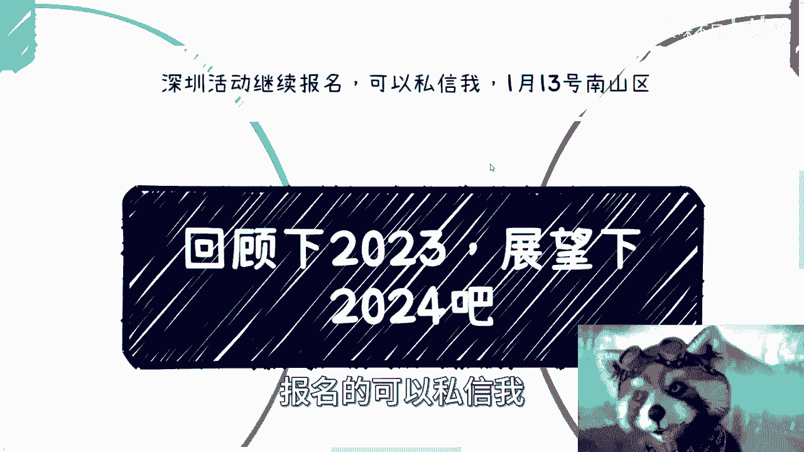
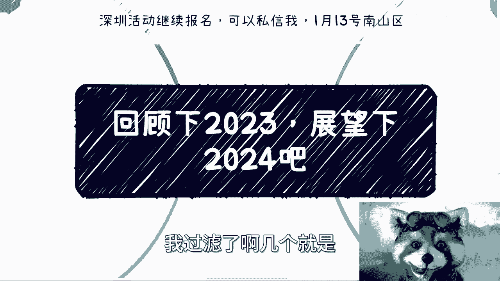
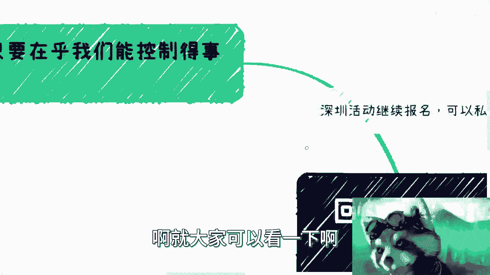
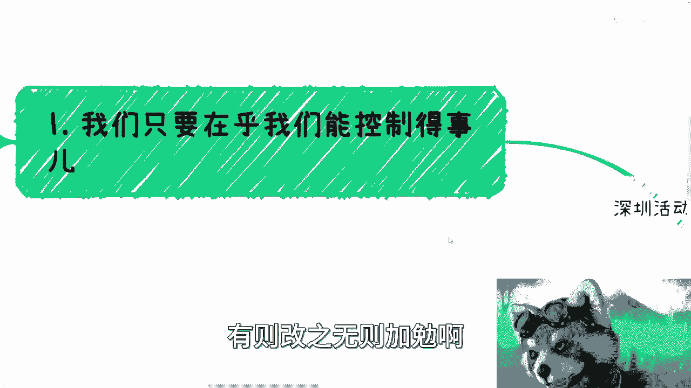
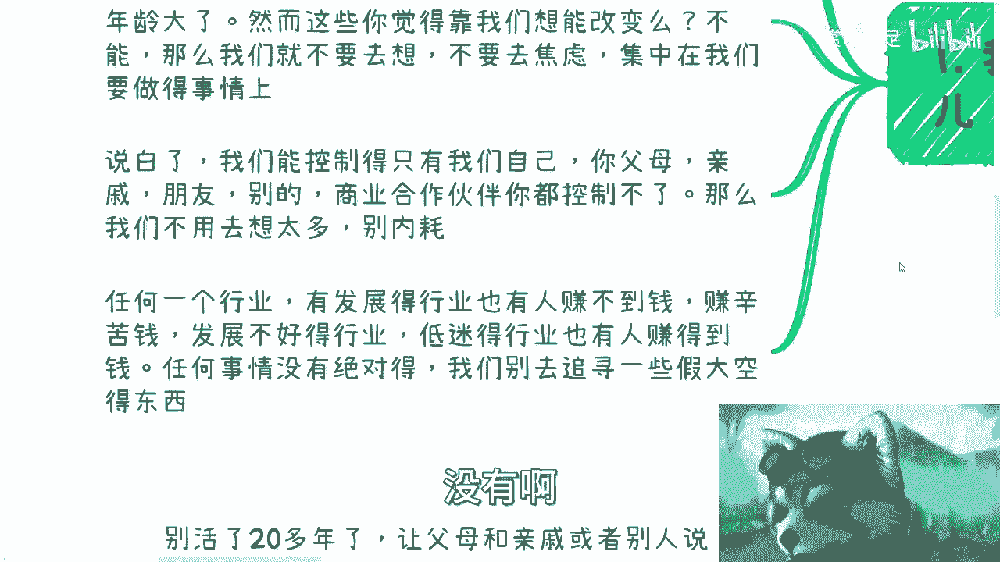
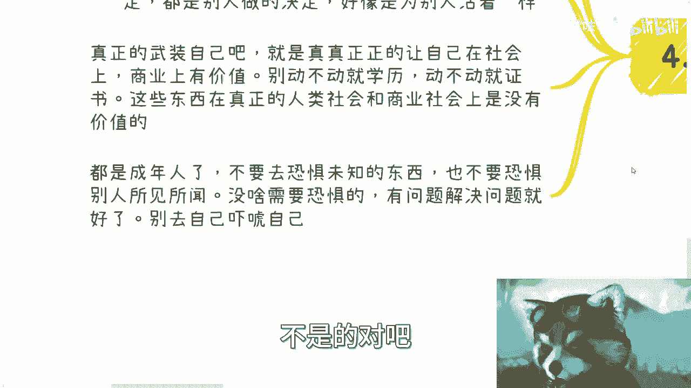
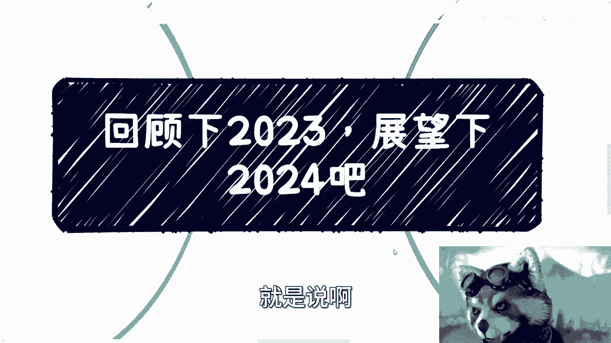

# 去他喵的2023！！！ - P1 - 赏味不足 - BV1WC4y1i7mY

好大家好啊，今天是2023年的最后一天，晚上弄了个直播。

就扯扯淡就扯扯淡，首先啊这个深圳活动继续报名啊，报名的可以私信我。

在1月13号在南山区好吧，然后我这两天会给大家拉个群啊，再告诉大家这个详细的这个地址啊，嗯就最后一天呢我觉得就回顾一下2023啊，展望一下2024呃，但是本质上呢就是也没什么细节要要回顾的。

也没什么细节要展望的呃，我觉得我拎了啊，我过滤了啊几个，就是这是我认为最最大的问题吧。

啊就大家可以看一下啊。

啊有则改之，无则加勉啊。

呃第一个就是我们只要在乎，我们能控制的事情啊，就是不要去在乎所有不能控制的啊，呃你在乎的就是内耗没有意义啊，我今年最早的时候，就是在B站还没有给我流量之前，我最早的时候说的观点是。

什么叫做三到5年大家都要面对失业对吧，这个是应该说最多的人看过的一个视频，但其实本质上我不是说大家一定会失业啊，而是说工作这个东西我们控制不了你，签劳务合同，我们怎么控制呢，对吧。

你就像很多人咨询我的时候跟我说，创老师我想找一个稳定的工作，他妈的哪来的稳定对吧，老百姓都想稳定，谁不想呢对吧，我只是告诉大家，随着年龄的增加，随着这个目前的整个中国的趋势的发展。

失业是大部分人不得不去面临的问题啊，或者你可以这么理解，你可以不失业，但是你可能会不停的降低你的预期，不停的降低你的package对吧，那我们需要提前去考虑啊，不是说你们到了35岁，40岁再去考虑。

有意义了，没有意义了呀，对不对啊，然后这第一个，第二个你不要去想那些有的没的哦，好多人做事情就是想哎呀我没有竞争力，哎呀我不懂，我没有接触过，或者我年龄还小，或者我年龄已经大了。

但你们仔细想想看这些东西你想了有用吗，没有用啊，今天不会因为你想了你年纪就变大了，或者你想了你年纪就变小了，或者你想了你就有竞争力了，不会的呀，对不对，然而你靠这些东西既然不能改变。

那我们去想它干嘛呢对吧，你去那号干嘛呢，去焦虑干嘛呢，没有意义，你还不如把精力focus在你要做的事情上面，甚至就是你说他妈的老子不想做事情，我就想躺平也可以呀对吧，你开开心心过每一天不好吗，是不是啊。

说白了我觉得我们能控制的只有我们自己，你的父母，你的亲戚，你的朋友，你的这个everything，Everybody，你都控制不了，有用不啦对吧，你就你就像我们以前说的啊，我要做我，我可能是个舔狗对吧。

或者我可能是很在乎别人眼光，没有用啊，因为你在乎也好，你不在乎也好，害怕也好，不害怕也好，你不改变任何事实，对不对啊，好还有一个啊，就是很多人说的那个行业一样的道理，就是有发展的行业，有前景的行业。

也有人赚不到钱，他赚的辛苦钱，发展不好的低迷的行业，也有人赚到大钱，对不对，就是你任何事情他没有绝对，那我们为什么要111味的去追求，那些假大空的东西呢，对吧没有用的呀，就是那而且还有很多人就说了。

他说他说有用的对吧，这个是概率问题吧，我进一个好的黄页，我赚到钱的概率就大，你仔细听听看这句话，这句话有道理吗，有的但是是屁话呀，对不对，就是就是这个道理是对的，但是这件事情跟我跟你有什么关系呢。

没有你用这种话。

就是PUPUA自己或者PUA大众没有用的。

对啊，第二点也是最核心的。

就是我觉得大家陆陆续续去接一下社会的鬼，就是说，无论你在什么学校，无论你做什么工作，也无论你在什么行业，无论你工作多少年，本质上啊，大部分人他其实是没有接这个社会的鬼的，什么意思呢，就是说其实。

你觉得你活在这个世界上，但是你碰到你会在社会上会碰到很多事情，会碰到很多人会碰到很多矛盾，也会涉及到很多的，比如说司法或者其他的，但是其实很多人你会发现你别说商业怎么做了，你碰到很多矛矛盾。

碰到很多事情，他知道怎么处理吗，他也不知道对吧，他可能只知道说哦，我要到网上去去去曝光啊，我要去他妈的网暴对吧，但是这是一个正常的处理事情的方式，是不是呀对吧，你说白了就是你活在这个世界上。

但又好像脱离了人类社会，你有没有这种感觉对吧，你不是一味的工作，一味的跳槽，一味的就是说啊我在工作当中啊，花了十多年，这不是一个接轨的逻辑，你这个就完全脱轨啊，啊接轨的核心其实是什么，就是说你要去社交。

你要去聊，你要去接触各行各业的人，然后积累不同的关系，这才是我们让自己能够，在未来的这个人类社会当中，又有更多的竞争力的核心，而不是说一味的去学习，去死学，没有用的，对啊。

那么第三点就是不要再PUA自己说，价值跟积累了，什么意思呢，就是最近的一些咨询对吧，好多小伙伴也跟我说，他说他认为做一件事情要有积累，要体现出唉，我写错了啊，要体现出自己的价值，要改变一些事情对吧好。

我就跟他们这么说，我说就跟我们刚刚说的那句话，就是说什么，他说啊我去一个好的行业对吧，赚钱的概率高一点，对没有错，这句话是对的啊，就是做一件事情有积累，要体现自己的价值，没有错，但是可惜的是。

大部分人认为的价值跟积累，就是你如何去定义价值和积累，对吗，你认为的价值跟积累积累在商业上，在社会上，对于很多我们称之为鸡的利益者，或者说那些那个真正的与我们，或者高于我们阶层的这些人。

与他们认为的价值和积累，他他妈的不是一个东西啊，你明白吗，就说白了，虽然我们的确不要刻意的去追求别人的认可，我们不要去刻意的去跪舔别人，但是你至少是需要就在这个世界上，得要有你的客户，得要有甲方爸爸。

得要有金主爸爸认可你吧对吧，否则你怎么体现你的价值，怎么体现你，你积累对吧，但是你真的认为你认为的价值跟积累，和金主爸爸认为的价值和积累，是他妈一个东西吗，对吧，其实是这么个逻辑。

就是你要问我这句话对不对对，但是很可惜很多人认为的这个东西，它它跟真正的商业上的，这个甲方爸爸所要要的东西它不是一个东西啊，你不能成你不能说中文博大博大，博大精深，对吧啊，这个就是大家搞文字关系。

他不是啊，那可是大家定义不一样啊对吧，然后关于2024，我觉得是什么呢，就是别的东西啊，我们以后明年再说，明年再说，但今年我们要说的是什么，就是展望一下是什么呢，就是你要做你自己对吧。

就是核心来讲就是别活了20多年，30多年，让父母跟亲戚或者别人老是说哎呀，你这辈子就这样了啊，你这辈子没有前景了啊，你这辈子比如说做不了什么大事，怎么滴了，我他妈活20多岁，你就说我做不了大事。

你先知啊，对吧，你也别活了，20多年，30多年对吧，自己没做过什么决定，都是别人给我做的对吧，好像就为了别人活着一样啊，我觉得核心点就是真正的开始武装自己，真正的要让自己在这个社会上拥有商业价值。

拥有社会上的这个正常的一个人的价值啊，别动不动就是说动学历，别动不动就是证书，因为你要明白，当你真正碰到事情，当你真正在人类社会需要一些帮助，需要赚钱的时候，这些只对你是没有帮助的，你仔细想想看对哦。

难道今天你去做一件事情，动不动他妈的把学历贴你脸上吗，我就问有人认吗，有人认吗，没有用的，这就好像大家都是标品，都是电池跑出来，自己说哎老子是金霸王，老子牛逼的吧，你这个什么垃圾电池跟我没得比。

有意义呀，对吧啊，我觉得都是成年人了，不要去恐惧未知的东西，也不要去恐惧别人的所见所闻，也不要去喝别人的鸡汤，没有任何的用处啊，没有什么需要恐惧的，为什么，因为你是一个成年人，有问题解决问题就好了。

有什么问题就解决什么问题，有任何问题总有解决的方法，不是说今天我们碰到问题，就好像判了死刑，不是的对吧。

你别自己吓唬自己，没有任何意义。

对吧我就给你们举个例子，这就像很多人跟我咨询的时候，说我办个活动吧，会不会有风险，我说有又怎么样呢，对吧有优怎么样呢，今天民警来了，警察叔叔来了，怎么了呢，对方是个人，你也是个人，沟通啊啊啊。

他总不至于他总不至于什么都不说，什么都不问啊，把你两个手一靠两个脚一靠滚来啊，绑走会问了，你自己思考一下，会不会啦，对不啦，有问题解决问题吗，沟通吗，啊你怕这个怕那个到最后就是一事无成，没有用的呀。

对不对，你包括前两天还有小伙伴问我说啊，这个啊，这个大家就万一自己家庭也没什么背景对吧，也也都是很普通的对吧，怎么样怎么样，那要不要去闯荡一下，我说这件事情你是成年人，你自己去考虑。

不是别人没有人架着刀在你脖子上说啊，你要去闯对吧，而且另外一方面是什么，就是你自己要不要穿，其实是你自己追求，你想未来要怎么样的一个生活，就是你不去做0%的概率，你去做哪怕0。000001%。

后面八个零，那你也是比0%来的好吧对吧，但是至于要不要这个东西是你自己决定的，不是别人说的对吧，你不要到处说啊，有问题了，说啊这个东西陈老师说的没问题，赚到钱了，哎你怎么没想到分陈老师点钱呢，对不对。

这一个道理呀，你不能说有事了，好陈老师的锅没事儿嗯，好跟常识没什么关系，不是那那那还怎么讲法呢对吧，而且我也早就跟你们讲过了，就是我呢就当每天跟电脑前的大家啊，通过网络，通过互联网就跟大家聊个天啊。

我也不传达任何的东西，为什么，因为传达也好，不传达也好，我这么说吧，听得进去的人他自然听得进去，听不进去的人，他自然会认为我是，无所谓的啊，对不对，那不重要啊，我少块肉嘛，我也不少，我多块肉嘛也不多。

对吧好吧，这个就讲这么多，哎呀预祝大家2024啊有新的发展好吧，也预祝不管整个全球经济，中国经济怎么发展啊，我都希望就是说啊。

当然同时呢也不管我们过得好，过得不好，我都希望大家能为自己过啊，因为人就活一辈子，何必呢，对不对啊，好啊，就这么着，拜拜拜拜啊，有什么咨询的。

