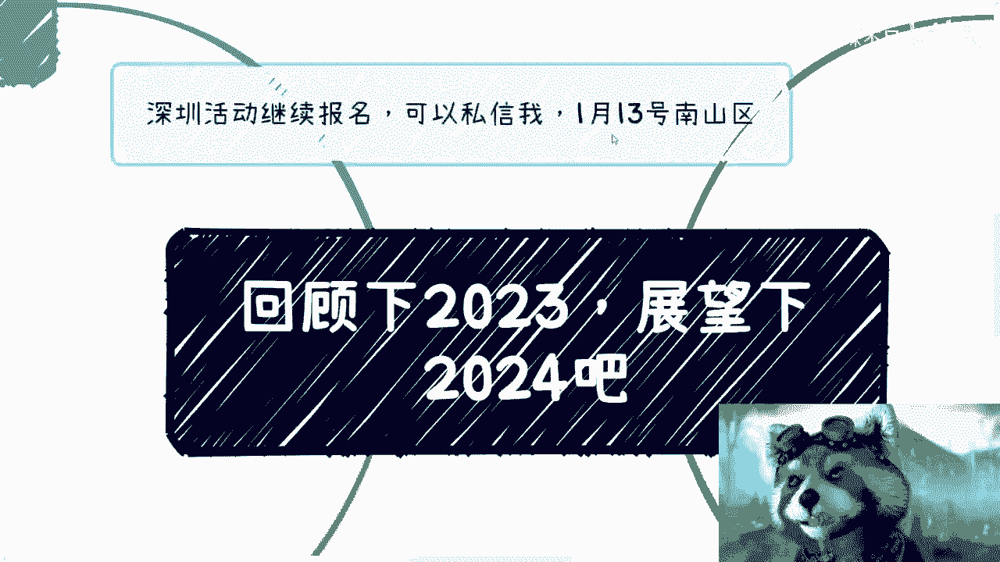

# 课程名称：告别内耗，拥抱现实：2023年终思考与2024行动指南 🎯

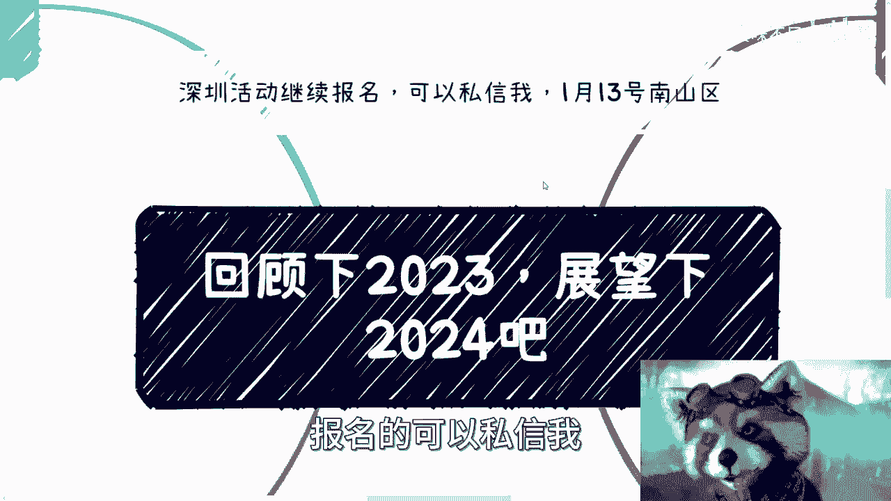

## 概述

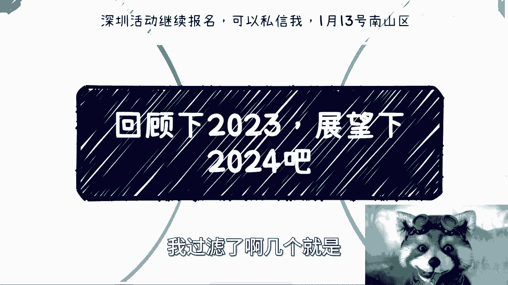

在本节课中，我们将一起回顾一段2023年末的直播分享。分享者探讨了关于个人成长、职业焦虑和现实认知的核心问题。我们将把这些思考整理成一份清晰的行动指南，帮助你摆脱无效内耗，聚焦于可控之事，并为新的一年做好准备。

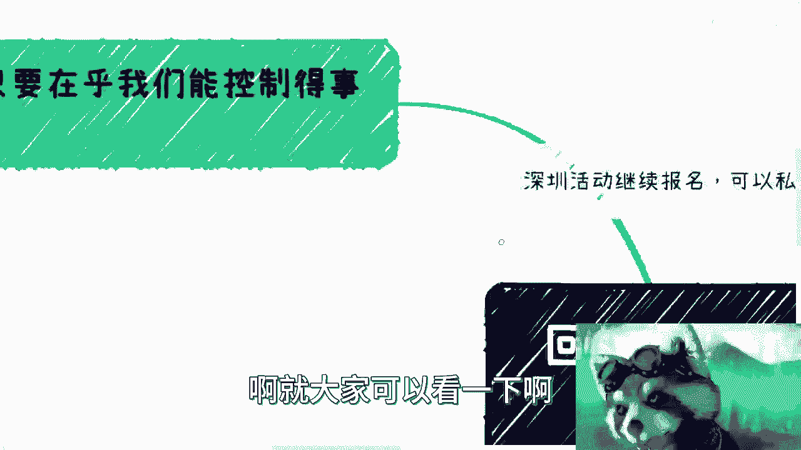

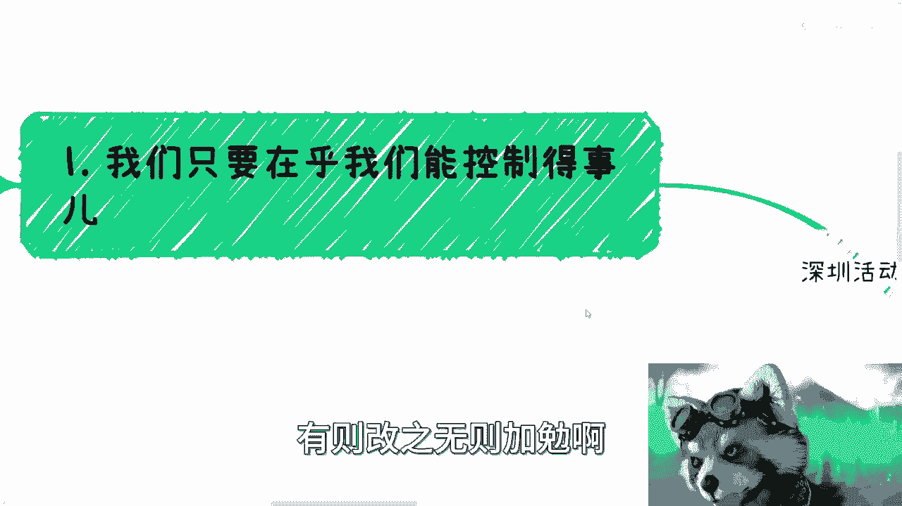

---

## 第一部分：回顾与核心问题提炼

上一节我们概述了本节课的内容。本节中，我们来看看分享者对2023年个人普遍存在问题的总结。他认为，最大的问题可以归结为三点。

以下是三个核心问题的提炼：

1.  **过度关注不可控之事**：人们常常为无法控制的事情（如大环境、他人看法）而焦虑，这导致了严重的内耗。
2.  **与社会现实脱节**：许多人长期生活在单一的轨道（如学校、固定工作）中，缺乏处理复杂社会矛盾与建立多元人脉的能力。
3.  **对“价值”与“积累”的认知偏差**：个人所追求的“价值积累”与商业社会、市场需求所认可的价值往往不是一回事。

---

## 第二部分：核心原则详解

### 原则一：只关注可控圈 🎯

上一节我们总结了三个核心问题，本节中我们首先深入探讨第一个原则。

分享者指出，内耗的根源在于为无法控制的事情焦虑。例如，担忧“35岁失业”趋势、行业前景或他人评价。这些宏观趋势或个人看法，单凭个体意志无法改变。

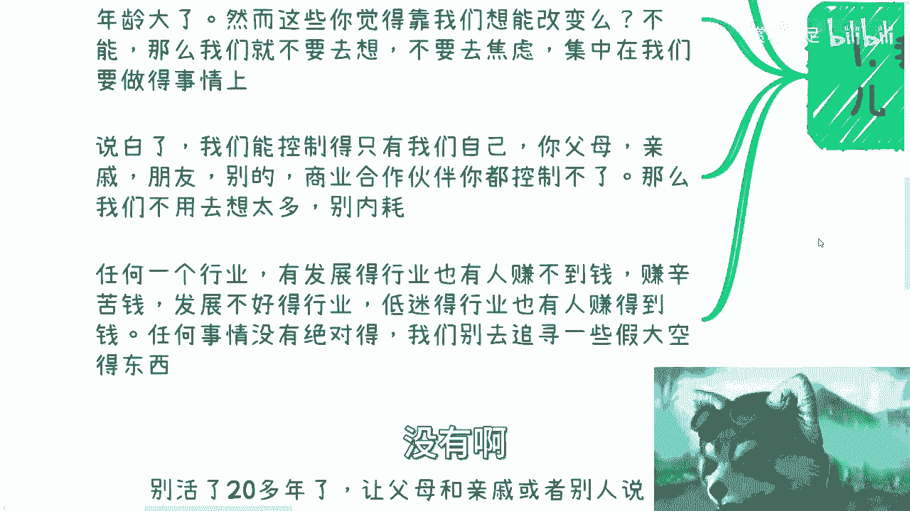

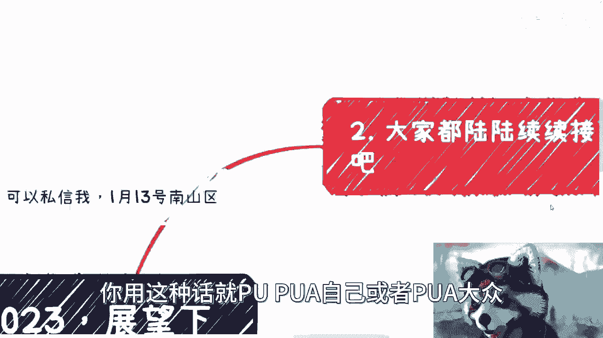

**核心公式**：
```
个人精力 = 聚焦于（可控之事）
无效内耗 = 纠结于（不可控之事）
```

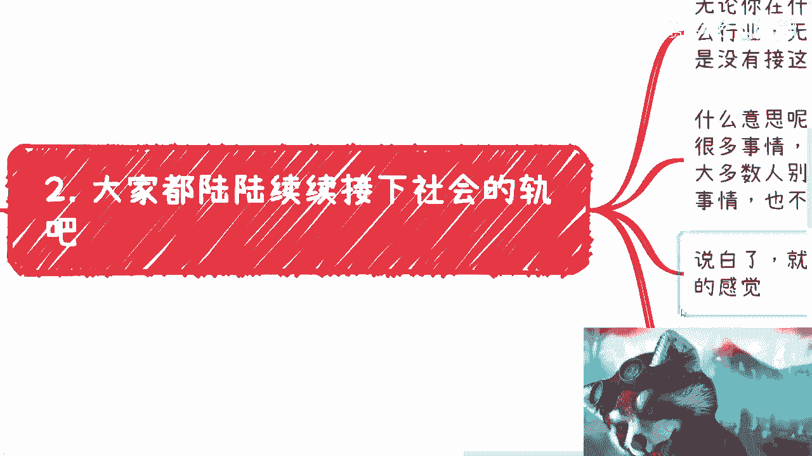

我们需要将精力完全聚焦于自己能控制的事情上，例如：
*   提升个人技能。
*   调整对工作的预期和心态。
*   决定今天是否要开心地度过。

对于不可控之事，过度思考不会改变任何事实。

### 原则二：主动“接轨”社会 🌐

我们了解了聚焦可控圈的重要性。接下来，我们看看如何避免与社会脱节。

“接轨社会”不是指机械地工作或跳槽，而是指主动融入真实的人类社会网络。这意味着你需要：
*   **处理复杂事务**：学习如何应对矛盾、纠纷，而非仅诉诸网络曝光。
*   **拓展多元社交**：接触不同行业、背景的人，积累真实的社会关系和人脉。
*   **理解运行规则**：了解商业、法律等社会基本运行逻辑。

这些社会经验和人脉网络，才是未来真正的竞争力，而非单纯的书本知识。

### 原则三：重新定义“价值”与“积累” 💎

上一节我们讨论了融入社会的重要性。本节中，我们来重新审视两个常被误解的概念。

许多人追求“有积累、体现价值”的工作，这个方向本身正确。但关键在于，**你对价值的定义，需要得到市场（“甲方爸爸”、“金主爸爸”）的认可**。

**核心认知偏差**：
```
个人认知的价值 ≠ 市场认可的价值
```

例如，你认为钻研某项高深技术很有价值，但若市场没有需求，这份“积累”就难以转化为商业价值。因此，在做任何“积累”前，应先思考：
*   谁会成为我的客户？
*   他们需要什么？
*   我的能力如何满足他们的需求？

避免陷入自我感动的“价值积累”，要寻找与市场共识的交集。

---

## 第三部分：2024年行动指南 🚀

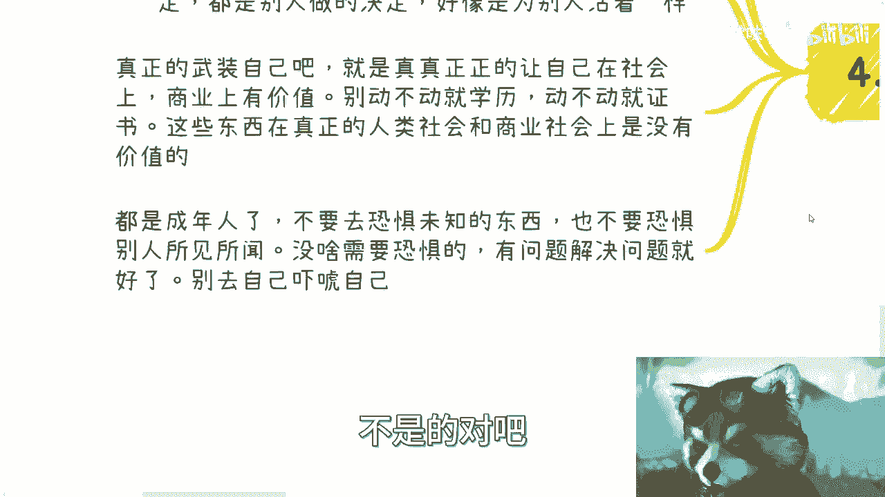

基于以上原则，我们可以为即将到来的新年制定更清晰的行动思路。

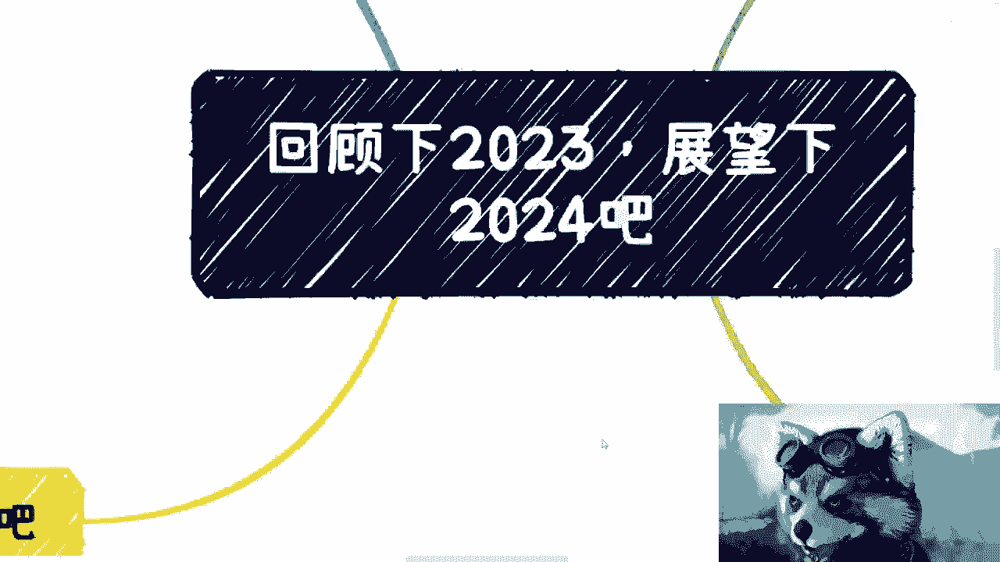

以下是具体的行动建议：

1.  **做自己的决策者**：不要让他人（如父母、亲戚）的评判定义你的人生可能性。你的人生决定权应掌握在自己手中。
2.  **武装真实能力**：减少对学历、证书等“标品”的依赖。社会看重的是你解决实际问题的能力、商业价值和社会适应力。
3.  **直面问题，拒绝恐惧**：成年人的世界，**“有问题，就解决问题”**。不要恐惧未知、恐惧他人经验或鸡汤故事。沟通和尝试是解决一切问题的起点。
4.  **为自己而活**：人生只有一次，生活的目标应该是追求自己的幸福与充实，而非活在他人的眼光和期望之中。

---

## 总结

本节课中，我们一起学习了如何告别2023年的精神内耗。我们明确了三个核心原则：**聚焦可控圈**、**主动与社会接轨**、以及**用市场视角重新定义价值**。基于这些原则，我们为2024年提出了行动指南，核心是**掌握人生主动权**、**培养解决真实问题的能力**，并**勇敢地为自己而活**。

记住，成长始于将目光从不可控的远方收回，脚踏实地地扩大自己的可控领域，并在真实的社会碰撞中锤炼价值。

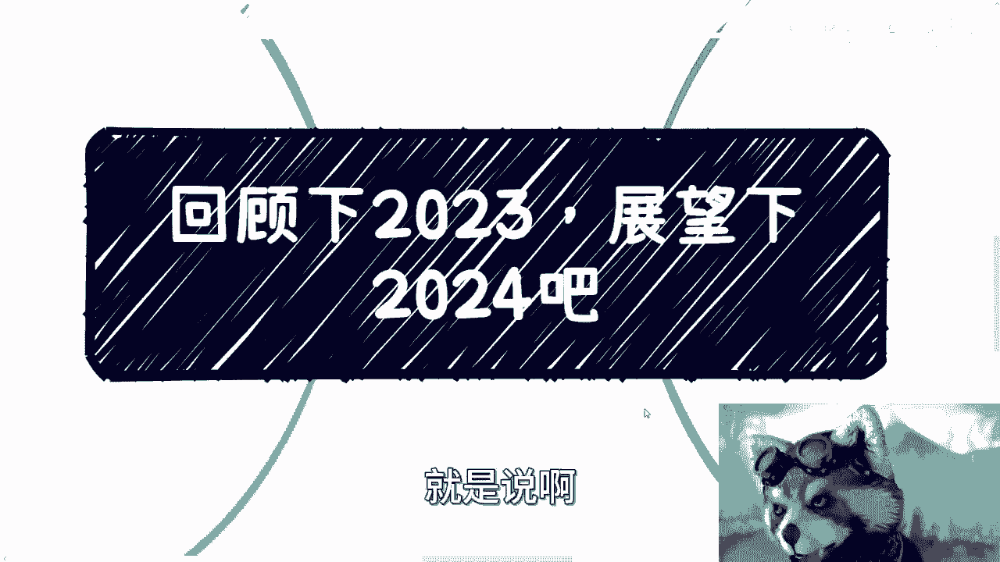

---

**附：直播中提到的深圳活动信息**
*   **活动时间**：1月13日
*   **活动地点**：深圳市南山区（具体地址将通过群组公布）
*   **报名方式**：通过私信分享者报名，后续将组建活动群。