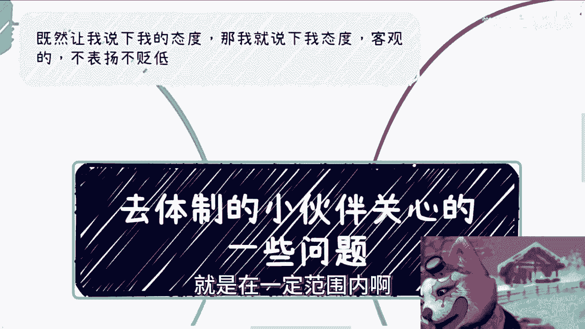
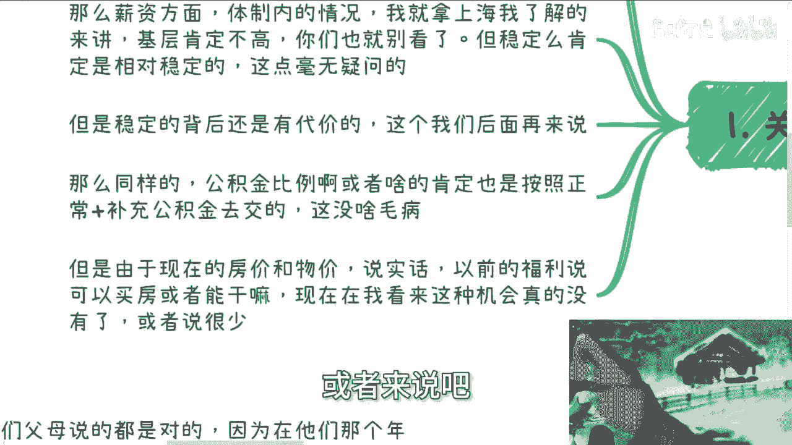
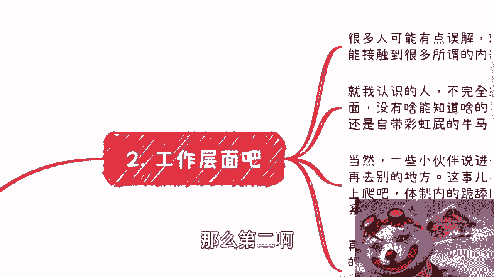
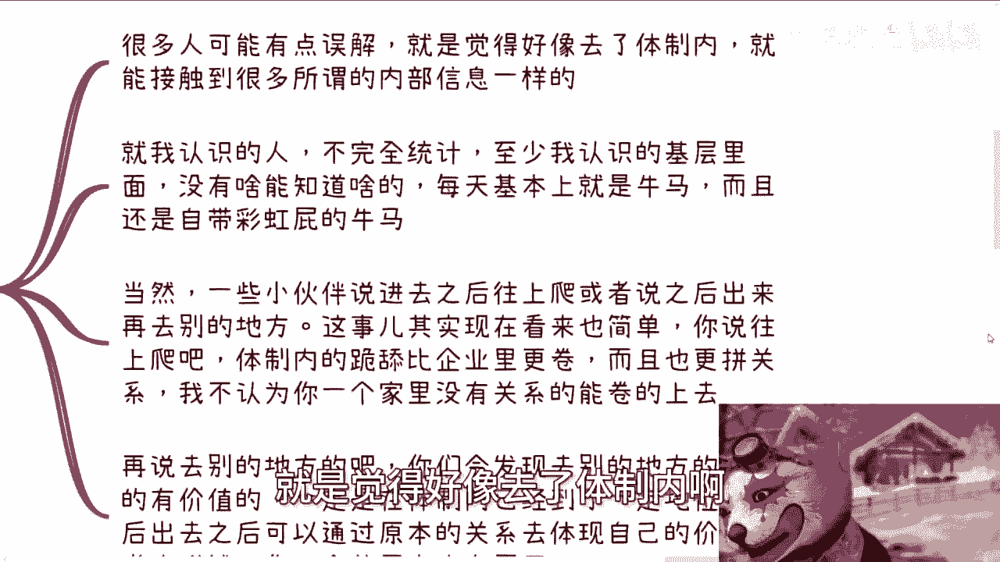
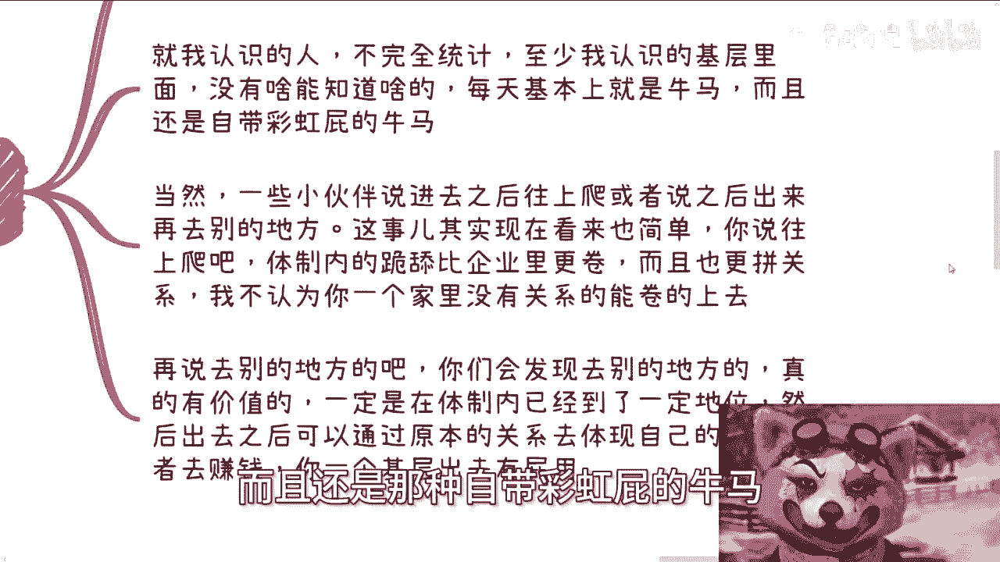
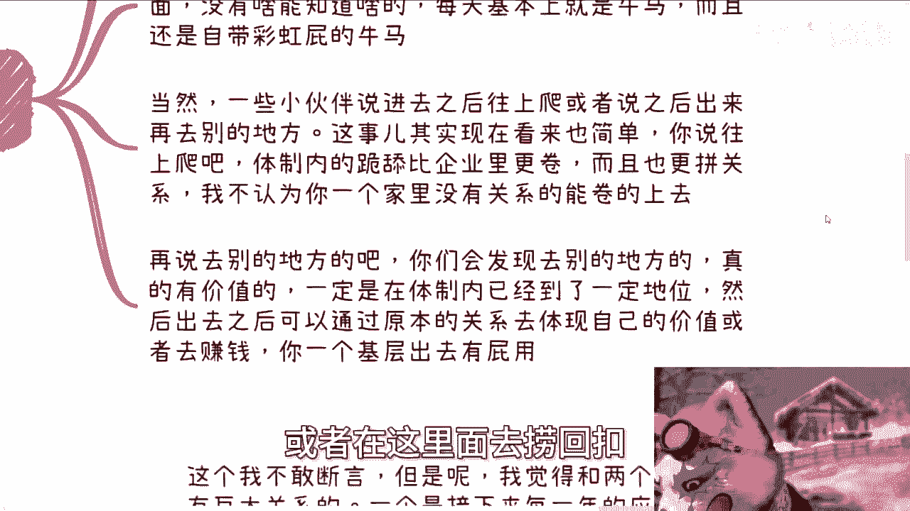
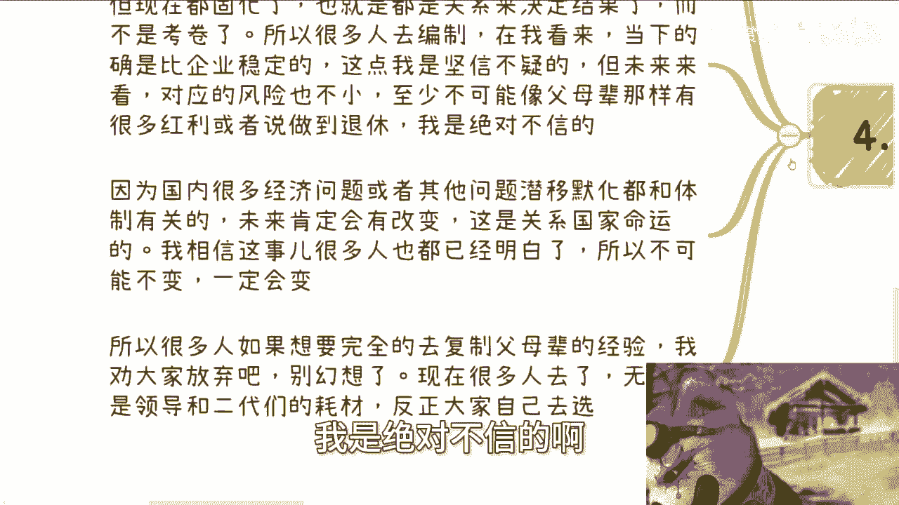
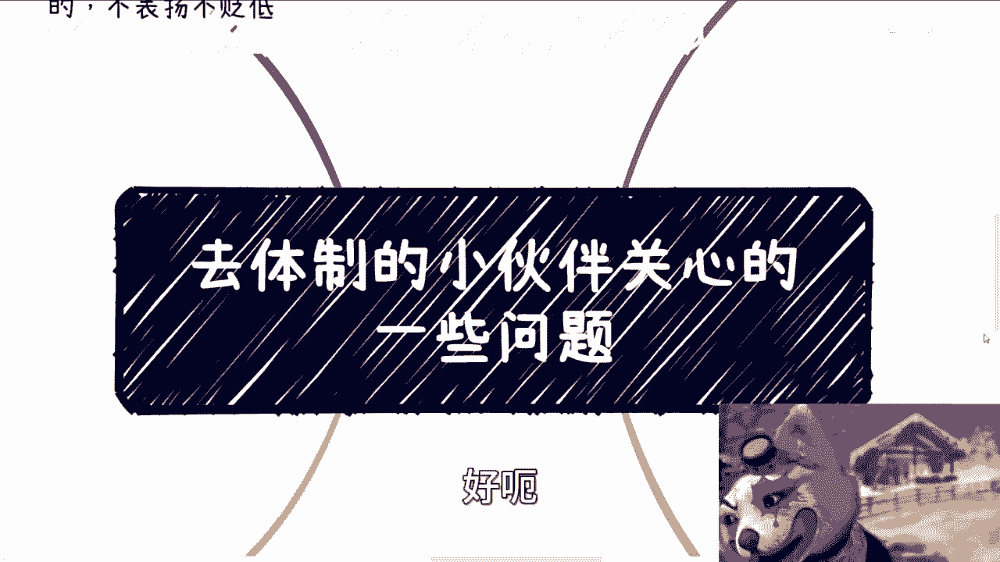

# 去体制的小伙伴关心的一些问题 - P1 - 赏味不足 - BV1Jy411q7f5

好昨天有小伙伴这个私信我啊，让我讲一下这个东西啊。

我思考了一下，我觉得也可以啊，就是在一定范围内啊。

我我我这边也说一下啊，就是我也说一下，我态度就是啊客观的啊。

不表扬也不贬低啊，就客观的来表述我的一个态度啊，啊然后首先那个深圳活动已经定了好吧，30号下午啊，本次活动完全按照数字经济大会的规模去做啊，邀请了很多嘉宾，也做了很多接机地跌，接地气的主题啊。

大家了解详情跟报名啊，可以私信我，首先第一啊嗯关于薪资方面呃。

首先我先说个说个宏观的东西啊，我个人是觉得你要追求薪资呢，你就不应该去体制内啊，这是个最宏观的一个东西啊，呃其实就跟我之前说跟大家说，读书为了赚钱是一个道理啊，无论啊你怎么套高大上的逻辑。

也无论你跟我说什么啊，这个想做什么学术啊，对吧，有什么成就啊对吧，他妈都是些屁话啊，呃在我看来，九十九九十九。99%的人去读书，无非就是为了赚赚钱和稳定，对不对，你别跟我说他妈的去什么公司。

我要学习流程，真他妈屁话不就为了赚钱吗，啊别逼逼啊，对吧啊。

那么薪资方面呢，我觉得体制内的情况啊，我就拿上海我了解的来讲啊，基层肯定是不高的啊，你们也就别看了呃，但稳定嘛肯定是相对稳定的，这也毫无疑问啊。

但是稳定的背后呢是有代价的啊，这个我们后面再来说啊，额那么同样的啊，公积金比例或者啥的呢，肯定也是按照正常加补充公积金去交的啊，这也没啥毛病呃，也就是说相对很多的民企，这个这个这个中型中小型企业来讲。

它是一个比较高的啊，这么个比例，但是你们反过来想想看啊，由于这个现在的房价跟物价啊，说实话我觉得以前的公务员的额福利啊，说可以买房啊，或者说能干嘛啊，现在在我看来这种机会真的是没有了。

或者来说吧就是呃我也不能一棒子打死啊。

就或者来说可能就是说比较少，那么第二啊工作层面。

那么很多人呢可能有点有有有有种误解啊，就是觉得好像去了体制内啊。

就能接触到所谓的内部信息呃，就我认识的人啊，不统不完全统计啊，至少我认识的基层里面没有啥能知道的东西，因为他们每天在干嘛呢，他们每天就是开会写报告，开会写报告呃，汇报开会写报告汇报对吧，要么就是干活啊。

做牛马，而且还是那种自带彩虹屁的牛马。

那你告诉我，你能知道个啥，你能知道个啥，而且我说也不好听点，你你作为一个基层，或者你在里面混的时间，只要足够没有还没有到足够长的长的情况，下面，你甚至都不知道哪些东西应该往外面讲。

哪些东西不应该往外面讲，知道什么内部消息啊，你知道内部消息又如何呢，你能变现吗，不能啊，当然一些小伙伴说进去之后呢，或者呃就说往上爬啊，或者说出来再去别的地方，这事啊其实看来严呃。

这事其实现在看来呢也简单，你说往上爬吧，我就这么说啊，体制内的跪舔比企业里面的跪舔都要卷，而且体制内是更拼关系的，我不认为大众跟我一样啊。

就作为一个家里没有关系的人，在体制内能卷的上去，我不认为我也不相信啊，呃当然啊呃我还是那句话，不能一棒子打死，但是比例很低啊，再说啊，去别的地方，你们会发现去别的地方的真的有价值的。

一定是在体之内已经到了一定地位，然后出去之后可以通过原本的关系关系去做，两边的一个怎么说呢，资源的整合，然后去体现出自己独一无二的价值，或者在这里面去捞回扣。

那么我再退1万步来讲，你一个基层出去有他妈个屁用，对吧啊。

第三再说发展发展前景啊，这个我不敢断言啊，但是我觉得两个东西，一跟两个东西一定是有巨大关系的，一个是接下来每一年的应届生，跟30多岁被优化的人工作能不能安排妥当，以及另外一个就是整体的经济情况。

当然啊，其实应届生跟被优化的人的这个问题，更迫在眉睫，因为在我看来，这些人本身的这个安排的情况，跟经济发展也是强绑定的，如果这些人在未来的几年里面没有很好的安排。

也就是说没有非常多的head account出来的话，那么很有可能几年后啊，我我我觉得五到10年的时间，越来越大的压力会来到政府这边，那么政府这边会迫于财政的压力，其实就会有一些地方啊。

我就说地方政府啊，比如说会有停薪啊对吧，甚至来说缩边的情况，因为停薪在去年已经有部分地方已经存在了，这已经是个现实了，缩编之前也有一些地方的教师编也有这么的，这么这么一个苗头，那么我们就这么说啊。

他就算未来不缩边，他可以去缩福利，有很多种方式，当然我们不知道啊，当然大家别觉得好像不可能，因为你要明白一点啊，编制里也是金字塔，也就是说不管是停薪还是缩编，还是说说福利，它也不会影响到中上层。

它影响的也是基层，我不认为说他会一刀切啊，当然他就算对外宣称一道歉，我也不认为他真的实施时会一刀切，因为这件事情也很难发生哦，所以说我说不好听点，你们作为基层，至少在5年时间里面，因为大部分的人在里面。

你5年总归要干得到吧对吧，你没有任何你作为一个基层，你没有反抗能力，因为什么，因为你在体制里面，你如果真的要要有点错误或者怎么样子，你这叫政治错误哦，你你不是一般的错误啊。

第四综合来讲，为什么因，因为你要明白啊，你们的父母劝你们去考，去体制内这个事实，这个事情对不对对，因为在他们那个年代，很多东西是没有的，百废待兴，改革开放到现在多少年。

说白了以前很多的业务很多地方都是有机会的，但现在固化了也都是关系来决定结果的，而而而而不是说靠卷对吧，所以说很多人去编制，在我看来，你当下的确比企业稳定，这点我是坚信不疑的，但未来来看。

对应的风险也不小，至少不可能像父母辈那样子有很多的红利，或者说做到退休这个事情，我是绝对不信的啊。

我是绝对不信的，更何况前两前两天，这个什么养老金额基数涨了3%，我就他妈更不信哦，因为国内很多经济问题或者其他的问题，潜移默化，本质上它其实都是跟体制有关的，未来肯定会改变，为什么，因为这是关系。

在我看来啊，至少啊我就说啊，这个是我个人观点啊，就这个事情在我看来是关系到国家命运的，他肯定要改，他不改，他没法往下发展哦，我方信我，我相信很多事儿，这些事上面的人也早早早就已经明白了。

所以他不可能改变，一定会变，就只是看怎么变法哦，所以说很多人如果觉得完全去复制父母辈的，这个呃考公啊，或者说这个公务员的这个经验，我跟你们讲啊，我劝你们放弃就别幻想了，没有意义的，你不要浪费你的青春哦。

现在很多人去了，无非都是那些已有的一个萝卜，就你能明白吗，你给上面的人打工，你给那些二代打工，人家也跟你一样年轻，但人家有关系，那凭什么你能上去呢，那你进去后面如果有一定的变化，你怎么办。

我就问你怎么办，当然我这只是我的一些建议和我的一些态度啊。

怎么选你们去选啊。

我没有任何的这个就像我一开始说的，我没有任何的态度表达了我是看好或不看好。

我只是说了我的想法啊，没有看好不看好，看不看好，你们自己决定啊，好呃好吧。

然后那个活动好吧，30号的这个活动继续报名啊，然后剩下的话就是职业规划，商业规划额，股权期呃，股权啊，期权啊啊合同啊啊分红啊，分润啊，商业计划书啊，白皮书啊啊，包括你们有什么牌，你们没有什么牌啊。

你们希望通过跟我的沟通啊，能够给你们更加接地气，或者更加接近当下经济发展的，这么一些建议的话，那么你们可以整理好个人的问题跟个人背景，私信我。

