# 去体制的小伙伴关心的一些问题---P1---赏味不足---BV1Jy411q7f5

## 概述

在本节课中，我们将客观分析关于进入体制内工作（如公务员、事业单位等）时，大家普遍关心的几个核心问题。我们将从薪资、工作内容、发展前景等多个维度进行探讨，帮助你更清晰地认识体制内工作的现状与潜在风险。

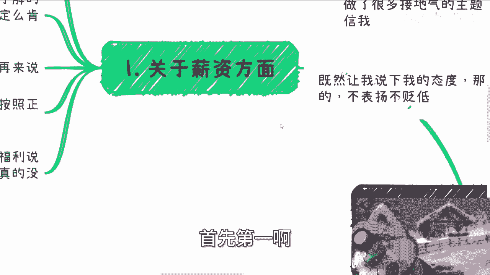

---

## 一、 关于薪资 💰

上一节我们介绍了课程概述，本节中我们来看看大家最关心的薪资问题。

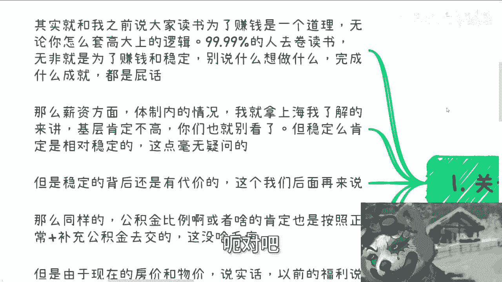

首先，从宏观角度看，如果追求高薪资，就不应该选择体制内。这与“读书为了赚钱”的道理类似。无论套用何种高尚的逻辑，例如追求学术成就或学习流程，对绝大多数人而言，核心目的无非是**赚钱**和**稳定**。

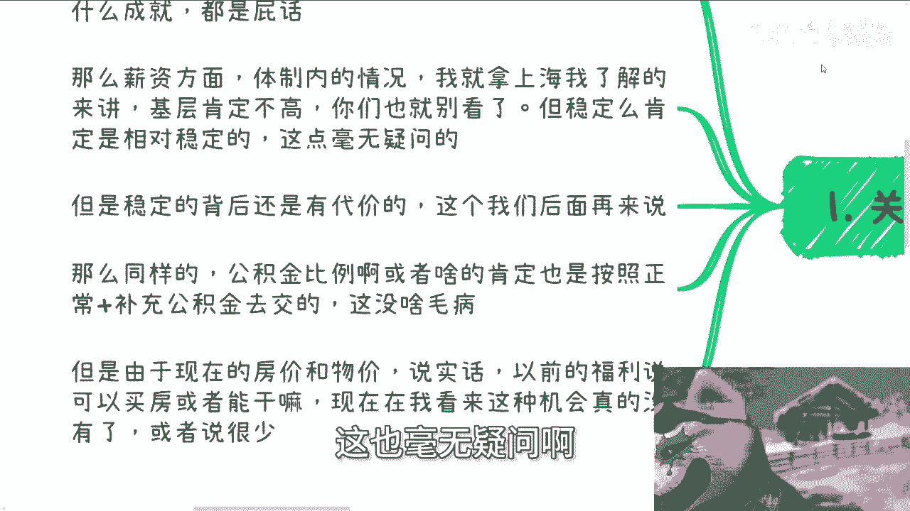

具体到体制内的薪资情况，以上海为例，基层岗位的薪资肯定不高，但稳定性相对较高。然而，稳定的背后存在代价，这一点我们后续会讨论。

公积金方面，体制内通常按照正常比例加补充公积金缴纳。相对于许多中小型民营企业，这是一个较高的比例。

但需要反向思考的是，结合当前的房价与物价，过去公务员依靠福利买房的优势已基本消失。这种机会现在非常少。

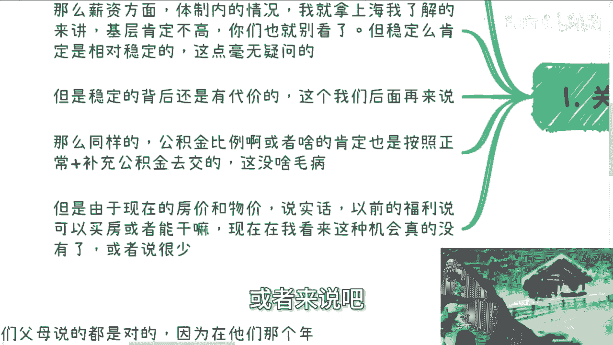

---

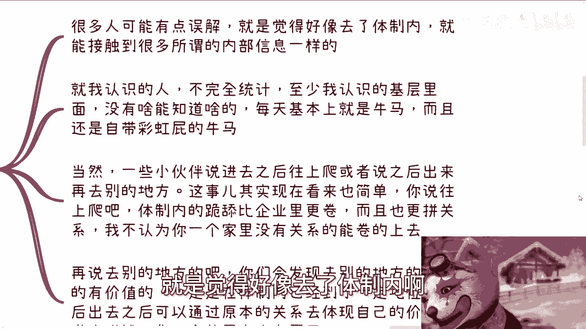

## 二、 关于工作内容 📝

了解了薪资概况后，我们再来看看体制内具体的工作内容。

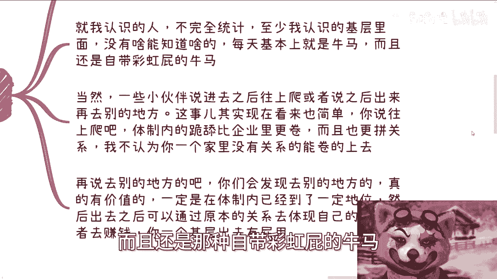

很多人可能存在一种误解，认为进入体制内就能接触到所谓的“内部信息”。根据不完全统计，我所认识的基层人员中，并没有人能接触到有价值的信息。

基层人员的日常工作状态通常是：**开会 -> 写报告 -> 汇报 -> 干活**。他们更像是“自带彩虹屁的牛马”。

作为一个基层人员，你很难知道哪些信息可以对外讲，哪些不能。即便知道一些内部消息，通常也无法变现。

关于职业发展路径，主要有两种常见想法：

以下是两种常见的职业发展设想及其现实情况：
1.  **往上爬**：体制内的晋升竞争比企业更激烈，更依赖“关系”和“跪舔”文化。对于没有家庭背景的普通人，能成功晋升的比例很低。
2.  **积累经验后去别的地方**：真正能在离开体制后体现价值的人，通常已在体制内达到一定地位，可以整合原有资源。一个基层人员离开体制，作用非常有限。

---

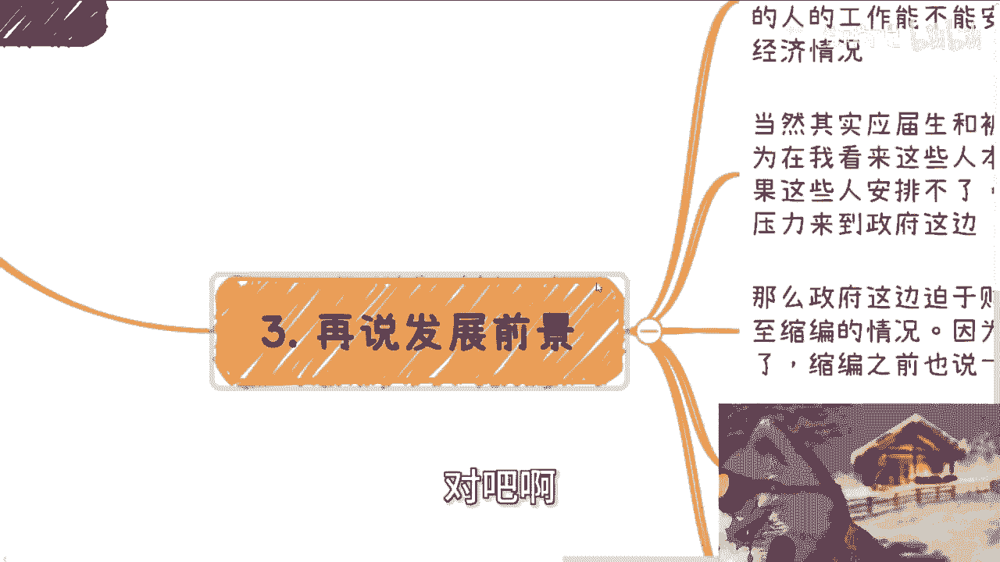

## 三、 关于发展前景 🔮

分析了具体工作后，我们来探讨更具长远性的发展前景问题。对此我不敢断言，但认为它与两个因素有巨大关系：

1.  每年应届毕业生及30多岁被优化人员的就业安置情况。
2.  整体的经济发展状况。

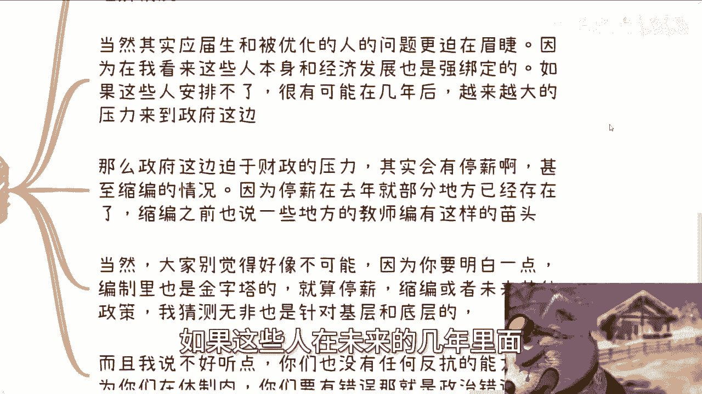

其中，第一个问题更为迫在眉睫。如果未来几年社会无法为这些群体提供充足的岗位（即没有足够的 `headcount`），那么压力将传导至政府。

几年后（例如5-10年），地方政府可能迫于财政压力，出现以下情况：
*   **停薪**：去年已有部分地区出现。
*   **缩编**：教师编制等领域已出现苗头。
*   **缩减福利**：存在多种操作方式。

需要明白的是，体制内也是金字塔结构。上述措施主要影响的是基层人员，而非中上层。作为基层，在至少5年时间内，你几乎没有反抗能力，因为在体制内犯错属于“政治错误”，后果严重。

---

## 四、 综合分析与建议 🤔

最后，我们综合以上几点，进行总结分析。

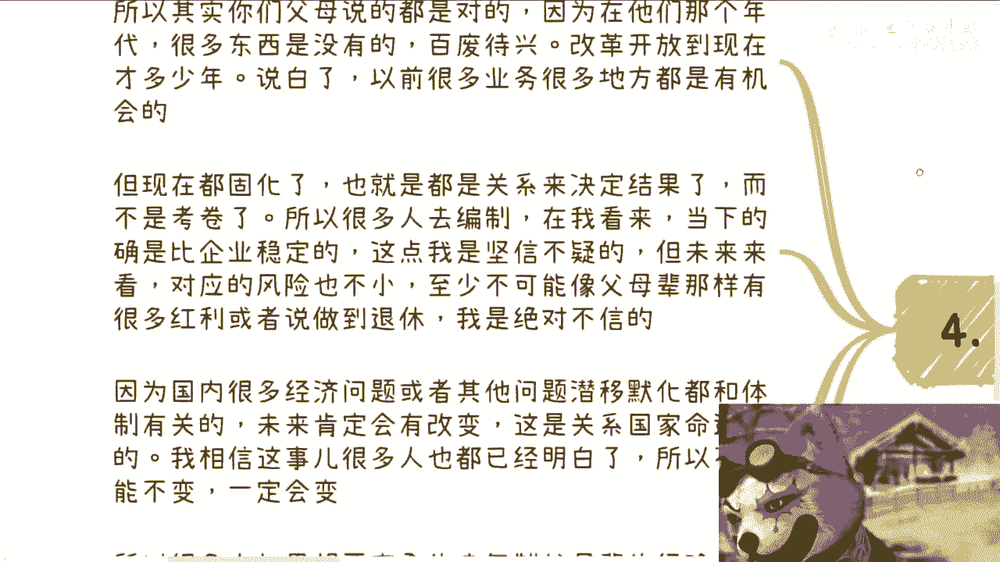

父母辈鼓励子女进入体制内，是因为在他们那个百废待兴、机会众多的年代，体制内确实能提供稳定和红利。但如今社会结构固化，结果更多由“关系”而非个人努力决定。

因此，我的观点是：
*   **当下**：体制内工作的确比大多数民营企业更稳定。
*   **未来**：体制内基层岗位面临的风险不小，几乎不可能复制父母辈“安稳做到退休并享受红利”的经验。

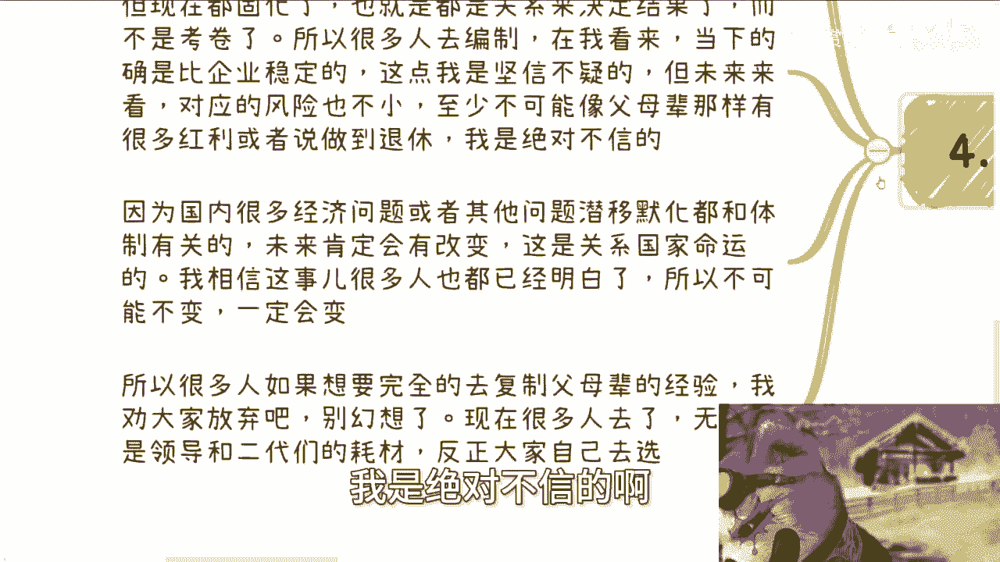

国内许多经济与社会问题，其根源与体制有关。为了国家发展，改革是必然的，只是方式和时间的问题。

所以，如果只是幻想复制父母的经验，意义不大。现在很多人进入体制，更像是填补一个已有的“萝卜坑”，为有关系的“二代”们打工。如果未来体制发生变革，作为基层将非常被动。

---

## 总结

本节课我们一起学习了关于体制内职业选择的几个核心方面：
1.  **薪资**：不高但稳定，福利优势随房价物价高涨已减弱。
2.  **工作**：基层工作内容重复，难以接触有价值信息，晋升或转型出路对普通人而言较窄。
3.  **前景**：受就业压力和经济形势影响，基层岗位未来可能面临停薪、缩编等风险。
4.  **建议**：应理性看待体制内工作，认识到其当下的稳定性与未来的不确定性，避免盲目复制过往经验。

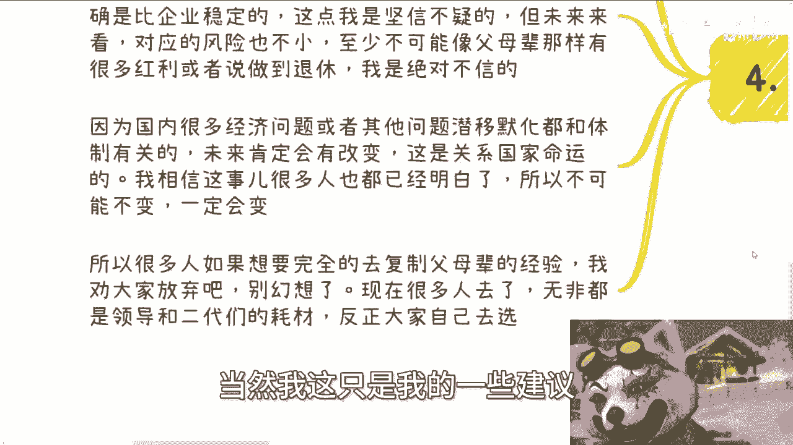

我的态度始终是客观陈述事实与个人分析，不褒不贬。最终如何选择，取决于你自己。

---

## 附：活动与咨询信息 📅

深圳活动已定于30号下午举行，将按照数字经济大会规模筹备，设有接地气的主题。了解详情或报名请私信。

此外，如需关于**职业规划、商业规划、股权期权、合同、分红、商业计划书**等方面的建议，或希望获得更贴近当下经济发展的接地气分析，可以整理好个人问题与背景后私信我。