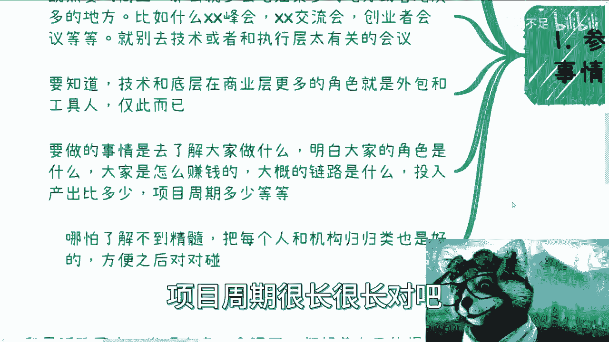
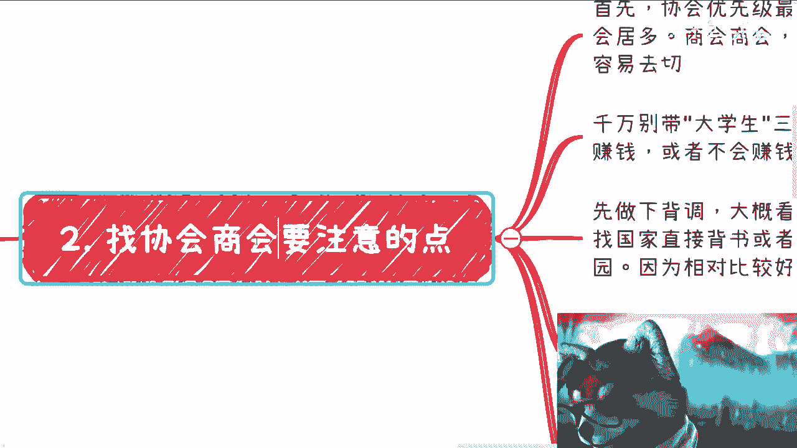
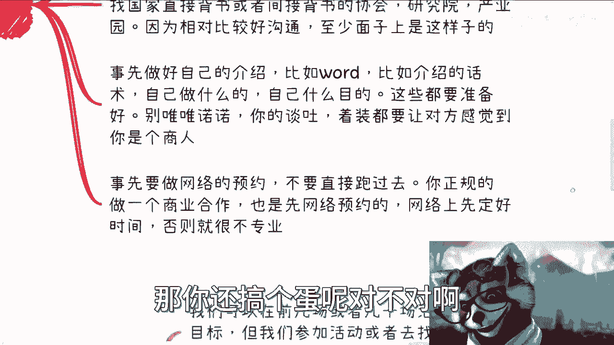
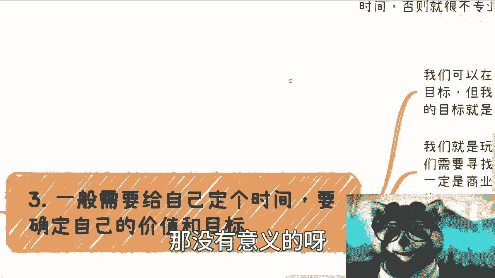
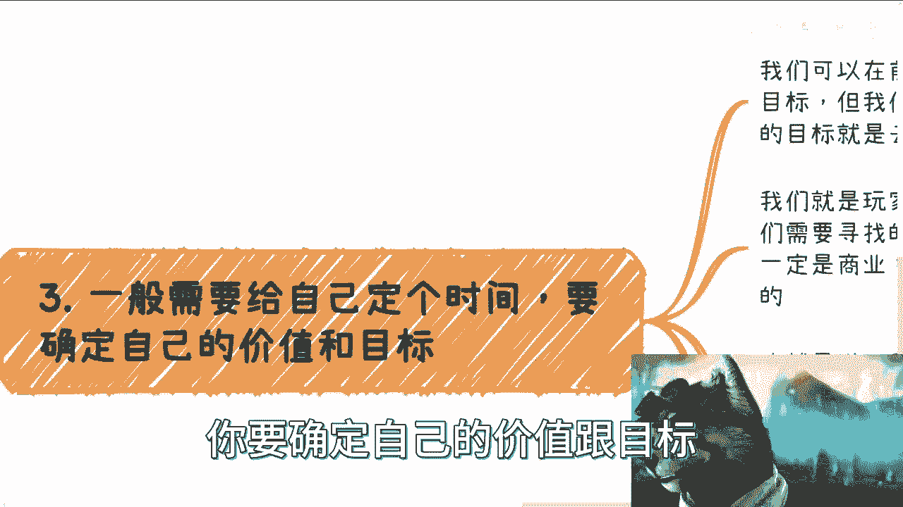

# 参加活动和寻找协会商业实践反馈的补充 - P1 - 赏味不足 - BV1XP41187uV

啊好啊，大家好啊，这个嗯最近啊呃我还是很庆幸的啊，就是有很多小伙伴这个我做了半年过去了啊，也有蛮多人开始行动了啊，不过呢问题也蛮多啊，我统一这边我再补充一下，我觉得可能细节上大家没有把握好啊。

没把握好，蛮多小伙伴呢先从这个参加活动啊，和找协会商会嗯，嗯等方向去做这个商业的切入啊，那么我来给大家补充一下啊，首先第一点啊。

参加活动的类型及以及要做的事情啊，呃一些小伙伴呢去参加了一些技术类的啊，执行层类的活动，比如说啊什么开源项目啊对吧，然后什么什么技术讨论啊，或者什么东西啊，首先啊这类活动啊别去参加了，没什么好参加的啊。

我们不是去跟大家交流怎么做电池的，我们也不是跟大家交流去怎么做更高级的电池，我们也不是去交流在中国怎么做慈善的，比如说open source对吧，就是一群电池所在的活动，对我们毫无意义，好吧。

不要再去参加这种活动了哦，就是我跟你们说，就是这种活动参加了，我也有点哭笑不得啊，这是第一个第二个啊，既然要切商业啊，那么你们要去的是哪里，你们要吃的是那些老油条多的地方，或者炮灰到多的地方。

什么意思啊，老油条多的地方就是那些啊，什么什么什么什么什么各种开头老多了对吧，然后各种什么啊，这个资源老多了对吧，然后各种什么听看上去就很油滑的那种人啊，然后然后什么。

比如说比如说我这边写的什么什么峰会啊对吧，什么什么商业峰会啊对吧，然后什么招商引资活动啊对吧，什么东西呢，哎呀这种地方多了去了啊，炮灰是什么呢，炮灰就是创业者啊，比如说创业者会议啊，创业者峰会啊。

对吧啊，你就别再去这个参加任何那些电池呃，七八十%都是电池组成的活动，那这个你去干嘛呢，对不对，当然了，你要是跟我说，你想去收割C端的，那你去啊，那没毛病啊，那么要知道啊啊技术和底层啊。

呸技术技术和执行层啊，在商业层面，他更多的角色就是外包跟工具人，仅此而已啊，仅此而已啊，不是我看不起技术啊，不好意思，那本来就这样子，那怎么办呢对吧，这社会运作规则就是这样子的啊，那么要做的事情呢。

你是什么呢，是要去了解大家做什么，明白大家角色是什么啊，大家是怎么赚钱的，大概的整个链路，整个上下游是什么样子的啊，然后投入产出比是多少啊，项目周期多少等等等对吧，你总要了解清楚啊，啊你别听别人说啊。

这个东西好像流水多少多少啊，听上去很牛逼啊，然后一问嘛，利润嘛很少很少对吧，然后我们再一问吧，项目周期很长很长对吧。

那你做它干嘛呢，对不对啊，所以说呢就是说你尽量去了解啊，哪怕呢你了解不到精髓，你把每一个人做什么和每个机构做什么。

你归归类啊，归归类啊，方便以后对对碰啊，什么叫对对碰呢，就就就撮合嘛啊撮合嘛，第二啊找协会商会呃，写错了啊。

对吧，找协会商会要注意的点啊，首先协会的优先级是最高的。

因为协会他可能有行业协会，也有产业协会啊。

但是你要记住商会商会，商会这个地方它是以商业为主的啊，他们的定位不一样呃，商会没这么好切，第二点呢就千万别带大学生三个字，这三个字说白了带了你就是不带，你就是不赚钱或者不会赚钱的代名词啊，不要带啊。

我管你是谁啊，你别带啊，第三你要先做一下背调啊，你该简单的，比如说不够啊，企查查啊对吧，这个什么别的东西啊，就是你该简单的这个了解了解，先简单了解了解啊，你尽量先去找那些。

就是说国家直接背书或者间接背书的，这个这个叫什么协会或者研究院，或者说一些叫什么这个相关的产业园啊，或者相关机构啊，因为这些他相对会比较好沟通啊，就至少在面子上是这样子的啊。

因为他呃表面功夫还是要做好的对吧，那么首先呢你还有还有一个东西呢，就事先你得做好自己的介绍啊，我不管你是word还是PDF还是介绍的话术，还是做什么PPT啊，都可以，你得做好啊，包括你是自己做什么的。

你大概呃这个包装是怎么样的，你自己的目的是什么，你都得想好啊，因为对方肯定会问的啊，你这个陌生人跑过去，人家肯定会问你啊，对不对啊，那么另外呢，就是说在你的这个这个这个这个面子上啊，别唯唯诺诺。

你的谈吐，着装都要让对方感觉到你是个专业的啊，一个一个一个创业者对吧，别人就跑过去一说话就感觉嗯好。

这是个学生，可能还没毕业，那你还搞个蛋呢，对不对啊。

那事先要做呢，还有就是说你要你至少得往上跟他们沟通过啊，你不要直接跑，因为你作为一个正规的专业的商业合作，人家出于尊重也都会网络上线沟通，没有网络上先沟通，你跑过去，这就是一个很不专业的这个对吧。

这个传销行为对吧。

直销行为对吧，这个这个递推行为对吧，那没有意义的呀。

那人家地推都比你专业啊，那么第三啊，一般需要给自己定个时间啊，然后比如说一两个月，三四个月对吧，你要确定自己的价值和目标。

啊，那么我们可以在前几场或者几十场活动，都没有呃，都没有去定自己的那个定位价值，定位一个目标，我觉得可以没问题啊，就是说你一开始想不出来，定不出来也正常，但是啊我们去参加活动，或者去找协会，找商会。

找产业园的目的就是去寻找定位一个目标的，一定要清楚啊，不是说哎我就是去参加了好，我连那个毫无目的对吧，我缺无脑参加，那你参加干嘛浪费时间啊，有这时间游轮沙滩美女不香嘛，是不是啊，我们就是玩家，你知道吧。

这个世界就是游戏本身，也就是说我们要去寻找的定位和目标，一定是世界原本就存在的定位和目标啊，一定是在商业链路上面大家认可的，而不是我们YY出来的，也就是说什么意思呢。

也就是说我们得要先去了解大家都是什么定位，怎么赚钱的，大家有啥需求，然后最终总结出来之后，找到自己的定位跟提供价值，就是说这个东西是找出来的，它不是我们想出来的哦，你获得大家。

你你想啊，你你每次做事情，你获得的是拼图对吧，你获得的是这个社会给予你的一张拼图，你获得的是什么呢，大家做什么，大家怎么赚钱，协会做什么，协会可能有什么项目，可能有什么政策，协会需要企业干什么。

以及大家需要什么样的合作方等等等等等等等，对不对好，那么你需要将相将这些零散的信息整合之后，你相当于要在这里面找bug，找属于你的那个定位。

那你之后比如说你找到定位之后，等你再下次参加活动或者去协协会时候。

你不就可以直接他们痛点了吗，对不对，那这个事儿它就是一个循序渐进的过程，没有办法的啊，你千万别想着说哦，我要开始想，我要我要去社交了，好我社交之前开始想想我的定位，想你能经过什么，你想不出来的，为什么。

因为你对这个社会一无所知，想啥呀，啊你所有的认知就是到20多年，30多年，你们的家庭，你的这些高校9年制义务教育给你的，不好意思，没有任何东西跟商业有关啊，你还不还你，你跟一个婴儿层出来的没什么区别啊。

好那么第四点也就是我要再三强调的，就是记住你的价值，并不是你真材实料能做什么哦，我发现很多人就这个误区啊，啊千万别这么想啊。

千千万万别这么想哦，就是你要明白你的目的是赚钱，赚钱的很大一个前提是什么，是时间窗口，时间窗口是什么，就是比谁快哦，那么你看啊，我最近聊下来，我就发现这个误区，就都想着自己能提供什么或者提供什么服务。

这个对，但这个也不对，什么意思呢，就是说我们的确要告诉别人，我们提供什么服务，我们提供什么价值，但是并不是我们真正的能提供什么服务，或者我们真正能提供什么价值，而是说我们能对接到这个服务。

或对接到这个价值就可以了，因为关系本身就是价值，你知道吧，没有这么多执行方案，你因为你要这么想，你你的关系，你的定位要很清楚，你知道吗，就是如果你不是一个对商业很了解的人，你作为一个执行方。

你很容易让对方去知道你是一个执行方，那么你最终就是一个工具人，你知道吧，你哪怕有111堆博士团队，一堆硕士团队，你还是个工具人，你懂吗，就是商业合作，商业合作你要赚钱，什么意思。

就是大家需要的是商业合作伙伴，然后大家作为一个绑在一条绳上的蚂蚱，一起去找工具人，这个叫商业合作伙伴，而不是说我们一上来告诉对方，哎你好啊，我是一个工具人，这他妈还怎么赚钱，对吧啊。

我们需要的是大家合作过，大家一起赚过钱，而不是说你到底会什么，你到底会做什么，这不重要，你知道吗，你会做什么，你会你你自己能做什么，这个的确能证明一些，但是如果你没有商业价值，你没有商业的思维。

你让对方觉得，你做事情就是一个脚踏实地做事情的人，那不好意思，你就是个工具对吧，你不但会最好的结果就是你会让别人当，把你当做工具人，最正常的结果是你被别人白嫖对吧，最差的结果就是你还得倒贴，何必呢。

对吧哦，合作本身你们要记住，合作本身我们要做的是什么，我们要做的就是去寻找合适的人啊，而不是说让每个人都认可自己对吧，就是我知道大家每个人做事情他都怕拒绝，都怕失败啊，都怕别人好像觉得自己在吹牛逼对吧。

或者怎么样子，但这是正常的呀，唉你要去赚钱，你要去寻找的是这个社会上面，属于自己的一亩三分地，你要找到这个人或者这个关系链，或者这个这个合作方不就好了吗，你就成功了呀，你又不是要让每个人都认可你。

你又不是我不是他，每个人好，大家都得认可，大家都得合作，大家都得赚钱，这他妈叫商业吗，这叫过家家哦，哦这叫你可能还在五六岁幼儿园里面，大家你好，我好，大家好好吧啊，就这个思维要改变过来。

别老师就说来问我说哎呀，别人拒绝我怎么办对吧。

这个别人觉得我没价值怎么办，你这没价值很正常啊，你就去找那些认为你有价值的人嘛对吧，就跟你结婚一样，跟你谈朋友一样吗，你要去找那些喜欢你的人吗，哦你非要跪舔每个人，喜欢我喜欢我喜欢我，那我能说啥呢。

对吧啊好吧，然后我就给大家补充一下啊，就是你别去看你参加个活动，你也别去看，你去找人谈东西，这里面细节很多啊，为什么俗话说得好，这个母魔鬼存在于细节里面，这有道理的啊，但是这些东西就是你们可以问我啊。

但是你未来很多时候得还是得你们自己去摸索，还得你们自己去踩坑啊，好吧哦行，那就这么着吧，嗯嗯我正好要出去了，然后那个好吧，然后大家反正有什么啊，商业合作对吧，要要或者说自己有什么手上有什么牌的对吧。

或者说可能也觉得打工未来没什么希望的对吧，或者或者想要赚钱的啊，你们当然啊，就是我说的是那些高举高打的方式啊，就是就是你要是这个这个说我要，怎么说呢，就是就就收割C端的，纯收割C端的，那那你也别找我。

我也不知道，我也不知道啊，所以就是咱们就说正规的啊，或者说这个对于这个社会水下80%啊，这些怎么赚钱的啊，怎么依靠政府，怎么依靠这个成员，怎么依靠政策来赚钱的啊，这些感兴趣的。

那么你们可以整理好问题好吧，然后私信我好吧。