# 参加活动和寻找协会商业实践反馈的补充---P1---赏味不足---BV1XP41187uV

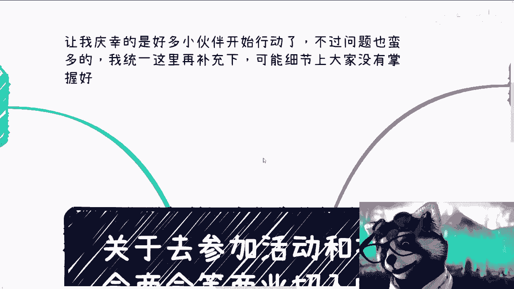

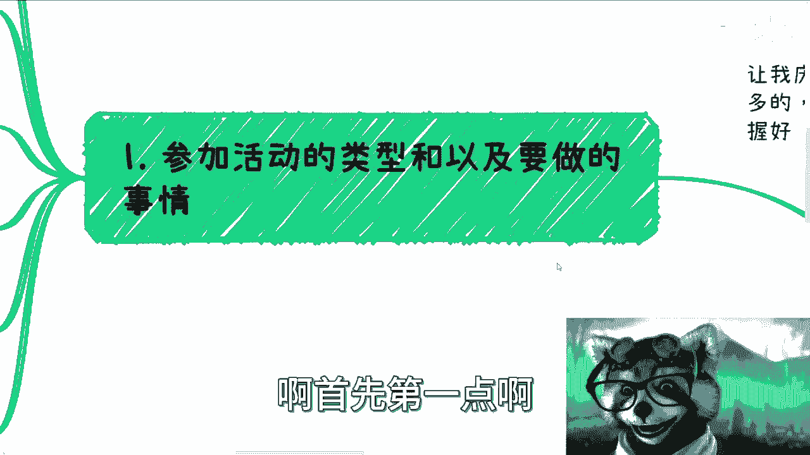

在本节课中，我们将学习如何通过参加商业活动和对接协会、商会来切入商业实践。许多初学者在行动中未能把握关键细节，导致效果不佳。本节内容将补充核心要点，帮助你明确方向、提升效率。

---

## 1. 选择正确的活动类型 🎪

上一节我们介绍了商业切入的初步思路，本节中我们来看看具体应该参加哪些活动。首先，必须避免参加错误类型的活动。

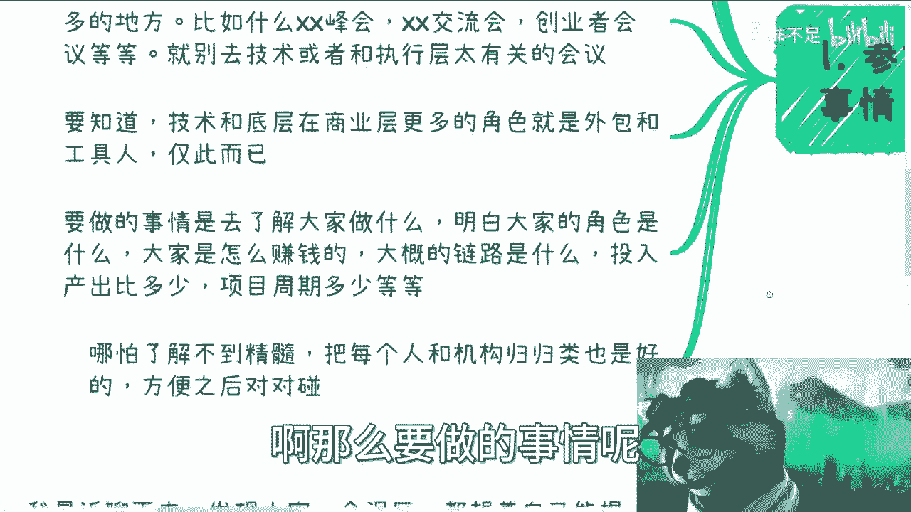

**应避免的活动类型：**
*   **技术/执行层活动**：例如开源项目讨论、技术研讨会。这类活动参与者多为具体执行者（比喻为“电池”），与商业合作和资源对接的目标关联度低。
*   **公式/代码描述核心概念：**
  ```text
  无效活动 ≈ 技术研讨会 + 开源社区会议
  目标：寻找商业合作与资源
  结果：匹配度低，效率低下
  ```

**应参加的活动类型：**
你需要前往“老油条”（经验丰富的商业人士）或“炮灰”（大量创业者）聚集的地方，那里才有真正的商业机会和资源流动。

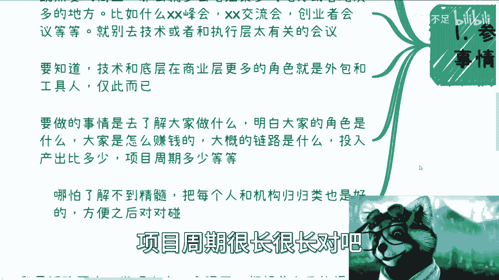

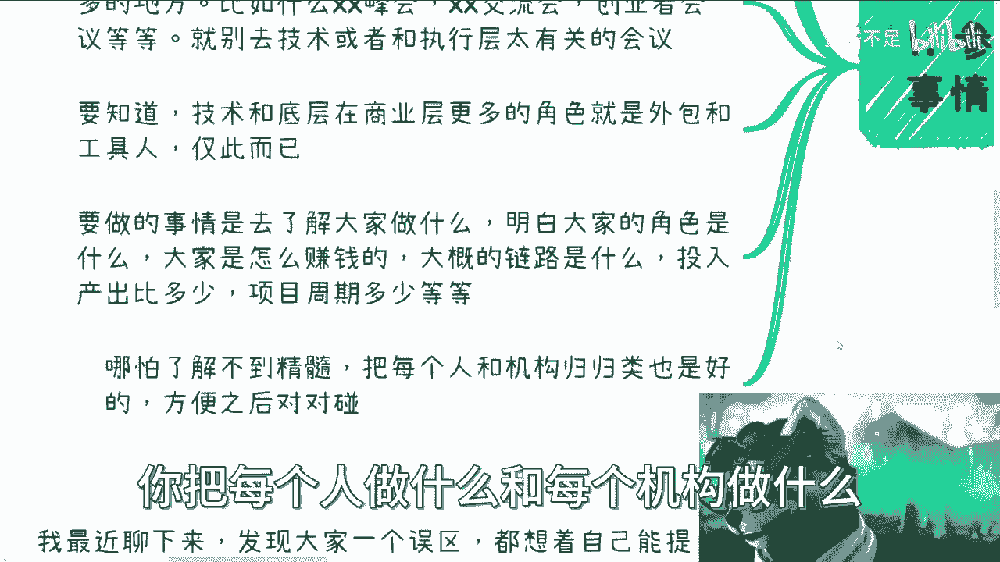

以下是推荐的活动类型：
*   **各类商业峰会、招商推介会**。
*   **创业者大会、创业者论坛**。

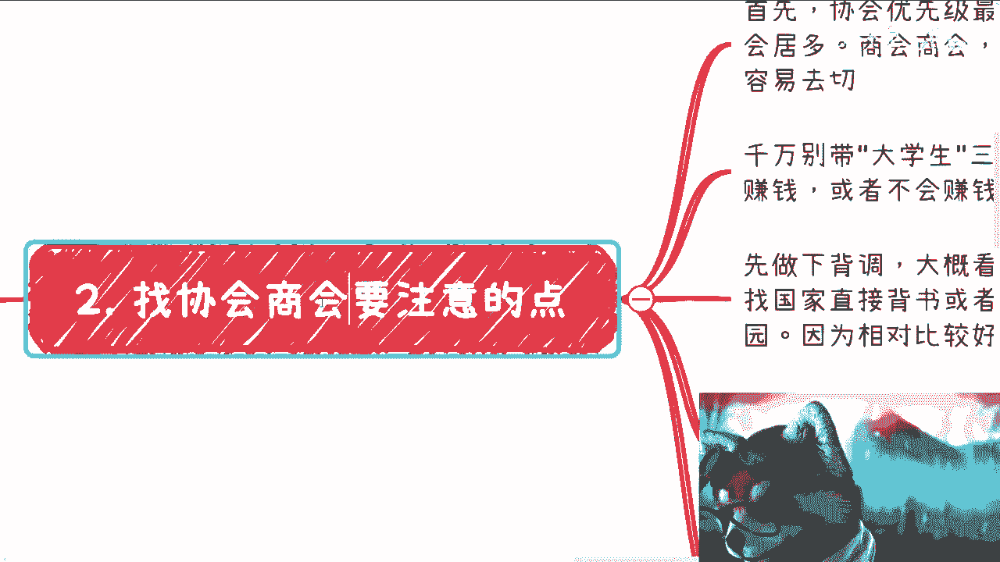

> **注意**：如果你的目标是直接面向消费者（C端）进行业务，则参与C端用户聚集的活动是合理的。否则，请聚焦于上述B端商业活动。

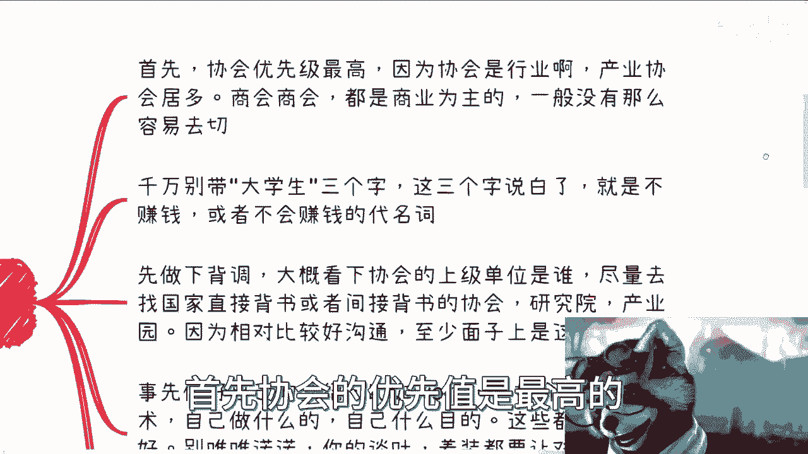

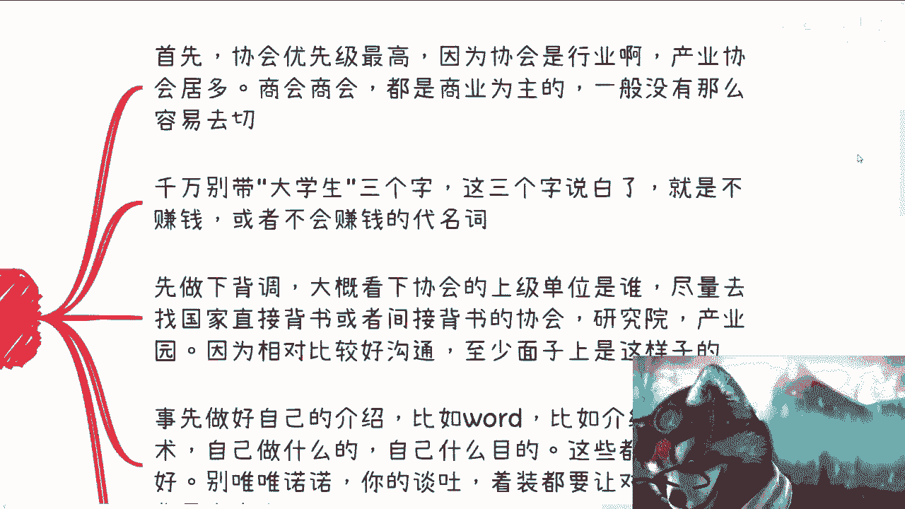

---

## 2. 在活动中应做的事情 🔍

明确了去哪里之后，接下来要知道在活动中具体做什么。核心任务是**观察、学习和信息整合**，而非急于推销自己。

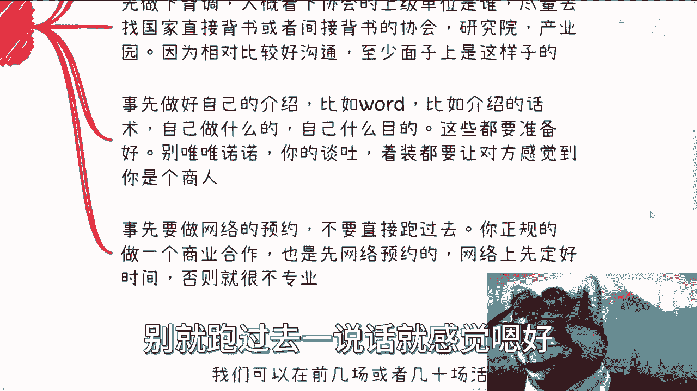

你需要系统性地了解以下信息：
*   与会者各自在做什么？扮演什么商业角色？
*   他们是如何赚钱的？商业模式是什么？
*   整个业务的上下游链路是怎样的？
*   项目的投入产出比、周期和利润情况如何？

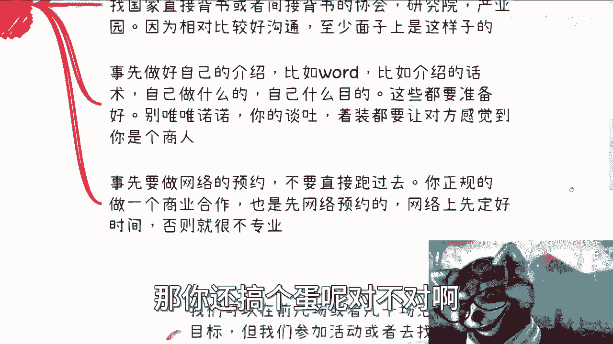

**关键行动：信息归类与对对碰**
即使无法立刻洞悉精髓，也要将收集到的关于**每个人**和**每个机构**的信息进行归类整理。这个过程的目的是为未来的“对对碰”（即资源撮合）打下基础。当你掌握了足够多的“拼图”（零散信息），就能从中发现市场缺口或合作机会，从而找到自己的定位。

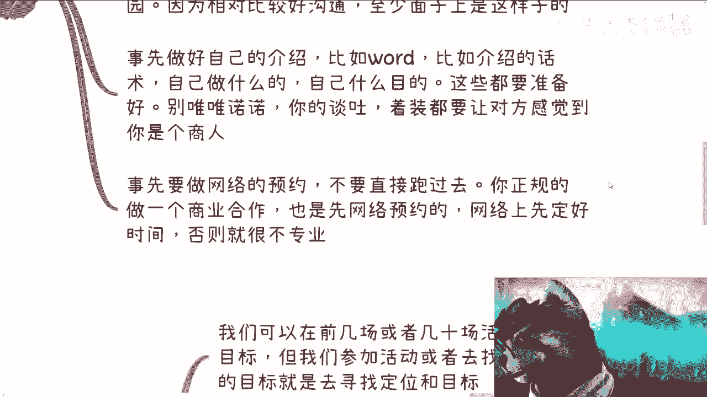

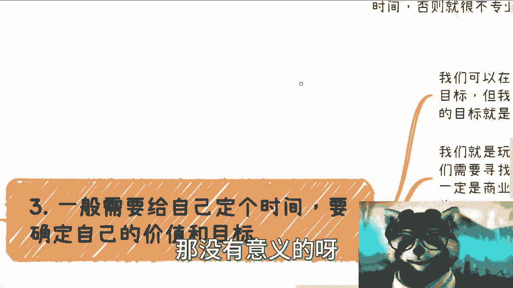

---

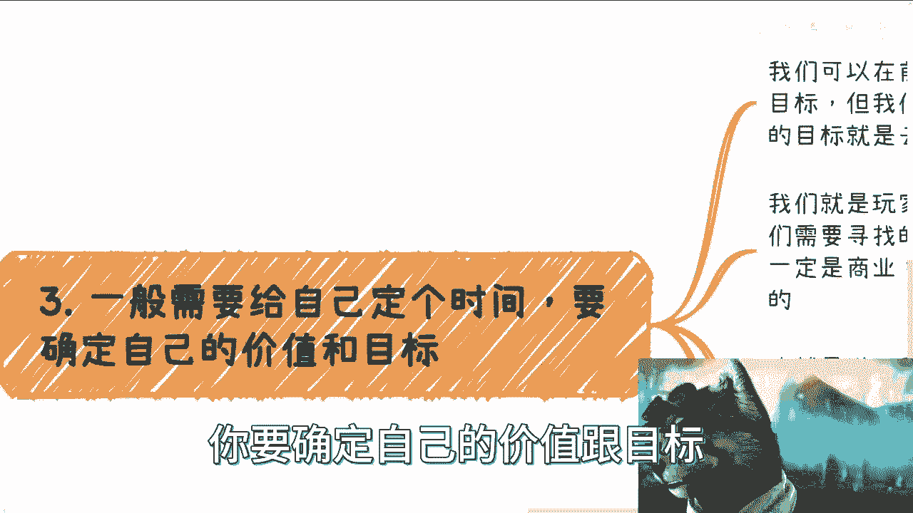

## 3. 对接协会与商会的核心要点 🤝

除了参加活动，主动对接协会、商会、产业园是另一条重要路径。以下是需要注意的关键点。

**优先级与定位：**
*   **协会优先**：尤其是具有国家或地方政府背景的行业协会、产业协会或研究院。它们通常拥有更丰富的资源和项目，且沟通相对规范。
*   **明确区别**：商会以商业盈利为主要导向，切入难度可能高于协会。


**事前准备清单：**
在联系或拜访前，必须做好充分准备，展现专业度。
1.  **身份包装**：准备专业的个人或公司介绍（Word、PDF、PPT或话术），清晰说明你是谁、做什么、有何目的。
2.  **背景调查**：使用“企查查”等工具对目标协会/商会进行初步了解。
3.  **预约沟通**：务必先通过线上方式（如电话、邮件）进行初步沟通和预约，直接上门显得不专业。
4.  **形象管理**：注意谈吐和着装，避免给人留下“学生”或“新手”的印象。切勿在自我介绍中强调“大学生”身份。


---

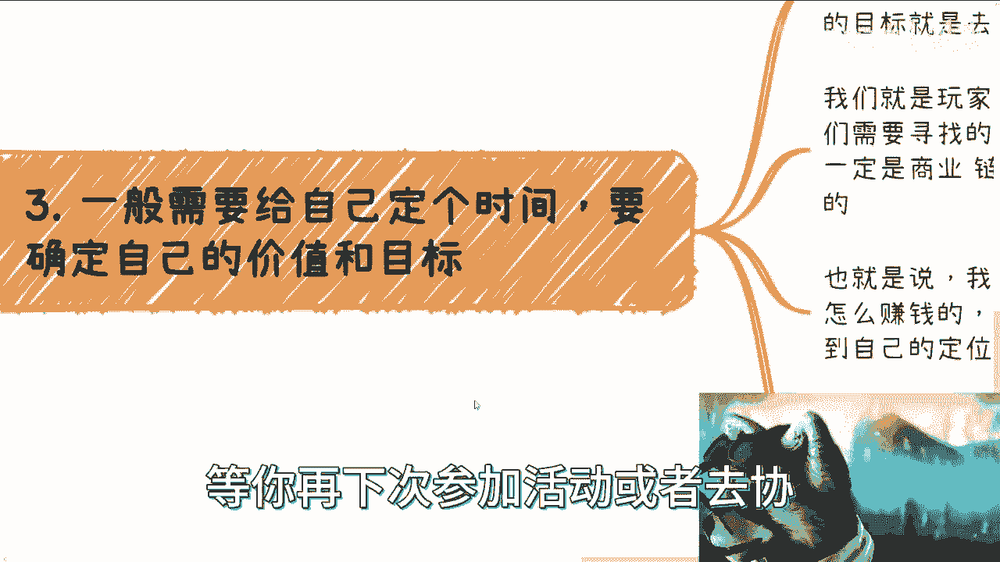

## 4. 明确目标与价值定位 🎯


无论是参加活动还是对接机构，都必须带有明确的目标。这个过程是动态和渐进的。

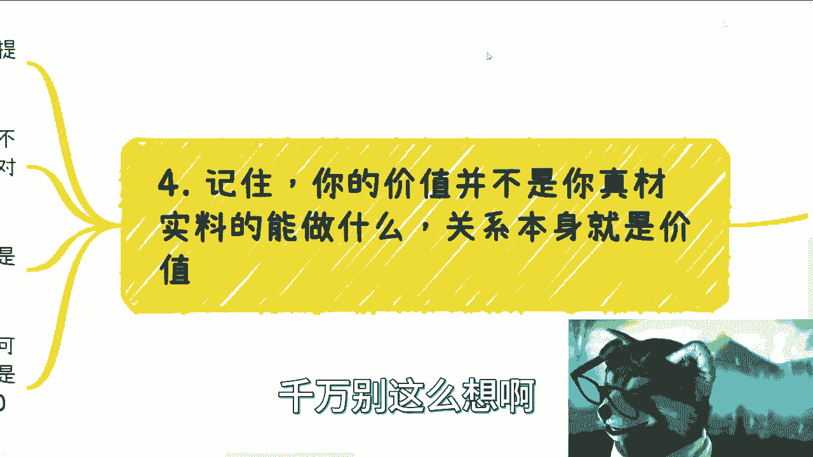

**设定时间与目标：**
给自己设定一个周期（如1-4个月）。初期可以不带具体目标去广泛了解和收集信息，但**最终目的必须是寻找到自己的商业定位和价值点**。

**价值定位的逻辑：**
你的价值定位**不是凭空想象**出来的，而是通过对商业社会的观察“寻找”出来的。
*   **公式/代码描述核心概念：**
  ```text
  有效价值定位 = 观察(商业链路) + 分析(各方需求) + 发现(市场缺口)
  无效价值定位 = 自我想象(YY)
  ```
*   你需要像玩拼图一样，将收集到的信息（谁在做什么、需要什么、协会有什么项目和政策）整合起来，从中找到属于自己的那个“Bug”（机会点）。

---

## 5. 理解“价值”的真正含义 💎

这是最常见的误区，需要再三强调：在商业合作中，你的价值往往不在于“你能亲自执行什么”，而在于“你能链接什么”。

**核心思维转变：**
*   **避免成为“工具人”**：如果你一味强调自己的执行技能（如技术开发），很容易被定位为外包或工具人，议价权低。
*   **定位为“连接器”**：你的核心价值是**关系与链接**。你能对接到的资源、服务和人脉，本身就是巨大的价值。商业合作是大家成为“绑在一条绳上的蚂蚱”，一起去寻找和利用工具，而不是自己成为工具。
*   **坦然面对拒绝**：你不需要让所有人都认可你。商业的本质是寻找**相互认可、优势互补的合作伙伴**。就像寻找伴侣一样，目标是找到欣赏你价值的人，而非取悦所有人。

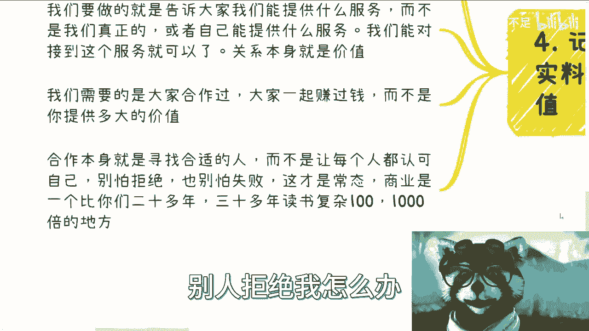

---

## 总结 📝

本节课中我们一起学习了如何通过参加活动和对接协会商会来有效切入商业实践。我们明确了：
1.  要避开纯技术活动，选择商业资源密集的峰会、创业会议。
2.  在活动中，核心任务是观察、学习商业模式并整合信息。
3.  对接协会商会前需做好充分准备，优先选择有背书的机构，并展现专业形象。
4.  商业定位是一个通过观察社会、整合信息而“寻找”出来的过程，并非自我空想。
5.  商业合作中，真正的价值常在于“链接资源”的能力，而非仅仅是个人的执行技能。

记住，细节决定成败。这些要点需要你在实践中不断体会和优化。商业世界如同一个大型游戏，愿你成为一名优秀的玩家，找到属于自己的赛道。