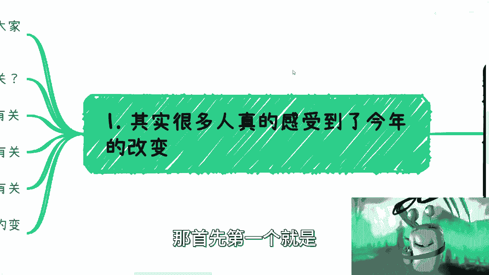
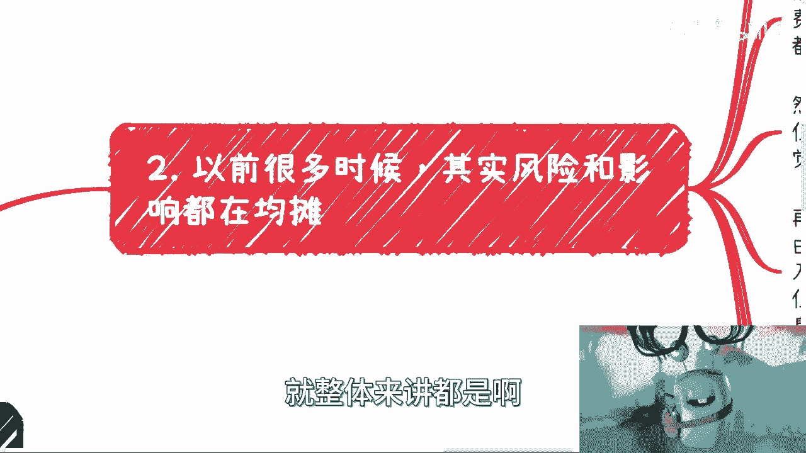
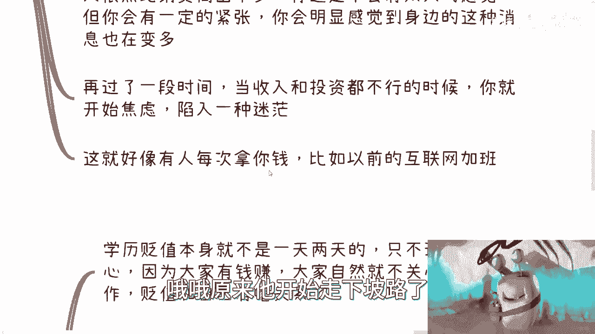
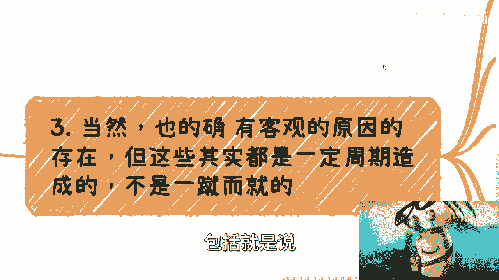
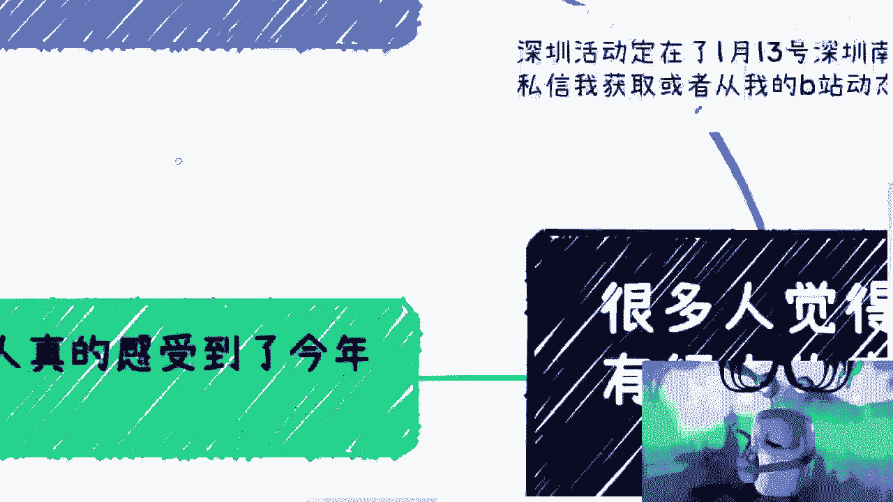
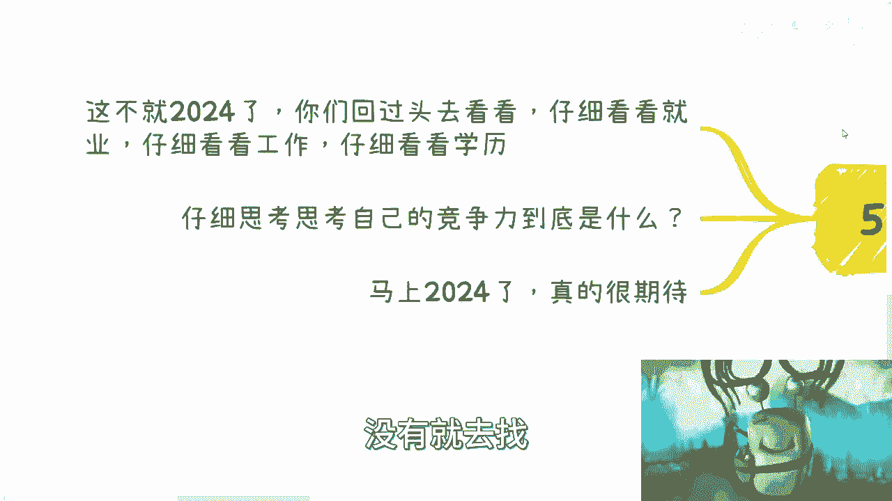

# 课程一：感知与现实 🔍

在本节课中，我们将探讨一个核心观点：许多我们当下感知到的剧烈变化，其实早已存在，只是人们的感知时间点不同。我们将通过几个方面来分析这一现象，帮助你理解社会与个人发展中的“感知滞后”效应。



---

## 一、变化的感知与现实的错位

上一节我们介绍了课程的核心主题，本节中我们来看看具体表现。许多人感觉2023年发生了巨大变化，例如应届生数量庞大、关于失业的舆论增多、路边摊现象变得普遍等。人们常将这些现象归因于疫情后的第一年或AIGC（人工智能生成内容）技术的发展。

然而，需要明确指出，将当前现象归因于AIGC是**无稽之谈**。未来或许有关联，但与现状**毫无关系**。其他可能被关联的因素还包括美国大选、宏观经济环境、金融暴雷事件以及学历贬值等。


这引出了一个根本问题：是环境真的发生了巨变，还是仅仅因为人们现在才感知到这些一直存在的风险？



---

## 二、风险均摊与感知钝化

理解了变化的普遍性后，我们来看看为何过去感知不明显。以前，风险和影响往往被**均摊**或**对冲**，使得整体感知较弱。

我们可以用一个财务模型来类比：

```
初始状态：
月收入 = 100,000元
月消费 = 20,000元
状态：盈余充足，感知平稳。

第一阶段变化：
额外不稳定收入减少至 0元。
固定收入 = 100,000元（不变）
状态：因固定收入高，感知变化不大。

第二阶段变化：
固定收入减少一部分，同时通货膨胀导致消费上升。
状态：收入仍高于消费，但开始感到紧张，注意到周围负面消息增多。

第三阶段变化：
收入与投资均不理想。
状态：当 `消费 > 收入` 时，开始焦虑和迷茫。这正是当前许多人面临的情况。
```

这个模型说明，问题的核心在于**基数变化**。当整体收益高时，小的损耗（如被拿走2000元）无足轻重；但当收益本身很低时，同样的损耗占比（如40%）就会变得极其显眼。

过去互联网等行业的光景，并非完全因为个人能力或学历价值高，而更多是得益于**整体经济上行**的“红利期”。在资金充裕时，企业可以承担低效的岗位设置（`两个人的活，二十个人干`），个人也容易产生“我很优秀”的错觉。这些岗位本质上是**虚设**的，其影响一直存在，只是未被普遍感知。

---

## 三、线性发展与感知滞后





除了经济模型，许多社会现象的发展也是线性的，只是感知有延迟。以“学历贬值”为例，它并非一日之寒，而是一个长期过程。

```
学历贬值进程 ≠ 公众关注度
```

在过去经济好、就业机会多的阶段，即使学历在贬值，因为大家能找到工作，所以**无人关心**此问题。如今就业困难，这个问题才被推到台前，备受关注。高校专业设置的质量问题同样如此，过去与现在都存在“缝合怪”专业，只是在不同经济周期下，人们的关注点不同。

同理，对于同一观点的评价（如“悲观”或“极端”），也会随时间变化。在当前环境下，可能有20%的人认为某观点悲观。但若将同样的观点放在几年前经济上行期，则可能90%的人会反对。**事实并未改变，改变的只是大众的感知阶段。**

---

## 四、新机遇的特征与个人应对


认识到变化一直存在后，我们来看看当下环境的新特征。未来可能会出现新机遇，但其**生命周期将越来越短**。




以下是其发展模式：

1.  **模式复制加速**：一个行业或模式一旦盈利，立即涌入大量模仿者进行简单复制（`Ctrl+C, Ctrl+V`）。
2.  **环境迅速恶化**：大量参与者涌入，好坏难辨，快速将行业搅乱，耗尽发展潜力。
3.  **生命周期缩短**：原本可能持续数年的模式，现在可能仅维持`6到9个月`便迅速衰落。

从赞美到唾弃，从崛起到崩塌，速度越来越快。面对这种环境，个人需要深度思考：

*   **核心竞争力是什么？** 仔细审视自己的技能（`技能`）、学历（`学历`）在就业市场中的真实价值。
*   **追求的目标是什么？** 明确自己对于时间自由、金钱、事业地位的追求。
*   **如何构建优势？** 必须清醒认识到，未来的“红利期”将更少且更难捕捉。如果没有核心竞争力，就要主动去寻找和构建。

---

## 五、总结与核心启示



本节课中我们一起学习了“感知滞后”现象。我们通过分析经济模型、线性发展规律以及当前市场特征，揭示了**变化本身是持续的，而大众的感知是阶段性**的这一核心观点。

任何事物的发展，我们都不可能是第一个或最后一个感知者。社会按其固有规律发展与变化（`社会本身该怎么变化，怎么变化`）。我们感觉到的“不同”，往往只存在于个人的**认知与脑海**中，而非社会客观发展的本质出现了断裂。

因此，关键在于**认清现实，停止将当下困境简单归因于突如其来的变化**，转而积极寻找和构建属于自己的、不依赖于短暂红利的真实竞争力。