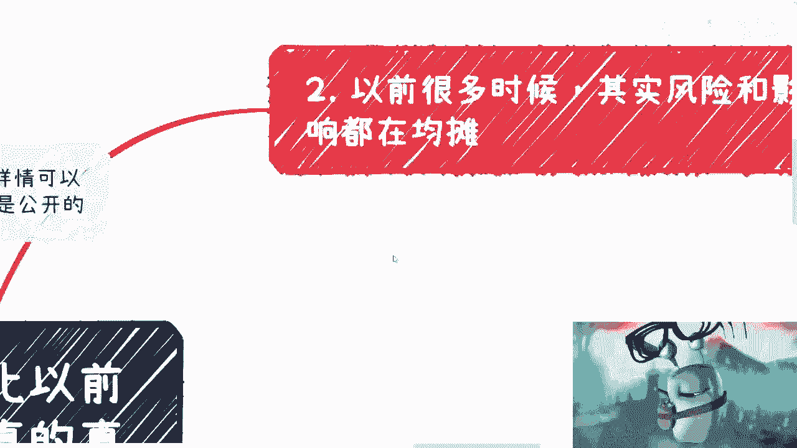
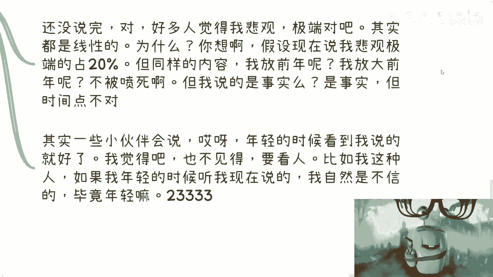

# 变化其实一直都存在，只不过每个人的感知有早有晚 - P1 - 赏味不足 - BV1Eb4y137dr

大家好，咳嗽还没好，我就悠着点悠着点，那个深圳活动继续报名啊，反正场地也大，1月13号，我下周差不多要订机票了吧，然后详情可以私信我获取啊，咳咳，那么我们今天这个内容呢主要是呃叫做什么。

就觉得现在比以前有很大的变化，呃几方面，一方面是有很多人觉得，2023年有很多的变化，另外一方面呢就是呃我跟很多人聊的时候，就是他们也会发出一种感叹，就是说哦原来现在是这样对吧。

原来咳咳咳跟我可能想的不太一样，然后我就会跟他们说的，不是现在这样，其实一直这样啊，这只不过就说是大家有没有感知到，那首先第一个就是很多人感受到了。

今年的这个变化对吧，比如说应届生数据很庞大啊，比如说啊身边或者网络上的舆论啊，关于这个失业，然后大家觉得路边摊变多了，包括我在这个网络上也看到了很多，就记录这种路边摊的视频。

呃然后觉得今年呢可能比较特殊啊，因为毕竟是疫情过去的第一年，那么也有可能呢很多人把当下的很多的现象呢，归结到AIGC啊，说AI嗯的确是替代了很多的岗位啊，怎么样怎么样，在这个地方先提一嘴。

这个是真的是无稽之谈，真的是无稽之谈，你说有没有可能我觉得未来有你说多久，我不知道你说跟现在有没有关系，我觉得这一点关系都没有啊，那么咳咳咳，那还可能比如说和美，明年明年的这个美国大选啊，经济大环境啊。

包括这两年这个金融暴雷有关，对吧，那么啊这个也跟这个学历贬值啊有关系，那么我们来问一个直击灵魂的问题，就是说是真的有很大的变化呢，还是说其实是仅仅是因为大家感受到了变化，以前没有感受到变化而已啊。

好。

那么第二点，就以前我们很多时候呢，其实风险跟影响呢在均摊，咳咳咳咳，可能一部分在军团，另外一部分在对冲，嗯嗯啊，但是不管怎么样呢，就整体来讲都是啊。

就是感知上没有这么明显，比如说我们打个比方，你比如说你一个月消费2万块钱，你月收入10万，你日子过得很平稳，你没啥感觉对吧，然后呢时不时呢你还做做投资啊，做做别的大型的消费，自然呢同时也会有个呃。

可能时不时还会有一些额外的收入，只不过这些额外收入不稳定，那么你过得蛮开心的，过了一段时间呢，你的那些额外收入减少了甚至没有了，但由于你固定收入还是很高的啊，自然也没什么太大的感觉，依然你正常开销。

甚至做做投资和大型消费，再过了一段时间呢，你的固定消费减少了一部分，然后啊你的固定收入减少一部分啊，当然由于通货膨胀，你的消费也在提升啊，那么呃也由于你的收入依然比消费高出不少，你还是不会有太大的感觉。

但你会有一定的紧张，你会明显感觉到身边的这种消息，或者这种情况会在变多，嗯嗯对吧，那么再过了一段时间来，当收入跟投资都不行的时候，那么你就开始焦虑，陷入一种迷茫，那么你就当你这个这个消费。

远远高于你的收入的时候，那么或者说你的这个成本远远远高于你的收入，是红的吗，基本上就像今年对大部分人面临的，这么一个情况，但是其实你会发现你会发现我们来看这个点啊，你比如说这就像你今天做一个生意。

你每次对吧，比如说这一单，你每单赚10万块钱，然后里面有人啊偷鸡摸狗，拿了1000，拿了2000，你知道吗，你可能知道，但你在乎吗，你不在乎，你觉得无所谓对吧，这不是什么很大问题。

但是为什么今年会发现很多人就会感觉到，就是因为他不再是输入是吧对吧，他拿掉2000，他现在收入多少，他现在收入5000哦，你现在每一单收入5000，你拿2000，你再拿对吧，就是一他拿了不会不知道。

但是会更加明显，二当你收入10万的时候，五千两千，他动不了你的根基，但是你收入5000的时候拿2000，你等于拿了40%啊啊对不对，就是说大众其实以前，以前说你比如说创业互联网或者其他的，你是真的。

因为就是是真的因为学历没有贬值，还是说是真的，因为大家的技术实力都还不错，还是真的因为大家的这个这个切入点很好，解决了很多痛点，还是说因为真的怎么样，是这样吗，就是因为我说的这些原因。

而就是说让前两年或者前几年处于一种，就是说大家觉得诶好像还不错的这么一种错觉，是因为什么，是因为整体的经济很好，是因为他有很多的地方可以去挥霍对吧，就是就像我们说的，就是说当你经济好的时候。

或者当你有一定的这个这个资金量的时候，你花个多少钱出去投资，花了多少钱出来开head count花，明明两个人的活，花20个人来干又怎么样呢，没人在乎上上下下都没人在乎对吧。

那么自然而然大家也会觉得哇好像我很牛逼啊，哦好，我能找到工作或者怎么样子对吧，但其实这些岗位本来就是虚的，而不是说今年就这样，你包括以前互联网加班也是一样对吧，你互联网加班，你一年给100万，你加呗。

大家会抱怨吗，不会，但是如果到现在呢对吧，你比如说一年20万，同样让你996007，这不得每天抱怨，不得每天都网上吐槽对吧，就是说所有的这些东西你会发现，包括我们说学历啊，包括其他东西啊。

它的影响一直都在，而且包括你说包括互联网走下坡路，也是他一直在走下坡路啊，他只不过是大众没有感知到啊，那不是说我感知到了哦，哦原来他开始走下坡路了对吧。

那么第三当然也的确存在一些客观的原因，包括就是说一些周期造成的。

它不是一蹴而就的，你比如说学历贬值这个问题，它不是一天两天大家关心吗，不关心，因为大家有钱赚，大家有工作岗位做，大家自然就不关心对吧，你找到工作，你关心什么，但是为什么现在关心了。

因为大家找不到工作对吧，你就比如说我说高校的新设专业很多都很拉垮，都是缝合怪，都是每个专业拉两个专业就是拼出来，那以前就不拼了啊，以前就良心专业，现在不良心了一样的呀对吧。

你就像我前两天在群里面跟他们讲的，只要你有机会躺着赚，你绝对不会去干事情，为什么，因为这就是人性，我不相信啊，你之所以干事情，是因为你还没有能力躺着赚对吧，再好比肯定很多人还觉得我悲观，还觉得我悲观。

我极端，那真的我就我就觉得要命了，我这还叫悲观啊，我这还叫极端对吧，我给你们所有的视频内容，我能讲出来的东西已经是我很克制我的输出了，啊就如果来说我在很克制我的输出情况下，面。

有一些人还觉得这叫悲观和极端化，那我就真的觉得这叫什么，这叫幼稚，这叫无知，对吧，那那当然还没说完啊，你看啊，关于极端和悲观，那很多东西也是线性的，为什么，假设现在说我悲观和极端的占20%。

但是如果同样的内容，你把现在我讲的这些内容，你把它放到前面，放到大前年，这就不是说我被观极端了，这他妈不要被喷死的，而且90%来喷我，为什么，因为时代不一样，时间点不一样，但是事实是事实嘛。

不就是这些事情发生了吗，发生了，但他们不知道啊，他没有感知到对吧，所以说其实一些小伙伴会说哎呀年轻的时候啊，看到我说的就好是吧，我觉得也不见得这要看人，为什么，因为比如我这种人啊。

就是如果我年轻的时候我碰到我，我碰到现在的这个自己，诶，我跟你讲，我也我也不听的。

就我就这种性格对吧好。

那么第四个就是说。

当下这个情况什么意什么情况啊，可能会出现一些新的东西，但是它的生命周期越来越短，为什么，因为你们去看吧，所有的客观现状，他就是这个样子，一个行业，一个模式，甚至一个人，他赚钱了好，马上一群人涌进去。

涌进去干什么，Ctrl c ctrl v，然后好坏重要吗，不重要，为什么，因为大众已经没有别的选择了，他要赚钱对吧，然后一群人涌进去，整个环境就是搅的一团乱，用户分得清楚好坏吗，分不清楚。

客户分得清楚啊，也分不清楚，反正就是本来啊可能这个行业，比如说或者这个东西生命周期能走个几年的好，现在可能就六个月，九个月好拉拉，倒一滩死水，下一个对吧，从赞美到唾弃，越来越越快对吧，要楼楼起楼倒。

楼起楼塌更快，所以我们说就是现在已经，2023年的最后几天了，马上就2024了，我说实话你别说你们了，我也觉得没什么真实感，就是就没觉得好像就2024了，不是那么的真实啊，但是你们回过头去看看仔细。

你再想想看，想想看就业，想想看工作啊，想想看学历，你再仔细想想看，比如说你们如果正在考研啊，正在考公或者正在做一些别的东西，你们仔细想想自己的竞争力到底是什么对吧，再仔细想想看。

未来自己到底想要怎么样的一个生活，或者和和和自己的这个事业，就是说时间自由，金钱地位等等，这些你到底追求的是什么啊，因为你们往后很长一段时间是很难有红利期的，而且就算有红利期。

我说不好听练跟你们可能也关系不大，你们也不一定抓得住，所以说你们就得提前去想好，就说自己的竞争力到底是什么，开始去寻找，没有就去找对吧。

所以啊就是说嗯关于这个点，也是一样的，就是任何的一个事情，我们都不可能是第一个人，我们也不可能是最后一个人，那意味着什么呢，意味着就是说总有可以改变的地方，总有可以就是突破的地方。

而不是说我们觉得啊好像现在很多变化对吧，然后以前不是这样子的，以前，任何东西它不一样，仅仅是在于存在于每个人的认知，跟脑子里面不一样，但不代并不代表社会本身不一样，社会本身该怎么变化，怎么变化。

该怎么发展，怎么发展，没有什么区别啊，OK那我们这一期就讲这么多吧好吧。