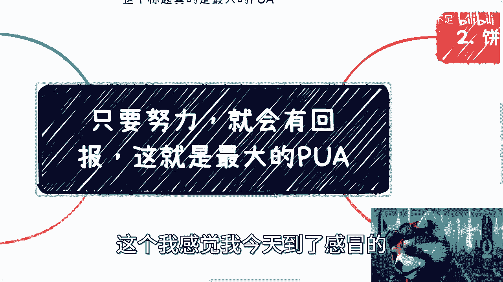
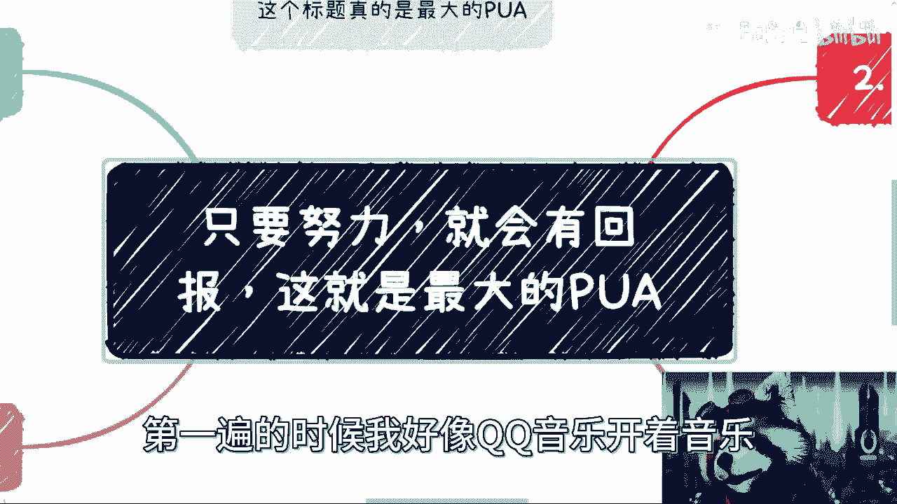
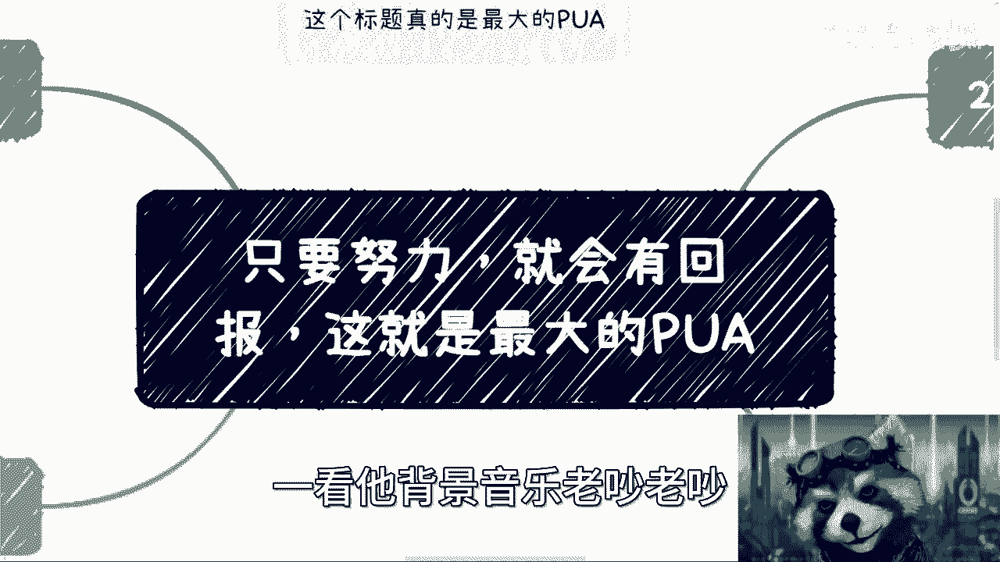
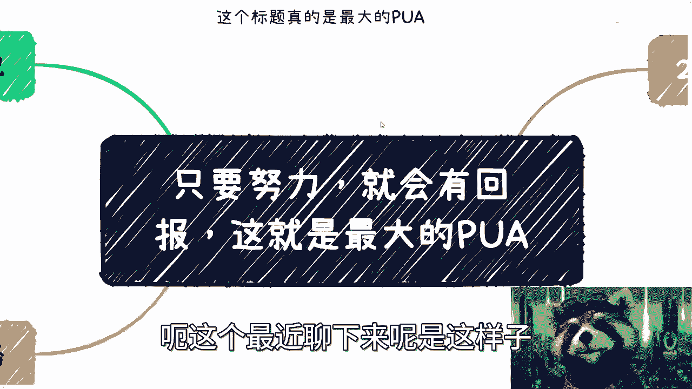
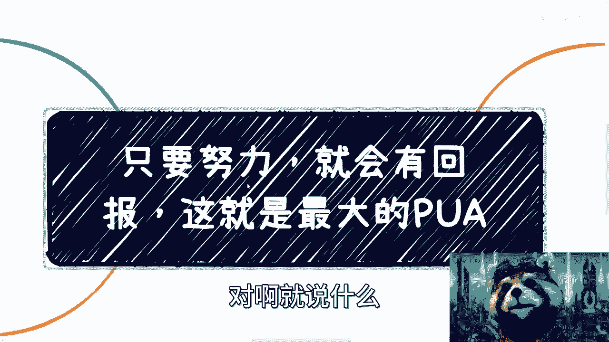
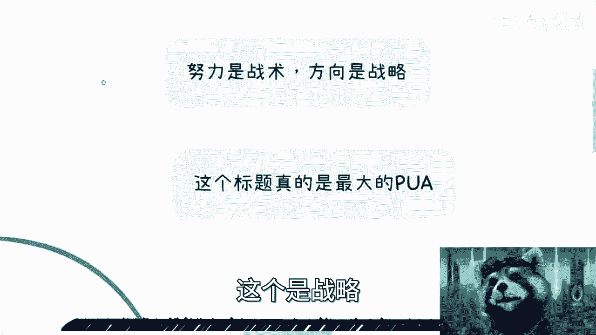
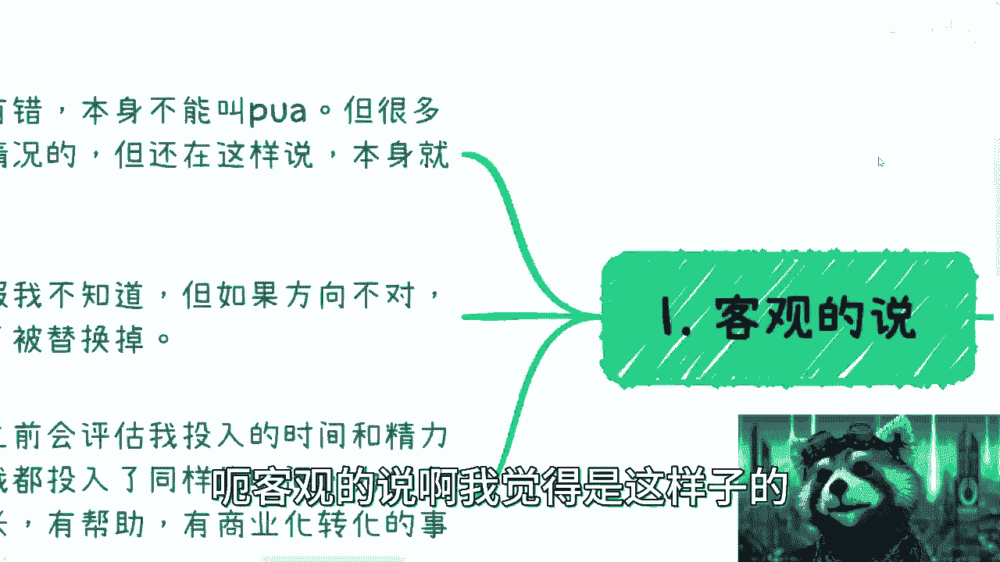
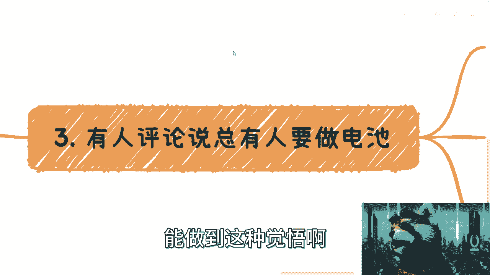
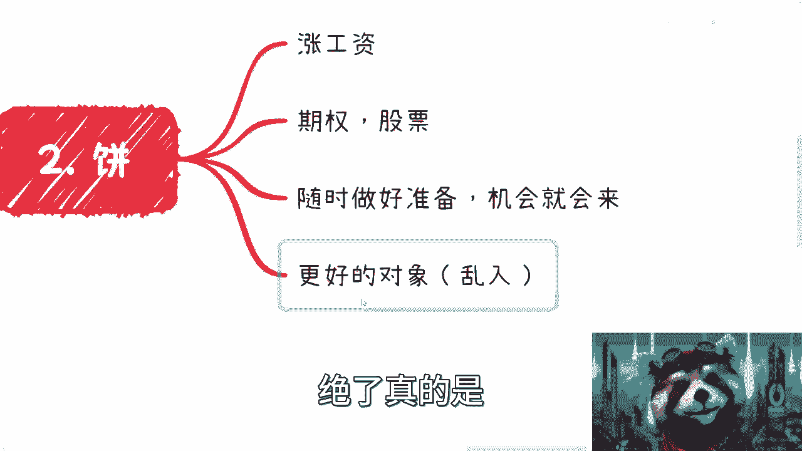
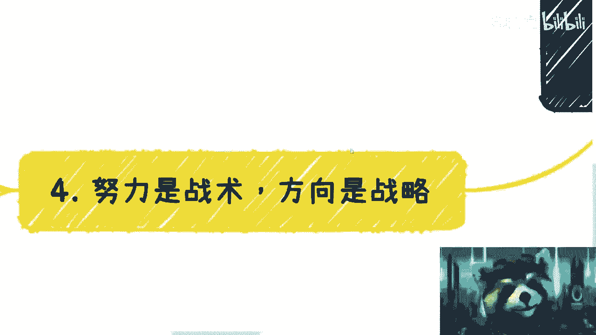

# 课程 P1：拆解“努力就有回报” 🎯

在本节课中，我们将深入探讨一个常见的观念：“只要努力，就会有回报”。我们将分析其背后的逻辑，区分战术与战略，并讨论如何在现实世界中做出更明智的选择。

---

## 概述

“只要努力，就会有回报”这句话被许多人提及，可能来自领导、父母或自我激励。本节课将论证，在缺乏正确方向的前提下，单纯强调努力可能是无效的，甚至是一种精神控制。我们将从几个核心前提展开分析。

---

## 核心前提：努力是战术，方向是战略

上一节我们概述了课程主题，本节中我们来看看分析这个观点的两个核心前提。

首先，努力本身是一种**战术**，它关乎执行和付出。然而，**方向**是**战略**，它决定了努力是否有效以及价值所在。

其次，能否遇到贵人、获得好机会，这些也属于战略层面。战略错误，战术上的努力可能徒劳无功。

---

## “努力就有回报”是最大的PUA吗？

客观地说，这句话本身没有错。否定努力的价值是不合理的。但问题在于，许多传达这句话的人，可能并不了解实际情况。

以下是几种常见情况：
*   **信息滞后**：父母、高校老师可能不完全清楚当前社会的真实竞争环境。
*   **刻意引导**：即便有些人了解现状，他们仍可能选择这样说，其目的可能是进行精神控制或洗脑。

真诚指出问题的人很少。指出培训机构等行业内幕，对讲述者并无直接好处，但这关乎真实信息的传递。

---

## 努力与回报的不确定性

关于努力是否一定有回报，无人能给出绝对保证。然而，如果方向错误，努力可能导致一个更糟糕的结果：随着年龄增长，个人价值被轻易替换。

在做任何事之前，都应评估投入的时间与精力成本。核心原则是：**在相同时间内，应优先选择对个人有成长、能产生商业化转化的事情**。

例如，录制一门课程可以复用，避免了重复劳动。又例如，选择不上班，是因为除了薪水，那份工作对个人没有成长，创造的价值也不属于自己。人生只有一次，为何不更多地为自己努力？

当然，许多人因现实所迫，暂时无法完全为自己工作。这一点可以理解。

---

## 关于“做电池”的思考

有观点认为“社会总要有人做电池”，这指的是社会中80%的人可能从事基础、可替代的工作。这本身是客观现实。

但我们需要思考以下几点：
1.  **目标与尊严**：即使目前是“电池”，目标也应是未来某天不再做“电池”。同时，作为“电池”也应获得基本尊重，而不是被PUA。
2.  **差异化成长**：可以在“电池”的岗位上，努力成为一个“电池科学家”，追求成长与不可替代性，而不是甘于成为996、007、随时可被替换的消耗品。
3.  **不自我设限**：不要偷换概念。倡导为自己努力，与现阶段能力不足、需要先做“电池”并不冲突。不要轻易将自己划入“80%”并认为向上的建议不适用。所有人都是逐步成长的。

是否要做“电池”，未来要成为什么样的“电池”，选择权在于个人。

---

## 方向为何比努力更重要

“只要努力就有回报”常常与对未来的空头支票绑定，例如承诺未来加薪、给期权，或说“机会总会留给有准备的人”。

然而，观察那些真正成功的人，他们的努力并非无意义的加班，而是**有方向的奋斗**。甚至一些灰色领域的参与者，他们的“努力”程度（如通宵研究模式）也远超普通无意义的加班。

选择方向之所以关键，是因为在中国，和我们一样努力、甚至更努力的人太多了。如果自认是普通人，那么如何脱颖而出？

以下是脱颖而出的关键：
*   **同质化无法胜出**：大厂背景、高学历在职业生涯初期是优势，但长期看，如果缺乏差异化，这些优势会被稀释。
*   **核心是差异化**：就像创业需要产品差异化或切入细分市场。个人发展也是如此。选择一个过于庞大（如土木、航空）且同质化严重的赛道，很难建立优势。
*   **寻找利基市场**：应寻找一个细分、有发展潜力且竞争相对较小的方向。当你在一个领域几乎没有竞争对手时，你的努力才会产生最大效用。

---

## 独立思考与自我改变

最后，我们必须明白，来自父母、老师、朋友的价值观需要用自己的头脑去判断。世界是多元的，思考不能像单细胞生物一样简单线性。

例如，问“看书有没有用”，答案取决于个人能否理解并应用书中的知识。这就像面对同一本武功秘籍，悟性不同结果迥异。

个人的性格弱点，如优柔寡断、讨好型人格，可能在商业世界中成为障碍。改变往往源于反复的失败和碰壁，直到意识到“不变就无法生存”。在商业合作中，果断和原则性是必要的，心软和模糊可能害人害己。

---

## 总结

本节课中我们一起学习了：
1.  “努力就有回报”在错误方向下可能无效，甚至是一种精神控制。
2.  **努力是战术，方向是战略**。战略优先级高于战术。
3.  在“做电池”的现实与追求成长之间，应寻求平衡，并保持尊严。
4.  脱颖而出的关键是**寻找差异化**的细分方向，而非在红海中无效努力。
5.  必须保持独立思考，审视外来价值观，并为了适应环境而勇于改变自身弱点。

关键在于，将努力用在正确的、能为自身带来成长和积累的方向上。

---

**行动建议**：如果你有具体的职业规划、全职/兼职选择或专业合作问题，可以私信我，请提前整理好你的问题清单。