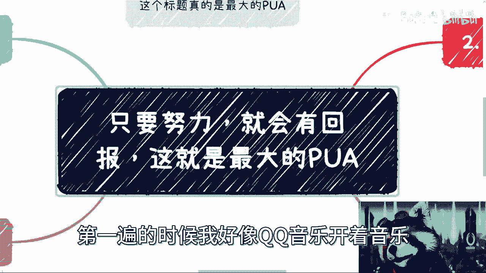
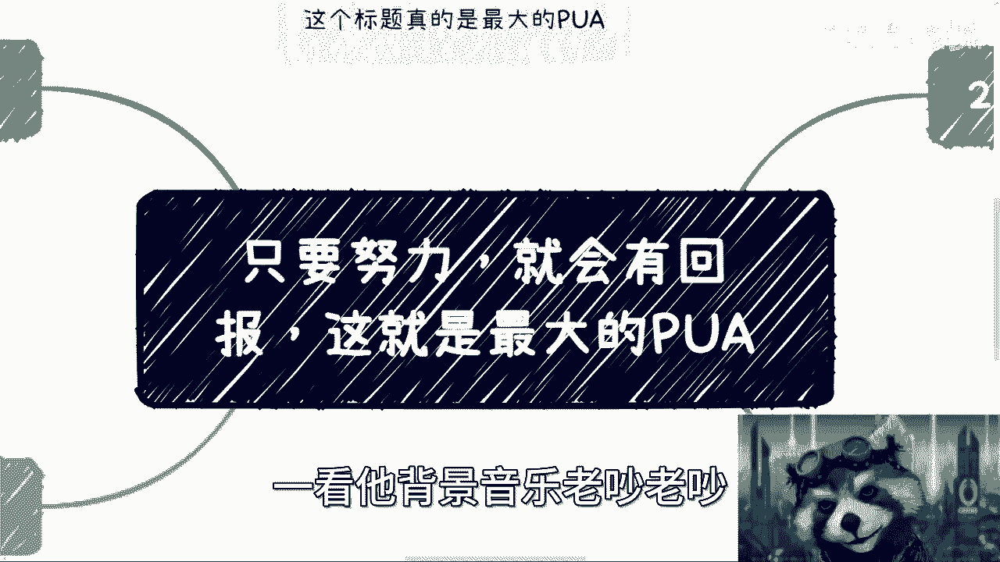
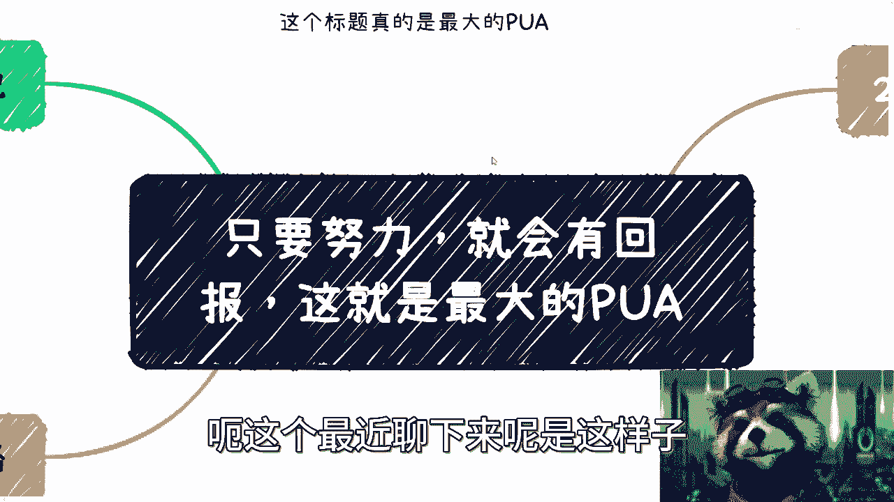
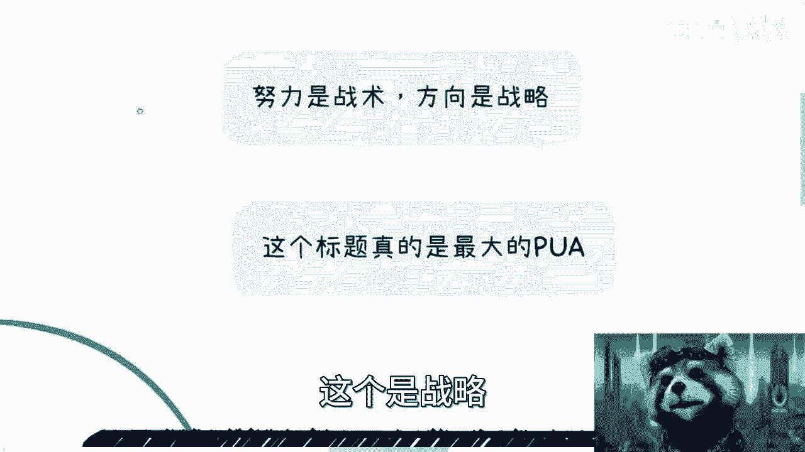
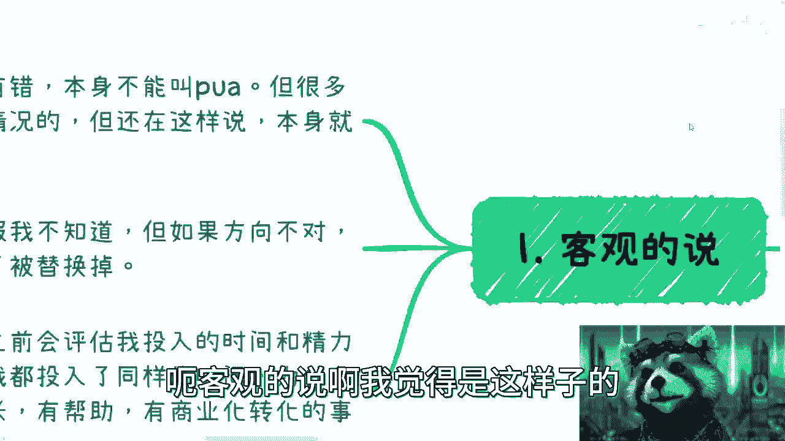

# 只要努力，就会有回报，这是最大的PUA - P1 - 赏味不足 - BV1Dm4y1t73B

哈喽大家好啊，这个我感觉我今天到了感冒的最高峰啊。

真的我跟你们讲，你们是不知道这个视频其实录了两遍，第一遍的时候我好像QQ音乐开着音乐。

然后我想怎么打开我录好的那个视频，一看他背景音乐老吵。

老吵还算了，重新重新给大家录一下，这个最近聊下来呢是这样子的。

就是好多人都在跟我说过这句话，他说他说要么就是他领导在跟他讲，要么就是他父母在跟他讲，要么就是他自己在跟他讲，对啊，就说什么只要努力了就会有有回报对吧。

这这这个我这边已经给出结论了啊，我认为这就是最大的PUA啊，毫无疑问的事情，在这个地方呢我觉得两个大前提啊，一个是努力呢本身是战术，方向呢是战略啊，方向是战略，包括就是说嗯或者这么说吧。

就是说你努力呢是战术对吧，你能不能碰到一些贵人，能不能有些好的机会，这个是战略的嗯对吧。

那么这个标题呢其实就是最大PUA嗯，客观的说啊。

我觉得是这样子的，本身这句话没有错对吧，因为你总不能说啊，你努力了，这个没有回报对吧，这个话就不对是吧，但是呢就是我觉得很多时候呢，就是我们的父母啊，就包括高校的老师啊，其实他也不见得不一定知道。

现在什么情况对吧，同时就是包括你们现在的一些同龄人啊，包括你们出去这个遇到的一些朋友对吧，包括网上的人，确实我觉得大，有些人呢就还是知道现在什么情况的，但是他还是会这么跟你讲，为什么呢。

就是他就是在PUA，你知道吧，他就是在洗你脑对吧，就是这样子，但现在最主要是真诚的人太少了对吧，就像你们关注我，我每次有一个自动回复是什么，我说你们关注了世界上少数的对吧，会说真话的人之一对吧。

我也没有说，我也没有说，除了我之外就没有了，但的确这种人很少对吧，就包括就是我之前给你们录的那些，什么培训机构啊，或者别的东西，就我我没有必要讲啊对吧，就是我的确知道，但我为什么要讲呢。

这对我也没什么好处是吧，那当然第二点呢，就是说你说努力一定有没有回报呢，我是不知道的啊，这个这个东西没有人能说得准，是不是，但是呢如果方向不对，我觉得努力呢本身只会让你的年龄到了，被替换掉。

就这个没有办法的对吧，你你你现在去客观的看待这个社社会嘛，其实就是这样子的，嗯对吧，就是说很多时候呢我们做事情就是我我跟你讲，我做事情之前呢，我会去评估我投入的时间和精力成本，就什么意思呢。

就是说我做都做了对吧，我都同同样的时间了，那么为什么不去做点对自己有帮助对吧，有成长有商业化转化的事情，什么意思啊，你你打个比方说你说我今天录一门课对吧，我当然是希望这个课在各个地方蹲着复用对吧。

我没有必要重复再去劳动，是不是，那这是第一种，第二种就是说我我现在是不上班的，就我已经很久不上班了，为什么呢，因为我去上班，除了我能拿到一份薪水以外，别的所有做的事情对我个人是没有成长的对吧。

对我我做的时候可能我也不开心对吧，对我个人也没有成长，对不对，那么我去赚钱，我去赚的钱也是给这家公司，给家老板赚的，又不是给我赚的对吧，那我就问我，我我图啥嘛，是不是对吧，你说我就活那么一次。

所有人都活那么一次，大家既然做东西对吧，做事情，那为什么不是为自己做呢，为什么一定要帮别人做呢对吧，那当然了，你说到这里有很多人有很多小伙伴要说了，他说那你这话不能这么讲对吧。

这个又不是所有人都能够为自己去做的对吧，有很多人被逼无奈对吧，好啊没毛病啊，没毛病，我们先来看第三点啊，老师在跟我说什么，他说他说总要有人做电池的啊，我确实是没想到啊，就是我是没有想到有人做电池。

能做到这种觉悟啊。

我是真没想到啊，这是什么意思呢，就是说我认为对吧，你做电池没有问题，本身这个社会就八二开的，本来就得有80%的人做电池，这没有毛病对吧，但是我为什么一直告诉大家不要去做，或者希望大家跳出来去想。

是因为第一是希望大家终究能有一个时间点，不去做电池对吧，不是说现在马上不足，对不对，第二就是说大家做没问题，但我需要我自己的，要就是尊重我自己啊，包括我也希望别人来尊重我对吧，我可以是个电池。

我也认了对吧，但是你得尊重我，你不能PUA我对吧，你不能说啊，就是就是我告诉你，我是个对吧，没问题的，但是你不你不能骂我对吧，那你得给我足够的尊重，是不是，那我觉得这是第一点。

第二点就是说我也可以做个电池对吧，我可以在这个电池的领域，这个做一个可以成长的电池，做一个电池里的科学家，就跟三体里面说作为一个火鸡里的科学家一样，怎么了呢，也可以呀对吧，但是并不是说。

我就要求变成一个996007的电池，然后然后因为年纪大了，因为我想要的更多，因为我想要生活，因为就是说啊，我有一个这个家庭或者别的东西要去养你，我就被替换掉，我就被更年轻的电池替换掉。

这是我们想要的吗是吧，这第二点对吧，第三点就是我跟你们讲，很多时候呢别老是偷换概念哦，你看啊，我跟很多人说，我说你们尽量为自己去努力，为自己去赚钱，这件事情没有错，但是这件事情跟你们现在能力不够。

或者机会没有到啊，要求做电池它不冲突，你知道吧，不是说啊，就是好像能就有些人就说哎，驴老师，你说这些观点对吧，这个只适用20%的人，不适用80%的人，那我就问问你，怎么知道你是20%还是80%的呢。

所有人不都是这么一步一步走过来的吗，对吧，你非要把自己框在80%，然后说我讲的东西对你不适用，那随便你要跟我有什么关系呢，是不是啊，所以说你本身要不要做，你未来要不要做。

要是做一个有尊严的还是没有尊严的，这个大家自己选择这件事情跟我没有关系，是不是啊，那么同样的啊，我们来说这个主题，主题就是说你只要努力就会有回报是吧，那这件事情呢，很多时候他是跟未来的一个饼有关的啊。

你比如说你只要努力了对吧，哎呀未来给你涨工资对吧，为了给你期权股票啊，然后呢你只要努力了，随时做好准备，机会就会来的对吧，然后还有什么就是啊你只要努力了对吧，你这个这个有很这个。

自然而然就会有很好的对象，这几个事有啥因果关系啊，啊有任何因果关系吗，在我看来对吧，我身边赚大钱的，或者我所有看到的这个面上面也好，水下也好，能够去赚大钱的，你说他努力吗，努力的。

但人家不是为为你PUA努力的对吧，人家不是每天在那边做电池努力的，在那边说要加一些无意义的班，努力的对吧，你就算你就算那些就是说我们说以前p two，P传销盘，我跟你们说，你们其实可能没参加过。

没有去听过传销盘的活动，我跟你们说，人家传销盘很努力的，你知道吗，就模式啊，资金盘啊对吧，包括资金模式啊，人家都是通宵讨论的，人家这才叫努力，你们这叫啥，你们这叫无脑的加班，对吧啊，我跟你们讲。

你到时候又要又要有人把我这段话截出来了，对吧，那就说哎你看驴老师三观不正是吧，支持方向盘怎么了，怎么了呢，我支持支持，这是我的事，国家打不打击是国家的事对吧，再说了，人家是比你努力没毛病啊。

你们自己去看看，哎绝了。

真的是是吧。

那第四个你看为什么要选方向，因为什么呢，因为我们够不够努力，事实上是什么呢，就是我相信啊，我们可以不够努力啊，但是呢你要明白一点，在这个世界上，你别说世界上了，就在中国和我们一样努力的人太多了。

对不对好，那么你们很多人又标榜你们是普通人，那我就问你们作为普通人，你们觉得别人跟你们同样努力，甚至比你们努力的人还要多，那如何脱颖而出呢，对不啦，就这件事情，但凡用用用，你们不用说大学了。

用你们高中毕业的脑子，想想就能想得出来的结果，如何脱颖而出呢，啊结果当然是不能脱颖而出的，对不对，那大家都一样的，有什么区别了，没有意义的呀，哦你跟我说你你你难道跟我说好，我有大厂的背景。

我脱颖而出的是你可能毕业3年脱颖而出了，你毕业三毕业10年了，拖个引个屁啊啊到最后不是都一样吗，啊啊然后你跟我说，你有学硕士学历，博士学历是你你毕业时候是脱颖而出了，对然后过了3年五年也不是一样吗。

有什么区别呢，是吧，就你是这样的，我一直说你你又不是他妈的，这人生只过30年对吧，你后面这么多年不够了吗，啊财务自由了吗，那财务自由也行对吧，那那我就不屁话了是吧啊牛逼啊，然后还有什么呢。

你看啊怎么脱颖而出呢，那你就要做差异化，对不对，你看创业产品要差异化对吧，用户画像要差异化，或者说有非常多的创业者，做的是大厂看不上的那种边角料对吧，去切一块小的，这叫差异化，对不对。

就是你们会发现你们很多定下来的方向，你去定什么土木啊，航空啊，化学啊，什么方向没有用，你知道吗，你这种方向太大，而且你来问我这个大而全的也没有用，你知道吧，你要去定一个很小的方向，方向是最重要的。

努力相对于方向来讲没有那么重要对吧，因为努力很多人都可以努力啊，对学历很多人也可以有同样的学历啊对吧，然后你说你这个大厂，那他妈大厂现在都已经烂大街了，对不对，那你说有什么区别呢。

区别就在于说你能不能找到差异化的地方。

对不对，你看我今天在群里，我还说呢，我说他们在群里面就在说什么，说最近什么杭州裁员裁的很多，我就跟他们讲，我说你看我关心吗，我一点都不关心，为什么，因为拆不拆跟我没有关系啊。

因为我所在行业放眼望去毫无竞争对手，那就只有我孤零零的一个人在那边对吧，我跟你讲，真的不是说我什么独孤求败是吧，或者怎么样，实在是的确没有人啊，我也喜欢大更多的竞争对手进来，你把我卷死，那最好，为什么。

因为你就更多人进来，这行业才有发展啊，我一个人在那边是孤独的对吧，做这个有什么意思，没有意思的呀，而且我说的不好听啊，我还要打四二打对吧，我一天才几个小时啊，我我我做的过来，我也做不过来，是不是啊。

所以呢就是我觉得啊就是说你们一定要明白，就是啊很多事情啊，你们的父母啊，你们的老师啊对吧，包括你们的朋友啊，给你们的一些价值观，我觉得没有问题啊，但是就是说你得要用脑子去判断这件事情啊。

这就好像有很多人问我，他说驴老师那个你觉得看书有用吗，我就这么跟你讲，看书有没有用，取决于你能不能看得进去对吧，你就好像今天有本有本九阳真经放在这边，那为什么张无忌能练得成，别人练不成呢。

那不是看你的悟性嘛，对不对，那为什么有的人111招就能练成，有的人练20年呢对吧，这不是看书的问题，只是看你能不能明白这书里面讲的东西啊，唉就我觉得有很多人啊，这个脑子啊就不知道是怎么一个情况。

你知道吧，就是就是你得你得看明白，这个世界是多元化的啊，就是作为一个人类，就不要像一个单细胞生物一样思考，你知道吗，这是第一点，第二点呢，然后还有就是这个我也跟大家说了对吧，我说我以前很优柔寡断啊。

然后说我以前很讨好型人格，然后又蛮多小伙伴在问我们，他说你到底是经历了啥，我告诉你们经历了啥，事情本身不重要啊，重要的就是对我来讲就是不停的失败，不停的失败，不停的失败，不停的伤心对吧，不停的去触碰到。

就是撞撞的头破血流，然后直到什么，直到就是说OK我必须要改变，我不改变就已经活不下去了，那才会变成今天这个样子，那怎么办呢，没有办法的，你你天生就这个样子对吧，有很多人可能跟我一样的。

就这个样子能怎么办呢，你必须改啊，你不改你你根本没有办法去做很多东西，因为你要知道你的优柔寡断，你的叫什么，就是心软对吧，你的就是说啊讨好型人格，在很多商业层面，别人一看就觉得。

你不是个做不适合做生意的料啊，你不是一个很合适的合作伙伴，我现在碰到这种人也是的，别合作不合作的，虽然我不会面上说，但是我心里很清楚，不合作的没什么好合作的，因为在商业上面层层面你就得狠，你不狠。

合作什么东西啊，没什么好合作的，害人害己，好吧那反正先说这么多吧，我要去给那个高考那个高等学校，就因为我最近不是在给那个金融专业在出课吗，我得给金融专业去上课去好吧，然后那个怎么找吧。

那那个啊大家有全职兼职啊，有这各种各样的职业规划啊，或者有这种专业合作的，你们可以私信我，把你们的问题的question list列好啊，可以私信我好吧。

