# 吃人嘴短，拿人手短，这就是扯淡 - P1 - 赏味不足 - BV1gjHgebERJ

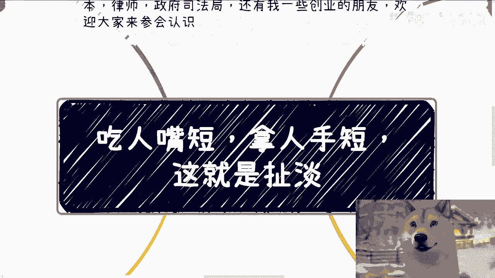

好大家好，今天我们来讲的这个主题呢，这个名字啊其实很多人都听到过对吧，叫吃人嘴短啊，男人手短，对我跟你讲，这他妈就是扯淡啊。

他妈真他妈扯扯他妈蛋啊，然后我先说一下下一期活动啊，9月8号啊，在上海，本期呢是2024年的第二期数字经济大会啊，详细的话呢可以建报名区的报名链接好吧，然后报名链接里面有这次的详情啊，嘉宾啊啊。

然后本次活动呢，现场我也邀请了我自己的一些资本的朋友，律师的朋友啊，还有我的一些创业的朋友好吧，欢迎大家来参会认识，反正这些人呢呃人都很不错啊，我相信就是未来这个工作当中也好，包括其他其他各个方面也好。

你们其实都用得上啊。

各方面的这种人，好吧啊，那么首先我们今天来讲这个主题，第一啊。

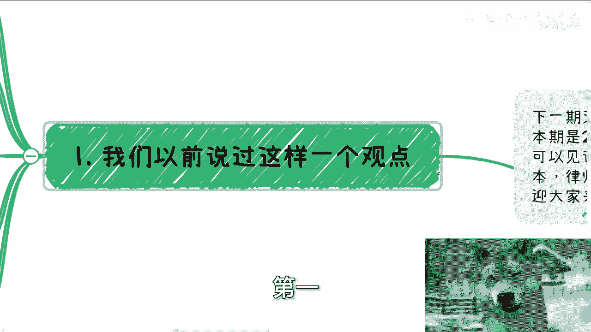

第一就是我们以前呢说过这么一个观点啊，象牙塔里啊，或者说老百姓呢都是来讲感情的啊，都是讲情义的，所以呢啊而而且我补充一句啊，就是他们觉得蒋侃杰跟讲情义是那种什么，就是那种呃还还特别骄傲啊。

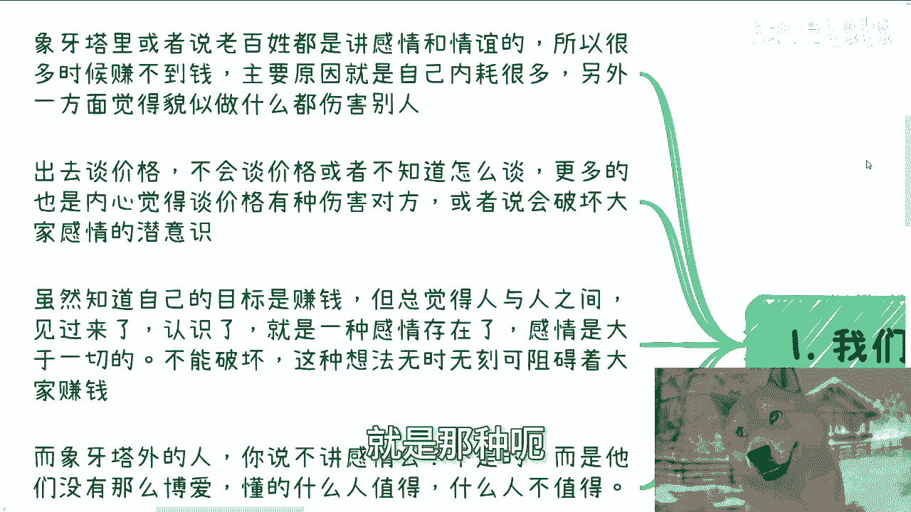

就觉得卧槽，我他妈是也是一个有血有肉的人啊，但还是那句话，这都是自我感动，你讲感情有血有肉，他妈有什么因果关系吗，啊有有什么直接关系吗，对不对，你看你跟谁讲感情，你要是跟他妈的任何一个都敢讲感情。

那就有情有那就有血有肉嘛，那他妈你也是个对吧，所以说很多时候赚不到钱啊，所以说主要原因呢自自原因是自己内耗太多，另外一方面呢觉得貌似做什么都很伤害别人啊，我也不知道这种什么情感是怎么来的，第二方面呢。

比如说出去谈价格啊，他不会谈啊，或者说不知道怎么谈，那么更多的呢，也觉得哎呀内心谈价格有种伤害对方，或者说我一旦报价了，我我不知道报高报低对吧，报不无论报高报低，好像对感觉跟对方情感呢都会有所破裂对吧。

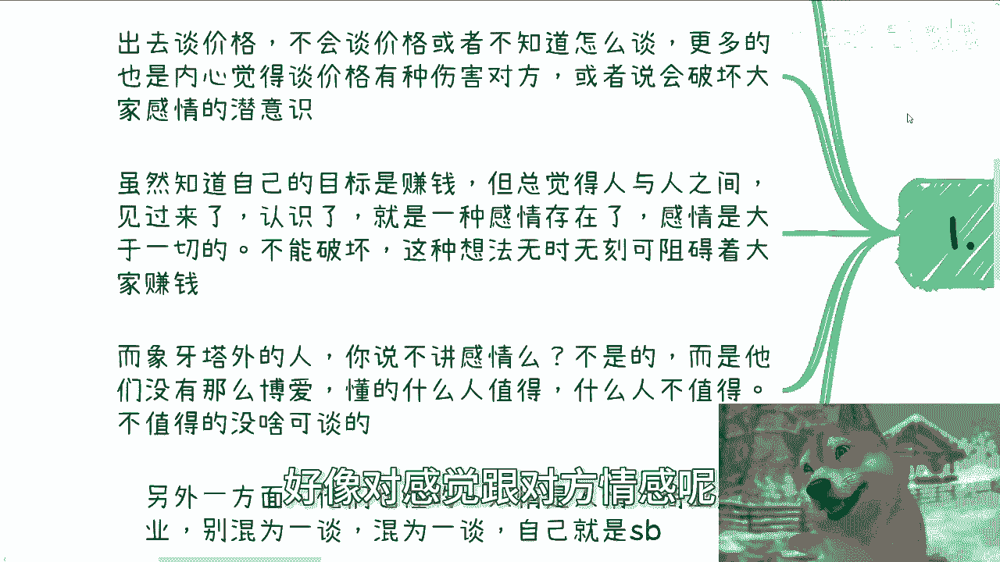

妈也很奇怪，也不知道这这种想法怎么来的啊，虽然知道啊，虽然我觉得很多人知道自己的目的是赚钱，但总觉得人与人之间啊，比如说大家线下见过了啊，或者说甚至微信聊过天了，认识了啊，他就有种莫名其妙的。

就是这种什么感情的存在对吧，就觉得感情是大于一切的，而不能破坏，那我就这么说，这种想法，这种所谓的有血有肉，这种所谓的情感啊，无时无刻都在阻碍着大家赚钱，就这么简单，这么都是屁呀啊，而象牙塔外的人。

你说不讲感情吗，不是的，就像我一开始说的，而是他们没有这么博爱，他们懂得什么样的人值得，什么样的人不值得，但不值得的，没啥好谈的，有啥好谈的呢，对不对，那么另外一方面啊，就是他们也懂人情是人情。

商业是商业，你别混为一谈，混为一谈。

就说明大家都是是吧，哎不要咬过来啧。

唉我家我家咪咪，我的咪咪每天都盯着我家老鼠啊。

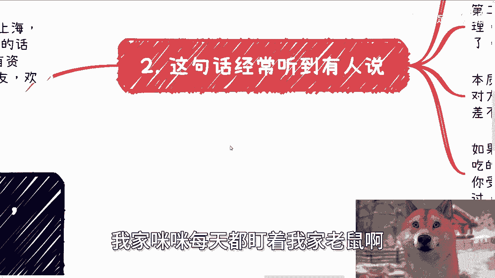

然后第二啊这句话经常听到有人说。

就是你看啊，你说这句话里面有两个核心点，第一个呢就是你是不是要吃这个饭，你是不是要拿这个东西对吧，没人逼你啊啊第二呢就是说如果你不懂得拒绝。

那么你自己是个，你怪不得别人对吧啊。

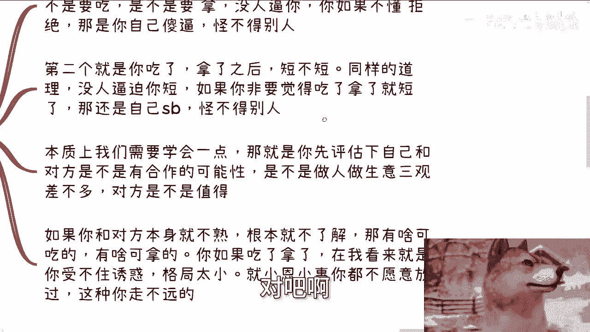

然后第二点就是你吃了东西，你拿了礼物短不短呢，那同样的道理没人比你短吧对吧，你总不可能一天到晚，一天到晚在里面说啊，我就是觉得就是好像拿别人东西来，然后吃别人东西了或者怎么样子的，就觉得短对吧。

那如果你非要觉得拿了就短了，那还是你自己，那怪不得别人啊，那本质上就是我们需要学会一点，就是那就是你先评估一下自己，跟对方是不是有合作的可能性，以及你跟对方在做人，做生意上面是不是有差不多的三观。

对方是不是值得对吧，那如果你跟对方就不熟啊，根本就不了解，那有啥可吃的，有啥可吃的，有啥可拿的，你如果吃了拿的，在我看来你就是说不出诱惑。

格局太小对吧，任何小恩小惠小惠你都不愿意放过，那他妈你这种你无论是以后出问题了。

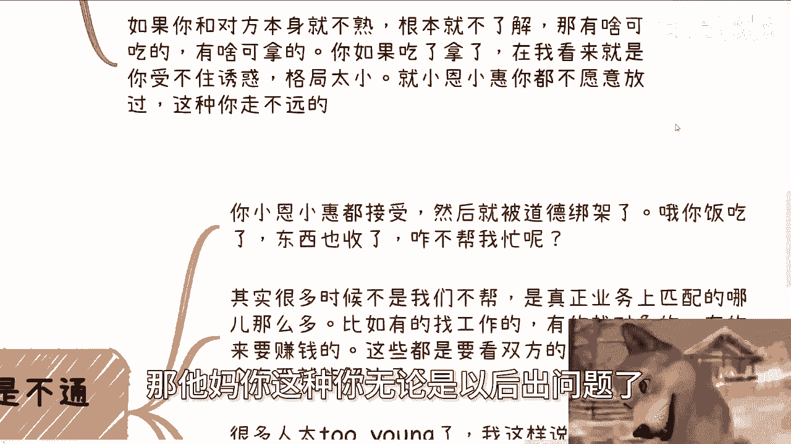

还是说是别人抱怨你，你怪谁呢，对不对，第三啊，其实我们仔细想想看逻辑。

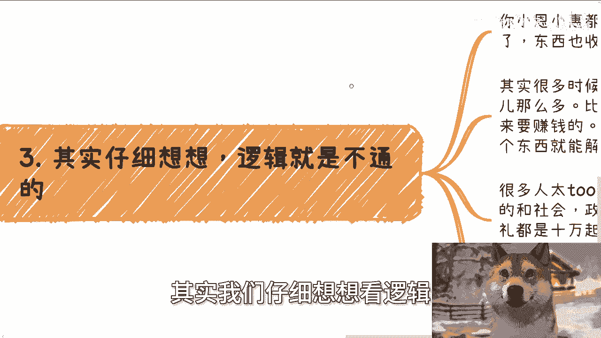

他就是不通的，因为你想啊，你小恩小惠都接受了，然后就是道德绑架啊，你要比如说我我给你吃饭对吧，我就说那他妈你饭吃了，你东西收了，咋他妈不帮我忙呢，对不对，那其实很多时候不是我们不帮啊，是真正业务上匹配。

哪有这么多，哪有这么多业务匹配，哪有比如说有的要找工作，有的要找对象，有的要赚钱，这他妈都要看双方的，难道吃个饭送个东西就能解决了啊，你活在这个世界上，在中国这么个国家，你认为任何一个问题。

吃个饭送个东西就能解决的话，那大家就还会这么难吗，是不是，对吧，就我就这么讲，你们但凡只要有那么一丝，跟社会跟政府接轨，你就会明白我们日常节假日，就是我们真正啊跟跟跟政府去打交道的。

我们日常节假日送礼物，都是10万块钱起步的对吧，你最后单子有没有还得看看运气，还得看跪舔人家，根本不你的，你以为呢啊吃个饭，你又让我想，就让我想到了，之前还有人他妈想求我做事情对吧，然后请我吃个饭。

他妈的加起来200块钱不到，我操真尼玛搞笑了，真的是对吧，我说不好听点，这就是不尊重我，就这么简单，你要觉得我能解决问题，那不好意思，我不止，我绝对是不可能值，你就200块钱帮我搞定，那么搞笑了。

你找别人去，对不对哦，那说白了送礼的人多了去了，大家都排队，按照这些人的逻辑，那他妈送了礼吃了饭一定能成事吗对吧，那如果来说所有的人都能都送，都送了东西吃了饭，那就说明本身这个行为没有门槛。

那没有门槛的事情。

所以如果逻辑都走得通的话，那那现在就不会这样子，对吧好，第四，你比如说送礼吃饭给钱，他就是一种态度，只是一种态度没了对吧。

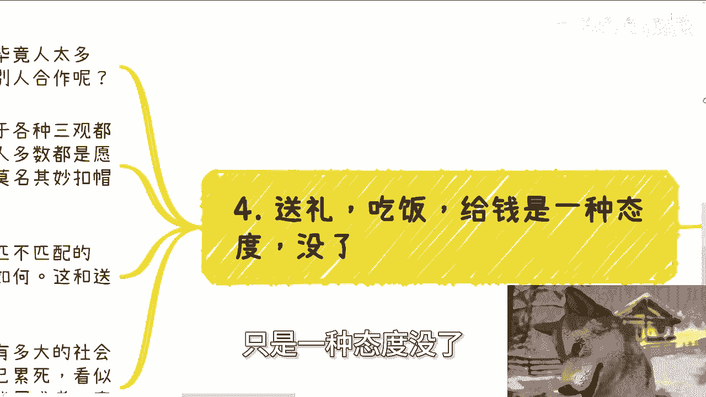

我跟你们讲啊，所有事情其实都是一层层筛选的，毕竟人多了，那为什么你想你，你为什么对方能愿意跟你合作，而对方不跟别人合作呢，对吧，如果来说你你今天也送东西也吃饭，对方也送东西也吃饭，那凭什么。

而不是对方啊，就别人也送东西吃饭，那对方为什么找你不找别人呢，也就是说你一定是有某一些护城河，或者有某些事情是别人没有做的啊，那如果你本身对于你自己，对于社会，对于这种各种三观都比较正的话。

那么你去送礼，你去请客吃饭，别人多数是愿意赏脸的，为什么，因为别人知道你不是一个格局小的，你不是一个会用这种叫做吃人嘴短送额，吃人嘴短送人啊，叫什么，就是，对男人手短的对吧，这种叫什么。

就是这种道德去绑架别人对吧，那你不是这种人，别人就不会去避着你啊。

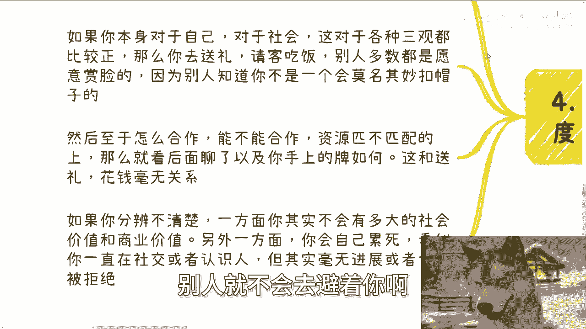

那么然后至于怎么合作，能不能合作，资源匹资源匹不匹配，那就看后面怎么聊，以及你手上的牌怎么打对吧，那么这个事情跟送礼跟花钱没有关系，你哪怕之前花了100万，花了200万，你们双方资源不匹配。

那就不匹配怎么办呢，哦因为你花200万，所以强行给你匹配上去，他做不到啊对吧，所以如果你分辨不清楚，一方面，你其实不会有多大的社会价值和商业价值，也就是说你所有的小恩小惠都是都都去得到。

以及你莫名其妙的，也就是不分大家到底匹不匹配，不分大家能不能合作，就就就到处，就比如说啊送东西请别人吃饭，说明什么，说明你是一个没有分辨能力的人，那你怎么会有商业价值和社会价值。

那另外一方面你会自己累死，看似你一直在社交或者在认识人，但其实毫无进展。

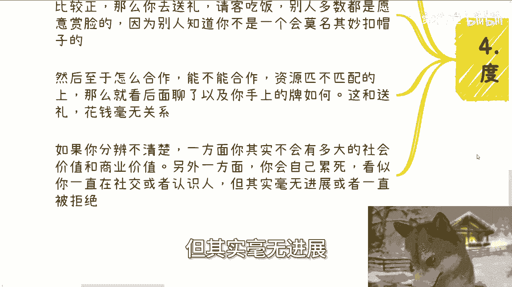

或者一直被拒绝，对不对，你我跟你们讲啊，很多事情还是那句话。

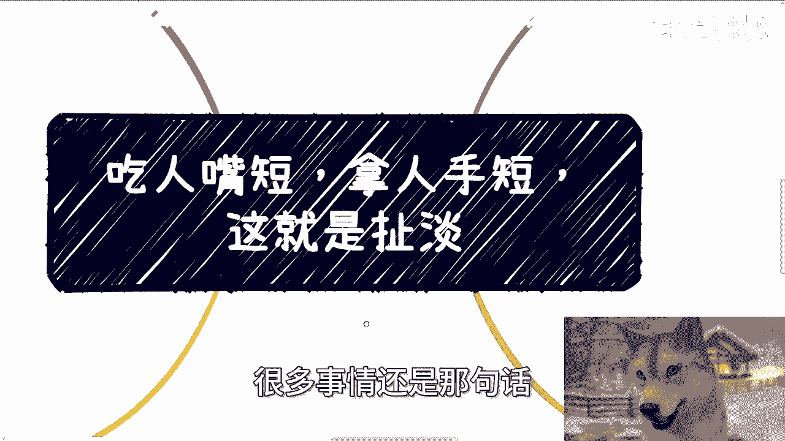

就是你不要觉得都是死路，路是人走出来的，而且很多路在社会上已经无数个人走过了，对不对，那你知很多人之所以觉得他走不了，或者之所以觉得走不通，还是我觉得还是因为他懒，要么就是他蠢对吧，你你很多东西讲感情。

感情有什么好讲的，感情能当饭吃吗，感情能换钱吗，不能对吧，你觉得你很高大上，你觉得你很你很高尚对吧，或者你你你好像呃很很有道德感，那是你的事情，那么我只能告诉你们，既得利益者跟资本家跟所有能赚到钱的人。

以及这个社会跟这个地球，他不是围着道德来赚的，就这么简单对吧啊。

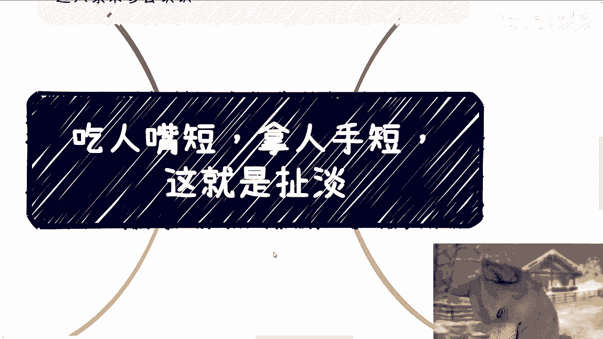

行好吧，那我觉得这个事情你们可以自己再想一想啊，那么下期活动9月8号好吧，报名的话就直接评论区链接就可以直接报了，然后现那个详情的话，就是链接里面也会有详情啊，啊然后剩下的话就是职业规划。

就包括你们的工作啊，商业规划，包括你们跟别人呃做一些叫什么，就是合作一些产品啊，合作一些服务啊对吧，在这里面会涉及到一些合同啊，分红啊，分润啊啊商业计划书啊，白皮书啊，融资啊，估值啊等等等啊。

各方面的东西，如果你们希望啊通过跟我的一些沟通啊，能够呃帮助你们更好的去做一些职业规划，跟商业规划的话，那么你们可以整理好对应的问题和个人背景，好吧。

