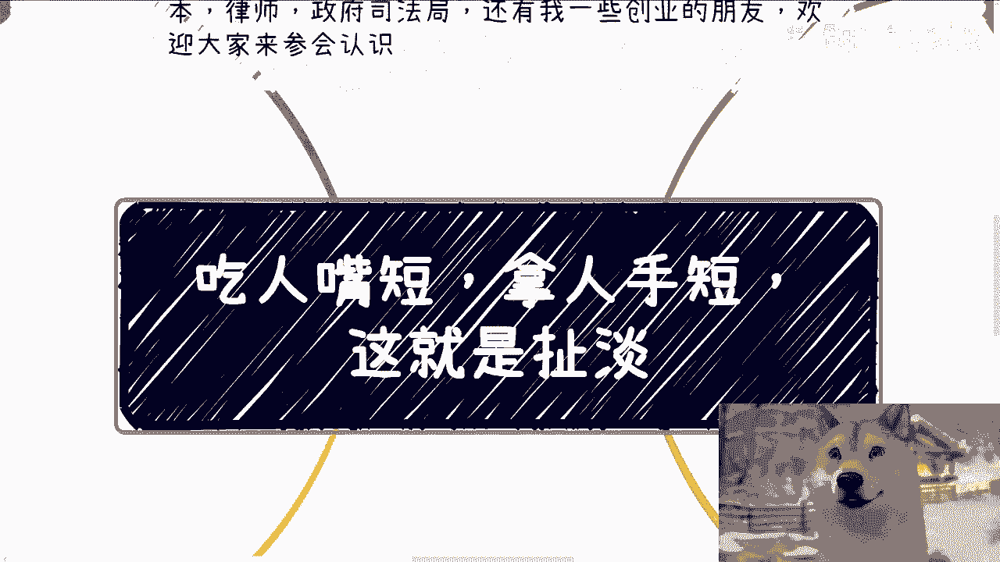

# 课程 P1：破除“吃人嘴短，拿人手短”的思维误区 🧠

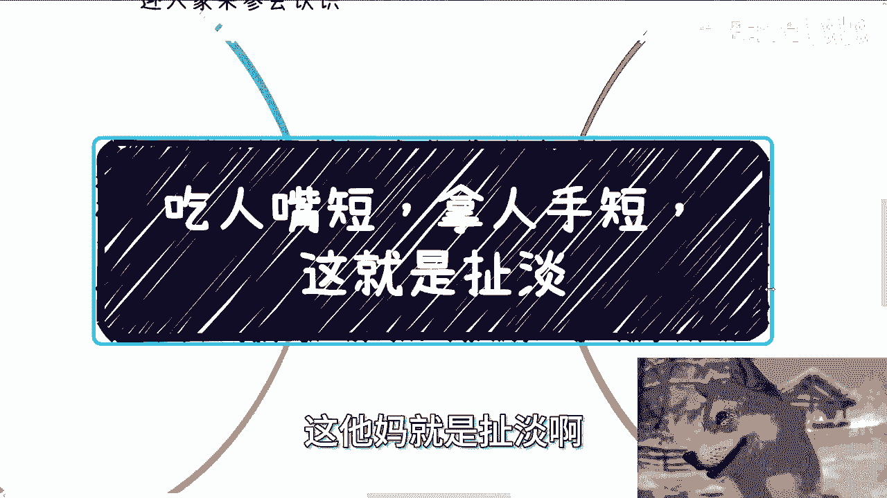

在本节课中，我们将要学习一个常见的思维误区：“吃人嘴短，拿人手短”。我们将分析这句话为何在商业和社交中站不住脚，并探讨如何建立更健康、更有效的价值交换关系。

---

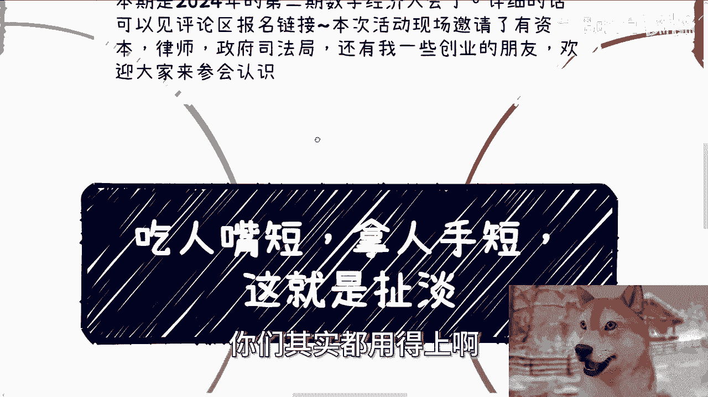

## 概述：情感与商业的混淆

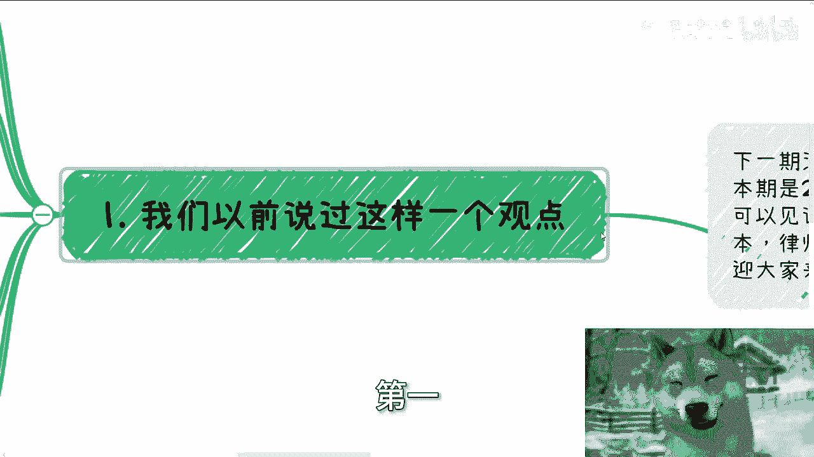

上一节我们介绍了课程主题，本节中我们来看看问题的核心。许多人，尤其是初入社会者，常常混淆情感与商业的界限。他们认为讲感情、重情义是高尚的，并为此感到骄傲。

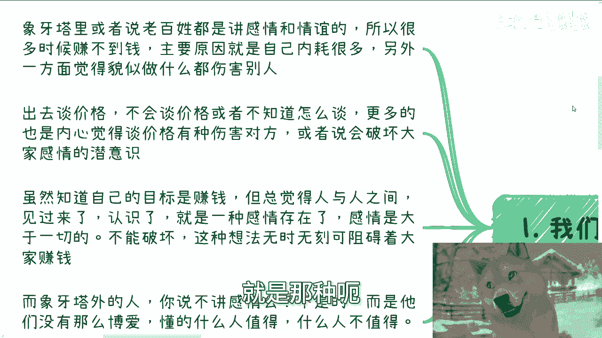

然而，这种“有血有肉”的自我感动与能否取得商业成功并无直接因果关系。无差别地对所有人讲感情，不仅无法帮助你赚钱，反而会成为巨大的内耗和阻碍。例如，在谈判报价时，会因害怕“伤害感情”而犹豫不决，这直接影响了商业决策的效率和质量。

而真正在商业世界中成功的人，并非不讲感情。他们的区别在于：**懂得对值得的人付出感情，懂得将人情与商业分开**。将两者混为一谈，往往意味着不专业和低效率。

---

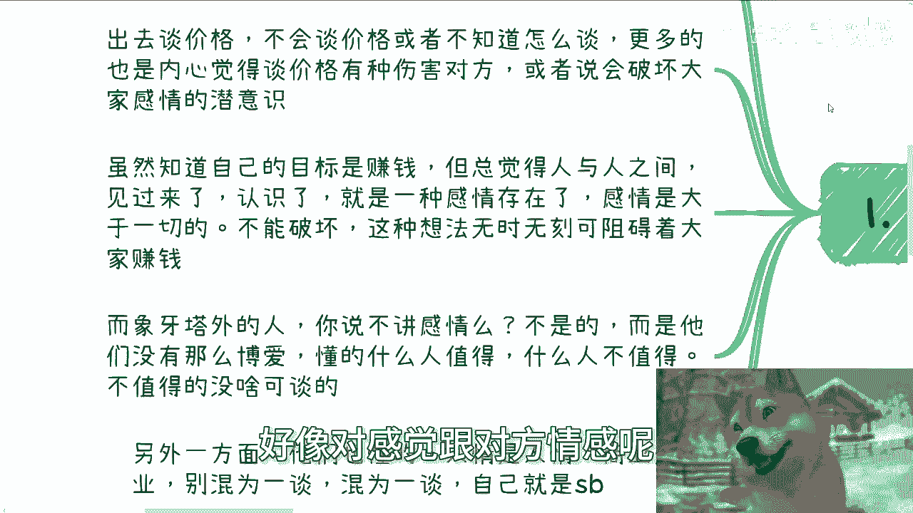

## 核心误区剖析：“吃人嘴短”的逻辑漏洞

“吃人嘴短，拿人手短”这句话包含两个隐含假设，但都经不起推敲。

### 1. 选择的主动权在自己

这句话首先忽略了个人选择的主动性。是否接受他人的饭局或礼物，决定权完全在你自己手中。没有人强迫你必须接受。

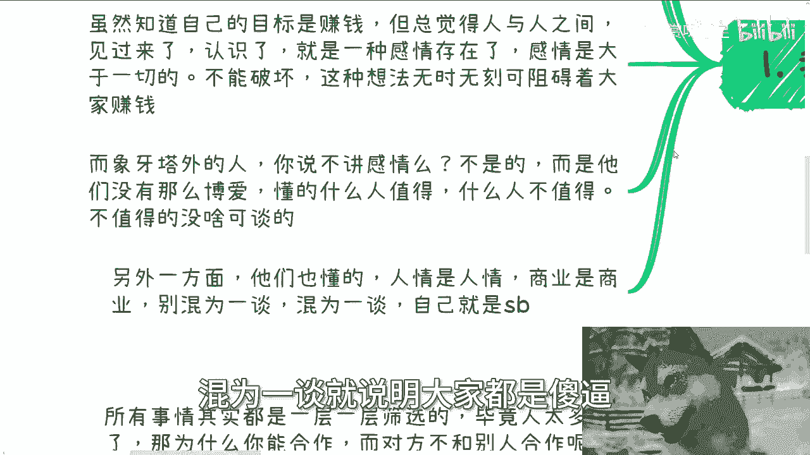

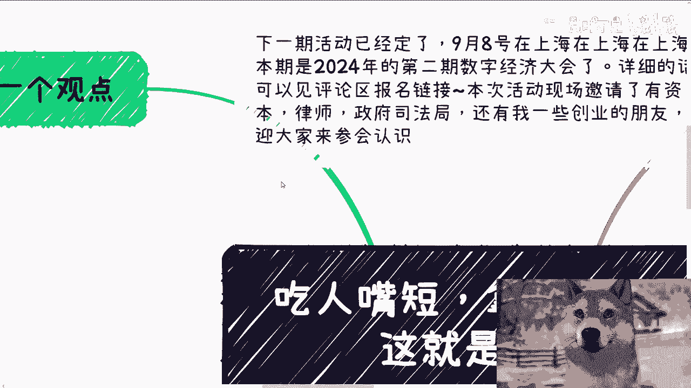

如果你不懂得拒绝，那是你自身的问题，怪不得别人。核心在于，你需要先评估与对方的关系和合作可能性。

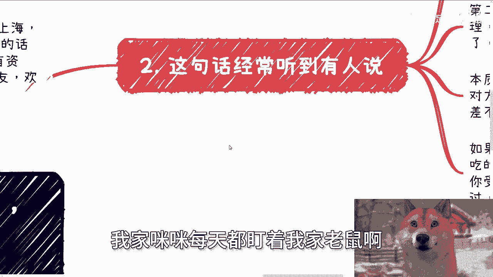

以下是评估的关键点：
*   双方是否有潜在的合作基础？
*   双方在做人和做生意上，三观是否大致相符？
*   对方是否是值得交往和信任的人？

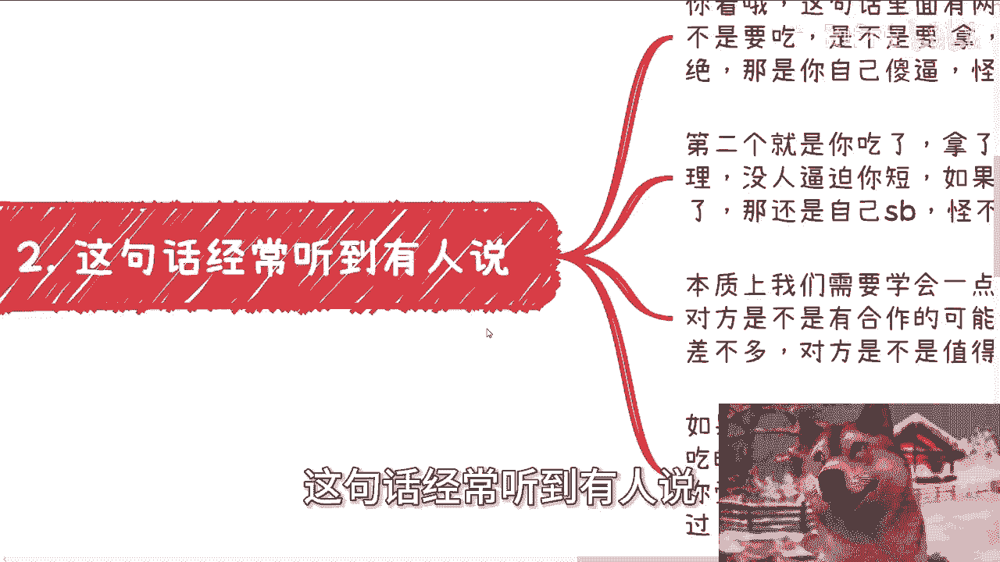

如果与对方根本不熟或不了解，那么接受小恩小惠在本质上，是**经不起诱惑、格局太小的表现**。未来若因此产生问题或抱怨，责任在于自己。

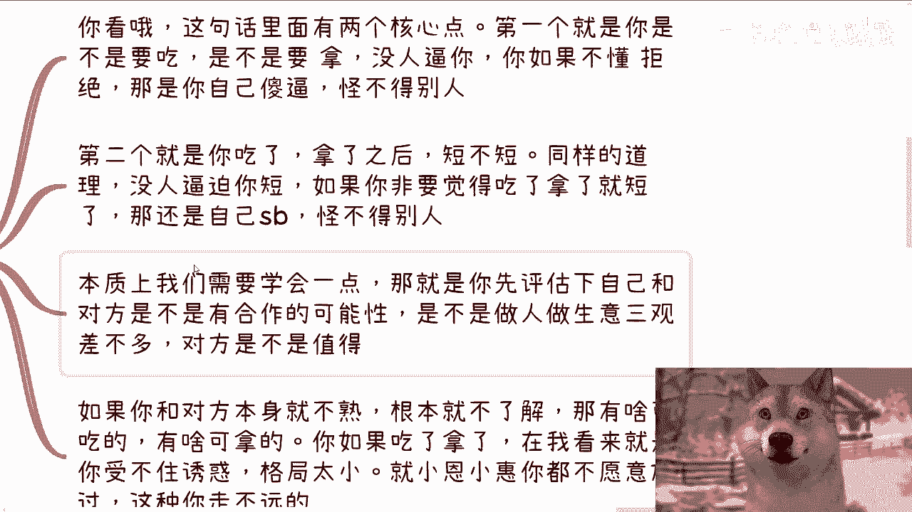

### 2. “短”是一种主观感受

其次，“嘴短”、“手短”是一种主观的心理感受，而非客观事实。同样没有人逼你产生这种“矮人一截”的感觉。

如果你非要在接受馈赠后感到“短”，那依然是你自己的心理建设问题。健康的商业关系应建立在**价值对等和相互尊重**的基础上，而不是被一顿饭或一份礼物绑架。

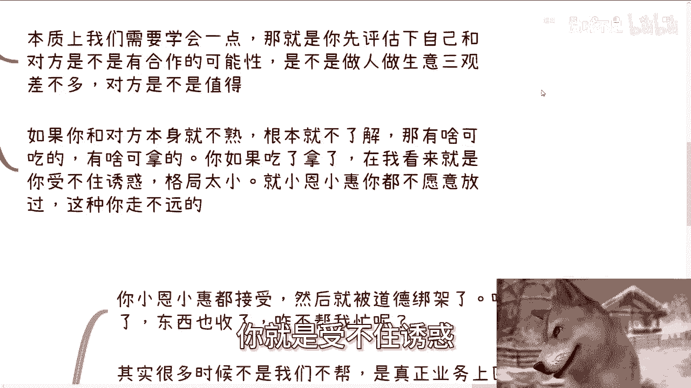

### 3. 逻辑不通：小恩小惠无法解决核心问题

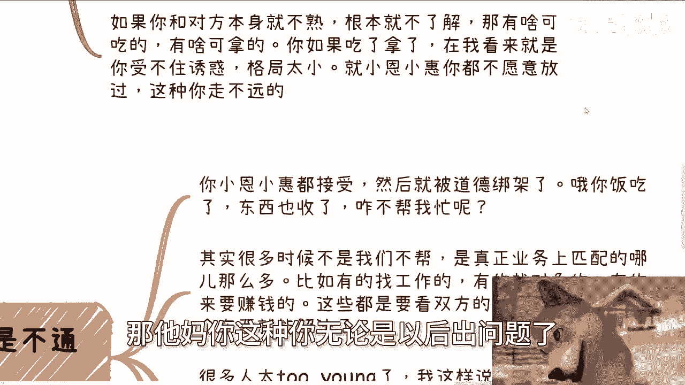

从逻辑上看，这句话根本站不住脚。社会上绝大多数问题，都不是靠吃顿饭、送个礼就能解决的。

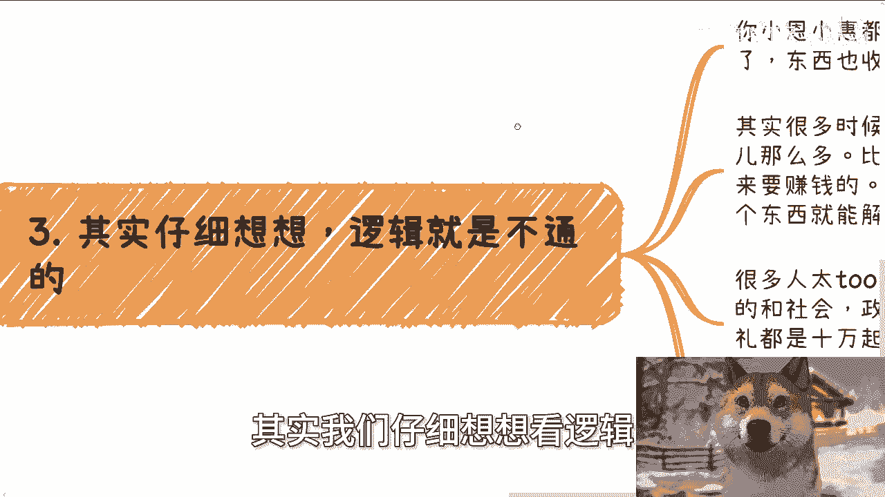

真正的业务匹配、资源整合、问题解决，取决于双方的能力、资源、时机等多重复杂因素。如果“吃饭办事”的逻辑成立，那么所有人都会这么做，这件事本身就失去了门槛和效力，现实显然并非如此。

例如，在更正式的商业或政务往来中，有价值的礼尚往来数额远非一顿便饭可比，且即便投入巨大，也未必能保证结果。这恰恰说明，**核心是价值匹配，而非形式化的馈赠**。

---

## 建立健康的社交与商业观

上一节我们剖析了误区的漏洞，本节中我们来看看应该如何建立正确的观念。

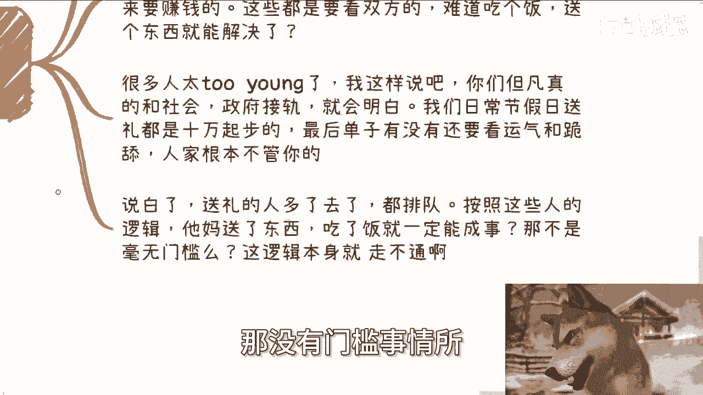

### 1. 馈赠的本质是态度，而非筹码

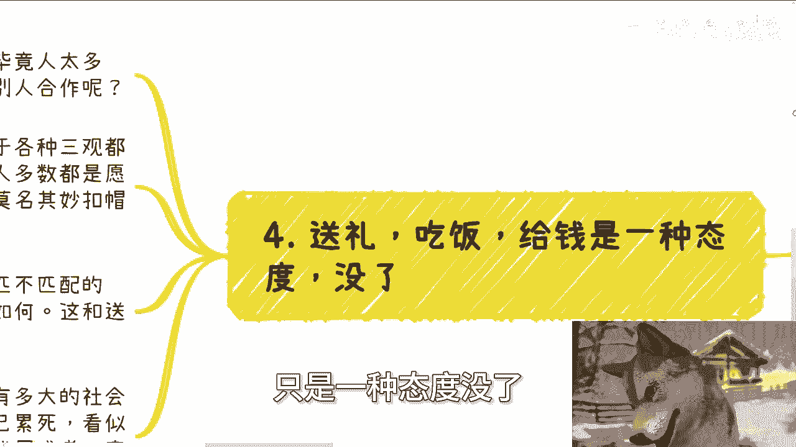

请客、送礼、花钱，本质上只是一种表达尊重、诚意和友善的**态度**。它是一块敲门砖，是关系的润滑剂，但绝不是交易的保证书。

合作能否达成，取决于你是否有对方需要的**独特价值**（即“护城河”）。如果你的三观正、格局大，对方会愿意赏脸，因为他们知道你**不会用道德来绑架交易**。

合作与否的公式可以简化为：
**最终合作 = 诚意态度 + 价值匹配 + 时机运气**
其中，“诚意态度”只是必要不充分条件。

### 2. 缺乏分辨力是致命伤

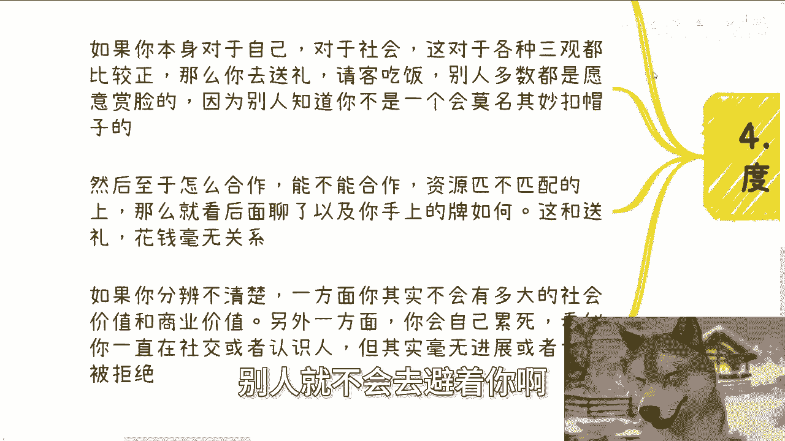

如果你无法分辨哪些关系值得投入、哪些合作可能匹配，将会导致两个严重后果：

以下是缺乏分辨力的主要危害：
*   **个人价值贬值**：来者不拒地接受小恩小惠或进行无效社交，会让别人认为你缺乏判断力和原则，从而降低你的商业价值。
*   **自我消耗严重**：看似忙碌于各种社交，实则进展缓慢，不断被拒绝，容易陷入疲惫和挫败。

### 3. 路径清晰，破除懒惰与恐惧

许多道路已被前人验证可行。觉得无路可走，往往是因为**懒惰**（不愿学习新规则）或**恐惧**（害怕打破情感舒适区）。

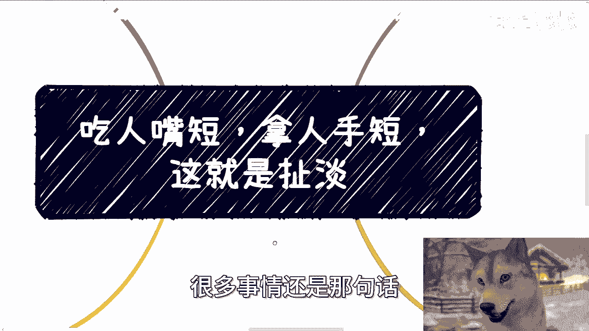

要记住：感情不能当饭吃，道德感也不能直接兑换为财富。这个社会的运行规则和既得利益者的成功路径，并非围绕纯粹的道德情感构建。追求商业成功，需要的是理性、专业和对价值交换规律的尊重。

---

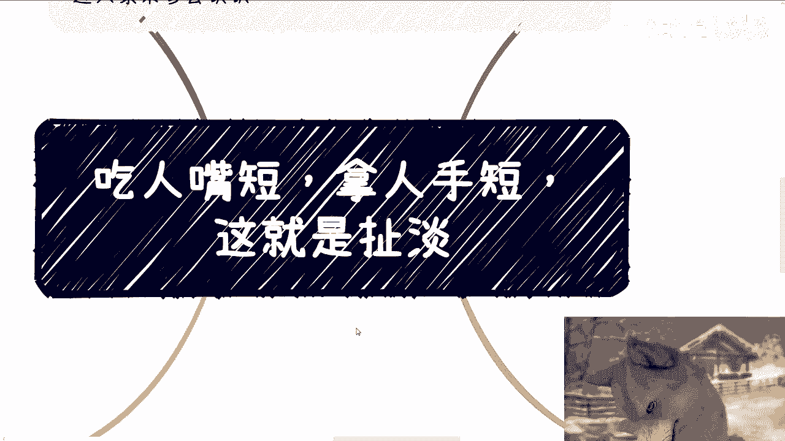

## 总结与行动建议

本节课中我们一起学习了如何破除“吃人嘴短，拿人手短”这一思维误区。

**核心总结如下：**
1.  **分清界限**：严格区分人情交往与商业合作，避免情感绑架。
2.  **掌握主动**：是否接受馈赠，主动权在你。接受前请做好价值评估。
3.  **认清本质**：小恩小惠只是表达态度的方式，无法解决核心的资源匹配问题。
4.  **提升价值**：打造自己的“护城河”，让合作基于你的独特价值，而非一顿饭的交情。
5.  **精准社交**：培养分辨力，将时间和资源投入在值得的、可能产生价值的关系上。

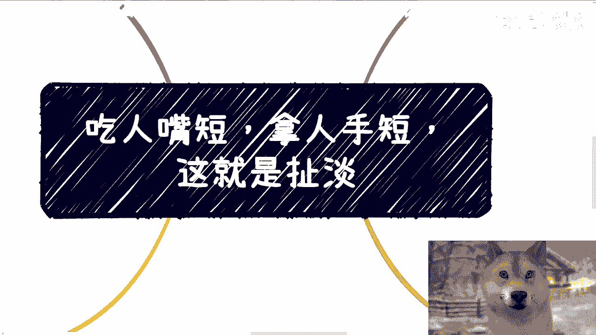

希望本教程能帮助你建立更清晰、更强大的商业心态，在社交与合作中更加从容自信。