# 课程 P1：理解网络信息本质与避免决策陷阱 🧠

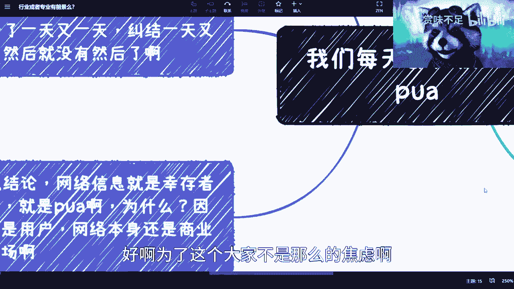

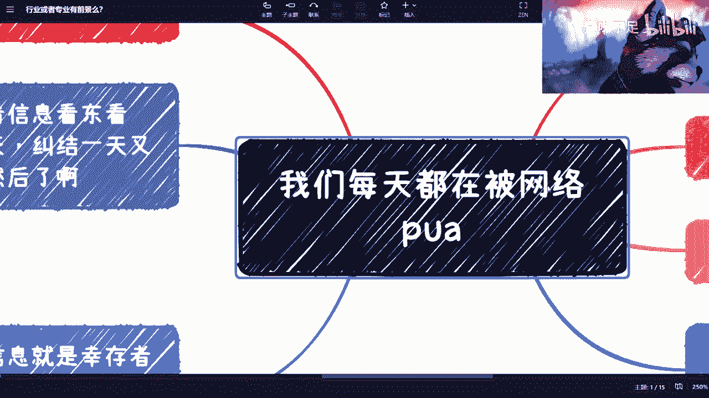

在本节课中，我们将要学习如何理解网络信息的本质，识别其中的资本与流量逻辑，并避免在个人发展决策中陷入常见的陷阱。我们将分析网络内容的商业属性，并提供更明智的信息筛选与决策方法。


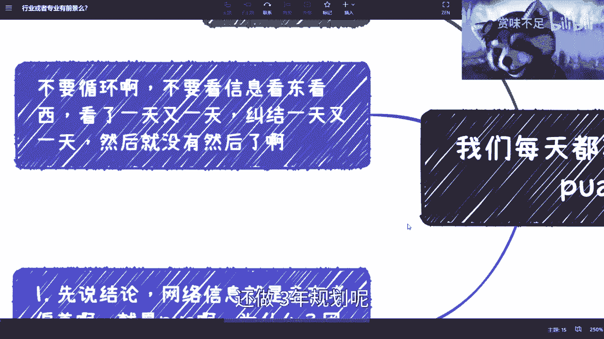

---

## 网络信息的本质是资本市场


网络本身是一个资本市场。无论是抖音、快手等短视频平台，还是其他社交媒体，其核心逻辑是流量竞争。用户的时间与注意力是资本争夺的资源。

上一节我们介绍了网络作为资本市场的基本概念，本节中我们来看看用户如何在这个市场中受到影响。

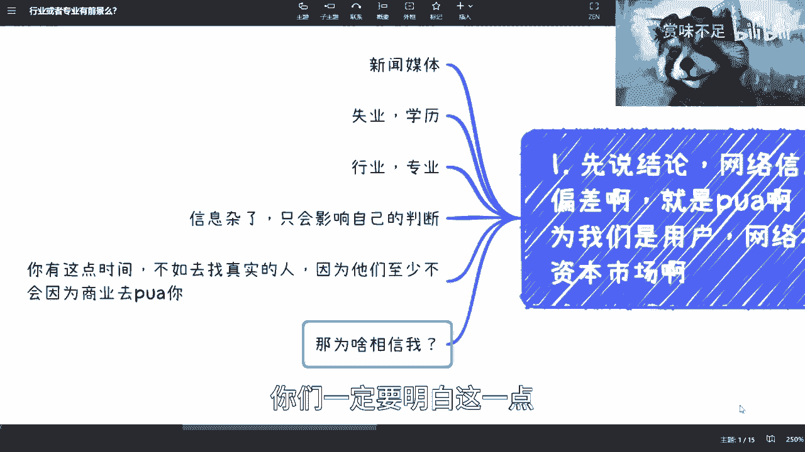

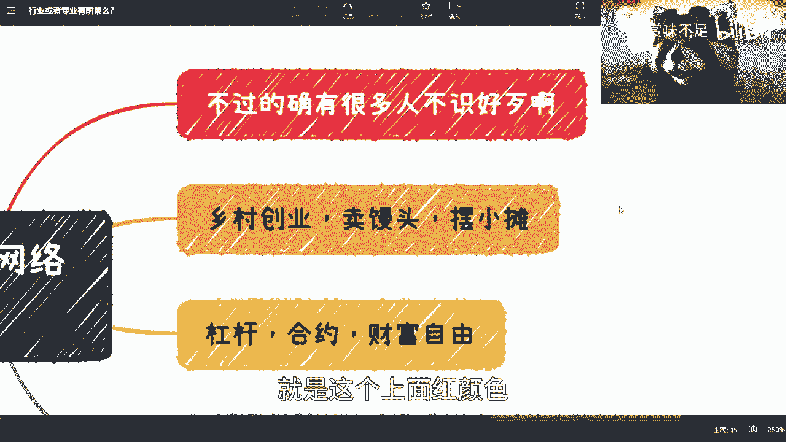

## 网络信息与个人焦虑

许多人在网络上花费大量时间浏览信息，例如纠结于考研、工作选择或职业规划。这些信息往往加剧了焦虑，而非提供有效解决方案。

网络上的大部分内容旨在吸引流量，其出发点并非为用户提供客观、个性化的建议。持续浏览这些信息可能导致决策瘫痪，即“看了一天又一天，纠结一天又一天，然后就没然后了”。

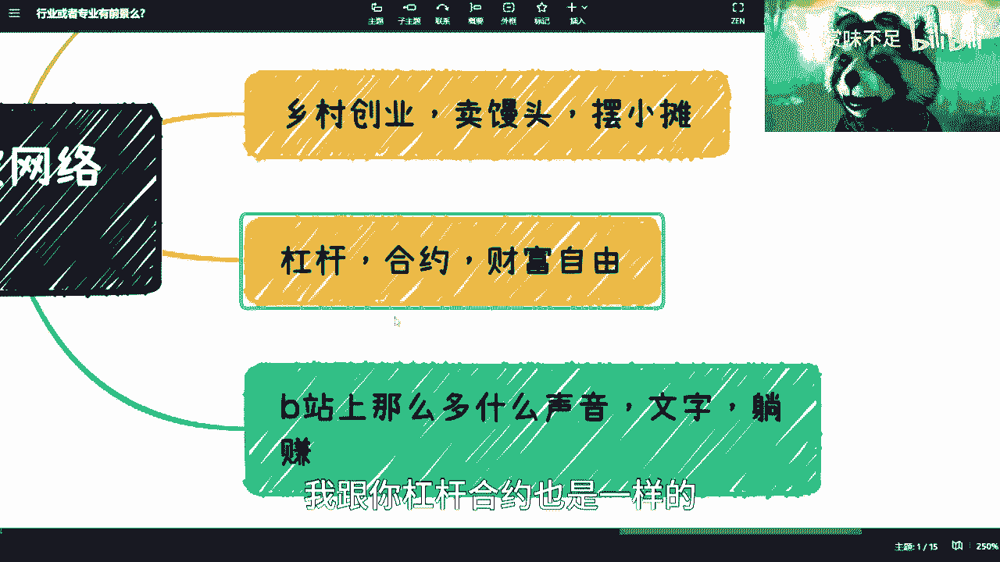

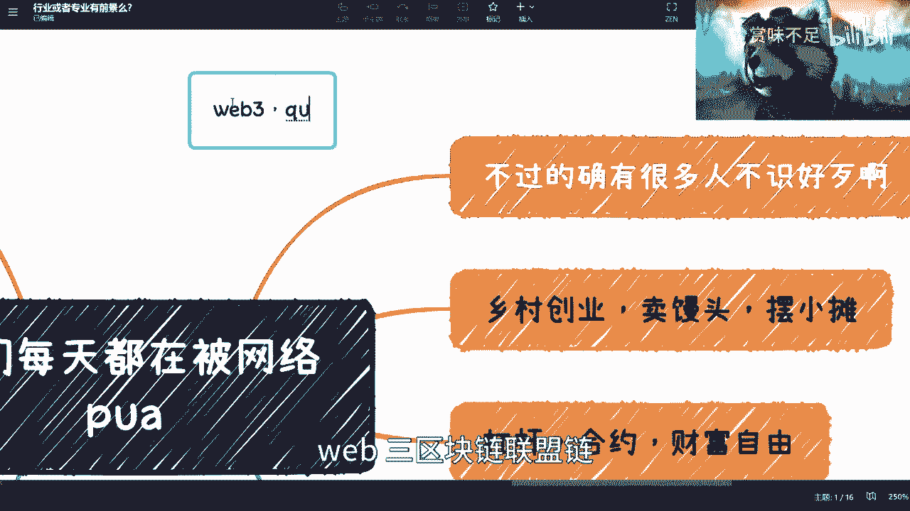

## 如何有效获取真实信息


要做出明智决策，必须获取真实、可靠的信息。网络搜索（如百度、Bing、Google）的结果通常带有商业目的，不一定符合个人实际情况。


以下是获取真实信息的建议：


1.  **咨询真实的人**：与行业内的从业者或可信赖的专家进行一对一交流。
2.  **进行付费咨询**：为专业、个性化的建议支付合理费用，这比免费但可能有偏颇的信息更有价值。
3.  **交叉验证信息**：不要依赖单一来源，应通过多个渠道验证信息的真实性。

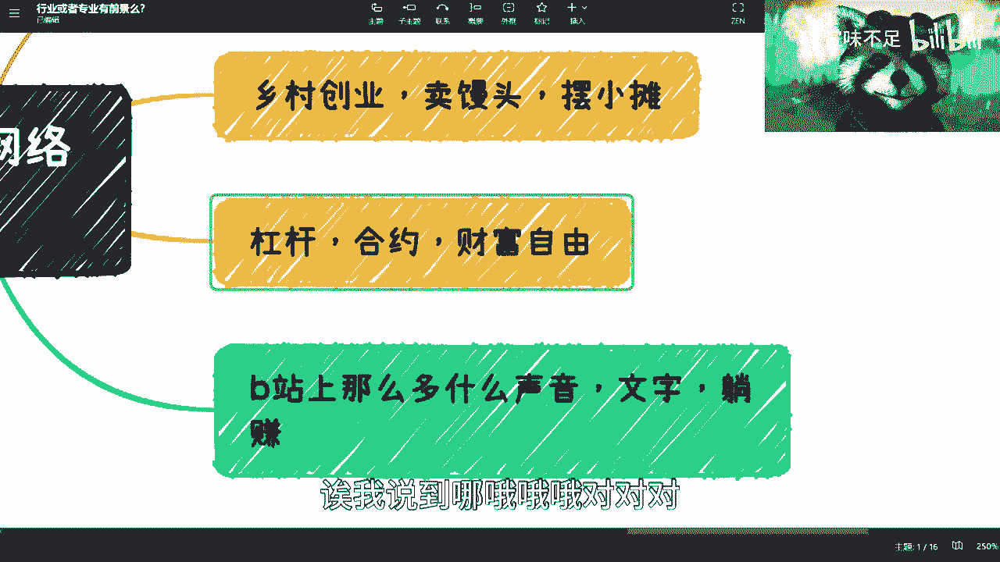

## 警惕网络上的煽动性内容

网络上存在大量具有煽动性的内容，例如鼓吹“乡村创业”、“直播致富”或“Web3快速暴富”。这些内容往往忽略时机、个人条件与风险，只追求转化率。

以金融或投资类内容为例，其核心价值在于流通，但收益与风险永远平衡。**公式：收益 = 风险**。当所有人都被鼓动“All in”时，需要思考财富从何而来。


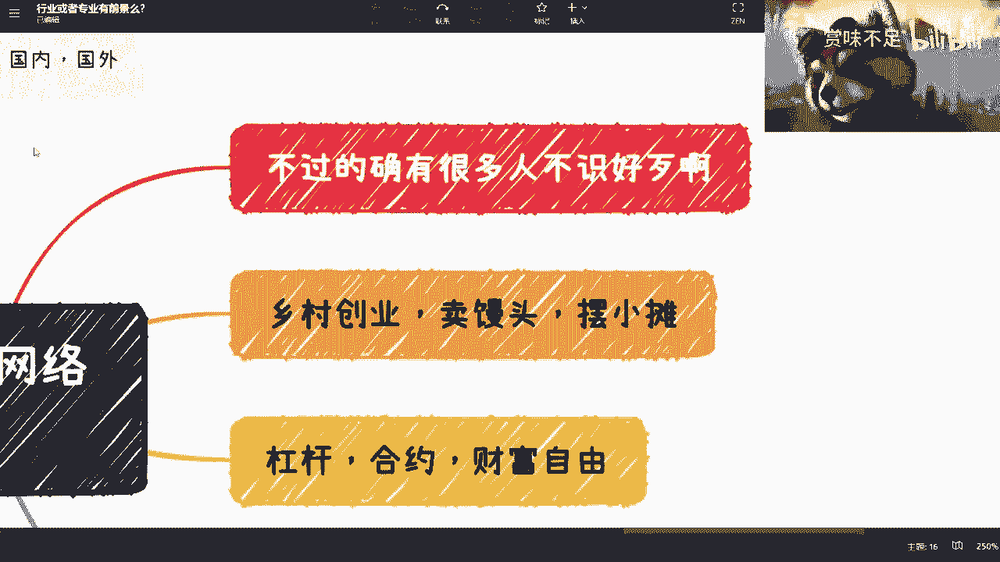

## 识别“躺赚”陷阱与培训机构套路

B站等平台存在大量宣称可以“轻松月入数万”的教程，例如通过写作、录音等方式。其商业逻辑通常需要用户先支付小额费用（如299、399元）购买课程。

思考逻辑：如果有10万人付费299元，主办方将获得巨额收入。但如果10万人都能因此“躺赚”，那么其宣称的盈利模式在商业上并不成立。**代码逻辑**：
```python
# 简化的收入计算
user_count = 100000
course_price = 299
total_income = user_count * course_price # 主办方收入
# 但10万用户是否真能如宣传般“躺赚”？逻辑存疑。
```


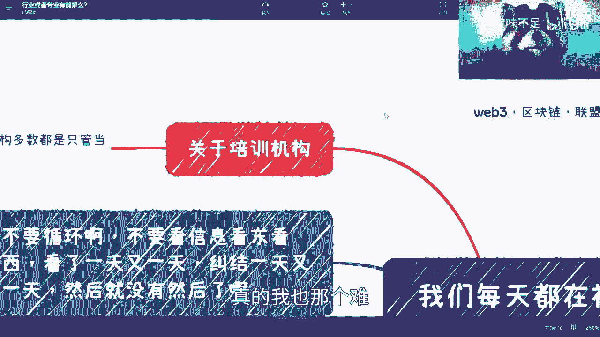

培训机构同样存在类似问题。由于其商业模式依赖招生现金流，课程内容可能过时，无法满足当前市场需求。许多付费学习的技能（如Java、Python基础）实际上有大量免费资源可供获取。

## 恶性循环与个人改变

网络信息环境、用户焦虑与商业推广之间形成了一个恶性循环。例如，企业可能因部分低学历者不靠谱而歧视低学历群体，而这又加剧了群体的对立与抱怨。


打破循环需要从个人改变开始。这包括：
*   培养批判性思维，不盲目相信煽动性言论。
*   为自己的决策负责，寻求真正有价值的建议而非捷径。
*   理解商业世界的本质，保护自己的时间与金钱。

---


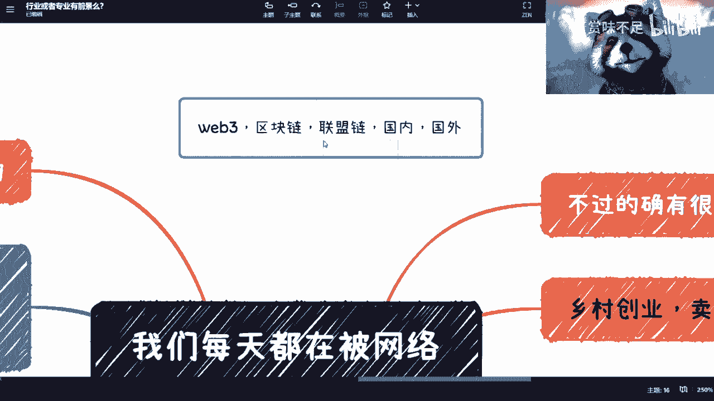

本节课中我们一起学习了网络信息的资本市场本质，分析了其如何加剧个人焦虑，并提供了识别煽动性内容、无效培训与“躺赚”陷阱的方法。关键在于理解信息发布者的商业动机，主动寻求真实、可靠的信源，并为自己的决策承担起责任。在复杂的信息环境中，保持清醒的头脑和独立的判断力至关重要。