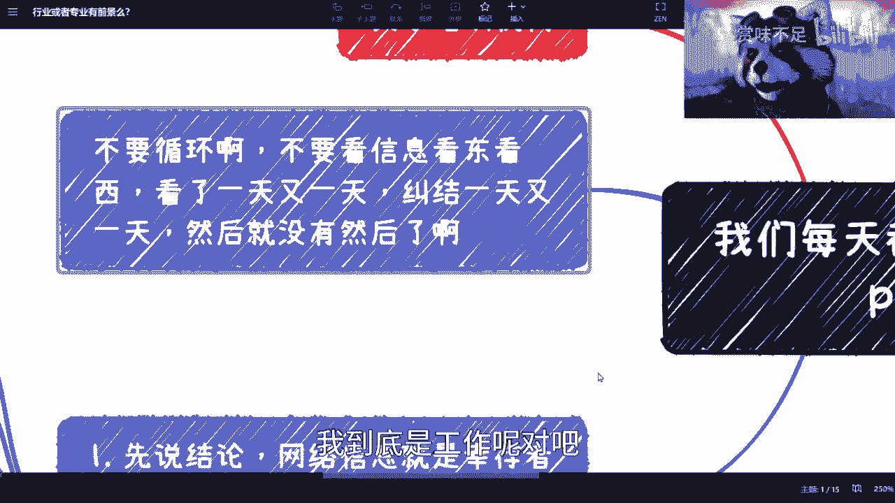
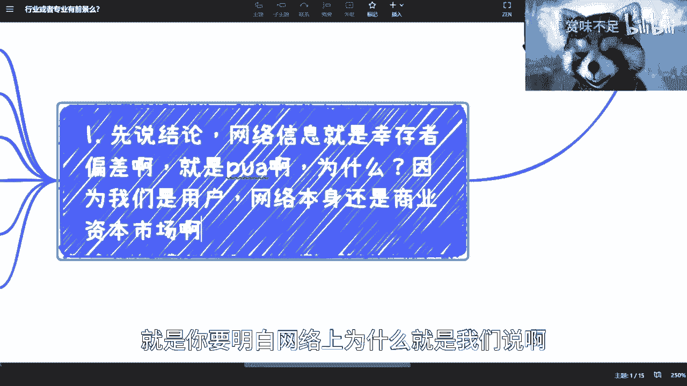
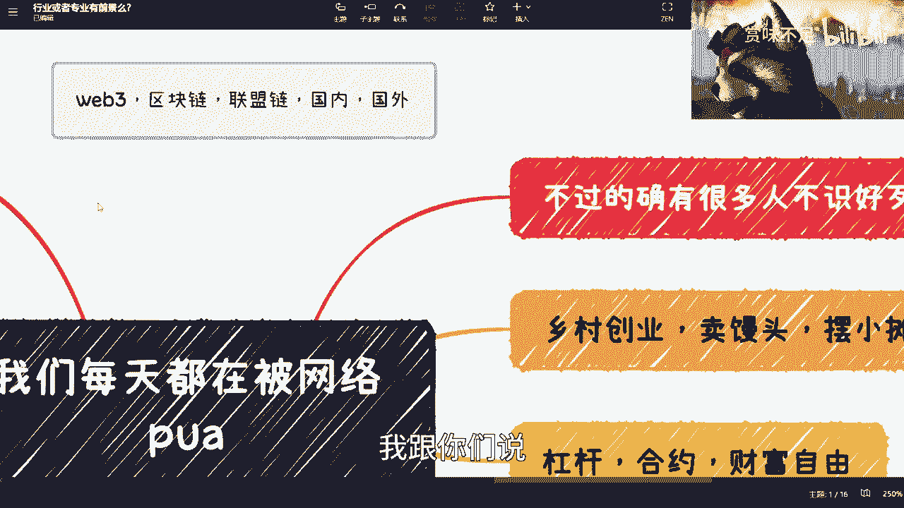
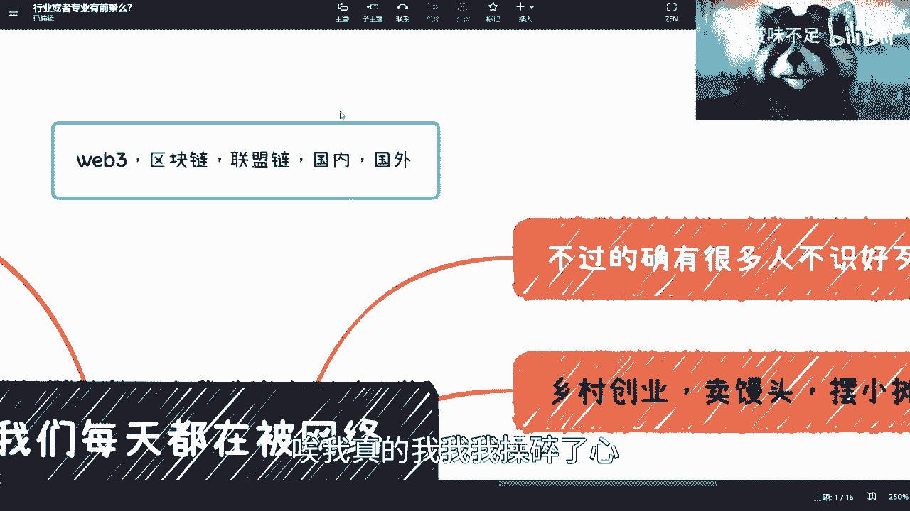
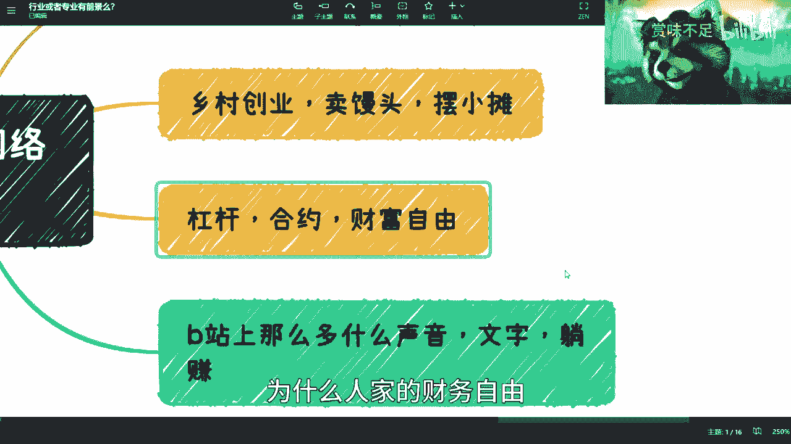
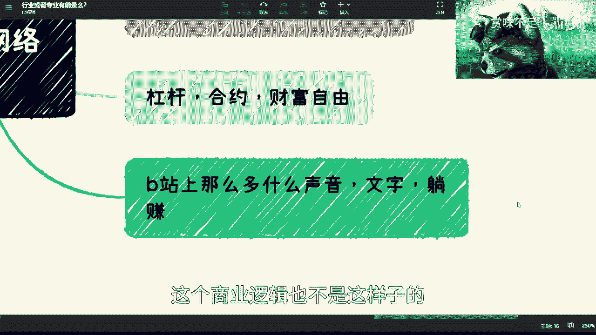
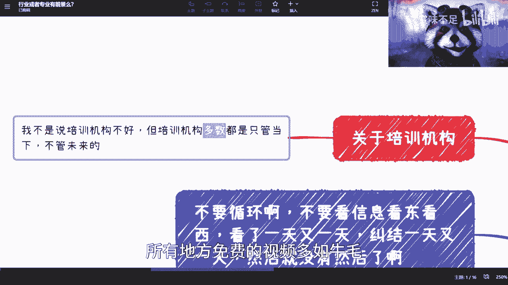
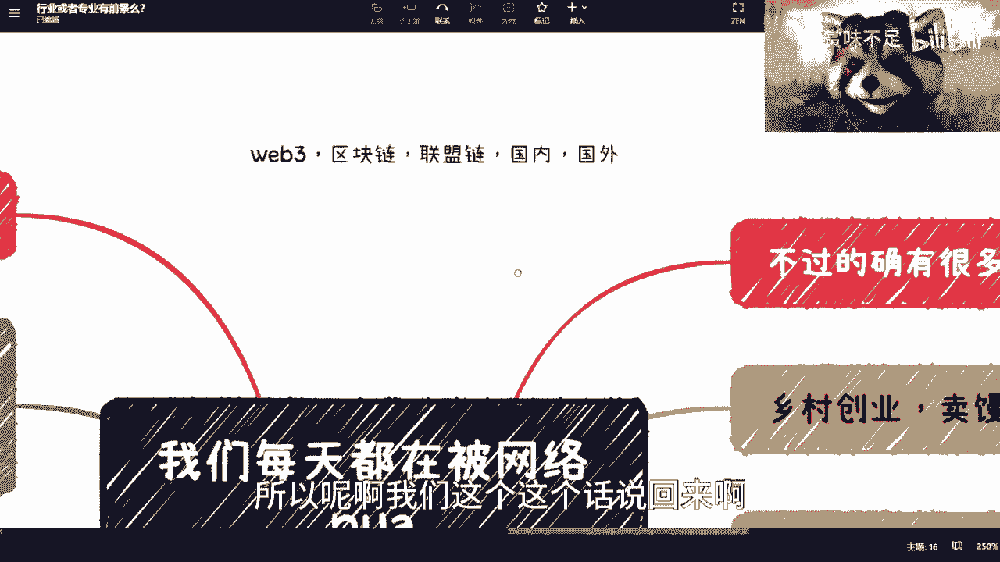
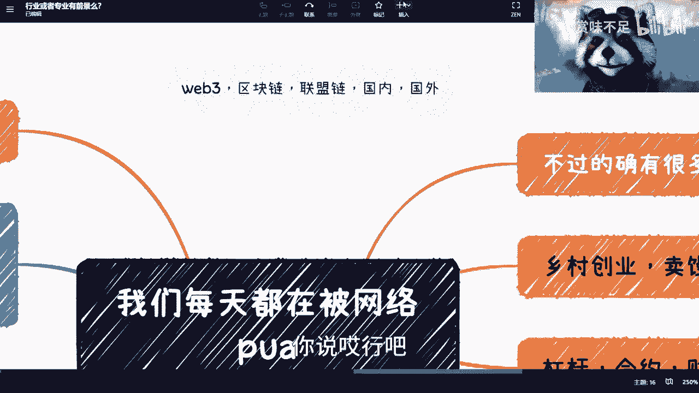

# 各位老爷们，网络就是个资本流量市场，别浪费时间了 - P1 - 赏味不足 - BV1VV4y1X7CT

好啊为了这个大家不是那么的焦虑啊。

我觉得这个本质上我也说一下，就是说网络本身这个信息就是PUA，你们要明白，就是网络这件事情，本身这个也就是个资本市场啊。

也就是个资本市场啊，我们以前都说啊抖音啊，快手啊对吧，短视频啊就刷起来很花时间啊，就是很浪费时间啊，但是呢现在也是一样的，就是大家有的比如说失业了，有的在跳槽，有的在可能考研对吧，有的就是跟我说的一样。

大家去积累一些这个副业，但是我跟你们讲网络上的信息，你看看娱乐娱乐没关系，你你像我微博从来就是吃瓜，你知道吧，就我从来不会去看什么，这个人跟我讲AI，那个人跟我讲什么，我不care啊啊我无所谓啊。

然后就说你看了一天又一天，你纠结一天又一天，然后就没然后了，这个就跟我那天跟你们说，那个追热点是一个道理，你知道吧，但是呢就是说追热点，至少你还有个热点可以追，你知道吗，至少你还有个有个有个东西可以做。

但是你要但凡每天在那边纠结说啊，我这个到底是考不考研呢对吧，我到底是工作呢对吧。

还是说我找了什么什么样份工作呢对吧，怎么样怎么样对吧，包括就是说就是说呃那个还还有很多纠结的，就是说我到底是啊这个做了几年对吧，做了半年的规划呢，还做一年规划呢，还做3年规划呢。

哎我跟你讲没有意义，你知道吧，就是首先当下这个整个环境，他已经是一个就是比较杂乱的一个环境了，就他没有任何的一个一个嗯依据啊，或者说一个历史可循了，你知道吧，就是当下就是先走一步看一步啊。

但是走一步看一步呢，就是你得选对嘛对吧，但选对的前提是什么呢，你得去真的去了解，真的去了解，不是说你在网上百度或鼻影，鼻影，或者来说google，你知道吗，就是你知道为什么，因为我们是用户，网络本身。

说到底他还是个商业资本资本市场对吧，就跟我们就跟我之前跟你们讲的，就是说美就是大家的出发点是不一样的，因为网络要的是流量，我们要的是一个符合我们自身的结论，你知道吗，就是那我有话又说回来。

就是我为什么会跟你们讲，你们有任何有有一些稍微复杂一点的事情呢，你就私信我，或者你就付费对吧，咨询我对吧，反正我跟大家早就报过价了，我一个小时500块钱对吧，我500块钱我就当吃了，就是当你请我吃顿饭。

是不是为什么，因为你在网络上所有看到的信息，他肯定他大概率都是有它的出发点的，我今天我如果为了B站的流量，或者为了微博的流量，或者为了你们大家的这些流量，我不会这么来说的对吧，我肯定上来就告诉你们。

那某某某对吧，某某某行业做了某某事情对吧，然后从失业两年对吧，一下子就进入了BAT对吧，进入了自己，我肯定会这么讲，对不对，就是你要明白网络上为什么就是我们说啊。

你新闻媒体也好诶这个大家看得见啊，看得见啊，就你新闻媒体也好，你失业也好，学历也好对吧，包括这个大家都在问，就是行业专业啊对吧，哪个有有有有这个前景对吧，怎么样啊，包括你信息砸了呃，包括就是别的东西啊。

就是因为所有的大部分的信息，它的出发点是以流量为主的啊，或者我们换句话说它是以这个博眼球为主的，你知道吗，就是说你有这点时间，你有刷的这点时间，你不如去多找些真实的人，那你说为什么他们不会骗你呢。

是因为很简单啊，他们就算要PUA，他们就算要去商业化，他也不可能得一个就就伤一个吧对吧，你逮一个就就PUA，你这不现实的，而且对于你来讲，你可以多找千元，我不相信你找100个人，100个人都PUA。

你是不是啊，那么所以说我要跟你们讲的是说，为什么你说啊好陈老师，那为什么你说的我们就要信别人说的，我们不信，因为别人有商业出发点啊，我不是说我要在你们身上赚钱，或者我不是说要去B站上面赚钱，对不对啊。

你们一定要明白这一点，然后这个是一个，然后我在这个地方还要说了。

就是这个上面红颜色，待会再说，你看啊，这个商业，你因为我不知道大家有没有看过这种新闻，就是就是这两年很多就是告诉你啊，某某大学生毕业了对吧，乡村乡村创业啊，卖馒头，摆小摊啊，然后做直播啊。

我不是说那当然啊，咱们不是说宣扬传统文化不好，咱也不是说回到老家去创业不好，咱也不是说创业不好，但是你做任何事情，你得挑时机吧对吧，你你你总不能在一个最最下行，当然现在还没有下行到底啊对吧。

你总不能在最最下行，当时就是相对下行的这么一个时间点，你说好，老子要去创业了对吧，非要去冲，那我就不明白了是吧，你你你你非要就是这个这个DEBUFF，套满的时候去冲，那我也不知道为什么对吧。

那么我们说从本质上来讲啊，就是说这个事情你说他的目标是什么，当然他的目标也是缓解一部分的就业压力对吧，咱们也实话实话实说啊，为了让大家能够有更多的出路，因为你也不要都卷在一线城市对吧。

你也不要都卷在这个这个叫什么白领市场对吧，有更多的可以去做乡村创业，或者说做一些别的东西啊，但是话又说回来，这个事情就是说你说的可行吗可行，但是他是不是适合所有人的，肯定不是啊对吧。

但是呢就所有的东西都有煽动性的，你知道吗，这就好像我跟你们讲，这就好像我今天但凡我跟你们说哦，新能源好冲对吧好，那有脑子的人肯定不会冲，但是总有那么一部分人诶，这个这个脑子一热对吧。

3分钟热度立马就冲了，哎但我跟你讲很多事情后，你冲了之后，你在就是再后悔再再反悔，再返回来就难了，你知道吗，所以说这种事情就是靠一个转，就是就是看转化率的现实，你杠杆合约，我跟你杠杆合约也是一样的。

你有很多小伙伴接触web3，哎我跟你们说唉我跟你们说，我真的我我觉得我回头我这边记一下，真的，我回头得要跟你们说什么web3区块链联盟链。

你知道吧，国内国外啊，我得帮你们把这个概念讲清楚，我发现现在大家对这个概念根本不了解，你知道吗，就是就是我说的直白一点，所有的人都想去，我也不算骗钱对吧，我相信大部分你们现在问我web3的也是想约我。

不说骗子钱吗，想去赚快钱对吧，所有人都这么想，无一例外，但是呢很多人他不懂，很多人他不明白，然后呢他就在那边说，哎我要去区块链是吧，我要去学联盟链是吧，我跟你们讲啊，你要去赚快钱，要去骗钱的。

你就去看web3，web3没什么好，也没什么好学的，你就去你就去看里面的金融模型，金融模式，你把以前的白皮书ISO的项目全部看一遍，我跟你们说，模式大差不差的就结束了。

不就这么简单吗，对吧，当然这些项目我回头可以挑，那么也不是挑吧，就是我会把一些敏感信息去掉，我跟大家可以分析一下，web3这个这个项目的这个核心问题啊，但是我觉得从大家赚赚钱，赚快钱和骗钱角度来讲。

你们根本就不care对吧，好啊，哎我真的我我我操碎了心。

你知道吗，就是这个也是一样的啊，你们会看到好像今天100%啦，明天百分之1万了对吧，就某某某某某对吧，然后哎呀我跟你们讲，昨天我在群里面还看到有人发了一个，就我在我那个群就是呃发了一个什么。

发了一个telegram的那个视频，哇那个TM视频我也听了啊，牛逼啊，反正它里面呢就是一分30多秒就是PUA，你们说PUA什么的意思，就是说为什么你们不能财富自由，知道吗，因为你们不够勇啊，就是怂。

为什么人家的财务自由，因为人家现在就敢all in。

卧槽我跟你讲1分30秒喊口号，要我是喊不出来啊，喊出来我都不行，是吧啊，然后你说对吧，一样的嘛，就是我还是那句话，你说有你勇了，有没有人财富自由，有，那跟你有什么关系呢，那是每个人对星驰都财富自由吗。

我跟你们讲嗯，就是就是我觉得很简单一个道理，就是就是其实你理智的时候，你想的清楚的，但是你脑子发的时候，你想不清楚什么东西呢，所有的金金融的东西啊，它的价值在哪里，是在于流通对吧好。

那么天平左右终究是平衡的对吧，你说好，我们所有人all in了啊，冲啊，所有人都财富自由了，那请问财富自由的钱哪里来，就这个天平左边的人都财富自由了，那请问天平右边的人是谁。

是傻子吗啊那为什么傻子不说我们呢是吧，哎呦我真的是绝了。

诶我说到哪哦哦哦对对对，这里我卡住了，然后你说最后一个对吧，你你去看B站，哎呀我跟你讲B站我一开始刷的时候，我他妈也是刷到很多这种视频，什么什么啊，这个这个这个啊写写文字啦对吧，录录声音啦啊。

然后好像还有什么时间读读书对吧，就在线读书对吧，然后什么每天可以躺赚，反正多少钱，反正他跟你说，一个月可以躺赚两三万或者34万，你知道吧，你去看啊，B站上多的是你知道吗，然后呢我跟你们讲一样的。

我但凡要去这个流量取名字，就不会是你们现在看到这个名字了对吧，我取名字就是来看这个视频，月入10万对吧，月入100万，反正我不要脸，哼是吧，就是就是我跟你们说，我后来看过，我也不是没看过。

就几乎所有的禁区没没有，还是那句话，就没有一个叫做叫做白嫖的馅饼对吧，就是你进去你会发现你还是要先付啊，当然这个钱也不多对吧，你可能付个299399对吧，然后什么学习什么什么一个录播课程。

你知道这个课程就是说哎，教你怎么去弄这个文字，怎么去弄这个录音对吧，但是还是那个逻辑啊，你们想想看呀，如果B站上有10万个人去听了这个299对吧，那相当于是多少，那不得了啊，哎呀是赚钱，我后悔了。

我后悔了，大家还是付我299吧，好吧哎我后悔了对吧，如果10万个人付299对吧，你想想看好这个人得赚多少钱，但是你又想想看啊，10万个人都能够月入两三万，那好那不要反了，那那那那个公司倒闭算了。

还做什么公司了，我就逼着他们发发文字，躺赚对吧，那你你用你的膝盖想想看，你赚的这个钱到底是哪里来的，有很多人跟我说，广告商是广告商，是会投钱对吧，社会包括批公关，包括皮亚都会投钱，但是人家脑子有毛病啊。

投这么多钱给予这些发文字，发语音的，就商业逻辑不是这样的，就是虽然大家可能不懂商业逻辑，但是你们用膝盖想想看，这个商业逻辑也不是这样子的。

对不对啊，就觉得很好玩。

你知道吧，然后还有一部分呢就关于培训机构的，我跟你们讲啊，所有东西咱都不是一刀切的，培训机构呢也有好的对吧，也不是说没有啊，但是你们要明白一点，培训机构我为什么，我为什么说这个越来越不行了。

是因为培训机构其实很难生生存下去，因为它的商业逻辑很简单，就是要招生培训呃，现金流你知道吗，那由于这个商业逻辑呢，它最终会被倒逼倒逼什么东西啊，会被倒逼成一个就是说只看当下利益，不看未来的，你知道吗。

而且他只看当前利益，就说他可能就是为了生存，他只会跟你讲大象棋当下的情况，或者说说一些就说过时的两三年前的情况，然后让你越来越焦虑，然后从而付钱，但其实你付钱了之后。

你学到那个东西在当下还是old fashion，就还是过时的，你知道吧，所以说我为什么说培训机构不好呢，是因为就很多老师没有这个觉悟，很多这种培训机构的创始人也没这个觉悟。

他们的觉悟就是说我要活在我要当下啊，这个这个稍微片片对吧，稍微就是说啊不那么紧跟时事，就就就就也关系不大，反正大家愿意付钱就可以了，但是吃亏的还是你们你知道吗，就是就是很多就是我看到过的。

就是两三万付下去啊，然后学个Python，学个夹板，学个什么东西，甚至你说厨师也是的，就学个，但是但是很多东西都过时，你知道吗，就是哎呀就是就是我跟你们说，就是从逻辑上来讲。

以前有很多人觉得哎呀假发不过时对吧，大家都在用到现在在用对吧，但是你要明白，以前的不过时是因为以前互联网发展没这么发，没这么快，现在的过失是因为互联网发达啊，发展太快了，包括cheat GB t。

包括其他东西，就是可替代也好，或者可以去做的人或机器太多了，你你单纯你说集中式的学习三个月的甲板，你去看看那些课程，不是我说什么，你们两三万付下去，那些课程都是从零开始教的，就就main函数对吧。

然后数据结构，数据类型哎，就就这个东西就当下网络B站也好，往那个那个腾讯也好对吧，这个YOUTUBE上面也好，所有地方免费的视频多如牛毛。

对不对，就就就这个钱，真的我也那个了。

就就培训机构躺赚啊，但是呢我跟你们讲就要说到这个红色了，就是有很多时候很多人的确不是，好歹你知道为什么哎呀我跟你们讲，我碰到过很多这种人，就是唉就我我操，我他妈吐槽无力了，真的是就是就他就要被PUA。

你知道吧，就是就是这样子的，就是我给你们举个例子，比如说他跟我说，陈老师，你就跟我讲啊，你就告诉我那个专业好，你就告诉我哪个专业学哪个专业，月薪2万对吧，3年后月薪2万。

卧槽我他妈要是知道哪个专业约3月后，3月后月薪2万，那那还是那句话呀，那全中国的人回头我到时候发发对吧，至少我这边朋友圈7000多人，每个人都去学呗啊都月薪2万啊，就就还有这么这个充分必要条件呢。

我我怎么不知道呢是吧，然后呢我我还苦口婆心跟他讲啊，讲就是说啊你得提升提升你自己，你得去判断每个行业，行业这个专业水很深的对吧，我说半天说半天了，他还要骂我，你知道为什么，因为他就说了。

小说说什么就说你要么就跟我讲怎么做对吧，你不要跟我说这些有的没的，说这些有的没的就说明你心虚，哎我我心虚，我我承认我心虚，我虚得很，我我也我我真的，我我我我就是我是真的觉得我毕业的时候。

这个网络不是这样子的啊，我毕业的时候就是这个普罗大众，也不是这样子的，我不知道为什么怎么现在就变成这个样子啊，所以说呢就是我觉得那句话真的是对的，叫什么可怜之处，可怜之人必有可恨之处啊。

就是就是我觉得我朋友劝我也是对的，他说你不割，总有人会去割，哎呀真的是多说两句，我都要被骂。

我也是很绝，你们知道吗，所以呢啊我们这个这个话说回来啊。

我觉得呢就是很多时候东西啊，都是就是为什么我说恶性循环呢，是因为他很多事情是相辅相成的啊，这个就像你们说哎呀女性受到歧视了，你们说这个学历受到歧视了，就像什么，我跟你们讲，这不是相辅相成的吗，对吧。

企业为什么要歧视低学历的人，就是因为低学历的人很很多时候坑过企业，很多时候骗过企业，很多时候做事非常不靠谱对吧，但是话又说回来，企业现在歧视了那么很多低学人又要喷了啊，企业你们这帮渣对吧。

为什么要歧视我们对吧，怎么样怎么样，然后还有说那个孕妇对吧，也一样，哎我跟你讲都一样的，就是就是没有一方是完全正确，也没有一方是完全错误的，反正全员恶人就这么回事对吧，就这个当中没有人愿意改变。

你知道吧，就没有人就是慢慢慢慢选择从自己改变，你但凡从自己改变，你比如像我现在对吧，我说我跟你们讲这么多好了，我跟你们讲切这个我视频做到现在对吧，就在下面评论区，还有其他地方私信，还有很多人说的呀。

诶你就是要卖课，你就是要做培训对吧，你就是要怎么样，我也不知道怎么说对吧，就就这个样子，你说哎行吧。

就这样吧，那个那个回头我单独再跟你们说好吧，把这个东西说一下，因为我觉得这个东西搞不清楚的人，真的太多了啊，没必要好吧，呃我不反对大家赚快钱，我也不反对大家去骗钱，反正这个社会就这样啊。

这个世界就这个样子啊，但是我觉得你们这个概念搞清楚对吧。

