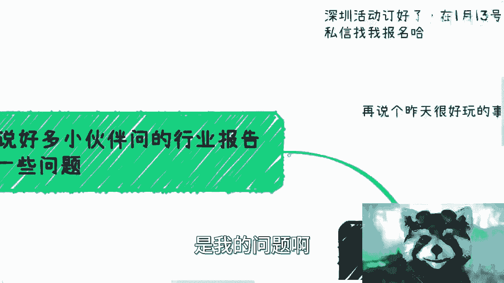
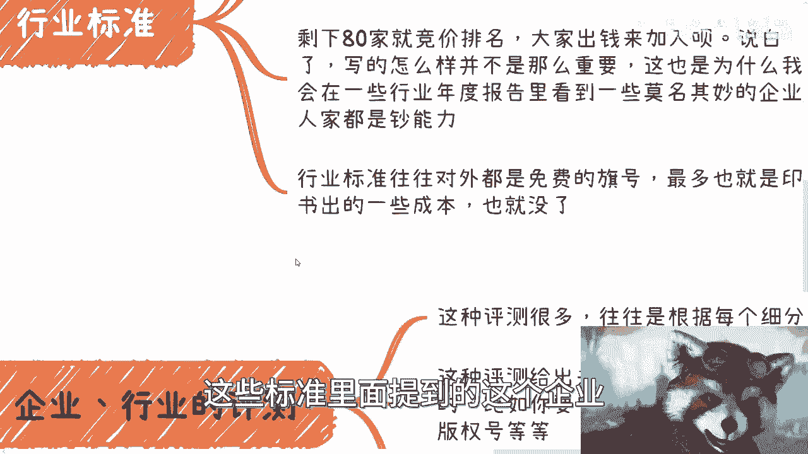
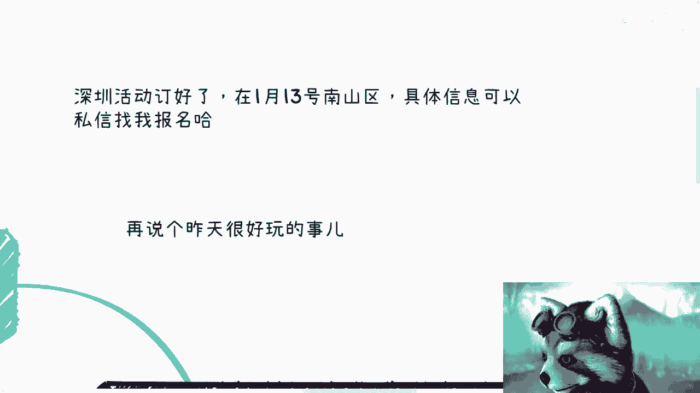

# 各行各业的报告背后的盈利逻辑 - P1 - 赏味不足 - BV1Au4y1K7fj

啊大家好啊，这两个事一个是生存活动就定好了，在1月13号南山区，具体信息可以私信找我报名，第二个呢就是昨天我这个发高烧，39。6去医院，那排除了一下，反正各种核酸啊，什么东西也都做了，啥都不是。

就是一个普通的感冒，但是发烧发展有点猛，嗯嗯我昨天身边还有个27岁的一个小伙子，四十四十度啊，不对40度，我靠，我就感觉人都人都不行了，就卡都不知道怎么插的，你知道吗，就是还是蛮危险的。

然后再说个昨天比较好玩的事情，就是我还提前写了一些文案，给那个昨天约了咨询的小伙伴，我想提前打个招呼嘛，这果然是昨天烧傻了，我打招呼呢，打到了今天的咨询的那个那些人里面。

我想哎昨天晚上怎么还有人来找我说。

陈老师，你人呢，我一看诶，哦嗯啊是我的问题啊。

嗯呃言归正传啊，首先先说这个小伙伴问我。

关于行业报告的一些问题啊，俗话说得好，免费的往往就是最贵的，行业报告呢一般背后都是企业咨询，行业标准，行业测评，行业排名，也就是说白了呢就是说报告这个东西，它更像一个广告，更像一个媒体。

那么很多小伙伴呢他会觉得我不付钱就好了，对吧，你还能强迫我付钱不成嘛对吧，我跟你讲，你还真说对了，你要是一个人吧，其实倒无所谓，你要是这个企业吧，有很多时候你还绕不开国内呢，我跟你们讲。

就是这个市场就很多时候呢你会用钱来去换名，再用名单再去换钱，就是这么个循环不停的循环，第二个啊，行业标准，你们很多时候会看到什么行业白皮书，蓝皮书啊，其实这个就跟我们班大会收费模式是一样的。

所谓行业标准本身就是对外免费的，他在编写的时候，会去找一些专家或者机构先加入啊，比如说我找了100家，其中先找20家先加入，剩下八只脚就竞价排名，大家来出钱来加入呗。

说白了这白皮书蓝皮书写的怎么样并不重要，我就问嘛，就是这种标准啊，这种这种这么蓝皮书，白皮书写出来能有多少人看，这也是为什么，就是说你们在一些行业年度报告里面，会看到一些莫名其妙的企业，人家都是超能力。

那么行业标准呢往往对外都是免费的旗号，最多也就是出版书，一些成本就没了，但是呢这些标准里面提到的这个企业。

提到的一些评测机构，这个是有后手的，第三个就是企业行业的评测，我跟你们讲这种评测很多具体什么名字，我就不点名了，点了回头又得找我麻烦是吧，往往这些机构都是根据每个细分领域来的啊。

这种评测呢给出来的机构呢，往往跟某些具体的行为绑定的，比如说你要申请什么新的项目啊，啊第三个就是行业这个企业的一些评测，嗯嗯嗯这种评测的很多啊，这种机构我就不点名了啊，点了回头又找我麻烦。

所以说呃其实大家在某些行业，这个只要时间足够长，你们就会知道，你们就会知道每一个行业里面都会有这种机构，用这种所谓的评测，所谓的测试证书来做这种收割，呃，为什么我叫收割呢，就是因为在我看来他就叫收割。

就是你如果单纯给些评测收点钱，我觉得没什么问题，但是这种评测他说第一收费往往比较贵，第二这种评测往往跟一些具体的行为，比如说你要申报什么新的项目，或者申报某些版权，或者说你要做某些这个就做某些跟政府啊。

跟这种协会有关的这种业务，你都会绑定，那在我看来就是强买强卖没什么区别对吧，而且你定价非常的离谱，这种评测收费呢一般也很贵，说白了怎么评测，评测出来的结果其实对于很多人来讲都是黑盒，你十几20万。

三十三十万交出去，你根本不知道他怎么评测的，而且还有很多时候，很多评测数据还是主观臆臆断去写的，就比如说嗯就既当裁判员也当运动员啊，那么说白了就是给钱就行，说实在的，报告这种东西呢往往就是最赚钱的。

为什么，因为你行业好不好，业务好不好，客户客户好不好跟他们都无关，他们反正可以继续赚钱吧，报告其实就是卖广告位，就是你愿意买就买啊，钱总归赚到，而且做行业报告中的团队吧，他都比较好转型。

因为逻辑都是一样的，去哪个行业都这么做啊，然后报告本身呢一般连着评测，连着沙龙连着大会啊，这样就齐全了，一年呢，这赚钱呢也简直是容易的。

不能再容易都一样一样的啊，呃你们别老是觉得很多东西，比如说啊这个东西免费对吧，包括之前还有小伙伴问什么问说啊，这个给大学生提供这个实习机会对吧，提供就业服务，嗯嗯嗯对吧，然后提供实验室提供这种。

比如说做项目的基金对吧，那其实所有的免费的东西，它背后的逻辑其实都一样，就是什么呢，就是说无非就两种，一种就是你们也许免费或者甚至被倒贴，但是呢你们比如说被倒贴了10万块钱，而你们本身的存在。

你们本身的加入，会让上面的这个人得到100万对吧，甚至1000万对吧，也就是说本身还是叫什么，就是被别人卖了，还帮别人数钱，这是一种，还有一种呢就是说不倒贴对吧，就是免费。

那免费呢可能后面就是我们说的强买强卖，就是后面还有很多的后续服务跟着啊。

好吧就是这么个情况啊，好吧行吧，就这么着吧好吧，大家反正有什么职业规划或者其他方面的，你们整理好了，反正也可以咨询我，然后深圳要报名的私信我，好吧好就这么装吧。

大家要注意保暖。