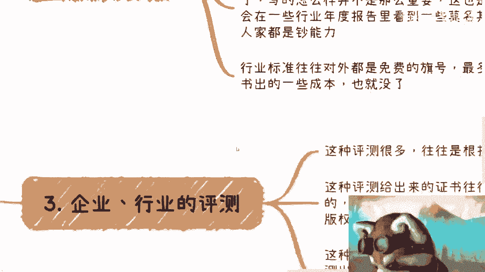

# 课程 P1：行业报告的盈利逻辑揭秘 📊

在本节课中，我们将要学习各行各业发布的“免费”行业报告背后隐藏的商业模式与盈利逻辑。许多看似客观、权威的报告，实质上是精心设计的商业产品。理解其运作机制，能帮助我们在接触各类报告时保持清醒的判断。

---

## 报告的本质：广告与媒体

俗话说，免费的往往是最贵的。行业报告一般背后关联着企业咨询、行业标准制定、行业测评或行业排名。报告本身更像一种广告或媒体渠道，其核心目的常是为了后续的商业变现。

## 盈利模式一：以名换钱与以钱换名

第一个常见模式是“以名换钱，再以钱换名”的循环。对于企业而言，很多时候需要花钱来换取知名度（例如上榜某个报告或排名），再利用这份知名度去赚取更多利润。这个循环会持续运转。

## 盈利模式二：行业标准与“皮书”

你们常会看到行业白皮书、蓝皮书。其运作模式与行业大会的招商类似。行业标准本身对外是免费的，但在编写过程中，会先邀请部分专家或机构加入。例如，先找20家核心机构，剩下的80个名额则可能通过“竞价排名”的方式，由其他企业出钱购买加入资格。

**核心逻辑**：`报告质量 ≠ 商业价值`。这些皮书有多少人仔细阅读并不重要，重要的是成为其“合作单位”或“上榜企业”所带来的背书效应。这也是为什么一些行业年度报告中会出现看似不相关的企业，它们往往是付费的“超能力”玩家。

## 盈利模式三：行业评测与认证

第三个模式是行业或企业评测。这类评测机构遍布各个细分领域，其给出的评测或证书往往与企业的具体商业行为绑定。

以下是常见的绑定场景：
*   申报新的政府或行业项目。
*   申请某些特定版权或资质。
*   参与与政府、行业协会相关的业务。

这种绑定在某种程度上构成了“强买强卖”。评测收费通常昂贵（十几万到数十万不等），且评测过程多为不透明的“黑盒”操作，有时数据甚至基于主观臆断。这相当于“既当裁判员，也当运动员”，付费成为通过的关键。

## 报告的商业优势

为什么报告生意如此赚钱？
1.  **风险隔离**：无论行业景气与否，企业都需要营销和背书，报告机构总能赚钱。
2.  **模式通用**：其核心是售卖“广告位”（报告中的露出、排名、证书），此模式可复制到任何行业，团队转型容易。
3.  **生态闭环**：报告常与评测、沙龙、行业大会打包形成完整商业生态，盈利链条长且稳定。

## 免费模式背后的通用逻辑

上一节我们剖析了报告的具体模式，本节中我们来看看其背后更通用的逻辑。所有“免费”或“补贴”服务的背后，通常只有两种逻辑：

以下是两种核心模式：
1.  **补贴引流，价值榨取**：用户可能获得少量补贴（如10万元），但用户的存在和参与，能为平台或组织创造远高于此的价值（如100万或1000万）。这本质上是“被卖了还帮人数钱”。
2.  **免费入门，后续变现**：前期服务免费，但后续通过捆绑必需的服务、认证或资源进行强制性或诱导性收费，即我们前面讨论的“强买强卖”。

---

本节课中我们一起学习了行业报告背后的三大盈利模式：以名换钱的循环、行业标准下的竞价排名、以及捆绑销售的行业评测。同时，我们也揭示了“免费”商业模式背后的两种通用逻辑。理解这些，能帮助我们在面对各类行业信息、商业合作时，穿透表面，看到本质，做出更理性的决策。