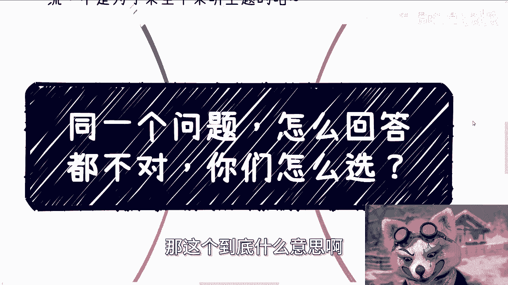

# 课程01：如何回答复杂问题？—— 在现实与理想间的选择困境 🧩

在本节课中，我们将探讨一个普遍存在的沟通困境：当面对一个复杂且没有标准答案的问题时，应如何回应。我们将通过具体案例，分析为何有时“怎么回答都不对”，并理解在现实约束下进行沟通和选择的复杂性。

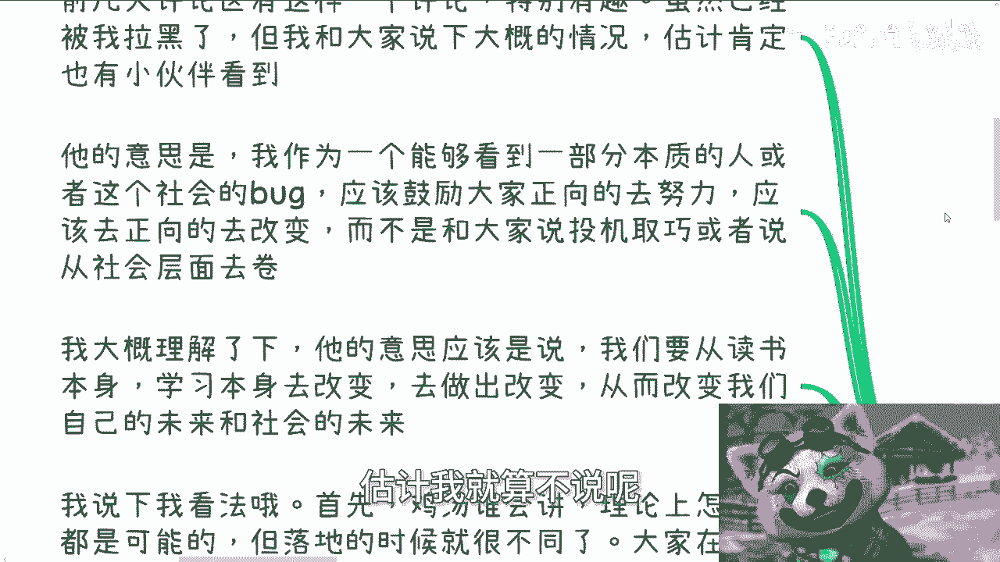

---

## 前情提要：一则评论引发的思考

上一节我们介绍了课程主题，本节中我们来看看引发讨论的具体背景。近日，评论区出现了一条引人深思的评论。评论者认为，作为一个能看到部分社会本质的人，应该鼓励大家正向努力、积极改变，而不是总谈论“投机取巧”或社会内卷。

评论的核心观点是：我们应该通过读书和学习本身来改变个人未来，进而改变社会。

对此，我的看法如下：
1.  理论上，任何正向改变都是可能的。
2.  但在现实中，对绝大多数普通人而言，第一优先级是 **生存**，而非改变。改变的前提是能够活下去。
3.  社会与世界极其复杂。如果仅靠读书或正向努力就能轻易改变，社会现状早已不同。
4.  许多路径都有人尝试过。有些路走不通，成了死路；有些路走通了，但知晓并成功行走的人，相对于挤在“读书考研”这座独木桥上的人而言，仍然是少数。

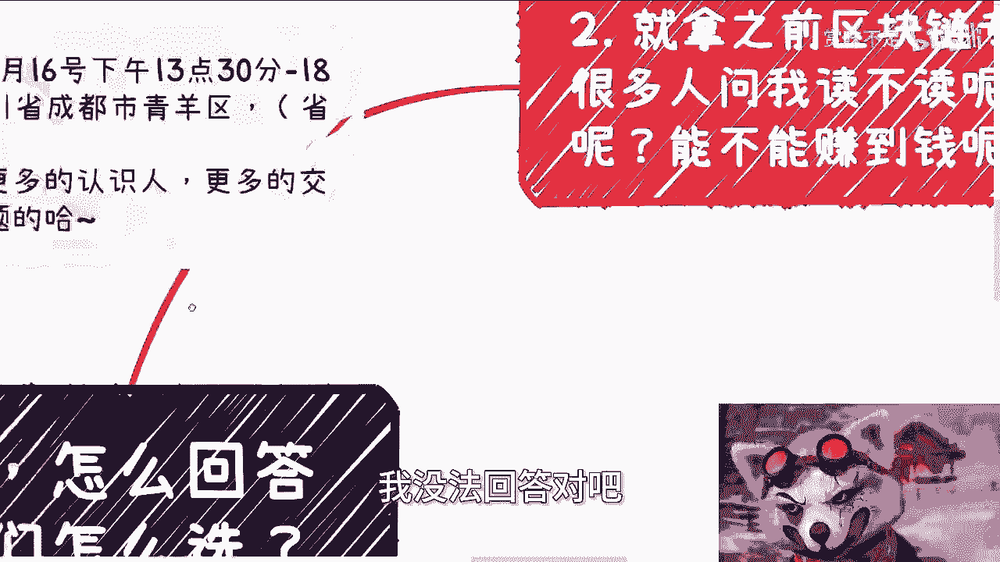

总而言之，正如主题所言，面对许多问题，我常常感到无法给出一个“正确”的答案。

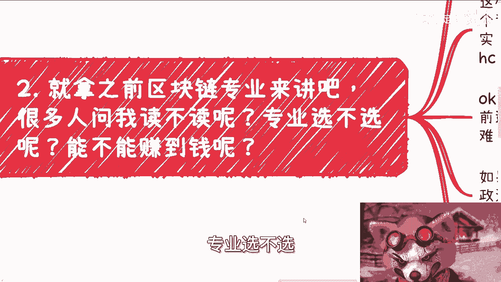

---

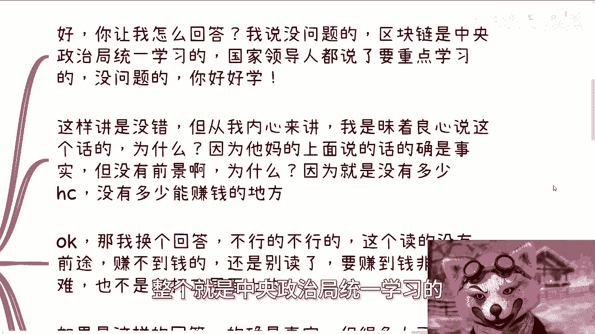

## 案例分析：具体问题中的两难处境

理解了基本困境后，我们通过两个具体案例，来看看这种“回答困境”在现实中是如何体现的。

### 案例一：区块链专业的选择

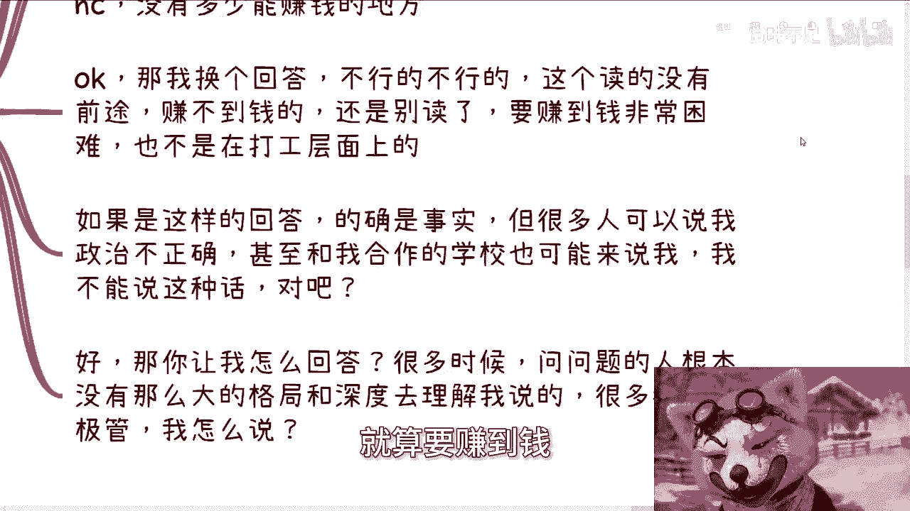

有人问我：“陈老师，区块链专业值得读吗？能赚钱吗？” 甚至高校的院长也会咨询是否该开设此专业。

面对这个问题，有两种回答方式：

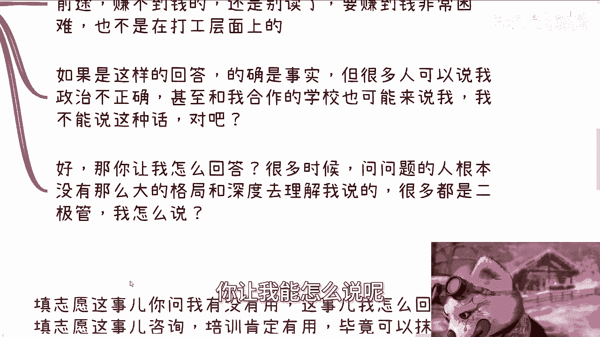

**回答A（符合官方与主流预期）：**
“这个专业很好。国家在2019年10月24日就明确了其重要性，应该好好学。” 这样回答没有错，因为它基于一个公开事实。但对我个人而言，这样说是昧着良心的，因为我在行业内很清楚：相关企业少、岗位（`head count`）更少，通过这个专业“打工”赚钱的前景非常有限。

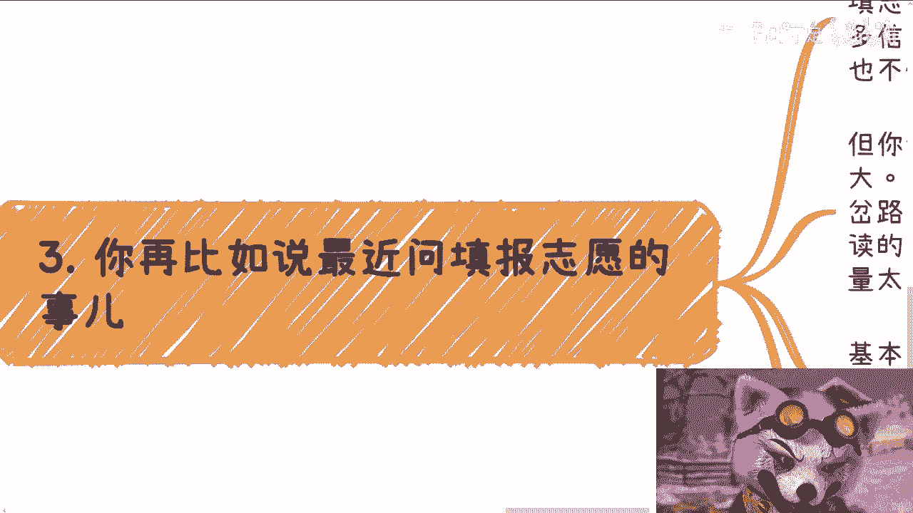

**回答B（基于行业现实的个人观点）：**
“这个专业没什么前途，很难赚到钱，不建议读。即使要赚钱，也可能不是在传统的打工路径上。” 这样回答是基于我所知的行业事实，也是为对方着想。但这样回答，80%的人可能无法理解，甚至会反驳我认知不正确，合作方也可能来质问我。

那么，究竟哪种回答才算“正向”和“正确”呢？很多时候，提问者可能缺乏理解复杂答案所需的格局和深度，思维呈“二极管”模式，非黑即白，这让我难以沟通。

### 案例二：高考志愿填报咨询

另一个常见问题是：“填报志愿的咨询和培训有用吗？”

同样，这个问题没有简单的是非答案：
*   **说它有用**：对于信息不对称的家长和学生来说，咨询确实能抹平一部分信息差，`咨询效果 > 不咨询效果`。因此，它“有用”。
*   **说它没用（从长远看）**：选择专业只是一个起点。未来大学怎么读、工作如何找、能否赚钱，其中变量太多（个人努力、环境、机遇等）。志愿填报的影响在4年甚至7年后，其间变数太大，难以预测。因此，从我的价值观看，它的“意义”有限。

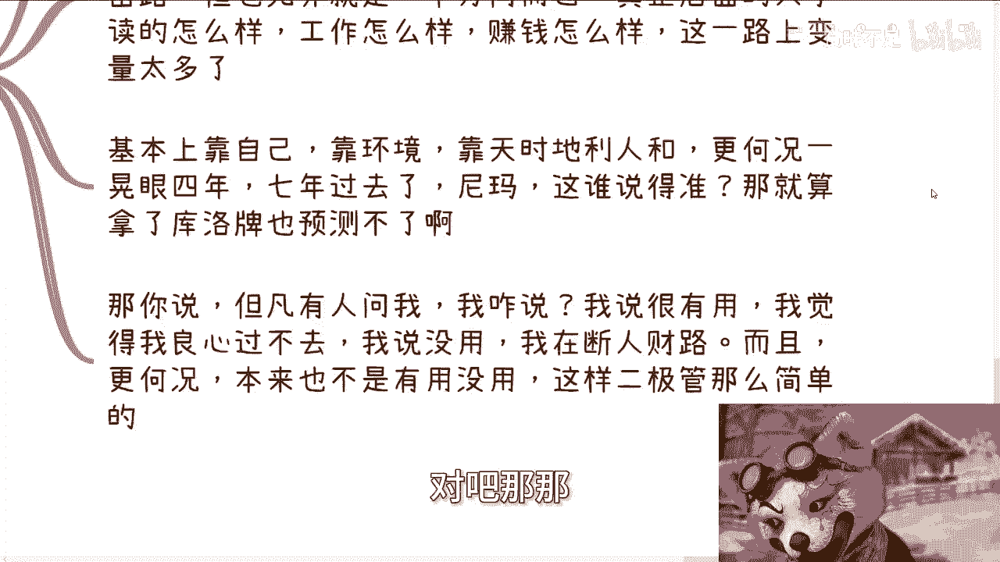

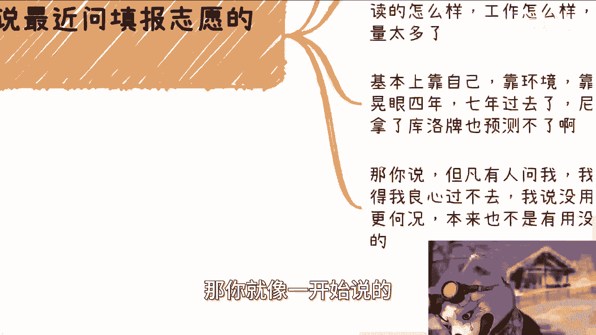

如果我回答“很有用”，我良心不安；如果我回答“没用”，我是在断人财路，且它并非完全无用。所以，这本身就不是一个能用“有用”或“没用”来简单回答的问题。

---

## 核心矛盾：改变的责任与个体的局限

通过以上案例，我们看到了回答具体问题的困境。现在，让我们深入一层，探讨这种困境背后的一个核心矛盾：谁应该承担“引导正向改变”的责任？

我经常被要求去承担这种“引导改变”的责任，但我认为这并不合理：
1.  **社会中有更合适的责任主体**：中国有众多教师、教授、各类组织、公务员等，他们都拥有明确的社会职责、地位或政治责任。在引导社会正向改变方面，他们都比我更有责任和义务。
2.  **我的个人定位**：我是一个“三无人员”，不隶属于任何企业、政府或高校。虽然与各方有合作，但都是基于平等合作关系。我的所有行为都基于个人意愿，不会因金钱或政治原因改变我的核心价值观。`合作状态 != 隶属关系`。
3.  **要求的不对等性**：那些要求我去改变的人，往往不会以同样的标准去要求他们的父母、老师、教授或校长。而这些人的社会影响力和责任范围通常都比我更大。

因此，当被要求去承担一些宏大的、改变他人的责任时，我需要认清自己的局限和社会的分工。

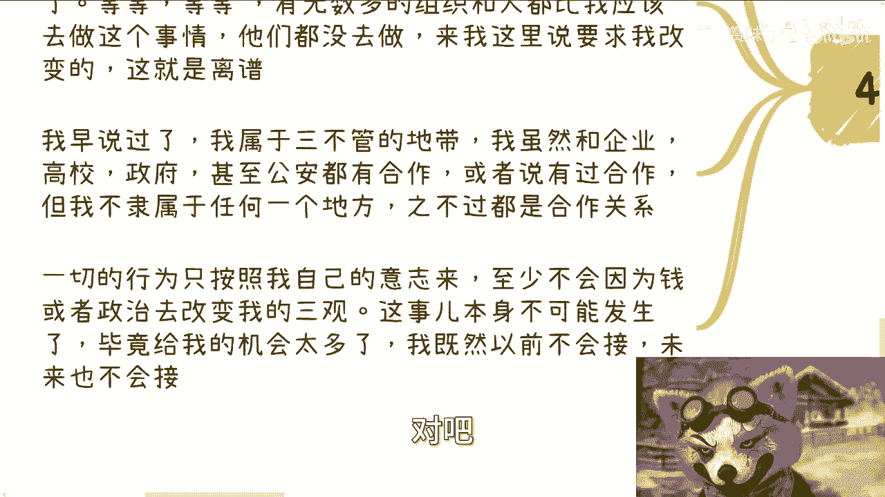

---

## 总结与启示

本节课中，我们一起学习了在复杂现实面前如何思考沟通与选择的问题。

我们通过评论分析、两个具体案例（区块链专业与志愿填报）以及对“改变责任”的讨论，揭示了以下几点核心启示：
1.  **社会是多元复杂的**：许多问题没有非黑即白的答案，其背景和影响因素往往是多维度的。
2.  **沟通存在认知鸿沟**：回答者基于经验和认知给出的答案，提问者可能因格局、深度或信息差而无法理解。
3.  **生存是首要现实**：在理想化的“改变”之前，必须正视生存这一基本前提。
4.  **认清责任的边界**：个体能力有限，社会改变需要体系中更核心的角色承担责任。每个人都应找准自己的定位，做力所能及的事。

希望这些思考能帮助你更好地理解复杂问题，并在面对自身的选择或他人的提问时，拥有更包容、更多元的视角。

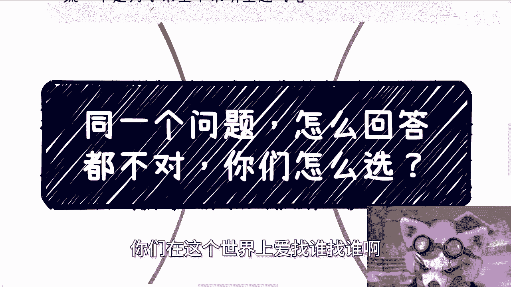

---
**附：活动与咨询说明**
*   成都线下活动已定于6月16日13:30-18:00举行，地点在青羊区神谷快医院附近。详情可私信咨询。
*   关于职业规划、商业咨询等服务，请务必整理好个人背景与具体问题后再进行预约。咨询旨在提供基于当前国情的建议，无法承诺直接带来财富或成功。