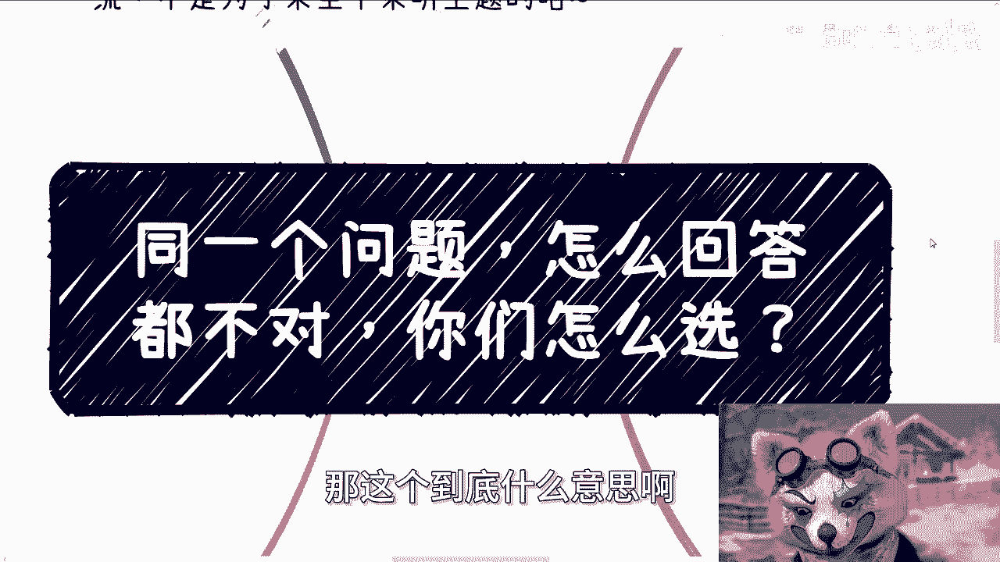
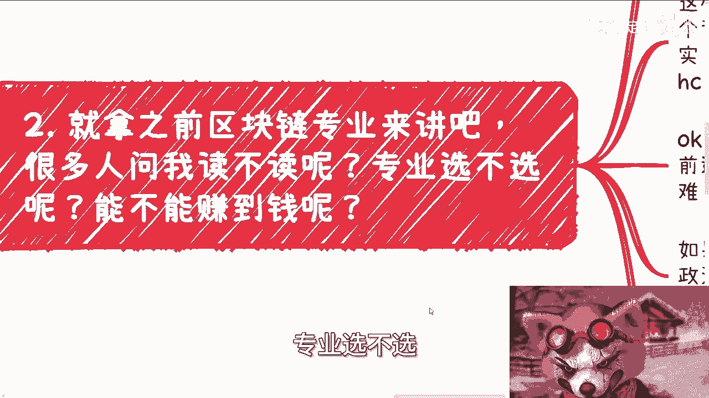
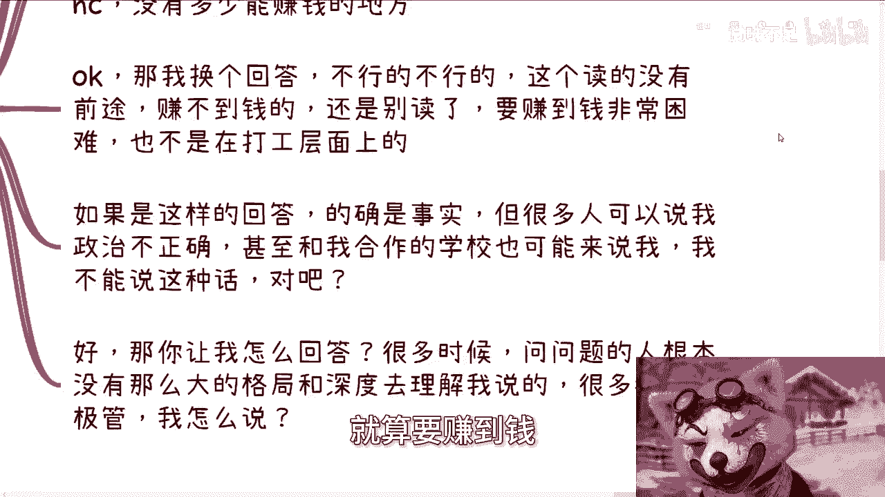
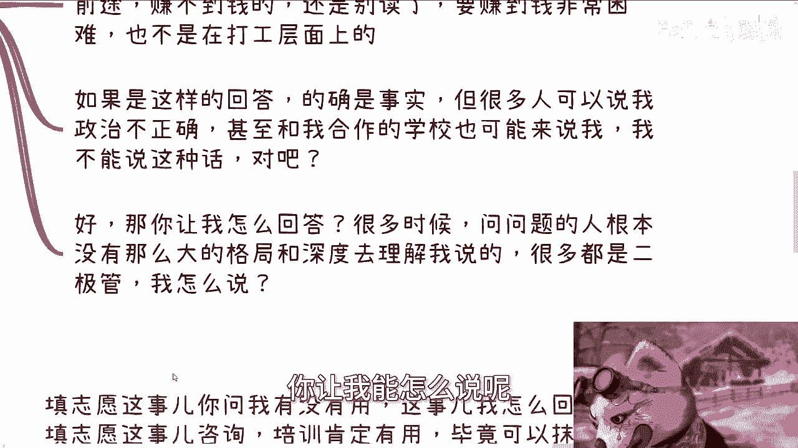
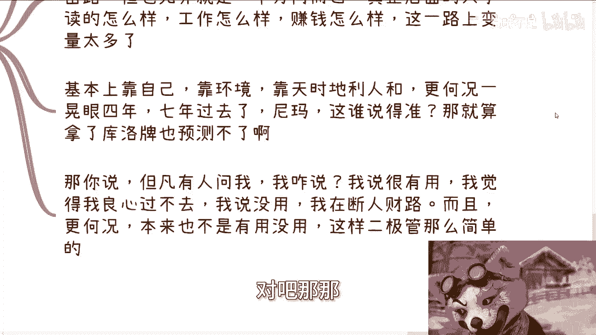

# 同一个问题，怎么回答都不对，你们怎么选？ - P1 - 赏味不足 - BV1qy411B7A8

好大家好，今天我们呃首先先祝大家节日快乐对吧，要放假了啊，然后就是今天我们讲的这个主题呢，叫做同一个问题，怎么回答都不对啊，你们怎么选，那这个到底什么意思啊。

你们听我讲下去啊，单纯看这个主主题，估计你们也看不懂啊，呃首先本期活动已经定了，现在6月16号下午01：30到六点好吧，然后在那个成都的青羊区啊，神谷快医院附近啊，然后哦报名跟详情你们可以私信我啊。

那么首先今天这个主题呢先来说前情提要，前情提要呢就前两天啊，评论区有这么一个评论啊，特别的interesting，Interesting，那么呃虽然已经被我拉黑了，但我跟大家说一下大概情况啊。

估计我就算不说呢。

也有小伙伴其实也应该也看到，那么他的意思是什么呢，他的意思是说我作为一个能够看到一部分本质，或者说这个社会的一个bug，应该鼓励大家正向的去努力，应该正向的去改变，而不是跟大家一直在说投机取巧。

或者说社会层面的去卷，那么我大概理解了一下，他的意思，应该是说我们要从读书本身学习本身去改变，是从学历本身去改变，从而改变我们的未来跟社会的未来啊，我说一下我的看法啊，首先鸡汤谁都会讲啊。

理论上怎么做都是可能的啊，怎么做都是有概率的，但是你真的放到普罗大众，你我个人的落地的时候就很不同，为什么，因为大家在社会上，包括我，包括你们啊，我们第一优先级是什么，是他妈的活下去，而不是改变对吧。

改变没有用，你活下去才是第一优先级，对不对，好那么第二社会跟世界太复杂了啊，人也很复杂，我们如果说从读书或者正向角度能改变的话，我就跟你们讲，早他妈能改变，也不会轮到今天啊，也不会有今天这种经济情况。

不会有的，你你明白吗，哦那么说白了很多路其实很多人都走过，有的路没人走，是因为走不通或者走死了，你懂吗啊，走死了，有的路走通了，也的确可能有一部分人知道，但相较于读书或者考研这根独木桥的人来讲。

基数还是少的，就比如说我左走的那些路对吧，你敢说我们行业里面知道这个东西的人少，不可能的，多的去了卷成狗了，但是你相比走独木桥人来讲，那技术还是少的对吧，那总而言之是什么意思呢。

总而言之就是说就如我主题写的很多问题，你让我怎么回答，我没法回答对吧。

你比如说举个例子，你就拿之前区块链专业来讲啊，区块链专业来讲，很多人问我诶，陈老师，你觉得这个专业读不足啊，专业选不选能不能赚钱啊。

包括就是你说高校啊，他们的校长院长问我哎，你觉得这个专业要不要进好，我就问啊，你让我怎么答，我说没问题啊，中央呃，要重点学习的，你们可以查一年，2019年对吧，10月24号。

他妈的这个事情是这个有目共睹的啊。

没问题，好好学对吧，你我这样做，我这样说有没有错，没有错，但你从我内心来讲，我是昧着良心说这话，为什么，因为他妈的上面说的话的确是事实，就是我们刚刚说的这个东西是事实吗，是事实，但更是事实的是什么。

他没有前景，为什么，因为我在这个行业里面，我很清楚这个行业里面怎么赚钱的啊，包括这行业里面压根就没有多少企业，也没有多少head count啊，没有多少head count，那就不会有多少赚钱的地方。

这个事情在45年前我就已经知道了对吧，OK那我换个回答啊，我就跟他讲，哎不行那不行的啊，这个读的没有前途的，赚不到钱的，他妈的你还是别读了啊，谁读谁啊啊要赚到钱极其困难啊，啊就算要赚钱。

你也应该可能跟我一样，不是在打工层面上面，OK如果我这样回答的确是事实，我也的确为对方着想，那我就请问我这种回答，我为对方去着想了，能有几个人理解我对吧，能有几个人理解我懂了懂个屁，对不对，我我跟你说。

我但凡这么讲，对面的人，80%的人，他只会说陈老师你认知不正确对吧，甚至跟我说啊，这个可能我合作的学校也可能来找我说，哎你怎么能说这种话呢，对吧对吧好，那我就问你让我怎么回答。

你说你要你要让我从正向改变，对吧好，那我就问你，我是说第一种类似那个话，还是说第二种话算正向回答，我也不懂对吧，就是就像我说的，很多时候问问题的人，他根本就没有这么大的格局，和这么大的深度去理解。

我说的很多是二极管，你让我能怎么说呢。

我再解释半天，他也听不懂了，对吧好。

再比如说最近提到这个填报志愿的问题，填报志愿这个事呢，你问我啊，说咨询培训啊，找老百姓找一些咨询培训有没有用，你让我怎么回答，就是咨询培训呃，那个填报志愿咨询培训这个东西肯定有用，为什么。

因为对于大部分老百姓来讲，对于大部分家长跟学生来讲，他对整个全国的很多的一些这个，这个就我们说行业内吧，或者说就是就是填报志愿这个行业内对吧，就有很大的信息差，那么你去咨询和培训，我相信我。

我我我就不管多少啊，你总归能抹平一定的信息差对吧，也就是说你咨询肯定比不咨询强，当然你问我这个咨询是不是性价比不高不高，那我我不知道，这个没法去说，对吧啊，那当然这个地方我也提强调一点啊，你们别来问我。

我不做这个音乐不大，而且我也不会啊，但是你话又说回来，你问我填报志愿这个咨询培训有多有用吧，那我就会告诉你，那按照我的三观，那不好意思啊，我他妈实在觉得没什么太大意义，为什么。

因为你用一个正常的脑子去思考一下啊，我不管你现在这个东西，对方讲的多么的真啊，你专业选择什么，也就相当于选择了一个分岔路对吧好，那么无非也就是一个方向而已，那么真正后面的大学怎么读。

工作怎么样赚钱怎么样，这一路上的变量太多了对吧，你基本上比如说要靠自己，靠环境，靠天时地利人和，更何况你现在做的一个填报志愿，一晃眼4年过去，一晃眼7年过去了，我就问了4年，7年后，谁说得准啊啊我靠你。

你你怕不是拿了这个骷髅牌，你也预测不了对吧，那你说啊，但凡有人问我，我怎么说，我说很有用吧，我觉得我良心过不去，我说没有用吧，我在断人财路，而且其实也不是说完全没有用对吧。

那那那所以说这个问题本身就不是说有用没用，这样二极管这么简单的，那你就像一开始说的。

你说这个改变不改变，怎么说呢，对吧好，那么就是最后一点，我们再来说改变，你就是说我们改变一年，我以前就说过，所有的人，你们可以要求任何人去改变，就不可能要求到我身上，为什么，因为很简单。

中国有这么多老师，老师是有职责的，中国有这么多教授，教授是有地位的，社会有各种组织，这种组织是有责任的，中国有这么多公务员，公务员是有政治地位的等等等等等，还有无数的组织跟人存在于哪边。

这些所有的人都比我来的有责任啊，或者说比我来的有义务，为什么，因为社会就是这样子，我是一个三无人员，什么时候轮得到我来做这个事情对吧，他们都还没有去做，轮得到我做嘛，啊嗯那我觉得我太把我自己当个人了。

那我早说过了，我是什么，我属于三不管地带，我虽然啊跟企业，政府，高校甚至公安竞争啊，等各地方啊，包括厅局都会有合作，但是啊我也早就说过了，我也只是合作，我不隶属于任何一个地方啊，之前都是合作关系。

我不是隶属于任何一个地方，是什么意思，就是我随时随地可以不合作，也没有人能够强迫我去合作对吧，也就是说一切的行为只按照我自己的意愿来，至少不可能因为钱或者政治，原因去改变我的三观，为什么。

因为这些事从以前已经发生过很多次了，我也有很多机会，我如果要改变，早就去改变了啊，我不是来跟你们强调说哦，我好像因为我要坚持我自己的想法对吧，我放弃了多少收入，或者我放弃了多少多少的这种政治的东西。

这个无所谓啊，大家总归是有得有失的，舍得舍得有舍才有得对吧，我觉得这不要去讲它，但是问题是我要告诉你们是，既然以前我不会去接，未来，也不可能去接对吧，也就是说，没有任何一方跟我是有直接的隶属关系。

也就是说不会有任何一方能够对我造成影响，对吧啊。

所以说就是说每次啊，就是你你你就拿有很多人问我问题来讲，我其实是不知道怎么回答的，因为我会发现我回答的内容，我回答的这个答案，我明白我在讲什么，但是对方不明白我在讲什么对吧，这是第一点，然后还有一类呢。

就是还有就是就我一开始说的那种评论区的人，就是他们往往会哼就要求我干嘛干嘛，我就觉得很搞笑，你们怎么不需求你们父母，你们就你们怎么不需求你们老师呢，你们怎么需求你们老师不要求你们学校教授。

怎么不要求你们院长校长的对吧，就随便拎出来一个都比我强啊，随便拎出来一个都是政治地位，社会地位比我高的哦，那哪轮得到我来做，是不是啊，所以就是就是我觉得就综合来讲吧，就是说你们通过我举的这些例子。

你们也可以去想想看啊，就是说社会是一个多元化的世界，是个多元化的，很多事情也是多元化的，你们要是觉得简单，仅仅是因为你们看到的面比较窄啊，没有哪个东西是简单的，它都是复杂的啊。

所以说你们讲你们仔细想想看，如果这些问题问到你们身上，你们会怎么回答，行好吧，就这么着，然后那个成都的活动你们要来了，继续报名啊，然后剩下的话就是职业规划，商业规划，股权分红丰润商业计划书。

合同白皮书对吧等等等，这些你们觉得啊手上有什么牌，没有什么牌的，你们希望能够通过跟我的沟通，能够给自己带来一些更接近于啊，目前国情，或者整个经济状态地起的这么一些建议的话。

那么你们可以整理好个人背景和问题，我们再来做咨询啊，再来约咨询啊，然后另外一方面，如果你们想通过咨询啊，无脑的去说，哎我们这个咨询过了，我就能赚到钱或者咨询过了啊，我就能财务自由或者怎么样子。

那你们你们别来找我啊，你们找别人去啊，我没这个本事啊。

