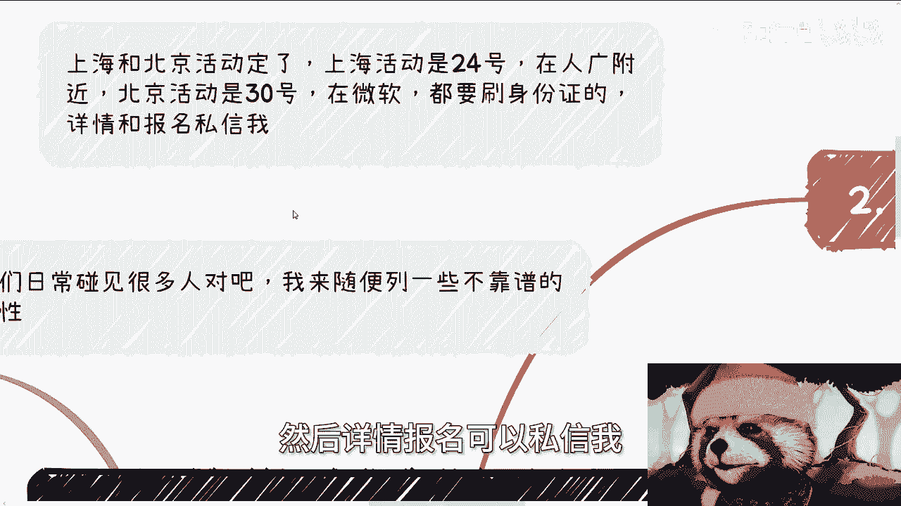
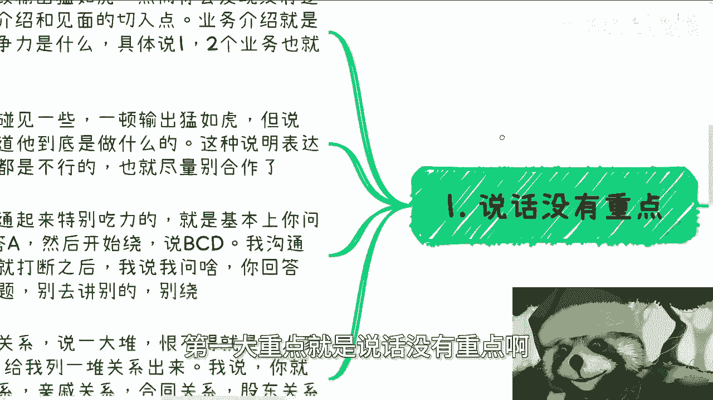

# 周末聊天专辑：不靠谱的人的一些案例 - P1 - 赏味不足 - BV15p421U7CV

好大家好，这个现在已经快凌晨了。

哎呀最近好烦啊，那个呃上海跟北京活动继续报名啊，上海活动24号啊，在人广附近，北京活动是30号啊，在微软都要刷身份证的好吧，然后详情报名可以私信我。

然后今天这个主题呢就是一样的啊，就是我最近碰到一些各种各样的情况嘛，也跟也跟很多人聊了一下嘛。

然后总结一下，就是有些不靠谱的人。

什么情况，首先第一大重点就是说话没有重点。

说话没有重点，就是说第一呢常见的特点就是一顿输出猛如虎，然而你听下来，但凡啊，当然前提是你得有逻辑性对吧，作为如果你有逻辑性的话，你会发现他一顿操作猛如虎，摔下来是毫无逻辑性的啊。

比如说业务介绍啦和界面切入点啊，业务介绍就说自己能做什么对吧，竞争力是什么，具体说核心的一两个业务其实就够了，然后呢我们日常当中碰到一些，比如说一顿输出猛虎啊，但是说完你还是不知道他到底做什么。

那么这个说明什么呢，说明其表达能力和逻辑能力都是不行的啊，这种尽量就别合作了，还有一种就是那种沟通起来比较吃力的，比如说你问他A啊，他不直接回答A，然后开始给你绕啊，绕了半天呢，可能说BCD啊。

那么我其实很多时候沟通的时候呢，我一般也都会打断他们，我说你别逼逼了啊，我说我说啥，你回答啥就行了，不要跟我逼逼别的，我不关心别的啊，就比如说我我跟别人一直聊商业，我说你们什么关系。

他跟我说我ABCDEFG各种关系，我说你你就要告诉我法律层面什么关系，有没有合同对吧。

有没有什么血缘关系对吧，就是就是所谓的人情关系和法律关系，你们别跟我他妈的让那些有的没的对吧，你包括就是那个前两天咨询我也是的，就是跟我说什么啊，我我跟我导，我导师这边能拿到什么好的项目，我是他妈的。

你导师跟你什么关系，项目为什么给你什么叫好的项目对吧，好的项目赚多少钱，屁都不知道，就他妈从我导师这边拿好的项目，唉都不知道他妈怎么想的，对吧啊，就是你们思考问题的时候，记住不要去用空的东西来思考对吧。

哦我我我我去一个，我要读个博啊，然后我从我导师这边就拿到好的项目，什么项目，什么都不知道，就PUA自己啊，这就好像我们合作关系说一大堆啊，他恨不得就是跟人家FBI办案一样的，给我他妈的列张列列列张照片。

照片关系图出来对吧啊，我说你就直接说亲戚关系，合同关系，股东关系还是没有直接关系，直接说他妈绕个屁，绕啊啊，唠啥对吧。

我跟你们说，你们做事情就是一样的，你们要想要去找绕的人，你们想赚钱就会吸引想赚钱的人啊，就这句话，不要老是抱怨外面。

你们先自己想想你们做事情是什么样子的啊，然后第二就是狮子大开口的那式子，大开口呢其实是两种类型啊，我给你们列一下啊，第一种呢就是直接大开口的啊，他没有什么没有什么分工的啊，就就就大开口啊。

那另外一种呢就是说有分工，有明确的事项，但是呢这个他大开口的这个这个数字呢，跟他这个明明明确的这个付出的事情呢，有明显的反差啊，那我们举个例子，比如说直接大开口的，就是那种非常明显高于市价的。

比如说一个培训啊，那么日常如果按照国家标准，可能也就是几几1000块钱上下，比如1000块钱3000块钱之间啊，那么如果是商业合作，也就几万块钱啊，如果上来他就跟你说，比如说10万或者几10万1天。

那我跟你讲，这就叫反就是违反常理，这种违反常理的人呢其实很，为什么呢，因为你要这么想，如果他真的有能力，能有赚钱的地方很多，他也不会不知道市场行情对不对好，那么既然知道市场行情还大开口，那么本质上就是。

也就是说他如果知道市场行情就大开口，那不就是来勾你吗，对不对，他不是来跟你吗，更何况往往你去找这种人，他能够给你大开口，他你level往往可能比较低，那他去割一个level比自己低的人。

而且是这种大开口的情况，那就说明格局更就更低了对吧，那么另外一种就是有分工的，你比如说他做的事也就值个几千，那也就值个几千，就是他或者这么说吧，他做的这个事情指的是一个定就是定额的价格。

比如说5000块钱一次啊，定额的价格，但是呢他开口跟你要分润啊，要比例，比如说他说我要50%，我跟你讲，这他妈就是，为什么，因为很简单，如果对方是个事，不懂什么时候应该分润。

什么时候应该要固定费用的这种商业人人士，就说明他对商业没有了解，那这种人你就不用合作了啊，那如果对方分得清楚，还想问你要分人，这他妈明显就是坏，对不对，那你更没必要合作了，有啥好合作的啊。

好那么第三个啊，就不考虑性价比，赚钱性价比的人，当然啊这有个前提啊，就对方的商业模式是成立的，比如说有合同钱也都落地了啊，也就是说对方的口袋是赚过钱的啊，我们先以这个为前提啊，什么对方吹得天花乱坠。

你问他哎，你钱有没有赚到过钱，有没有落过地没有，那没有，谈个屁啊，对不对啊，那假设我们假设对方赚过钱啊，然后谈业务的时候，你需要去思考一个问题，就是你是你不要思考你啊，你思考对方啊。

那就是对方的这个业务模型，它到底能赚多少钱啊，别去听一个流水，或者听一个营业额或者销售额，就就觉得卧槽牛逼对吧，就好像会被画饼了，没用的啊，记住没用的，那么你想想看啊，整个一个合作杂七杂八，有分销吧。

有渠道吧，有人员费用吧，有交税吧，日常打点费用吧，到到最后投入产出比到底多少，你得去了解它，如果投入产出比不高，也就是说他可能这个忙活了这个呃，这个上上下下忙活了很长时间呃，本质上他最终得不到多少钱啊。

那么他如果那个性价比不高，那么有没有多条业务线去做，如果没有，那他有没有思考过，比如说他他现在可能没有做啊，那你可以问他，比如说你有没有一些这个这个这个叫什么，就是备选方案对吧。

有没有思考过怎么进一步的提高投资产出比啊，那当然能赚到钱的，我觉得已经不错了，所以还要看一个因素，那就是时间就如果刚起步，或者来说可能刚起步几个月半年，那我觉得问题不大。

如果来说已经做了一年两年甚至更长时间，他还是这个投入产出比没有什么改变的，那我跟你讲也没啥必要合作，或者说你可以合作，就投个500%分之十的精力，因为什么，因为这个人肯定格局就这样子了。

他也没有能力改变他的赚钱的性价比，那你你你你你去付出太大精力在上面干嘛呢，对啊然后我刚刚谈到这个事情，我顺便提一点啊，哎我第四个没写完啊，没关系啊，我顺便提一点，就是呃评论区昨天就有人问我。

他说那一年赚多少钱算多对吧，或者算足够，我给你们讲思考问题，不是这么思考的啊，不是一年赚多少钱足够，而是说你得看，如果你要我告诉你们，如果来说从性价比角度来讲，钱一定是越多越好。

而你赚钱的时间一定是越少越好，就这么简单对吧，你不要来跟我说，我的，我一年投入12个月，我赚200万300万，这他妈算个屁啊，这叫垃圾，这叫窝囊废，你懂吗，就是如果你要谈论性价比，就是这么谈论的。

如果你觉得哎我打份工吧，赚了60万，赚了100万，赚200万算多的，那你去打工对吧，你去赚辛苦钱，这不在一个讨论层面上面，你知道吗，不是说你一年赚多少钱叫做叫做足够，不是这么个讨论方式的啊。

好然后第四个啊，我一边跟你们讲，一边来打吧，然后第四个比如说喜欢炫耀的啊，首先是这样子的啊，这里说的喜欢炫耀的，他不是说表面的那种啊，而是就是比如说表面这种是什么，就是说比如说穿着啊啊。

不是说比如说穿着啊，或者说一些就是就是就是就是表面的，表面的一些漏腹啊，等一下啊这种啊，他不是说这种我说的这种需要是什么呢，就是唉算了，我先跟你们说吧，说完我待会给你们补吧，好吧。

就是我说的这种信仰是什么呢，就是说更多的是指说诶，你比如说你跟他谈一个业务好，他会跟你来讲各种各样别的东西，就是跟你跟他谈的这个义务没有关系，比如说我今天跟他谈啊，我说我说我想来了解一下你的业务啊。

或者我想跟你，比如说呃，比如说我现在有个培训啊，我想跟你聊一下怎么分销啊，合作啊对吧，他不是的，他开始跟你炫耀，就说哎你看啊，我我就是你跟他讲A他开始跟你跟你讲，哎我在B上面啊，现在认识什么什么人对吧。

什么什么地方啊，然后各种各样什么什么说一大堆啊，但是问题在于哪里，问题在于没有落地或者落不落地，你也不知道，你知道吗，就是这种东西啊，也就跟你们相亲时是一样的，因为很多人相亲的时候，他也会碰到这种。

就是说就说你们双方可能没一开始这个不熟悉，对方也没有一些共同话题，然后呢对方就开始跟你聊，但是对方跟你聊，你会发现他正常来讲跟你聊，那大家相互了解嘛对吧，然后了解之后，比如说你有什么兴趣爱好。

大家可以顺着这个这个这个这个话题，继续往下聊嘛，他不是的，就是你发现那种炫耀的人啊，他就是完全不顾及你是谁，他也完全不顾及你到底要做什么，他也不顾及你到底有什么目的，他就管他炫耀。

比如说哎你看啊我爸什么什么什么，我家里面做什么生意的对吧，然后你看啊，我前两天比如说啊跟某某某老板去喝了，吃了个饭，只喝了个酒吧，那关我屁事啊对吧，就是说对方他讲一大堆，除了炫耀是没有别的作用的。

而且更何况你从我的角度，从对方的角度来讲，就是就是从我们坐在站在他对面的这个人，角度来讲，你你跟谁吃饭，你跟谁喝酒，你你你到底家里什么背景，我关我吊事啊对吧，就是如果我来相亲的。

那么我就是来看你这个人的，如果我是来谈合作的，那么我只关心大家怎么合作赚钱，你跟我讲这些东西有用吗，你们明白对吧，所以说就是说你们在很多时候，就是嗯我觉得有个有个事情，有一个方法是什么呢。

就是在很多沟通的时候，你们不要一开始太去多讲，就是你讲得太多，并不是说你掌握主动权啊，你看我现在很多时候出去聊聊，就是的，就是说我一般啊，能不说我就尽量不说，我就先听对方说啊。

我我不管对方是怎么样的一个人，我先让他一顿输出，你知道吗，因为很简单，他说的说的东西越多，我越能判断这个人是什么样子的，对不对啊，就是说他说的东西哪些是真的，哪些是假的，我会有我的判断。

然后我会从他说的东西里面再去提出我的疑问，那么你想想看，其实从头到尾的沟通，我都是掌握主动权的，为什么，因为不管我能不能套得出信息，我都是在根据他所给出来的信息在讨论对吧。

也就是说我对他的了解一定大于他对我的了解，那么我一定是大于我，一定是站在主导地位的对吧，否则你想想看啊，我一上来我一顿输出猛如虎啊，然后你要知道你很多人，你们但凡没有锻炼的情况下面啊。

你们的输出跟你们的脑子不是那么恐怖的，你知道吗，有很多时候你知道吗，你你你嘴瓢了，或者你可能讲话讲的上头了，你可能会讲了很多不过脑子的，但是你要明白，你讲出这个东西，对方会一样的。

对方其实他会来判断你讲的东西，到底是真的还是假的，然后对方会根据他所理解的东西来问你，如果你回头自己圆不回来，你想想看你怎么还往下合作，你知道吧啊。

所以说我觉得就是说就是说基本上是这么几点。

大家当然也不止这么些啊，大家可以去参作为参考，可以参考一下，行行就这么着吧啊好吧。

然后活动报名的你们继续找我好吧，哎都是下午啊，我顺便提一点，都是下午，反正就是一点多到五点多啊，然后那个剩下的话你们有什么问题融资啊，合同啊对吧，职业规划商业规划啊对吧，你们手上有什么牌啊。

包括像通过我的这个视角啊，更多的给你们一些这个职业规划的建议啊，或者其他的啊，你们可以整理好这个问题，整理好背景好吧，然后呃我们在做咨询，几点了，我的凌晨了，哎其实这两天是晚好吧。

