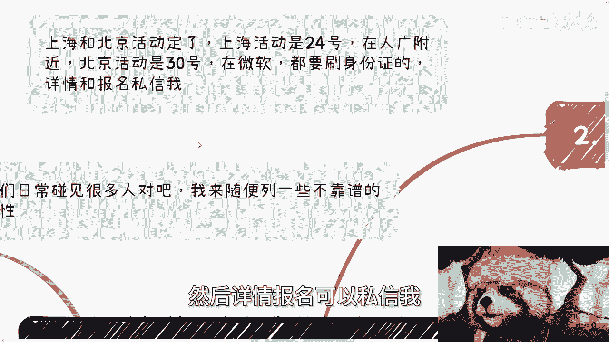
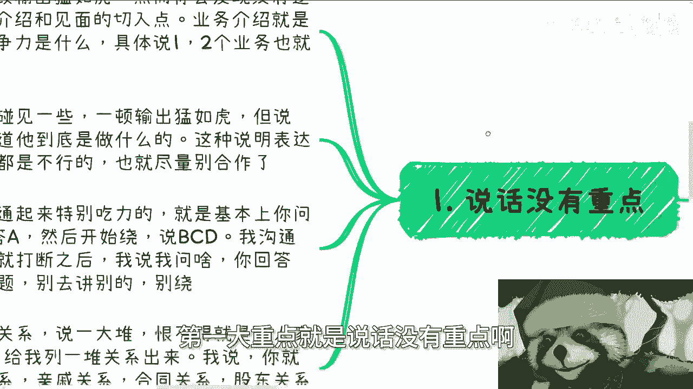
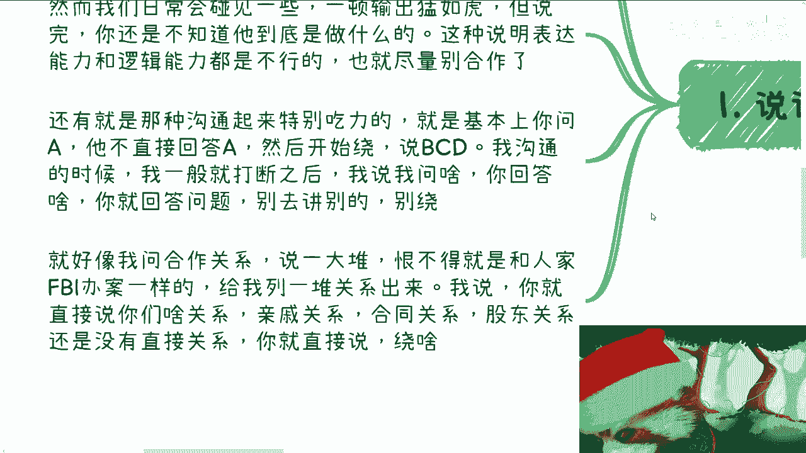
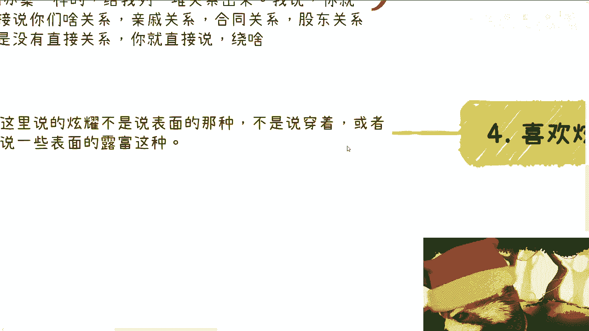

# 课程名称：识别不靠谱合作者的特征与应对策略 🧐 - P1

在本节课中，我们将学习如何识别在商业合作或日常沟通中可能遇到的“不靠谱”人士的特征。通过分析几种典型的行为模式，你将能够更有效地筛选合作伙伴，保护自己的时间和精力。

## 概述

本教程内容源自一次关于“不靠谱的人”的讨论。我们将逐一剖析几种常见的不靠谱行为特征，包括说话没有重点、狮子大开口、不考虑性价比以及喜欢炫耀。理解这些特征有助于你在未来的合作与沟通中做出更明智的判断。

## 核心特征分析

### 1. 说话没有重点 🗣️

上一节我们介绍了课程的整体框架，本节中我们来看看第一个核心特征：说话没有重点。这类人的表达往往缺乏逻辑，让人难以抓住核心信息。

以下是说话没有重点的两种常见表现：

*   **表现一：输出量大但逻辑混乱。** 例如在介绍业务时，说了一大堆却让人无法理解其核心竞争力和具体业务。这通常意味着其表达能力和逻辑能力存在问题。
*   **表现二：答非所问，回避核心问题。** 当你询问A时，对方不直接回答，而是开始绕圈子谈论B、C、D。例如，询问双方的法律关系时，对方却大谈人情世故。

**应对策略**：在沟通中主动打断并明确需求。可以使用类似 `“请直接回答我的问题：我们之间是否存在合同关系？”` 这样的方式，迫使对话回到正轨。

### 2. 狮子大开口 💰

识别了表达问题后，我们来看看另一个危险信号：不切实际地索要过高回报。这通常揭示了对方的不专业或不良意图。

狮子大开口主要分为两种类型：

*   **类型一：直接索要远高于市场行情的价格。** 例如，一个市场价几千元的培训，对方开口就要几十万。这通常违反常理，可能意在“割韭菜”。
*   **类型二：付出与索取严重不匹配。** 对方所做的工作明明只值固定费用（如5000元），却要求高比例的分润（如50%）。这要么说明对方不懂商业规则，要么就是居心不良。

**核心逻辑**：`如果对方明知市场行情仍大开口，其意图往往不是合作，而是利用信息差获利。`

### 3. 不考虑赚钱性价比 📉

谈完了不合理的要价，我们进一步思考合作的本质：投入产出比。本节关注那些商业模式本身“性价比”不高的合作者。

在确认对方确实有落地赚钱的前提下（而非空谈），你需要评估其业务的性价比。

以下是评估的关键点：

*   **不要只看流水或销售额**，要估算扣除分销、渠道、人员、税务等所有成本后的**净利润**。
*   **关注时间维度**：如果业务已运作一两年，但投入产出比始终很低且没有改进计划，说明其格局和能力可能有限。
*   **合作建议**：对于性价比不高的业务，可以只投入少量精力（如10%）进行尝试，避免重仓。

**关于“赚多少足够”的思考**：这个问题本身有误。正确的思考方向是追求 `收益最大化` 与 `时间成本最小化` 的组合，而非一个固定的“足够”年薪数字。

### 4. 喜欢炫耀（且与主题无关） 🎭

最后，我们来看一种干扰有效沟通的行为：在与当前目标无关的事情上过度炫耀。这会影响沟通效率，并可能暴露对方的浅薄或不自信。

这里的“炫耀”特指在谈正事（如业务合作）时，强行插入与主题无关的个人“资本”展示。

以下是这种行为的特点：

*   **脱离上下文**：当你谈合作A时，对方大谈自己在领域B的人脉、家世或消费。
*   **缺乏实质信息**：所炫耀的内容往往无法验证，且对推进当前事务毫无帮助。
*   **类比场景**：类似于相亲时，对方不顾你的兴趣，一味吹嘘自家背景和社交圈。

**沟通策略**：`多听少说，后发制人`。让对方先表达，你可以从其输出中收集信息、判断真伪，并基于此提出问题，从而始终掌握对话的主动权。

## 总结

本节课中，我们一起学习了四种不靠谱合作者的典型特征：
1.  **说话没有重点**：逻辑混乱，答非所问。
2.  **狮子大开口**：索求远高于其价值或市场行情的回报。
3.  **不考虑性价比**：其业务模型本身投入产出比低下，且无优化意识。
4.  **喜欢无关炫耀**：在沟通中插入对达成目标无益的自我展示。

掌握这些识别技巧，能帮助你在人际交往和商业合作中更快地过滤噪音，找到真正值得投入的伙伴。记住，你自身的行事方式也会吸引同类人，因此保持清晰、务实和高效的沟通习惯同样重要。