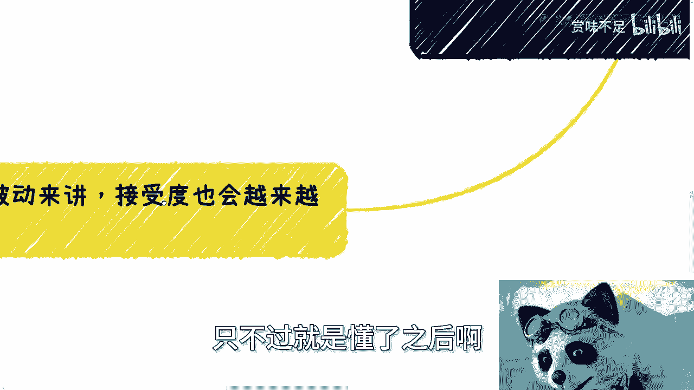

# 课程：中年为何难闯荡？🧭 - P1

在本节课中，我们将探讨一个普遍的社会现象：为什么人到中年后，似乎不再像年轻时那样适合去“闯荡”和尝试新事物。我们将从多个维度分析其背后的原因，帮助初学者理解其中的现实逻辑。

---

## 概述

很多人认为中年难以闯荡是“钱”的问题，但这并非全部。我们将从**恐惧心理**、**与社会脱节**、**被接受度降低**以及**精力分散**等多个核心因素展开分析。理解这些，有助于我们更早地规划人生路径。

---

## 一、 核心原因分析

上一节我们概述了课程主题，本节中我们来看看具体有哪些因素阻碍了中年人的闯荡之路。以下是几个关键原因：

1.  **经济压力并非唯一障碍**
    钱是重要因素，但单纯讨论“钱不够”意义不大。对于普通人而言，中年时经济压力普遍存在，但这只是基础背景。

2.  **恐惧心理加剧**
    所谓“年轻气盛”，无知有时也是一种优势。人到中年，明白的事情多了，顾忌也随之增加，更容易畏首畏尾。其根源主要来自三点：
    *   **自我认知更清晰**：年龄增长让人更清楚地认识到自身的局限性。
    *   **害怕失去**：可能缺乏抗风险能力，任何风险都需要反复权衡。
    *   **知识成为束缚**：知道得越多，决策时考虑的约束条件也越多，反而束手束脚。

3.  **与社会发展脱节**
    社会变化速度极快，如果一个人长期局限于自己的“一亩三分地”，缺乏对更广阔世界的接触和了解（例如，不关注行业动态、新兴技术或商业模式），那么一旦现有领域被淘汰，他将很难找到新的起点。

4.  **被接受度降低**
    社会对个人的接受度与其积累的价值正相关。公式可以简单表示为：
    **`被接受度 ∝ 价值积累`**
    如果年纪增长却没有相应的经验、技能或资源积累，那么被新环境、新机会接受的可能性就会越来越低。

5.  **精力分散，操心事务繁多**
    人的时间和精力是有限的。中年时期通常需要同时应对**贷款、父母健康、子女教育、婚姻关系、工作稳定**等多重压力。任何一环出现问题，都可能因为缺乏足够的抗风险能力和备选方案，而造成毁灭性打击。

---

## 二、 关于“积累”与“选择”的深入探讨

上一节我们列出了阻碍闯荡的具体原因，本节中我们重点来看看“积累”的重要性以及“线性思维”的误区。

*   **人生是非线性的**
    很多人有一种“线性思维”，例如计划“先打工四年，第五年再创业”。这种思维的问题在于，前四年的普通打工经历，并不能为第五年的创业自动积累必要的能力、资源和认知。该踩的坑、该学的知识并不会因为时间到了就自动掌握。
    ```python
    # 线性思维 vs 并行积累思维
    线性思维： 打工经验 != 创业能力
    应有思维： 为目标（如创业）并行积累特定技能、人脉和认知
    ```

*   **经济能力的基础性作用**
    一直强调努力赚钱，是因为在现实社会中，较强的经济能力能解决大部分无谓的矛盾纠纷。当你在一定范围内具备较强的赚钱能力时，你会发现自己能避免许多因经济压力产生的“鸡毛蒜皮”的争吵，从而为专注发展节省出宝贵的**时间和心力**。

*   **“折腾”的黄金期很短**
    一个人真正有心力和勇气去折腾、试错的黄金时期就那么几年。如果这段时间被浪费在无价值的事情上，未来很可能需要用半辈子去弥补和承担后果。




---

## 三、 现实世界的评估逻辑

理解了个人层面的原因后，我们来看看外部世界（如企业、机构）是如何看待和评估一个“中年人”的。以下是他们常见的评估维度：

1.  **对毕业新生**：会关注学校、专业和职业规划，但容忍度较高，因为对其直接价值期待不高。
2.  **对毕业数年者**：学校背景已不再重要。评估核心转向：
    *   **你过去做了什么？**（具体项目、业务）
    *   **你积累了什麼？**（经验、技能、资源、认知）
    *   **你的业务类型决定了你的认知层次**。例如，做政府项目、企业服务、散户业务所塑造的视野和能力是不同的。
3.  **残酷的现实**：如果没有积累，无论原因为何（家庭、工作、个人选择），在评估者眼中都意味着**缺乏即时价值**。商业世界遵循价值交换原则，同情心在此不适用。

**核心公式**：
**`个人价值 = f(经验积累， 技能深度， 资源网络， 认知层次)`**
年纪增长而函数值未增，则竞争力下降。

---


## 总结

本节课我们一起学习了中年人闯荡变难的深层原因。核心在于：**随着年龄增长，若未能持续进行有效的价值积累，同时又要面对激增的各类责任与风险，个人选择空间就会急剧收窄**。社会评价体系是现实而功利的，它看重的是你呈现出的价值，而非你的年龄或苦衷。


理解这些不是为了制造焦虑，而是为了提醒我们：**规划需尽早，积累要持续**。人生的关键几步，走对了事半功倍，浪费了则可能要用漫长的时间来偿还。