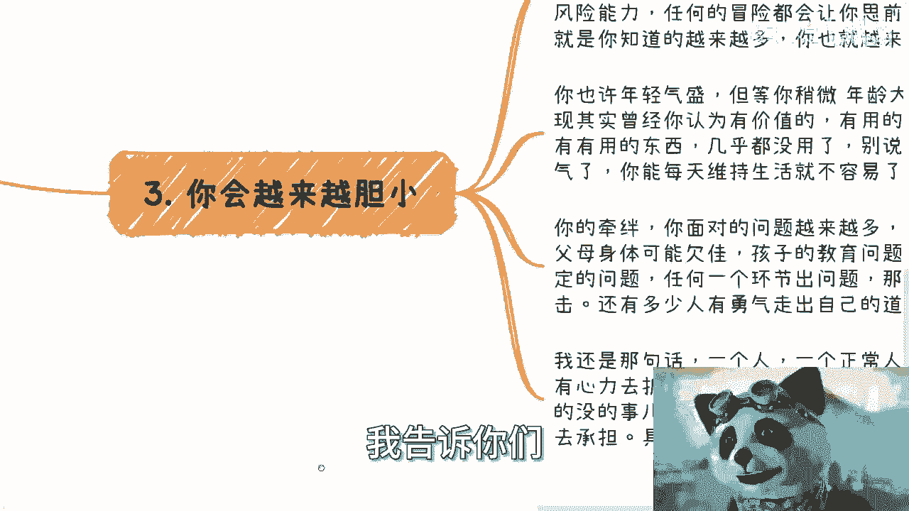
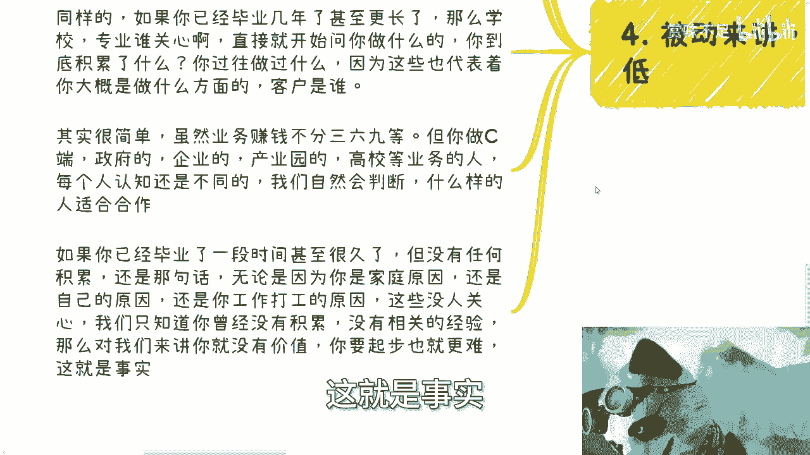
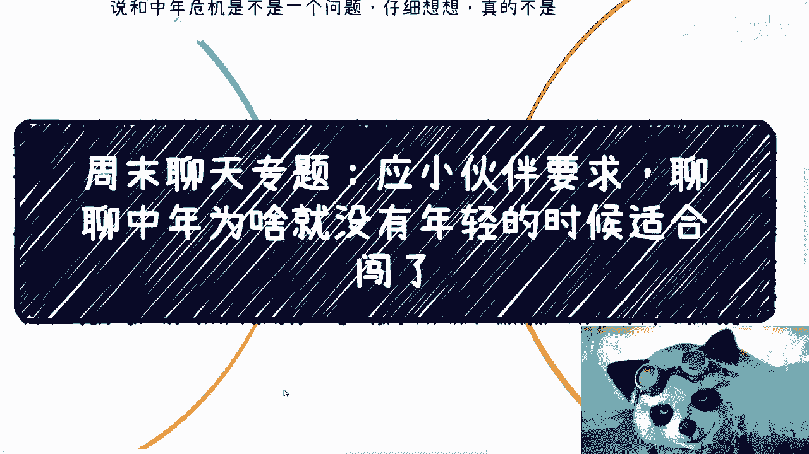

# 周末聊天专辑：为什么中年就没有年轻的时候适合去闯了 - P1 - 赏味不足 - BV1CK421b7VW

哈大家好啊，今天双休日双休日，这个我们继续聊天专辑啊，呃这个是之前小伙伴提的一个问题啊，他说聊聊中年为啥没有年轻的时候适合闯啊啊，然后呢他也提到了啊，说跟那个中年危机啊，这个应该不是一个问题啊。

仔细想想还真的不是一个问题，呃首先啊我觉得是这么几个原因，我先在讲之前，我先把它列出来啊，首先呢很多人觉得这是钱的问题啊，我觉得可以这么讲啊，但是呢大部分人其实到了中年了，钱肯定是不够的啊。

这这才是普通人嘛对吧，你单纯说钱的问题呢，我觉得意义不大，军校好像跟我说，他说呃就是说你跟我说，张老师，我给你一个亿对吧，那总归能解决很多问题是没毛病，但这句话没意义对吧。

那姑且呢我觉得把钱因素放在这啊，第二个原因呢就是恐惧啊，所谓年轻气盛，很多时候无知也有无知的好处，等中年的时候呢，你就会发现很多事情你可能明白了，或者来说你的顾忌多了，你就会更加畏首畏尾。

你更别说现在很多年轻人，让我觉得他妈的他年纪轻还畏首畏尾对吧，那我就不去说他了，那么另外一方面呢，就是说本身呢很多人与社会脱节也会很多，这就好像起点不同，就比如说现在很多年轻人，你说他脱节，我可以理解。

但你要是一个30的出来，你脱节，那我就觉得这是你的问题对吧，而且就是说以前嘛这种问题其实还好，但现在的话其实主要变化太快啊，那就比较难，那你像我身边的人也是一样的，就是呃我可以说啊，在我身边就是说啊。

就比如像我这样子的啊，有有这种自媒体属性啊，然后又有高效的这个咨询，又有企业的咨询啊，然后又有那个政府的咨询对吧，包括就是说可能我还一天到晚在这吃瓜吃瓜，吃瓜八卦的第一线对吧，就跟我这种属性一样的呢。

我基本上找不到呃，所以我是觉得像我身边很多人吧，他们基本上就与社会脱节很久了，就是他可以赚自己的一亩三分地，但是除了这一亩三分地以外，他如果未来被淘汰掉，那就真的被淘汰掉了，他也没什么。

不可能有什么机会让他起来再去做点事情啊，那么另外一点呢，就是说被接受度其实越来越低，因为随着你年龄的增长吧，你被接受的这种积极性啊，以及跟你所积累的是成正比的，什么意思呢，也就是说你积累的东西越多。

你被积极的可能你被接受的可能性也就越大，那是相反的，你如果没有积累，那你年纪大了，你被接受的可能性就会越来越低啊，那么最后一点呢就是说你要操心的事越来越多，因为人一天就那么点精力，就那么点时间对吧。

你不可能跟我说，你再牛逼，一天二十四十八小时是吧，那不现实的，而且呢很多人他的自驱力啊，就我之前也提到过关于自驱力啊，执行力啊，他可能还有惰性，所以说基本上呢你要我说，如果中年啊啊。

他还有精力去闯或者能闯出来的话，那么基本上之前也不会太差哦，因为你们一定要明白，就是人活着啊，他不是一个线性的，就有很多人他思维很神奇啊，他就会跟我说，他说陈老师，我5年后想创业啊，好我说可以啊。

然后呢他就跟我说，他说哎我那我现在先打4年工，就这种逻辑就很神奇，你知道吗，就是你前面打4年工，跟你后第5年创业有什么关系吗，你第5年该跌的坑还是要跌，你第5年之后该学的东西还是要学。

那你为什么不早点学呢，你你人生就这么长，你为什么要线性的做事情呢，我就不明白了，对吧啊，有很多东西说不清的啊，然后第二呢就是说先说操心的事儿啊，我为什么和大家说，一直跟大家说要努力赚钱啊。

尤其是中国当下这种经济情况，因为如果你在一个范围内啊，我不说一个亿这种不切实际的东西啊，就如果你在一定范围内，你会发现你能赚钱，更不能赚钱，差别其实他妈的天差地别啊，就是说你们记住我这句话。

你们回头一定会明白的，就是这并不是很多人说很多问题能用钱解决，这句话啊并不仅限于此，而是说你会发现你的父母，你的家庭，你的朋友，你的身边的人等等，对你的态度会很不同，说白了也就是说矛盾会少很多。

你们记住这句话，你们回头自己想想看，一定会明白这个道理的，也许你们现在不明白啊，因为当年我也不明白对吧啊，那么很多时候呢你会觉得烦啊，什么都不顺，而且矛盾四起啊，就是那种鸡毛蒜皮的事。

都他妈跟我来吵对吧，跟我来闹对吧，但是你想过没有，为什么啊，为什么中国人普遍是什么，就是嘴上他不说的啊，但是他心里面一定不是这么想的，也就是说他不会来说你啊，因为你赚钱赚的少，因为你没有这个能力。

因为你赚钱能力不强对吧，但是你心他心里面可能就是这么想的，而且大概率是这么想的，所以我们假设啊，我们假设你不是一个很看重钱，不是一个很看重物质的人，但是你是你啊，你活着不是只有你一个人。

你终究还是有身边的合作伙伴，你的父母，你的亲人，你的各种各样的人，对不对啊，但是你要明白，除了你以外，所有的人都是独立的个体，你甭管他跟你什么关系，都是独立的个体，独立的个体人心就隔肚皮。

你怎么知道人家怎么想的，艾玛奇了怪了，你怎么知道人家怎么想的对吧，就像我就这么说嘛，你就像之前有个小伙伴跟我说，他妈非要逼着他呃，那个读硕对吧，那我就问嘛，你妈你读硕对吧，是为了你好吗，不是为了什么。

为了你妈有个面子，就这样子的呀，你你那你可能会觉得啊，我作为我妈的孩子，那为什么不为我好，那不好意思，人就这个样子的，你是孩子，你是什么，有什么用啊，这种东西都是都是本来就是人类的，这种莫名其妙的。

怎么说呢，这种这种道德观或者别的东西套上去的，你说他的孩子只代表你有血缘关系，除了这个东西还有什么没了，代表他一定关心你嘛，没有呀，谁说的有因果关系吗，没有呀，对不了，一样的道理啊啊大部分人都是俗人。

你会发现当你有一定的积蓄，有很强的赚钱能力的时候，我跟你说啊，不能说矛盾都没有，而是说可以避免大部分的毛，莫名其妙的鸡毛蒜皮的，根本不用去争吵的问题，反之父母孩子另一半，你的事业，你的工作还要扩展关系。

还要去积累，我他妈就请问你哪来这么多时间，你最终只会被烦死，而且你最终可能不单不单单是被自己烦死，你会被身边的人烦死，然后你就会抱怨没有办法的，这一切都源自于你自己没有赚钱能力，也源自于你。

你年轻的时候不知道在他妈干什么，对啊好，第三点啊，你会胆子越来越小，所谓胆小的原因呢无非来自三个啊，一个是你年龄大了，所谓年纪大了呢，你越来越会认识清楚的认识到自己啊，那么会觉得自己其实其实不行。

其实没有这么行啊，那么第二个呢就是你怕失去，因为你可能没有任何抗风险的能力，任何一个风险他都会让你思前想后，那么最后一个就是说当你知道的东西越来越多，你就越来越束手束脚啊。

这就是我刚刚一里面所提到的那种，就是说无知呢也有无知的好处啊，那么你也许年轻气盛，等你稍微年纪大一点的，你就会发现，其实啊曾经你认为有价值的，有用的，以及你觉得所有用的东西有用的人脉啊。

其实都几乎都没用，你会为你的无知所买单啊，你的三观也会被带，也会被打碎，但是啊真的到那个时候其实也没什么卵用了，因为你已经没有出去闯的勇气了，你也没有重新来的勇气了，这才叫普通人对吧。

甚至你每天维持生活都已经不容易了，那么你的牵绊啊，你面对的问题越来越多，可能会有贷款，父母的身体可能欠佳，孩子的教育问题，还有还有比如说你的你的你的房子车子对吧，你的婚姻还有很多工作不稳定的问题。

你就会你你会面临一个问题，当然男女都一样啊，我这里不强调性别啊，男女都一样，就是你会发现你身上所有你的小宇宙，任何一个环节主要出了问题，对你就是毁灭性打击，为什么，因为你没有钱，你没有足够的抗风险能力。

你也没有足够的就是更多的路，对你来讲，你可能只有一条路，当当整个的这条路上面出现问题的时候，你就是毁灭性打击，但是还是那句话，这些事情是你自己造成的，不要怪外面从来就没有人，没有人跟你讲。

也就是从来这么说吧，就是如果你认为你的人生只有一条路往前走，你非要用那些莫名其妙的PUA说啊，普通人没有出路，我们只有这一条路对吧等等等，那你非要自己这么认为，那就是你的问题。

你为什么连这个世界都还没有了解过，你就要愿意听，别人说的东西没有意义的，对不对，那你最后走成这样子，怪谁呢啊，然后我还是那句话啊，一个人一个正常的人能折腾，能有心力去折腾，真的就那么几年。

如果你浪费在了一些有的没的事上啊，那么你们未来大概率就要用半辈子去弥补，去承担，具体我所谓的这些有的没的哦，没有价值的事情是什么，我就不说了对吧，懂得自然懂，还是那句话，我告诉你们。

还是那句话，你们现在懂不懂不重要，未来你们早晚早晚是要懂的啊，只不过就是懂了之后有没有选择罢了。

那么第四点就是被动来讲，接受度也会越来越低，这也是很重要的一点，我跟你讲啊，这就更简单了，你比如说你面对我或者面对机构啊，还是说是面对企业还是面对政府，我们看一个人其实就那么几个点。

如果你刚毕业或者毕业半年啊，我们会稍微问一下你的学校，你的专业你是做什么的，以及接下来你到底要干嘛，你的规划是什么对吧，因为我们基本上很清楚，你作为一个刚毕业的学生，你是没有价值的，那就随便聊聊。

如果你有具体项目或的确你有与众不同，跟别人不一样的东西，那么我们继续聊，如果没有的话，拜拜对吧，滚啊，那么同样的，如果你已经毕业几年甚至更长，那么学校专业他妈的鬼关系啊啊你我跟你讲，你但凡毕业3年了。

毕业5年了，我绝对不会来问你什么，你什么学校什么专业有什么用啊，没有用啊，你学的再好，该忘了就忘光了，有啥用呢啊再说了，你就算不忘光，这些东西也不能变现啊，就这么简单啊，那么直接。

那我觉得就开始问你做什么，以及你到现在，比如说这3年这5年到底积累了什么，你过往做什么，因为这些也代表着你大概是做什么方向的，客户是谁，而且其实很简单，虽然啊业务赚钱不分369等。

但是你做那个散户的单子，你做政府的单子，你做企业的单子，你做你做政企业产业园的单子，你做高效单子，你是做服务还是做产品，还是做融资，还是做什么东西，每你做每一个业务会影响到你的认知哦，你做不同的业务。

你的认知就是不同的，那么我们会通过你做的事情来判断，你到底有什么样的价值，以及你这个人是不是是不是最终适合合作哦，所以说如果你已经毕业了一段时间，甚至很久，但没有任何积累，那么还是那句话。

无论因为你是家庭原因，还是你自己的原因，还是你工作打工的原因，还是因为你家，你你什么什么什么什么自己忙着忙那的原因，这些东西没有人关心谁关心啊，没有人会同情你，因为没有人有义务去同情你对吧。

我们只要知道你曾经没有积累，我们只要知道你这么多年没有相关经验，那么你就没有价值over结束了，对不对，因为什么，因为我也好，政府也好，机构也好，大家都是资本家，那当然我可能还还还还还还不不。

没有资格做资本家啊，就是大家都是商人，那么我只能说我们都是以价值来看待的，你要说我们去做菩萨来救你，那我就问中国14亿人，我们救得过来吗，对不对，那么反过来说，如果你没有积累，你要再起步。

年纪大了再去起步，那就很难，这就是事实对吧。

也就是说我无论今天我给你喂多少鸡汤，你不改变这个事实没有用啊，你明白吧，包括就是说你如果觉得啊，所谓的你们父母给你讲的什么，ABCDE有用对吧，未来更稳定，怎么样子，你要愿意去吃，那你就去吃。

但是你吃不吃这个饼，你喝不喝这个鸡汤不改变地球，也不改变整个商业环境，更不改变我们所说的社会的一些潜规则，你只会改变你的未来，就这么简单，好吧行，那就这么着啊，那个大家在职业规划或者商业规划。

或者说什么商业计划书啊，你们有什么包括合同啊，包括任何细节啊，你们吃不准的股权分配啊等等等等等啊，你们要是有任何的问题，你们总结清楚啊，总结清楚。

包括现在的整个这个行业的发展等等等啊，你们总结清楚好吧，然后私信我。