# 周末聊天专辑 P1：在沟通现场被怼了怎么办？💬

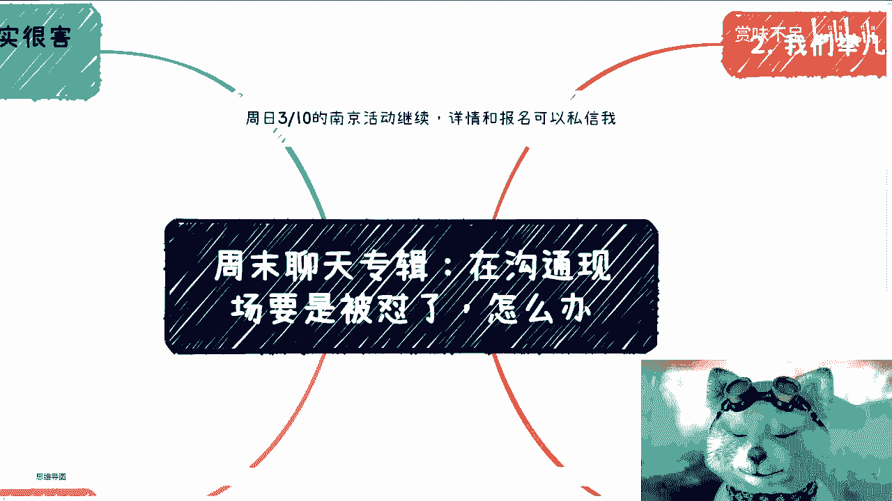

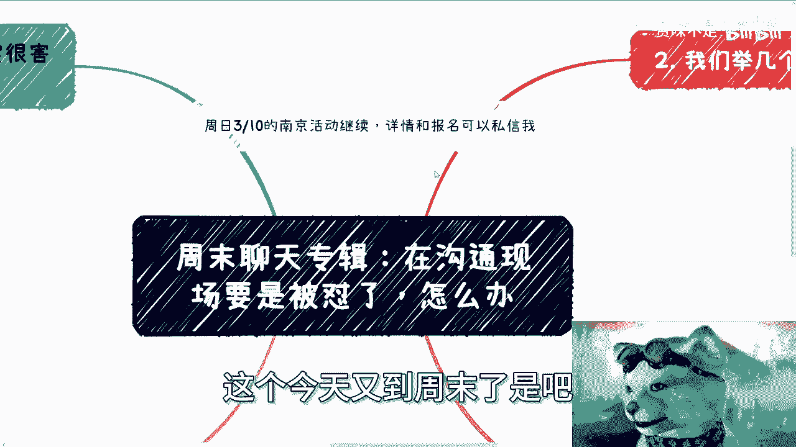

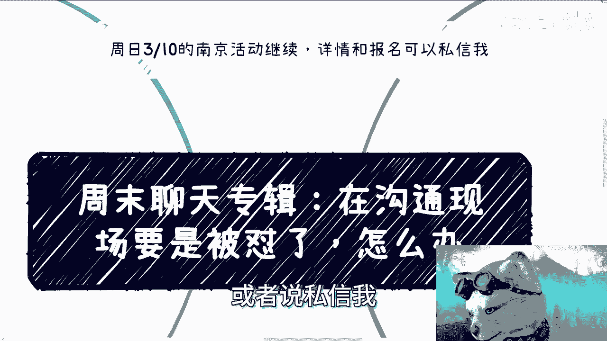

在本节课中，我们将要学习在沟通或演讲现场被他人质疑、反驳甚至“怼”时，应该如何应对。课程将拆解核心判断依据，并提供具体场景下的处理策略，帮助你保持主动，有效沟通。

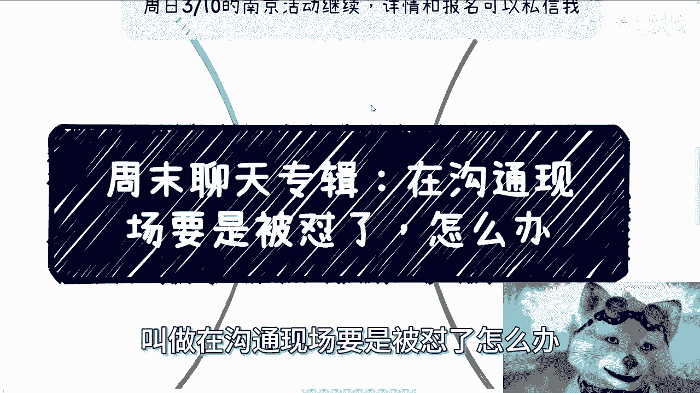

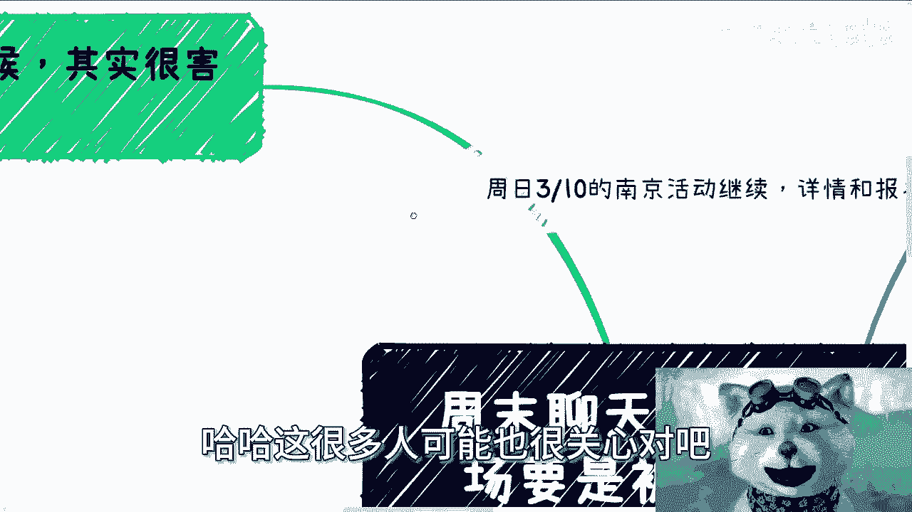

---

## 概述：被怼是沟通的常态

在正式或非正式的沟通场合，被质疑或反驳是正常现象。不被质疑可能意味着听众并未认真思考你的内容。在越正式的场合，直接、激烈的反驳反而越少，因为参与者通常顾及场合与情商。许多“怼”的行为，源于对方的认知局限、逻辑不清或故意刁难，而非针对你个人。

上一节我们概述了被怼的普遍性，本节中我们来看看应对前需要明确的几个核心判断点。

## 核心判断依据：四个关键问题

应对质疑前，建议先快速判断以下四点：

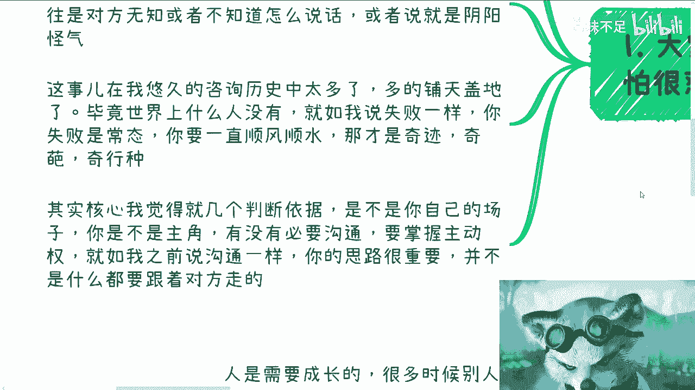

1.  **这是否是你的主场？** 判断你对场合的控制力。
2.  **你是否是当前的主角？** 明确你的角色和话语权。
3.  **是否有必要与对方沟通？** 评估回应的价值与必要性。
4.  **你是否掌握了主动权？** 确保沟通方向不被人带偏。

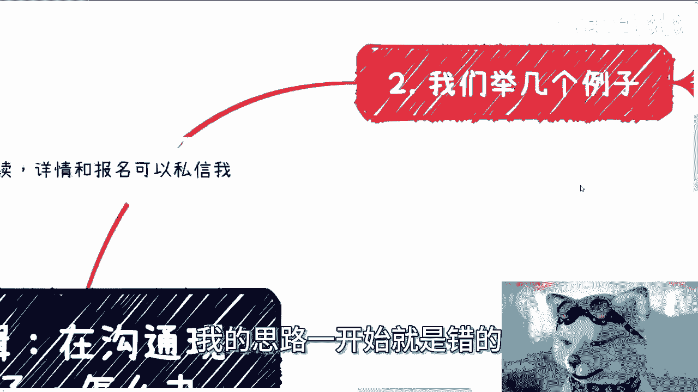

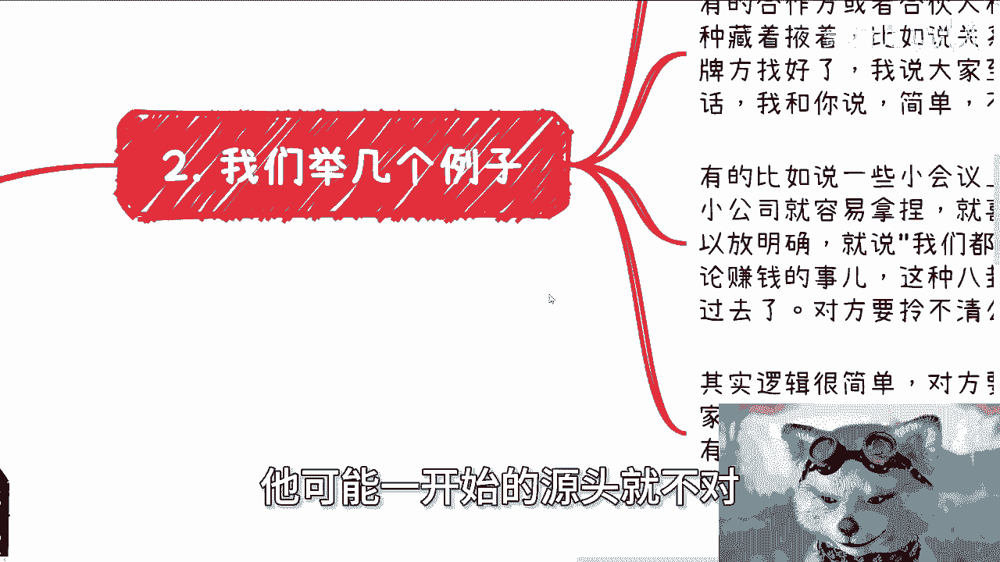

**核心公式：** `是否回应 = 主场优势 + 主角身份 + 沟通必要 + 主动权`

记住，沟通思路很重要，无需总是跟随对方的逻辑，尤其是当对方的前提或问题本身就有问题时。

---

## 应对策略与场景实例

以下是针对不同沟通场景的具体应对方法。

### 场景一：应对无关或恶意提问

在商业洽谈或会议中，常会遇到对方询问与核心目标无关或带有刁难性质的问题。

**处理原则：** 紧扣“赚钱”或会议核心目标，礼貌地拉回主题。

*   **实例：** 对方不断询问公司成立时间、团队学历等与当前合作无关的细节。
*   **应对话术：** “您提到的这些信息，与我们这次要讨论的**KPI达成方案**有直接关系吗？如果没有，我们可以先聚焦在方案上，其他细节会后再聊。”

**关键点：** 如果对方持续在明确核心目标前纠缠，可能缺乏合作诚意，需重新评估合作必要性。

### 场景二：应对需求变更或公开质疑

在企业内训或演讲时，可能被当场质疑内容与预期不符。

**处理原则：** 不陷入“为什么不一样”的解释循环，而是重新定义一致性。

*   **实例：** 客户说：“老师，你讲的主题和我们向中介提的需求不一样，能换主题吗？”
*   **应对话术：** “我理解您的顾虑。我准备的内容正是为了满足您**（提及核心需求，如‘提升团队效率’）** 的目标。您感觉到的‘不一样’，可能源于我们对该目标实现路径的理解角度不同，接下来我会展示其中的关联。”

**关键点：** 利用你的专业认知，引导对方认识到你的内容与其根本需求是一致的。

### 场景三：应对复杂、冗长或知识盲区问题

在Q&A环节，可能遇到一连串问题或触及你知识边界的问题。

**处理原则：** 控制节奏，坦诚未知，避免硬撑。

*   **对于冗长问题：** “您的问题包含多个要点，为了不占用大家太多时间，我们能否先聚焦在最核心的一个问题上？” 或 “我们可以线下详细交流。”
*   **对于知识盲区：** “您提到的这个**（具体领域）** 问题非常专业，这确实超出了我目前的研究范围，我需要进一步学习后才能给出负责任的回答。”

**关键点：** 在公开场合对专业问题硬撑，极易被真正懂行的人识破，损害信誉。

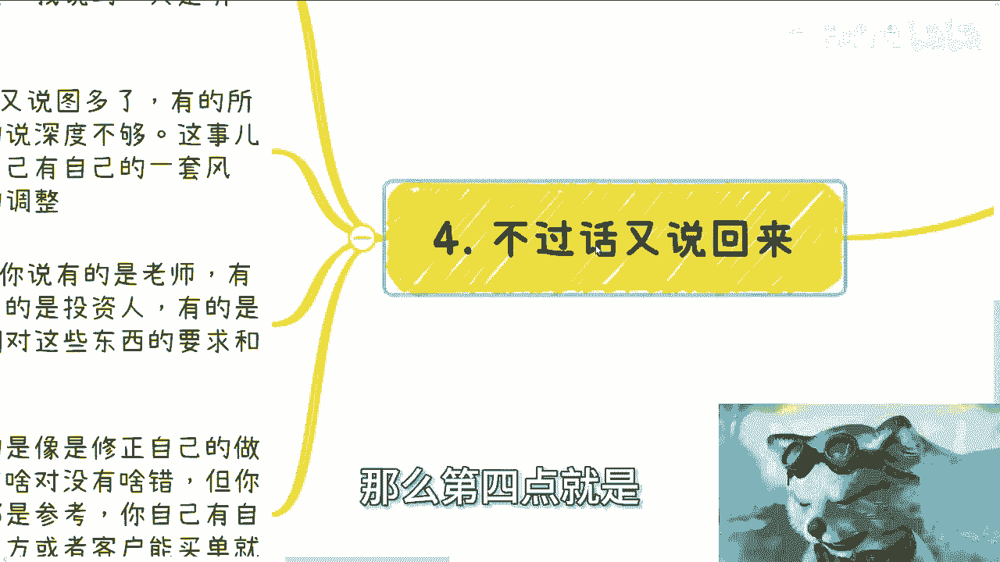

### 场景四：应对问题源头错误的情况

对方的问题基于错误的前提或假设。

**处理原则：** 绝不跟随错误前提，直接指出问题根源或重新设定讨论框架。

*   **实例：** 在区块链分享中，被问：“去中心化技术如何替代中心化技术？”
*   **应对话术：** “这个问题可能从一个不成立的假设开始。在实际应用中（尤其是国内），两者更多是**融合与互补关系**，而非简单的替代关系。我们可以聊聊它们在实际场景中是如何协同的。”

**关键点：** 识别并跳出错误的逻辑起点，是掌握主动权的关键。

---

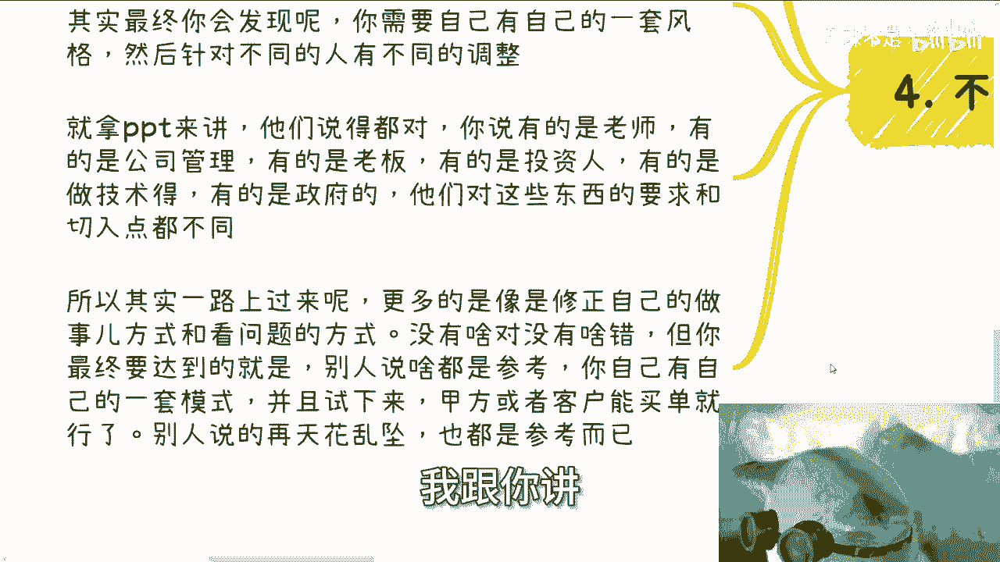

## 总结：成长心态与建立个人体系

本节课中我们一起学习了在沟通中被怼时的判断依据与应对策略。

最后需要强调的是，保持成长心态。有些批评是中肯的，需要反思吸收。但最终，你需要建立自己的方法论和沟通风格，并通过实践验证其有效性。面对海量且矛盾的他人意见（如“PPT图太多”、“字太多”），核心是**理解不同受众的视角**，进行针对性调整，而非成为随风倒的墙头草。

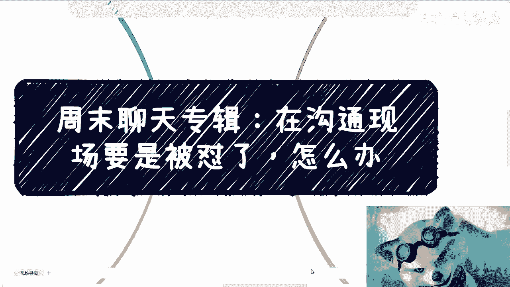

**核心心法：** 他人的意见皆为**参考**，通过小范围测试（如采纳20%）验证，最终形成一套能为你的目标客户/受众买单的成熟模式。你的价值在于提供独特的视角和解决方案，而非取悦所有人。

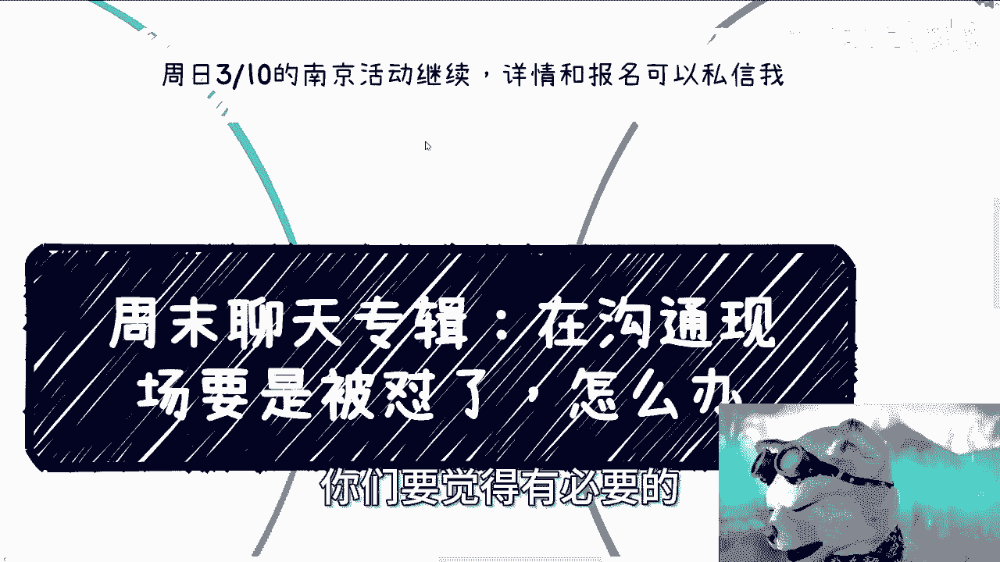

---
**行动提示：** 南京线下活动报名进行中，详情请见B站动态或私信。课程内容也适用于职业发展、股权分配、创业规划等个人成长议题。