# 课程名称：为什么赚不到钱？ - 第一讲：核心认知与常见误区 🧠💰

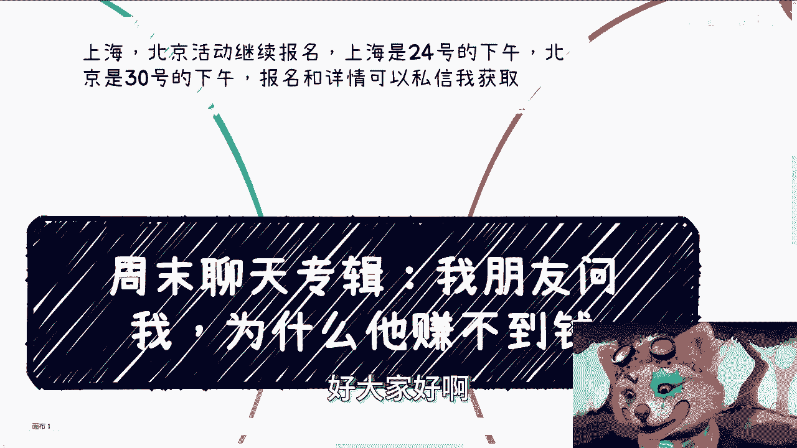

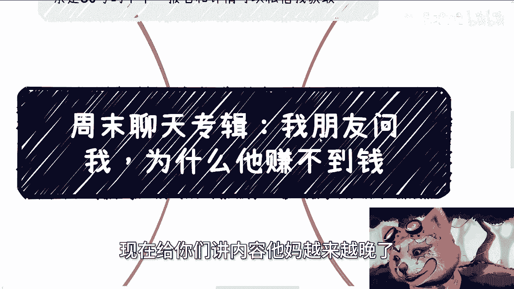

在本节课中，我们将探讨一个普遍困扰许多人的问题：“为什么我赚不到钱？” 我们将从几个核心认知出发，分析常见的思维误区和行为模式，帮助你理解赚钱背后的逻辑。课程内容基于一次真实的对话整理，旨在提供直白、实用的见解。

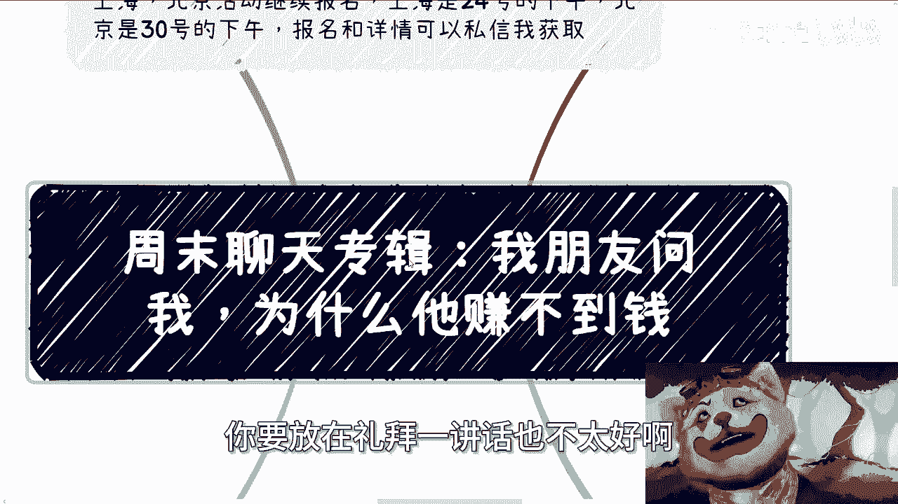

---

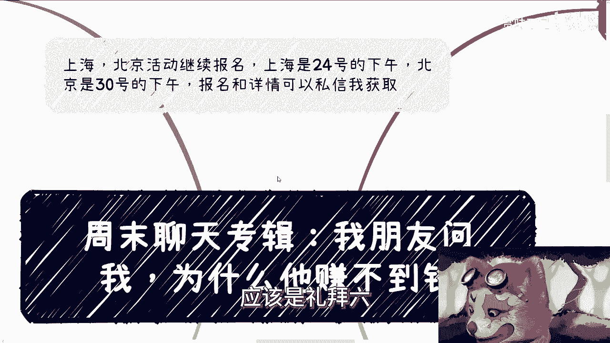

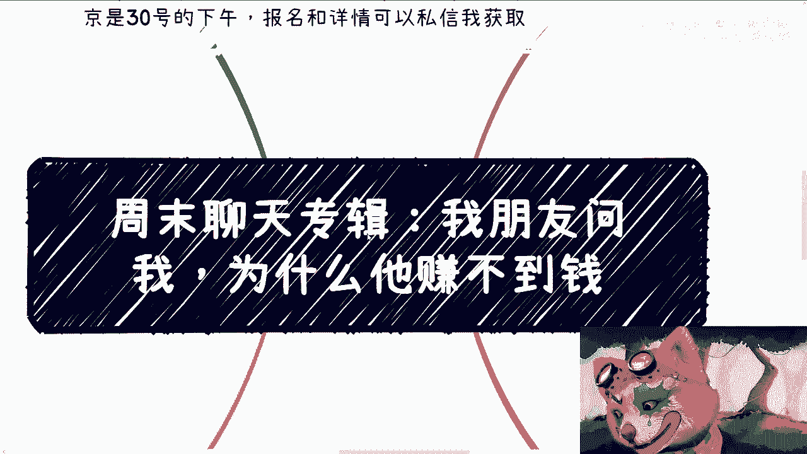

## 概述：问题的核心

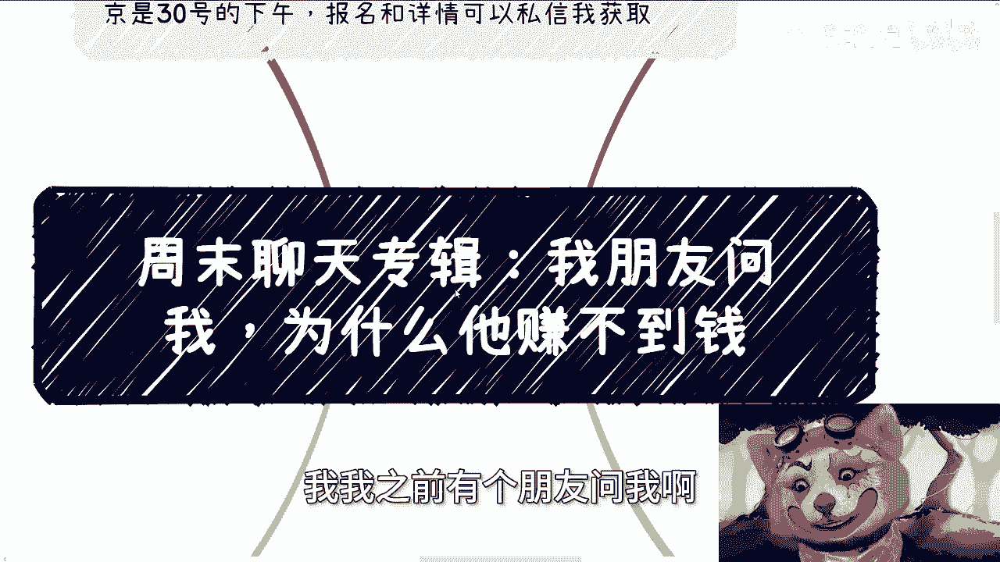

一位朋友曾向我提问：“为什么我赚不到钱？” 经过分析，我发现许多人赚不到钱或赚钱辛苦，并非因为能力不足，而是源于一些根深蒂固的认知和行为模式。本节我们将首先概述这些核心问题。

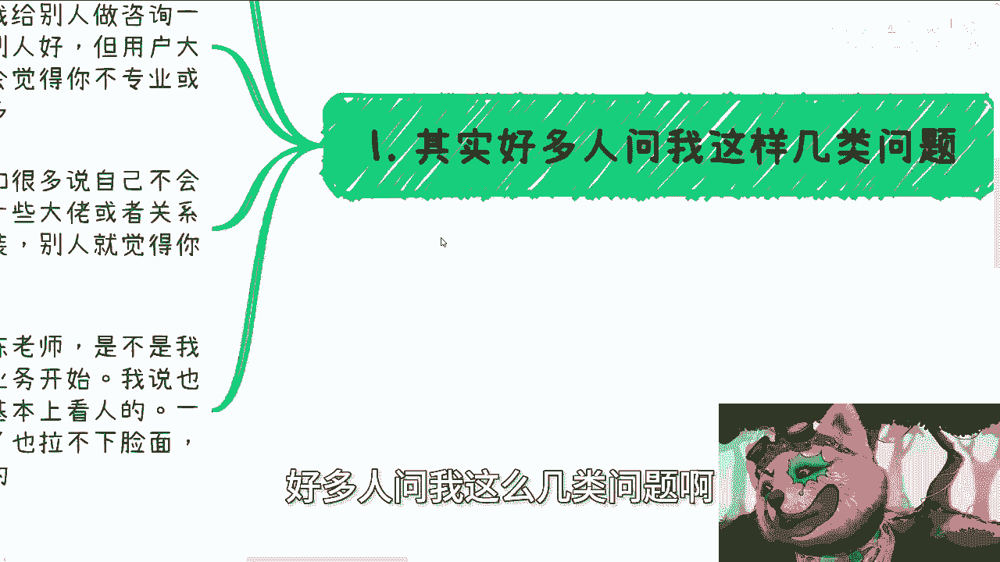

---

## 第一节：过度“为他人着想”的陷阱

上一节我们概述了问题的普遍性，本节中我们来看看第一个具体原因：过度“为他人着想”反而阻碍了赚钱。

许多人赚不到钱，是因为他们“太有良心”，过度为客户考虑。例如，在提供服务时，会详尽分析客户的学历、家庭、性格等因素，试图给出最“完美”的建议。然而，从商业角度看，这常常适得其反。

用户大多不会领情你为他做的复杂分析，他们可能反而觉得你不专业。如果你因此收取较低费用，用户甚至可能产生“一分价钱一分货”的质疑，认为你的服务不值钱。

**核心逻辑**：你的默许和妥协，并没有为你带来应有的回报。关键在于建立专业的价值认知，而不是通过降低价格或过度服务来获取认可。

---

## 第二节：“不敢包装”与自我设限

理解了过度服务的陷阱后，我们再来看看另一个阻碍：不敢进行必要的自我包装。

在许多场合，比如与大佬、领导见面时，敢于包装自己、展示实力的人更容易获得机会。如果你因为“不敢包装”而表现得平庸，那么即使你有能力，别人也会认为你“不行”。

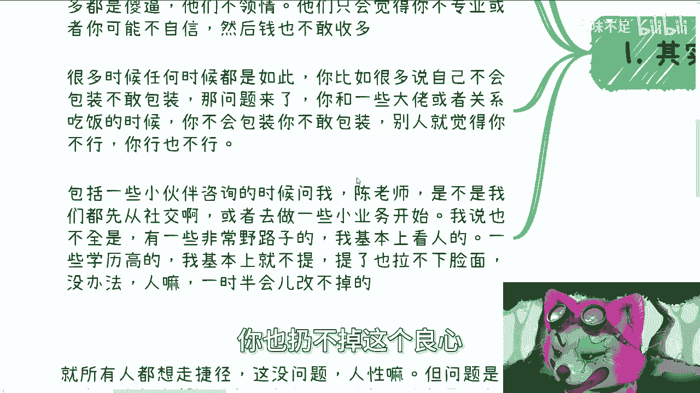

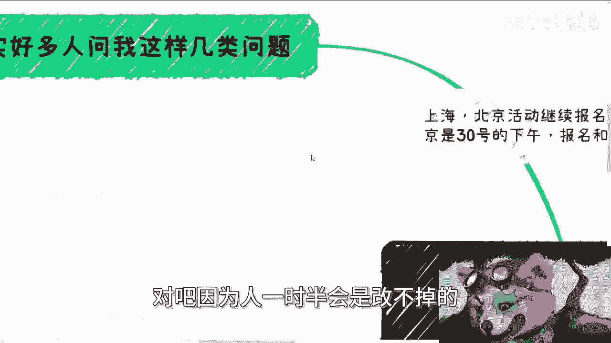

**核心公式**：`他人对你的认知 ≈ 你敢于展示的形象`

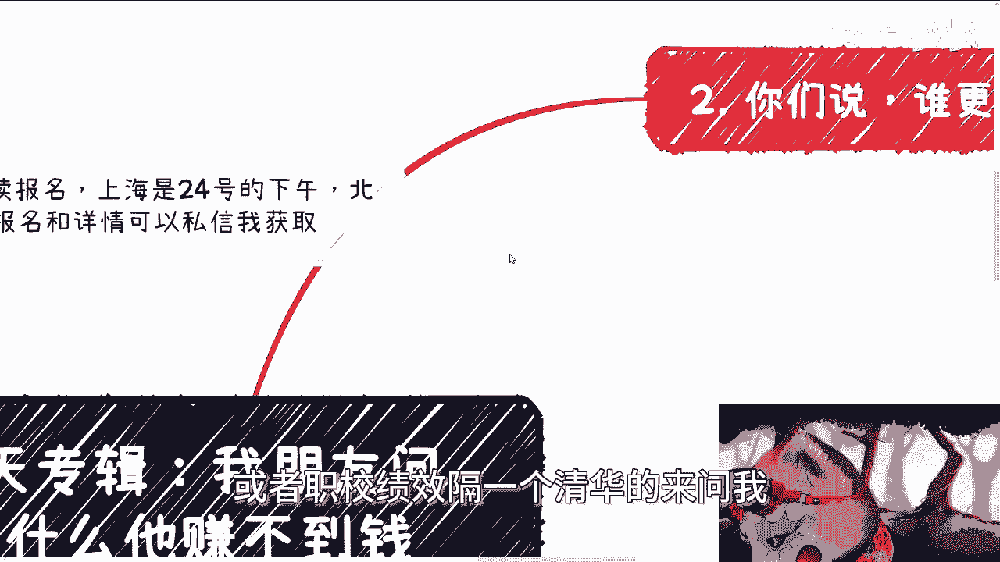

这与学历或背景无关。一个敢于适当“吹嘘”自己、展现自信的人，往往能抢占先机。包装不是欺骗，而是有策略地呈现自己的价值和潜力。

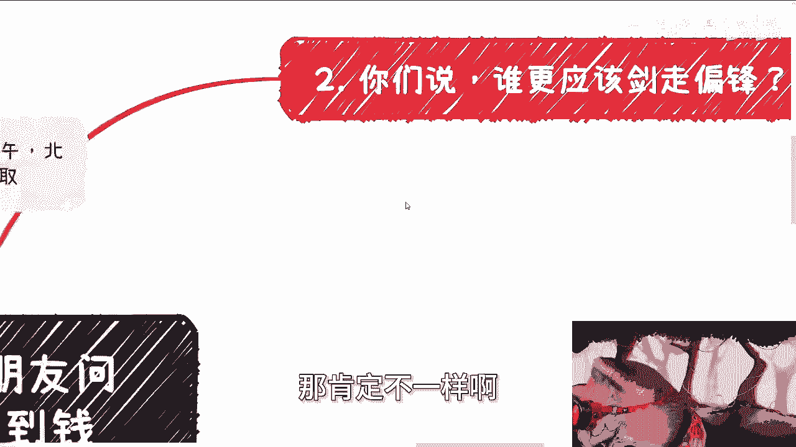

---

## 第三节：为何需要“剑走偏锋”？

认识到包装的重要性后，我们面临一个更根本的选择：是走安稳的路，还是冒险一搏？

许多人来自普通家庭，渴望通过努力获得安稳生活。但矛盾在于，如果你始终走在和大家一样的“独木桥”上，遵循常规路径，很难实现阶层的突破或财富的积累。

**核心观点**：最需要“剑走偏锋”的，恰恰是那些背景普通、渴望稳定的人。因为现有的路径无法提供你想要的突破，重复父辈的模式只会让下一代陷入同样的循环。

以下是需要考虑“剑走偏锋”的几种情况：

*   **背景普通**：家庭无法提供显著资源或关系。
*   **技能平平**：没有突出的软性或硬性技能。
*   **渴望改变**：不满足于现状，希望获得财富和更好的生活。

在这种情况下，寻求非常规路径（如结合线上引流与线下下沉市场、尝试新兴平台业务）反而是更务实的选择。指望通过“补学历、找好工作”这条拥挤的赛道来实现“稳定又赚钱”，在当前环境下已不切实际。

---

## 第四节：赚钱的本质：与环境和学历无关

当我们决定尝试新路径后，需要认清赚钱的本质。许多人将赚钱困难归咎于环境、城市或学历。

赚钱的本质是**滚雪球**，核心在于商业模式、抓住用户痛点以及实现商业闭环。这与你在哪个行业、哪个城市关系不大。

*   **关于出国**：如果一个人在熟悉的文化语言环境中都无法找到赚钱门道，指望在陌生的国度轻易成功是不现实的。外部环境可能带来新的挑战（如文化隔阂、语言壁垒），而非解决方案。
*   **关于学历**：学历可能与获取一份“打工”职位的起薪有微弱关联，但与“赚钱”能力基本无关。没有任何学校专业是专门教授“如何赚钱”的。赚钱能力来源于对商业的理解、思维模式和落地执行能力。

**核心认知**：`赚钱能力 ≠ 学历 ≠ 环境`。它等于`（商业模式 + 用户痛点洞察 + 执行落地）`。

---

## 第五节：“投机取巧”与“不劳而获”的误区

最后，我们需要澄清一个关键概念：很多人混淆了“投机取巧”和“不劳而获”。

所有人都想走捷径，这是人性。但“剑走偏锋”或“投机取巧”的商业模式，**依然需要付出巨大的劳动**。它只是指一种非主流的、可能更高效的赚钱方式。

例如，通过抖音公域流量引流至私域变现，这个模式听起来像条“捷径”。但它依然需要你精心运营账号、设计话术、维护客户关系、完成交付。很多人只想“复制粘贴”，不愿付出背后的艰辛，这实际期待的是“不劳而获”。

**核心区分**：
*   **投机取巧**：寻找并执行高效的商业模式，但**需要全力投入和运营**。
*   **不劳而获**：幻想不做任何努力就能复制他人的成果。

如果你复制了别人的模式却没赚到钱，问题往往在于你没有付出对应的“台下十年功”，没有消化和执行其中的核心细节。

---

## 总结与行动建议

本节课中，我们一起学习了关于“赚不到钱”的几个核心认知误区：

1.  **过度服务**可能贬低自身价值，应建立专业定价。
2.  **敢于包装**是获取机会的必要手段。
3.  **背景普通者更需“剑走偏锋”**，以打破常规循环。
4.  **赚钱能力**取决于商业思维与执行力，与环境、学历无关。
5.  **分清“投机取巧”（需努力）与“不劳而获”（是幻想）**。

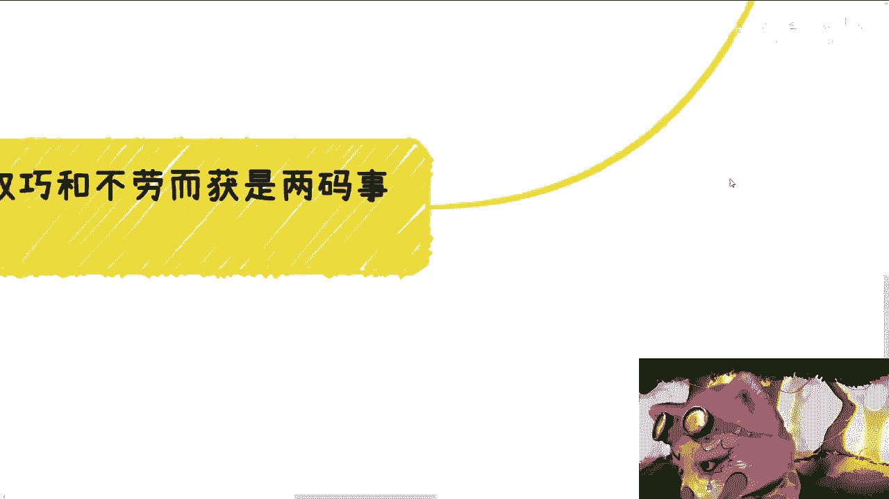

要改变现状，你需要：
*   **转换思维**：从“为别人想”转向“价值交换”。
*   **勇敢尝试**：在必要时进行自我包装，尝试非主流路径。
*   **聚焦核心**：深入研究一个领域的商业模式和用户痛点。
*   **全力投入**：认准方向后，付出扎实的努力去执行和优化。

改变始于认知，成于行动。希望本讲内容能为你打开新的思路。

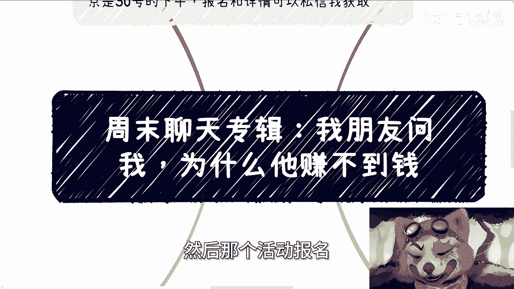

---
**附注**：上海与北京线下活动仍在报名中。如有具体的职业规划、商业规划或资源整合问题，可整理后进一步咨询。