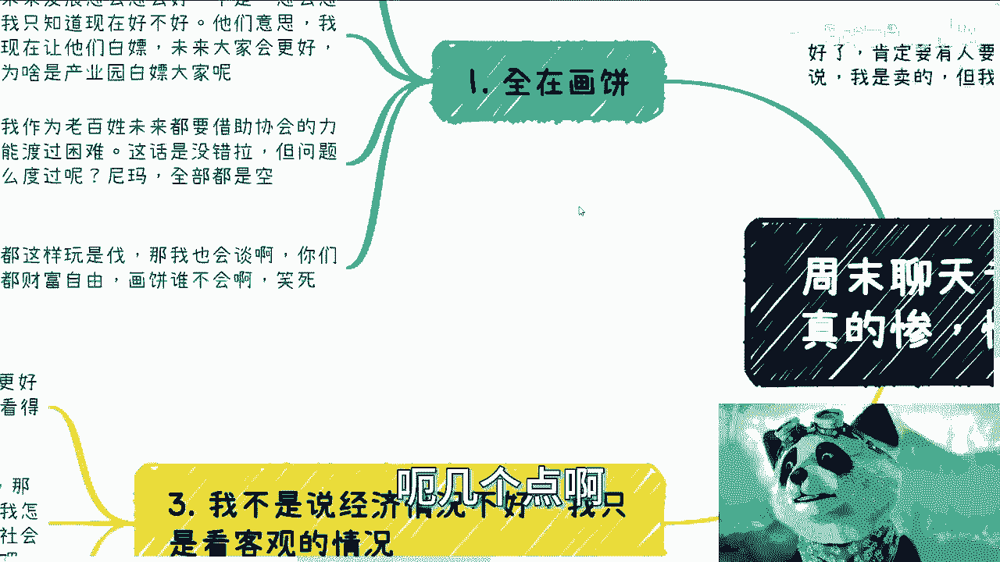
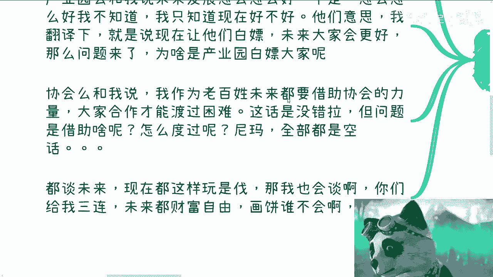
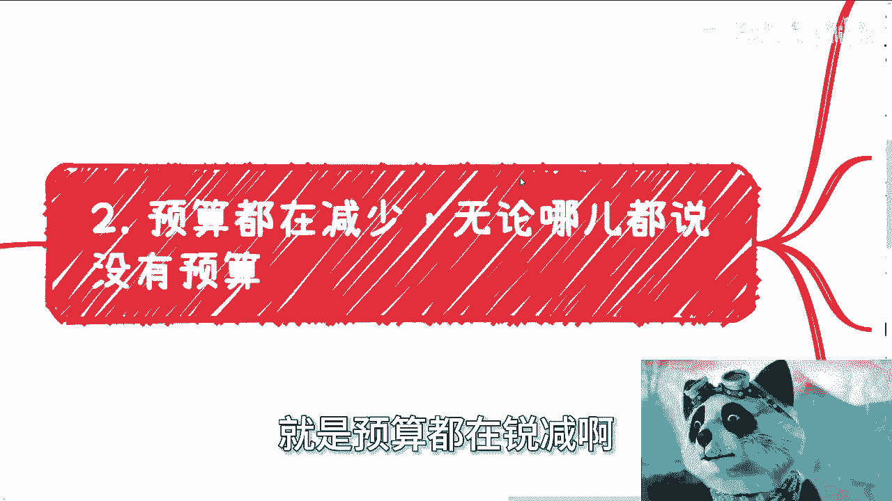
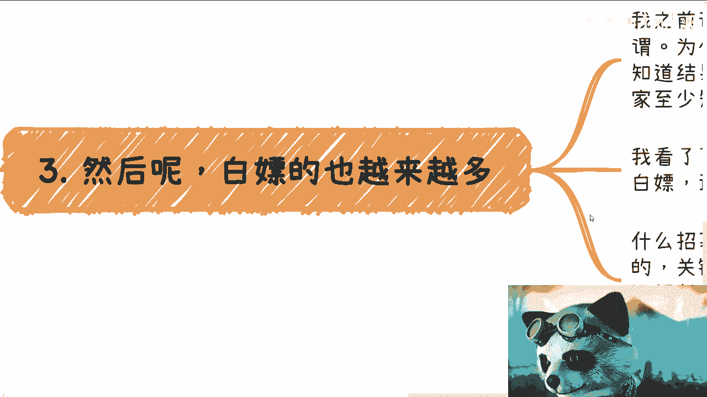
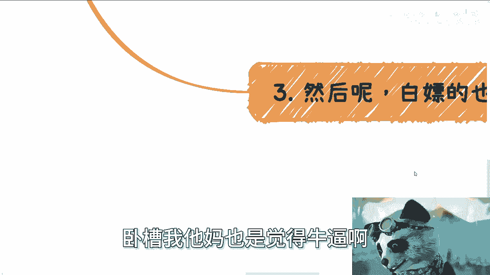
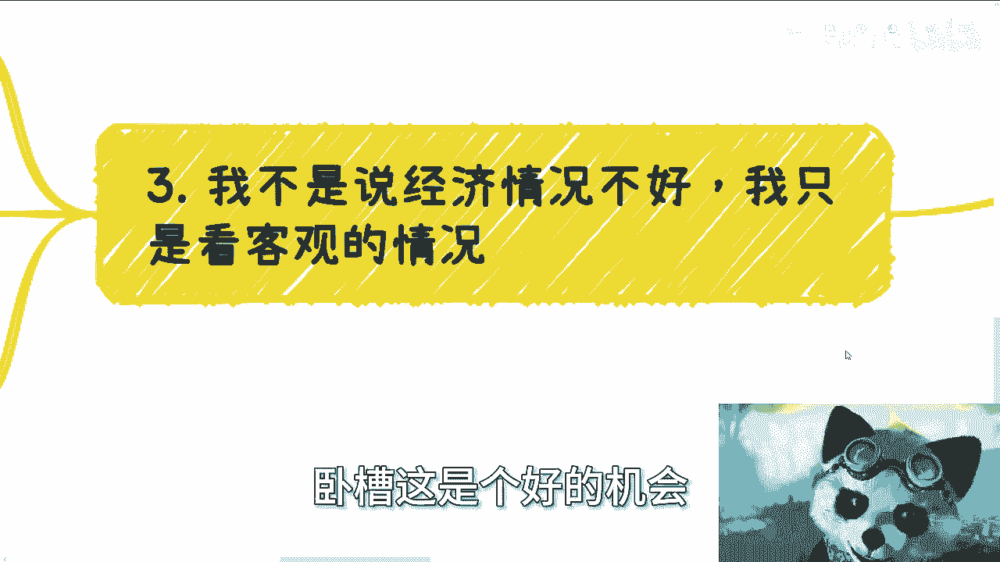

# 周末聊天专辑-最近聊下来-都蛮惨的---P1---赏味不足---BV1Ur421H72x

在本节课中，我们将基于近期的市场沟通与观察，分析当前就业、合作与商业环境中普遍存在的几个现象。我们将探讨“画饼文化”、预算紧缩、变相白嫖等问题的本质，并思考个人在复杂环境下的应对与发展策略。

---

## 概述：我们看到了什么？📊

近期与各行业人士沟通后，观察到几个普遍现象。这些现象并非贩卖焦虑，而是对客观情况的描述。了解这些情况，有助于我们更清醒地规划自己的道路。

---

## 现象一：普遍的“画饼”文化 🎨

上一节我们概述了整体观察，本节中我们来看看第一个具体现象：“画饼”文化盛行。无论是求职、合作还是项目招募，许多承诺都聚焦于模糊的未来，而非明确的当下。

以下是几种常见的“画饼”场景：

*   **求职与管培生**：雇主常承诺“3年后晋升为Leader”或“3年后薪资大幅上涨”，但拒绝将这些承诺写入具有法律效力的合同。其潜台词是：**未来承诺 = 无法兑现的空头支票**。
*   **产业园与项目合作**：合作方强调“未来前景广阔”，并暗示“现在共渡难关，未来不会忘记你”。其核心逻辑是：**用未来的不确定收益，换取当下的无偿或低价付出**。
*   **协会与社群**：某些组织声称“你未来总会需要我们的力量”，从而要求当下进行付出或合作。这相当于：**预设一个你未必需要的需求，并以此为由要求当前投入**。

这些模式的共同点是回避对当前价值的确认，转而描绘一个无法验证的美好未来。正如陈老师所言：“你有本事把35年后的承诺写在合同上。”如果无法落实，这些承诺就缺乏实际意义。

---

## 现象二：预算全面紧缩与价格战 💸

上一节我们讨论了“画饼”现象，本节中我们来看看与之紧密相关的现实：预算的普遍减少。当未来被描绘得天花乱坠时，当下的资源却在肉眼可见地收缩。

以下是预算紧缩的几个具体表现：

*   **差旅费用取消**：曾有合作方明确表示，因预算问题，今年不再邀请外地专家，原因是“差旅费付不起”。
*   **高校与企业项目预算锐减**：几年前价值数百万的项目，现在预算可能降至几十万甚至十几万。同时，在预算降低的情况下，甲方的要求反而更多、更严格。
*   **体制内降薪**：部分事业单位或相关岗位的朋友反馈，今年出现了强制降薪的情况。
*   **市场价格体系混乱**：市场陷入恶性“价格战”。例如，一项几年前报价5万的服务，现在可能有人报价5000。同时，部分甲方在采购时反而会乱开高价，这从侧面印证了各方资金链的紧张。

预算紧缩的核心驱动因素是“内卷”下的价格战，其恶性循环可以概括为：**预算减少 -> 供应商压价竞争 -> 服务质量潜在下降 -> 甲方收益减少 -> 进一步削减预算**。这种趋势对行业生态是一种损害。

---

## 现象三：“变种白嫖”合作模式 🤝

上一节我们看到了预算的紧张，本节中我们来看看一种由此衍生出的、对个体更不友好的合作模式：“变种白嫖”或“零成本扩张”模式。这种模式在各类“轻创业”或“合伙人”招募中尤为常见。

以下是这种模式的一个典型结构：

1.  **无底薪、无保障**：合作初期，参与者没有任何保底收入，纯粹“用爱发电”。
2.  **设置高门槛**：设定一个极高的业绩目标（例如：销售额达到XX万、粉丝增长到XX万），只有达到这个门槛，才能开始获得极低比例的分成。
3.  **信息不透明**：项目关键的供应链、流量来源、成本结构、真实利润率等信息对参与者完全不透明。
4.  **空头承诺**：用“未来可期”、“共同创业”等话术进行激励，但缺乏法律合同保障。

这种模式的本质是：**将经营风险和成本完全转嫁给参与者，平台方几乎零成本试错和扩张**。参与者如同在为一个自己一无所知的“黑箱”项目打白工。陈老师讽刺道：“按这个逻辑，我也可以说，沙龙人数低于50你们白干，超过50我才分你们5%。”

---

## 现象四：个人心态与机会认知 🧠

上一节我们剖析了不健康的合作模式，本节中我们回归到个人层面，探讨在当下环境中应有的心态。许多人感到迷茫，甚至将“进入大厂内卷”视为唯一出路，这是一种认知局限。

关键在于转变两种思维：

*   **拒绝“唯一出路”思维**：认为“除了去大厂卷，没别的出路”是自我设限。人类社会充满多样性，成功路径绝非一条。将自身命运完全寄托于单一组织（公司）的雇佣关系，意味着放弃了主动权。
*   **认清“机会所在”**：**经济下行期或调整期，往往是普通人切入市场、建立个人事业的最佳窗口期**。因为当市场繁荣、一切都好时，资源早已被先行者和资本占据，后来者门槛极高。当下的各种“乱象”和“不确定性”，恰恰留下了缝隙和机会。

等待环境“变好”再行动，很可能错失布局的时机。真正的机会属于那些能主动分析环境、整合资源、敢于为自己负责的人。

---

## 总结与行动建议 🚀

本节课中我们一起学习了近期市场观察到的四个核心现象：“画饼文化”、预算紧缩、“变种白嫖”模式以及需要调整的个人心态。

总结来说：
1.  对任何专注于描绘遥远未来而忽视当下兑现的承诺，保持警惕，要求**合同化、具体化**。
2.  认识到整体预算收缩是现状，在商业合作中需更加精打细算，并避免陷入恶性价格战。
3.  坚决识别并远离那些让您**零成本承担全部风险**的“合作”或“合伙人”模式。
4.  最根本的是，**将发展的主动权掌握在自己手中**。不要将人生局限于“打工-被裁”的循环，而是积极寻找和创造属于自己的价值变现路径。

当下的环境充满挑战，但也暗藏机遇。它迫使每个人更认真地思考自己的独特价值、资源网络和抗风险能力。建议整理您在职业发展、商业合作或个人规划中的具体问题，进行系统性的分析和规划。

---
**注**：本教程根据提供的对话内容整理，旨在提炼观点、分析现象，并提供结构化的思考框架。所有观点来源于原始材料，仅供参考与讨论。