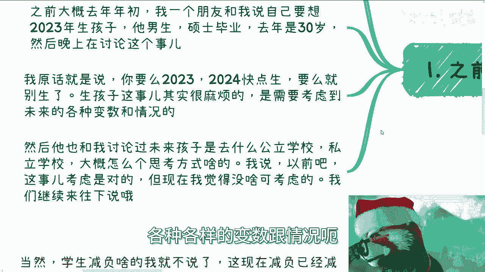

# 周末聊天专辑-聊聊孩子的教育发展---P1---赏味不足---BV1Wp421U7BG

在本节课中，我们将探讨关于生育决策与子女教育规划的几个核心议题。我们将分析生育时机、教育投入的本质以及当前教育环境的变化，旨在为面临相关决策的个体提供清晰的思考框架。

## 活动通知 📢

首先，我的着装风格已经很久没有出现了。我发现眼珠的显示效果似乎与以往不同。

上海与北京的活动日期现已确定，报名持续开放。上海活动定于本月24日，北京活动定于本月30日。北京场次因场地限制，预计有人数上限，名额可能相对较少。上海场次场地容量较大，大家可以尽量报名。

本次聊天主题其实我早有提及。无论你是有弟弟妹妹，还是自己仍处于成长阶段，都可以一同聆听，这并无太大关系。

## 生育决策的考量 🤔

上一节我们介绍了活动信息，本节中我们来看看关于生育的决策逻辑。

首先需要明确一个大前提：我认为疫情前与疫情后的社会环境存在显著差异，无论是网课普及还是教师态度，这些都是决定性因素。这一点我们稍后会详细讨论。

去年年初，我与一位朋友探讨过相关问题。他是一位30岁的硕士毕业生，计划在2023年生育。我当时的原话是：要么在2023年或2024年上半年尽快生育，要么就暂时不要生育。

原因是，生育是一件复杂的事情，需要综合考虑未来的各种变数与情况。当然，具体细节我们后面会展开。

我们也讨论了未来孩子就读公立或私立学校的思考方式。过去，无论从市重点、区重点还是公私立的维度去思考都没有太大问题，但现在情况已有所不同。这与我常和大家讨论的学历问题道理相通。

### 生育的核心考量因素

以下是关于生育决策需要权衡的几个关键点：

*   **女方年龄与健康**：这是最高优先级的考量。我身边经济条件优越的女性，越来越多选择冻卵。必须充分考虑对方的年龄、健康状况及生育条件。
*   **经济与时间支出**：需要对未来的金钱与时间投入进行预算和估算，包括孩子的生活费用和教育开支。这与评估未来风险类似。即使当前经济状况良好，例如年收入稳定在60万，也无法保证未来数年能持续如此。随着年龄增长，精力、健康都可能变化，不能简单地将现状平移到未来作为决策依据。因此，需要一套完善的预算和备选方案，而非盲目乐观预测。
*   **时机选择**：许多人倾向于在事业有一定基础或积蓄后再生育，但这种想法可能存在问题。因为当事业处于奋斗期或面临风口时，恰好也是孩子最需要照顾的幼儿期（1-5岁）。此时将面临艰难抉择。依赖父母照顾或聘请阿姨理论上可行，但对多数人而言实践起来困难重重。父母年事已高，隔代养育易产生矛盾；外聘人员也非单纯用钱就能完美解决的问题。

本质上，这并非一个仅靠金钱就能解决的课题。因此，较为理想的策略是：要么尽早生育，要么等待夫妻一方在资金和未来发展上真正成熟稳定后再考虑。当然，这必须优先考虑女性的生育年龄。

否则，在此过程中，家庭内部可能产生大量矛盾，相互指责，局面难以收拾。需要慎重考虑。

## 教育投入的本质 🎓

上一节我们探讨了生育时机，本节中我们来看看子女教育的理念。

关于教育，许多人的常见想法是提前干预，例如送孩子去寄宿学校、计划出国留学，或者报读各种培训班。

以下是我个人的观点，仅供参考：

我认为，在孩子形成相对成熟的三观，或对自我有基本认知（例如了解自己的兴趣、天性、性格）之前，过度的干预没有意义。

选择私立学校或出国留学本身没有问题。但除非你经济实力极其雄厚，能够通过支付高昂费用，让孩子从幼儿园到大学一路享受纯粹的精英化教育，否则意义不大。

如果只是选择一所不上不下的私立学校，这更像是为了满足家长自身的虚荣心，而非真正对孩子有益。这如同自我安慰“付了钱就有成果”。回顾我们自身的成长经历，过度的干涉真的带来了与投入成正比的实质性变化吗？当然，身边不乏因环境改变而成功的案例，但这属于幸存者偏差。孩子的成长受环境、资金投入及其自身天赋潜力的综合影响。

关键在于，你是否有足够的资金为孩子铺就一条连贯的道路？如果教育路径是断档的——例如幼儿园、小学接受精英教育，初高中却转入公立体系——不同阶段的教育风格和方式迥异，这种铺垫反而可能失去意义。

此外，过早寄宿或出于“锻炼孩子”的目的做出某些决定，往往体现了中国人观念中关于“锻炼与吃苦”的论调。但强加的锻炼和吃苦通常没有意义。这好比在职场，单纯在打工过程中“吃苦”和“锻炼”，并不直接等同于获得财富和成功，那只是辛苦钱。如果吃苦就能成功，那人人皆可致富。

过度的干预、锻炼和吃苦，除了可能留下心理创伤，并无其他作用。

## 疫情前后的教育环境变化 🌐

最后，我们来谈谈疫情前与疫情后的教育环境变化。虽然话题有些敏感，但仍可探讨。

学生减负等政策层面的话题暂且不提。单就疫情本身的影响而言，以上海地区我观察到的情况为例，最大变化在于：孩子对网课、网络及移动设备的依赖显著增加，网络交流也变得更为频繁。

与此同时，网络教学的普及也导致部分教师越来越松懈。因此，我朋友之前纠结的“是否要争取区重点、市重点学校”，在我看来意义已经不大。

在10年或15年前，学校层级之间的区别确实很大。但如今，正如学历泛滥一样，各类重点学校的教学质量能否与过去相比？更何况教师队伍水平参差不齐。重点与非重点学校之间的差距，已不像过去那样悬殊。

本质上，当前的教育竞争与社会竞争类似：除非有能力卷到各个学校的顶尖班级（如同社会中的前1%或5%），否则单纯追求进入某个区重点、市重点或省重点学校，其意义已经不大。这种趋势在未来只会更加明显。

真正的“干预”或“规划”应基于孩子具备足够认知和三观之后。它意味着在尊重孩子意见的基础上，提供资金支持，共同商讨发展方向（例如是否出国、选择何种专业），而非强行控制，要求孩子必须考公、考研或读博。后者是控制欲的体现，意味着孩子的人生不属于自己，而是属于父母。

其实，每次咨询谈到孩子教育，都会映射到你们与父母的关系。你们在父母眼中也是孩子。现在大部分人可能刚工作，不久将面临结婚、生育等一系列相似的人生课题。

当然，关于“是否要生育”这个根本问题，本课程不予讨论。这完全是个人的选择，就像讨论“现在是否要买房”一样，没有标准答案。

## 总结 📝

本节课中我们一起学习了关于生育与教育规划的多个维度。

我们首先分析了生育决策需要综合考量女性健康、经济可持续性与时机选择。接着，我们探讨了教育投入的本质，指出在孩-子形成稳定认知前，过度干预和“吃苦锻炼”可能收效甚微。最后，我们观察了疫情后教育环境的变化，指出单纯追求学校名气的意义正在减弱，真正的支持应建立在尊重孩子个体发展的基础上。

---
活动信息如上，有意参与者请继续私信我。此外，关于职业规划、商业规划、合同、股权分配，或是对某些项目感到困惑、不知如何规划未来职业路径的，可以整理好问题，进行付费咨询。

我聊的话题确实越来越广泛，但这些内容与大家的生活息息相关。能够这样坦诚交流的人可能不多。最后需要提醒，以上仅为我的个人观点。