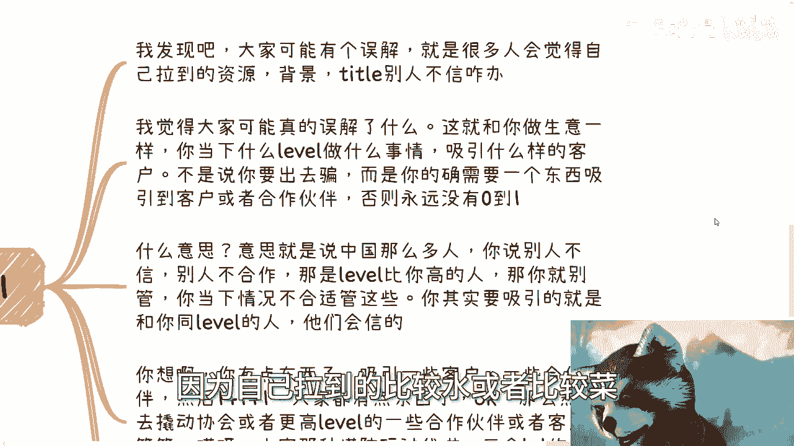
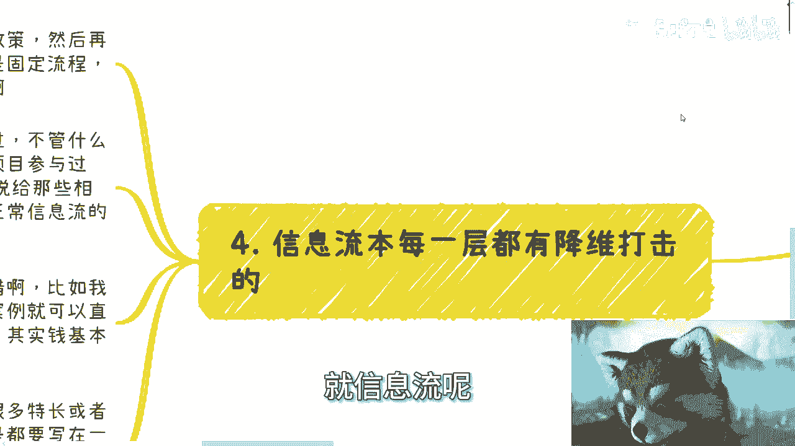

# 周末聊天专辑：适当的信息应该用在适合的地方 - P1 - 赏味不足 - BV18j421U7fY

好这个大家好，我们今天这里拜天呃，继续我们这个周末啊。

这个聊天专辑，那么今天这个内容主要讲的是适当的信息啊。

应该用在适当的地方呃，从题目来讲，可能大家不知道讲什么东西啊，没关系，就往下看啊，首先第一个啊就是说啊。

比如说很多这种政府的政策啊，呃我发现就是好多这个人啊，好多小伙伴看到一些政策呢就很高潮啊，当然这些高潮呢你看啊有的是真的高潮，有的是舆论高潮，就我们打比方说啊，比如说今天某某某地区出了一个什么政策啊。

出了个什么东西好，那么紧接着呢你就会发现一些群啊，一些朋友圈啊对吧，就各种各样的人都在转发，那么呃包括啊，就会就像我们以前有些线下活动啊，群里面也会啊，就是发出来说啊，大家讨论讨论啊。

但是呢政策就是政策这个东西啊，是这样子的，就是但凡以前合作过啊，看过了解过政策的，其实都懂，就是你看政策，这就好像你高度近视，看一个我就不说美女了，你高度近视看一个人他到底长什么样子，你不知道啊。

你必须戴上眼镜仔细看，你才你才能知道他什么样子，什么意思啊，意思就是说政策这个东西，首先它最大就两件事情啊，呃你比如说很多人看到自己地区出政策了对吧，很非常开心，这个是对的啊。

然后他说我到那个政府网站上面去，把这些政策详细的了解一下，这也是对的，没毛病，但是你单纯的去看，你说啊，我今天就把这个政策，就比如说你说我今天看了一遍，然后我得出了啊。

今天政策里面所提到的这个领域很有前景啊，比如说什么芯片啊对吧，或者说人工智能啊，或者什么东西啊，他说很有前景，这个你得不出来的，为什么，因为就像我们以前很多人问我，他说陈老师你觉得这个行业怎么样。

我说这行业好也好不好也好，好，你也赚，你也不一定赚，总有人赚不到钱，不好也总有人赚得盆满钵满，你怎么说呢对吧，所以说其实政策这个东西也是一样的，就是你戴眼镜去看了没有。

以及你觉得眼前是这个人到底长什么样子，你知不知道，所以说啊就是看政策无非就两点，第一点是你要去看这件事情，到底跟你有没有关系，你觉得你能不能赚钱，如果整体你了解下来对吧，你说你找不到切入点。

你也没法赚钱，那他妈他再好跟你软关系呢，对吧好，这是第一点，第二点是什么呢，就是你寻找跟看当中呢，你得去相关部门了解，你不去对接，不去了解啊，你政策再好再强没有用，为什么，因为政策本身啊。

你们就像我之前说的，就是政策本身它就是个模糊的东西，你要知道你怎么切，你一定是要下一步啊，跟相关部门，就是我们说跟那些相关部门的，你说小喽啰也好，谁也好，就真真切切的去对接，你才能明白你怎么切。

你说我今天就把这个government的这个，网站上的东西看一遍，你说我就知道怎么切了，不可能的啊，不管是你还是谁。

都不可能，啊好那么我们就说啊，就是说如果啊你上上下下了解下来，跟你都没关系，你只不过可能就被别人当做一个舆论高潮当中，一部分，那你高潮啥呢，对不对啊，你说啊我今天了解这个东西，这个东西好像很牛逼的吧。

怎么怎么样，没有用的啊，那么首先是第一点，第二点，比如说很多人和我说要去大城市对吧。

好，我们来讲啊，其实很多人跟我说，就跟我跟我说这种学历是一样的，就是一样的道理，就是问题是你说你去大城市干什么。

你知道吗，你不知道的话，你去了干嘛呢对吧，那很多人要说了啊，我去大城市有更多的机会，更多工作可能性，更多的人们，尼玛这他妈就是屁话，你仔细看这些话，这些话有用吗，啊这些屁话除了你PUA。

你自己毫无作用啊，啊我你要我来问，我就问啊，更多机会什么机会，你知道吗，什么机会更多的工作可能性，什么可能性，怎么就更多的可能性，更多的人脉，人脉哪来的，天上掉下来吗，哦今天你进了上海结界。

天上就掉人脉了对吧，你比如说我坦白说啊，我说说多少人抱着这么一个想法来大城市，你比如说不管是北上广深哪个地方啊，我就问多少人在大城市自己社交过，去参加过酒会，去蹦过迪吧，去各种部门，各种协会去认识。

去交流过有吗，你自己不去哪里来的人脉啊，我奇了怪了，你难道跟我说哦，因为我在大城市的公司工作，公司里面有所谓的人脉，公司里面能叫人脉吗，啊你你真的你合作过你就知道了，人家叫人脉吗。

能他妈不在背后戳你就不错了对吧，而且啊还有不少人跟我说，他说成了啥，我已经查到了一些政策啊，但是呢我去约一些部门或者相应的协会，或者来说这个地方啊，别人不待见我。

我真的我有时候跟他们聊的时候，我就觉得就是你们是不是有什么误会，就是什么意思啊，就是我们退1万步来讲，你我我们是纳税人，我们是老百姓，你所在的是什么国家，你仔细想想看啊。

啊大哥大姐理应应该是他们为我们服务啊，哦你怎么会觉得，就是说为什么他们会不待见我们，你知道吗，我之前咨询的时候，我就跟他们说，越是正规的地方，他越是应该待见你，因为这是你的权利，你有正当的理由。

你沟通业务，你了解业务，对方但凡拒绝，你可以理直气壮去投诉啊对吧，我说的这种投诉不是说大家什么啊，有的没的去举报对吧，你有正当的理由投诉啊，哦我作为纳税人，我作为人人民百姓，我怎么不能了解东西呢。

那我就觉得奇了怪了，唉很多人就会表现给我一种什么感觉，就说就说哎呀，张老师这种相关部门或者什么地方，是不是不是不是我们能够去沟通的，你怎么不能沟通的，大哥，对吧好，那么我们扯远了啊，就比如说去大城市呢。

很多时候用处是什么，其实是这样子的，我总结下来啊，用的最多的就是因为大城市相对就是1~5线，中国的这个城市发展，它是有一定滞后性的，就是大城市的政策往往是有前瞻性的，然后很多下沉市场呢。

它是大城市的这种政策的这种那个严，就是滞后性，那么你可以在大城市利用一部分的政策，或者说做的案例，然后在一两年或两三年后再去下沉市场，下沉的城市去占据那边的红利。

这个其实是大城市的意义，你们懂啊，就不是说什么什么用那些空的话来套你啊。

那么第三点好，我们来说第三点，第三点就是说到今天为止。

很多人不是还在操心0~1嘛啊，我发现啊，我觉得大家可能有的真的有什么误解啊，就是说很多人觉得，他觉得最大的问题就是自己拉得到资源背景title，但是别人不信，因为自己拉到的比较水或者比较菜。

对吧好，那我真跟你们讲，我觉得你们可能真的有什么误解，就是这就跟你做生意是一样的，你当下什么label就做什么事情，就吸引什么样的客户，不是说你要出去骗啊，而是说你的确需要一些东西吸引。

吸引到最基础的第一批的客户或者合作伙伴嘛，对不对，那么否则所以否则永远没有0~1了，对吧好，什么意思，意思就是说中国这么多人，你说别人不信别人不合作，那我说直白一点，这些人就不是你的客户。

就不是你的受众用户，你管他干嘛对吧，你要管的就是说，你其实要吸引的就是跟你同level的人，我告诉你们，他们会信的，为什么，因为你告诉我，今天你做一件事情，中国14亿人，你碰到一个人跟他讲了，他都不信。

你觉得会不对吧，我一直强调这一点，中国老百姓要是有这些判断能力，有这些觉悟，那大家今天就不会是这样子的啊，我跟你说啊，你想啊，你有点东西吸引哪些客户，一些合作伙伴，然后1+1加1+1加一。

大家这个时候都有点东西了，OK那么然后你用大家都有的这些东西，组合起来之后，去撬动更高的，比如说协会呀，或者说更高一些内部的合作伙伴或者客户，那么你们才能往前走，你否则怎么走啊是吧，我跟你讲。

你就像玩那种塔防一样的，三个LV1的塔能够变成一个LV2的塔，三个LV2的塔能变成三个能变成一个LV3的塔，这不就这个意思吗，你永远想着你说我现在LV1LV100的boss怎么打。

我，你告诉我怎么打，你不就卡在那了吗，啊，这游戏还怎么打。

对吧啊。

然后我们再来看啊，就是呃最后一点就是信息流呢。

其实每一层都是降维打击，你们心里得有个这个概念，就是这句话，像我们就做方案啊，就是我发现很多人其实不知道怎么做方案，当然没做过对吧，就是我跟你讲，你做方案啊，一开始一定是先拿中央的政策。

然后再去放审相关的政策，然后再去放地方政策，这是一个固定流程，为什么，因为这是符合中国的，从上到下的规则的降维打击，就是这就是这个国家的规则，那你就要否你知道吗，就有很多人可能会觉得哎呀。

为什么现在好像很多人上去讲PPT，讲什么东西，为什么上来讲政策，废话讲，就是大家的叫什么，就是共通的这个共识，你不讲就说明你不懂啊，不是说明你牛逼，不是说明你不懂啊，那么就好像你跟一些好的学校。

好的大企业合作过，不管怎么合作啊，哪怕是一种很很远亲的这种合作啊，对吧，就是说你可以说合作，然后呢你要把这个合作写出来的时候，是为了写给那些相对中下游或者，中小微企业看的。

因为这个是正常信息流的一种降维打击啊，当然其实如果你没有吧，我觉得你可以借，就是我以前也说过，我说你要是没有对吧，你跟有的那些公司去签战略合作，那当然你又要问了，他说那为什么别人愿意签证，没有合作呢。

对不对，好他要不愿意签，你给些钱也行啊，你你就跟他说，我跟你签个合作，我要借用你以前的一些案例对吧，那么对方会评估的，只要不涉及到侵权，只要不涉及到一些敏感信息，借给你一些案例对吧。

或者说你意思就是因为你接他案例很简单，你是没有实施能力的嘛，对不对，那么万一这个case成了，其实也是需要你借安利的这一方，来给你做实施的，那对他来讲也不吃亏呀，对不对。

像他相当于就是说收你一笔钱给你个案例，你帮他兼职做销售有什么不好的啊，所以说其实啊我跟你们讲找工作也是一样的，你比如说你这个人对吧，以前打个比方，比如说什么学生会也做过啊，然后什么什么就业办也做过对吧。

然后也也做过什么帮忙做过什么活动对吧，怎么样啊，比如说你做过很多事情，但是你一定不是，把所有事情都写在一个简历上吧，你把所有东西都写在一个简历上，那你就是个四不像啊，没人能抓得到你到底会干嘛对吧。

你就像你跟别人介绍，我就发现大家做事情就非常的死板，没有很多人问我，他说哎张老师，我跟别人介绍我怎么介绍，我说大哥见人说人话，见鬼说鬼话对吧，你今天去什么活动，说什么话，你别今天什么跑到金融那边。

你也说哎哎那个谁谁谁啊，你好，我是一个互联网创业人员，谁你啊，对不对，就你总归有偏向性的，你就像我给政府做咨询也是一样的，我我的客户有的是互联网，有的是金融，有的是传统工业，我不可能一套话术的。

我总归多套话术，但是问题是我不管什么话术，我的核心是不变的，就是你你想对我来讲，不管我什么话说，我去培训的，我去咨询的都是数字经济，对不对，但是你话术要编，你不要让别人觉得哦，今天陈老师做东西给我们办。

就是八竿子打不着边的，那你还怎么往下聊啊，对不对，所以说你看啊，你应聘开发的简历上，你可以只写A应聘运营的简历上，你可以只写B应聘销售的简历上，你可以只写C。

你所有的信息都是要有明确的目的性去写的。

你们能明白吗，啊所以我就发现啊。

就是就是其实啊我不知道你们有没有这种感觉，就是其实很多人手上的牌已经够了，而且这些牌也可以打，但是往往他们自己吧就不知道怎么去排列，组合去打，然后呢就是就是就是他也不会灵活的变通。

就是就感觉就是说我比如说我手上一个，也就是怎么说呢，比如说啊111个对子吧对吧，一套比如说33445对吧，或者说是一个我不知道你们怎么教的，他叫上海，叫什么叫叫俘虏对吧，叫什么，就是你334455。

你可以打一对三，你也可以打一对四，你也可以一对三一对四一起打，你也可以一对四一对五一起打，你不是每次他妈的345连在一起一起打的呀，对不对，你打打牌，你得灵活的打，你还可以3451个个出，你看情况嘛。

对不对啊，就我我跟你们讲，我真的不是说我要去贬低应试教育，有很多人很多人你知道吗，评论区在那边说啊，说说好像陈老师贬低应试教育或者怎么样，我真不是贬低应试教育，是应试教育的人，你说说看这个大众出来的。

这思维已经什么定式了，你说20几岁思维就这样定势以后还怎么发展，对吧啊行，那就这么着啊，明天要上班了，大家早点休息嗯，然后反正有什么呃，职业好吧，商业啊，包括合同啊，包括这个股权啊，包括各种各样的。

反正你们想了解的或者怎么样，反正你们可以整理好。

