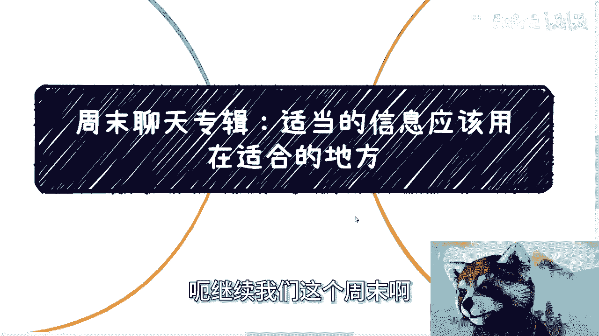

# 课程01：适当的信息用在适当的地方 📚




在本节课中，我们将学习如何有效地筛选、理解和运用信息，避免被无效信息干扰，并利用信息差来创造机会。核心在于理解信息的“降维打击”原理，并学会根据不同的目标和对象，灵活地组织和呈现信息。

---


## 1. 如何正确看待政策信息 📄

上一节我们介绍了课程主题，本节中我们来看看如何正确看待政策信息。

很多人看到政府发布新政策时会非常兴奋，但关键在于如何解读。政策本身是模糊的，就像高度近视的人看不清事物一样。单纯阅读政策文本，无法得出“某个领域有前景”的结论。

解读政策的核心在于两点：

1.  **评估关联性**：分析政策内容是否与你自身相关，以及你能否从中找到切入点并获利。如果找不到关联点，政策再好也与你无关。
2.  **主动对接**：政策是指导性的，具体如何实施需要与相关部门进行实际对接和沟通。仅靠阅读无法了解具体操作路径。

**核心公式**：
`有效利用政策 = 评估自身关联性 + 主动与相关部门对接`

如果经过评估和对接，发现政策与你无关，那么你的兴奋可能只是被舆论裹挟的“虚假高潮”。


---


## 2. 去大城市的意义与误区 🏙️


上一节我们讨论了政策解读，本节中我们来看看关于“去大城市”的常见误区。


许多人认为去大城市意味着“更多机会、更多人脉”，但这些是空洞的概念。关键在于明确去大城市的具体目的。

以下是关于大城市意义的常见误区与真相：

*   **误区**：大城市机会多、人脉广。
*   **真相**：机会和人脉不会自动降临，需要你主动去社交、参加活动、对接资源才能获得。

大城市真正的价值在于其**前瞻性**。大城市的政策和发展模式往往领先于下沉市场。你可以利用这一点，在大城市学习经验、做出案例，然后在一两年后将这些经验应用到下沉城市，抢占那里的发展红利。


**核心概念**：利用大城市的**信息与模式滞后差**，进行跨地域套利。

---

## 3. 解决“从0到1”的启动问题 🚀

上一节我们澄清了去大城市的目的，本节中我们来探讨如何解决事业起步阶段“从0到1”的难题。


许多人卡在起步阶段，认为问题在于自己的资源或背景不够有说服力，别人不信。这是一种误解。


关键在于：**你当下的层级（Label）决定了你能吸引什么样的初始客户或伙伴**。你的目标不是让所有人相信你，而是吸引与你同层级、愿意相信你的人进行合作。

这个过程类似于游戏中的升级机制：


```
初始状态：聚集几个 Level 1 的伙伴
升级操作：Level 1 + Level 1 + Level 1 -> 组合成更强的 Level 2 单元
持续迭代：用 Level 2 的单元去吸引或组合成 Level 3 的资源
```

不要总想着用 Level 1 的状态去打动 Level 100 的对象。先通过同层级的合作积累起最初的资本和案例，才能逐步撬动更高级别的资源。

---

## 4. 信息的“降维打击”与灵活运用 ⚡


上一节我们学习了启动策略，本节中我们来看看信息运用的高级原则——降维打击。


在信息传递中，高层级的信息对低层级具有天然的“降维打击”优势。理解并运用这一点至关重要。


例如，在制作方案（特别是面向政府或大企业的方案）时，标准的流程是：
1.  引用中央政策
2.  引用省级政策
3.  引用地方政策

这个流程符合国家自上而下的规则体系，能建立共识和专业感。同样，与大公司、知名机构的合作经历，对于中小微企业来说就是一种信息降维打击。

如果你自身缺乏这样的案例，可以考虑“借用”。例如，与拥有案例的公司签订战略合作协议，支付一定费用以获得其案例的使用权（需确保合法合规）。这相当于你为其充当销售渠道，是双赢的做法。

---

## 5. 信息的针对性组织与表达 🎯

上一节我们了解了信息降维打击的概念，本节中我们学习如何根据目标组织和表达信息。

信息并非一成不变，应根据不同的对象和目的进行针对性组织和表达。就像打牌，要根据牌局灵活组合出手中的牌，而不是每次都按固定顺序出牌。

以下是具体应用场景：

*   **制作简历**：应聘开发岗位时，重点突出项目A；应聘运营岗位时，重点突出经历B；应聘销售岗位时，则强调案例C。一份简历包罗万象反而会让人抓不住重点。
*   **个人介绍**：面对金融圈人士、互联网从业者或政府人员，应采用不同的话术和侧重点，但核心能力与业务主线保持不变。目的是让对方觉得你的专业与他们的领域高度相关。

**核心原则**：所有信息的组织和呈现都应有**明确的目的性**。你需要灵活地排列组合你手中的“牌”（即你的经历、资源和信息），以应对不同的局面。


很多人并非资源不足，而是思维固化，不懂得如何灵活变通地运用已有资源。


---

## 总结 📝

本节课我们一起学习了“适当的信息用在适当的地方”这一核心思维。

1.  **解读政策**要超越文本，评估关联并主动对接。
2.  **看待城市选择**要超越空洞口号，利用其前瞻性创造滞后差红利。
3.  **解决启动问题**要立足当下层级，通过同层级合作积累升级。
4.  **运用信息**要理解“降维打击”规则，并学会“借用”高阶信息。
5.  **组织信息**要极具目的性，像打牌一样灵活组合，针对不同对象呈现不同侧面。


关键在于打破思维定式，根据目标灵活、精准地筛选、加工和输出信息，让信息真正为你所用。