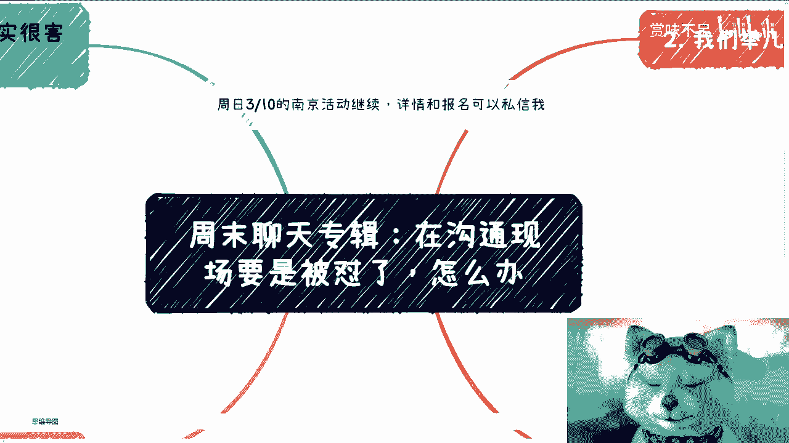
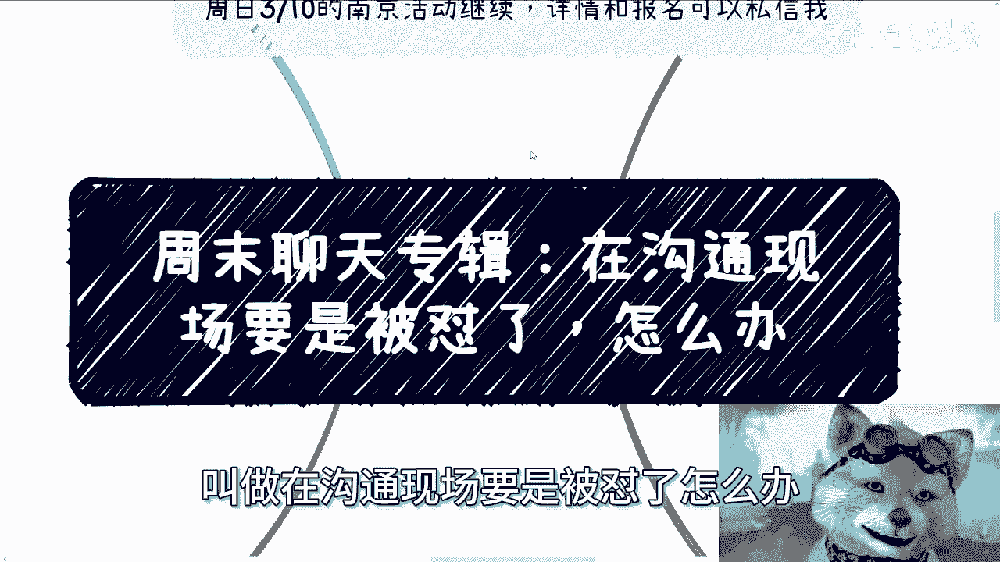
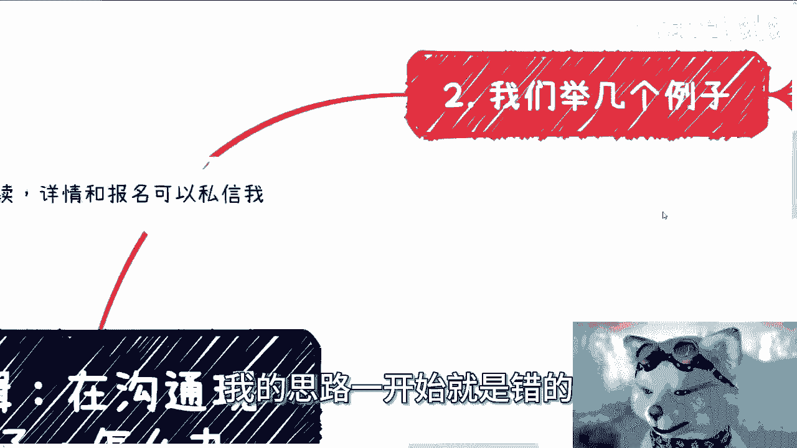
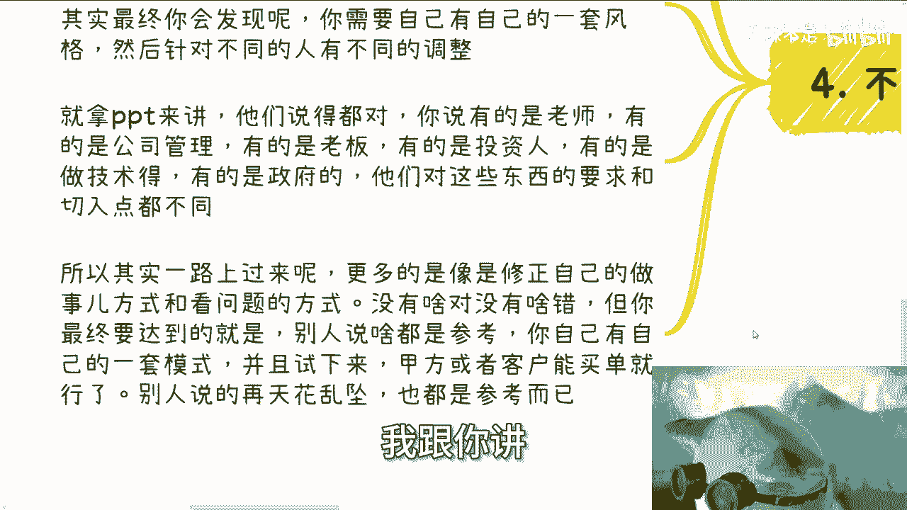

# 周末聊天专辑：在沟通现场要是被怼了，怎么办 - P1 - 赏味不足 - BV1YZ42187Eh

好大家好啊，这个今天又到周末了是吧。

嗯到了我们这个聊天专辑啊，首先3月10号就后天，这个南京活动继续报名好吧，然后详情的话可以看我B站动态或者私信我。

然后也可以私信我报名啊，那么今天聊天的这个专题呢叫做在沟通现场。

要是被怼了怎么办，对吧啊对吧哈哈，很多人可能也很关心对吧。

我跟你讲啊，大家在沟通的时候其实很怕被怼，我知道的啊，就首先啊就跟失败是一样的，就被怼是正常的，你不被怼意味着什么，意味着没认真听你东西啊对吧，你说你在那边讲，我不管什么场合，你不被怼，你脑残就这么说。

你今天讲一个东西，你不被怼，现场人都很赞同你，这个大概率我不是说不可能出现，这大概率不会发生在你们现在身上对吧，那如果发生在你们身上，就说明下面没有更多，更多的是没有人认真去听啊，那么我觉得正常来讲呢。

越正规越正式的场合呢，其实不太会有人直接怼你的，而且连拐弯抹角来说，你的都很少，阴阳怪气也很少，为什么呢，因为这种比较正式场合，我觉得大家情商一般都很高啊，他不会说因为为了去怼你，或者为了去阴阳怪气。

你给别人留下不好的印象，所谓得不偿失嘛对吧，没必要，那么很多怼的呢，另外一方面来讲啊，往往也不是为了怼你啊，就是当然啊我这地方也说一句，如果你的确太，比如说你在上面讲东西的确是啊。

让别人觉得太他妈假大空了对吧，太他妈的瞎他妈扯淡了对吧，那那那那没办法啊，那如果是正常沟通呢，我觉得很多怼啊往往是因为对方的无知，或者说对方可能就是说他自己脑子里面，也不是很清楚他的逻辑啊。

啊或者说他就是故意阴阳怪气的啊，那么这事呢在我悠久的这个这个政企历史呃，咨询历史当中啊，呃很多多的铺天盖地啊，而且因为你为什么，因为毕竟世界上什么人都有啊，就如我之前说的，失败是一样的，失败是常态。

你要跟我说，你一直顺风顺水，那他妈才叫奇迹啊，那他妈叫奇葩，叫他妈奇行种啊，其实核心啊我觉得有几个判断依据，就是几个点，你可以自己考虑一下，第一呢就是是不是你自己的场子啊，第二你是不是主角啊。

第三你有没有必要跟对方去沟通，就是当他怼你的时候，你有没有必要去沟通啊，我不是说一定回怼啊，第四就是要掌握主动权啊，那么就像我之前有一期专门说沟通一样，就是你的思路很重要啊，并不是什么都要跟着对方走的。

就比如说我随便打个比方，比如说我今天就怼你，我说地球他妈的是扁的，地球是个2D的，那怎么地啊，你跟着我思路，你说不对的啊，你这个2D的说法是不对的啊，然后就说啊这个东西怎么样怎么样。

你不要跟着我思路来啊，因为很多时候我的思路一开始就是错的。

你知道吗，就下面很多人跟你问问题的时候，他可能一开始的原图就不对。

那你跟着他来个屁啊，那么第二啊，我们来举个例，举个例子，记住记住啊，这个社会上只要出来混的，都是为了赚钱的，你说他有没有别的目的，也许有，那不好意思，可能是，千千千千万万万万分之0。00001啊。

我基本上为了我自己的，怎么说呢，为了我做事情效率，我就一刀切了，我认为都是出来赚钱的，你但凡不是赚钱的，OK跟我没有关系，滚对吧，那么嗯大家出来是为了赚钱，不是为了出来委屈自己或者跪舔谁的。

我跟你讲都一样的，你要委屈自己，我跟你讲，你就找地方打工，你可以委屈，你，完全可以吃得苦中苦啊，做的苦上人对吧，获得更加苦的经验啊，就这么简单啊，你想去你想去委屈，请你去打工啊。

那么有的合作方或者合伙人呢跟你沟通，他其实就是阴阳怪气，或者各种藏着掖着，比如说关系找好了，合作方找好了，品牌方找好了，我比如说啊，我跟他们说，我说哎大家至少见一面吧，你比如说合作方找好了。

我们至少见一面对吧，你不能说我面都没见过啊，然后对方推三阻四啊，然后怎么样啊，这个找各种理由，反正就是不能见对吧，怎么样，我跟你讲啊，这种东西简单不用怼，就他妈根本不需要合作，怼什么东西呢对吧。

那我跟你们讲啊，很多人跟我讲，他们就是在做这个商业业务，或者在创业的时候碰到的问题，我就跟他讲，我说这种合作的人，或者你现在这种合伙人，他压根就是从诚意上面就没有任何一丝诚意，对吧。

而且也没有任何赚钱的这种思维，你有什么好合作的，你合作只会为自己挖坑，怎么了，在地球上的死光了啊对吧，你比如说有的一些小的会议上，可能他们会觉得你们年轻或者小公司。

就你们可能可能可能刚创业的公司就容易拿捏，哎呦，我跟你讲都一样的，我当年刚毕业出来做政企咨询，我被怼的多了好吧，他们就喜欢东问西问，然后呢我觉得是这样子的，你态度其实可以放明确。

我们就是就我这边不是有个打引号的嘛对吧，我的意思就是说如果是我的话，我可能会这么说，我说我们都是以赚钱为主的，大家只讨论赚钱的事，如果来说比如说他问问的有的没的嘛。

我就会跟他说这种东西可能就是一些八卦啊，就是一些无关紧要的，我说你要是比较关心这种无关紧要或者八卦，我们可以从后面再谈对吧，就是说你不要去跟着他，他比如说问你怎么样怎样哦，你还真回答他不用啊。

你就跟他说啊，我就是赚钱为准的，你说的这些东西跟赚钱没有关系对吧，就像之前有很多人，还有些小伙伴跟我说什么什么谈的时候，人家问他什么什么公司什么时候成立的，然后公司什么什么呃，这里面学历分布怎么样。

那你要我说啊，我就会说，那这个东西跟我们的K4有什么关系吗，如果没有关系的话，我觉得我们可以后面再来讨论这个问题，对不对，就是说他会问这种有的没的，说难听点，他不是来找茬的，就说明是纯坏，就他妈纯。

那有什么好沟通的呢，你就跟他态度不表明清楚，如果他再拎不清，不用合作，怎么啦，我还是那句话怎么了，世界上他妈的中国这片土地上能合作的死光了，对不对啊，然后其实逻辑很简单，就是对方但凡懂得商业。

它出来是为了赚钱的，很资本家他会有空来跟你八卦吧啦，就是你们真正去谈东西，大家见面目的是什么，就是赚钱，没有别的啦，他但凡在明确赚钱之前跟你在那边搞，有的没的都他妈是，就这么简单，我跟你们讲。

你们要是在那个没有明确能不能赚钱，没有明确自己分多少钱，没有明确多少周期，自己能拿到这笔钱，你们在跟别人打，你们也一样的啊，然后第三我已经碰到问题很多，比如说在企业内训上问我，他说赵老师。

你说的这个主题跟我们之前啊，这跟呃这个中介，因为我毕竟也是通过中介的嘛，他说我们这个，你说这个主题跟我们这个找的中介需求不一样，我们能不能换个主题，那我就问你们，如果你是我，你怎么弄坏你。

你当场比如说现在50多个人，然后在一家企业内部，比如说因为我以前做的基本上都是银行，然后阿里巴巴百度这种公司嘛，你在里面你可能就慌了对吧，你下面这么多人看着你，你怎么办换吗，换怎么换，PPT都没有。

怎么换，干空奖吗，不行的呀，对了还是说你硬讲，还是说你你硬着头皮最终讲完，对方给你个差评都不行的呀，对不对，一样的呀，那你说怎么办，很简单啊，你首先第一点你不用去解释为什么不一样，你要跟他讲的是。

我讲的内容跟你的需求是一样的，你觉得不一样，是因为你的理解和你现在的认知可能有偏差哦，就是说你要帮他修正一下他的认知，告诉他你讲的东西跟你的需求是一样的，因为很多下面的人他的确不懂啊对吧。

就是你觉得你准备的东西，跟他们的需求是一样的，但他不觉得因为什么，因为他所认知没有你强了，那我就说嘛，下面要是有人认知比你强，那还是你给他们讲吗，啊诶奇了怪了对吧啊，然后你比如说在大会上。

有的人问问一些敏感信息或者121长串问题，什么什么爱爱张老师，你看我有五个问题啊，第一个叭叭叭讲完，我的，我跟你讲，他讲到第五个，前面三个问题是啥，我都不记得啊，这个时候看你自己。

反正对我来讲我是无所谓的，你呢可能得考虑到你自己的工作，你的屁股啊，你的这个乌纱帽对吧，那么关于一连串一长串问题呢，我觉得你就直接让他私下礼物，别浪费大家时间，或者你就跟他讲清楚，我就给你30秒。

我问不了下一个，对不对，你你你现场比如说100个人哦，你讲30秒，就他妈一个人30秒浪费多少时间啊，没意义的，你要有大局观，你不要让他牵着鼻子走，因为你是你是一个主角啊，那么还有可能那种呢。

就是说问出来是你的知识盲区很正常嘛，每个人都有都有不懂的地方嘛对吧，那对方可能做的业务多了去了啊，他他比如说有的是医疗啊，有的农业啊，有的可能做大数据啊，做隐私保护啊，对吧啊。

往往他是按照自己认知来提问的，但是对你来讲呢，可能是致盲区，而且你不像我做咨询做这么多年了，什么问题都碰到过，你可能就说得要慢慢积累嘛对吧，那么要我说呢，最保险的你该说不知道，你就不知道没什么问题的。

这就跟我跟你们说，你们去面试是一样的，如果问到一些问题，你真不知道，你不要去硬说，因为我跟你讲，你面试的时候硬说还无所谓，你在这种场合公开的场合，你要去硬说啊，我跟你讲，你不知道下面有多少人。

因为你不知道下面的人的认知怎么样，你往往如果你硬说，就是下面有些人是在某个领域比较专业的，他会觉得你是，你懂吗，就是你在那边瞎瞎他妈扯的时候，人你只要触碰到别人的专业领域，我跟你讲。

你一定会让别人觉得你的，因为你不要去跟人家专业领域的人去碰啊，你碰不过他的呀，对不对，而且更何况你自己不，你明明不清楚，你要是清楚就算了哦，那么呃很多时候呢问啊呃呃呃呃，另外一个点就是我刚刚说的。

就是说很多时候呢问题的源头它就不对，就是说你跟着这个问题去思考，他就不行，比如说我以前在讲区块链的时候，他们就问我，他说哎陈老师去中心化的技术怎么替代，中心化技术要命了，你让我怎么回答，我是在跟你解释。

去中心化技术怎么替代中心化技术吗，我但凡这么解释，我跟你讲，我他妈就掉坑里了，为什么，因为中国这片土地上不是这么玩的呀，谁跟你们说过要替代的了啊，政府从头到尾做的，我跟你们讲。

在央企国企银行都是双层架构的，谁他妈说过替代对吧，所以说这种问题我跟你讲很多的，但是你不要掉入他们的圈套，不管他是有意的还是无意的，但是你会发现这个问题的源头他妈就不对，你但凡跟着他去走。

我跟你讲这条路只会越走越歪，那么第四点就是我们最后话又说回来啊。

就说人呢是需要成长的，很多时候呢别人怼你呢是怼的对的，你是需要反思的，因为没有办法，人是成长的，你不可能说我怼我都对吧，那不行啊，你除非说你已经练成了一套神功对吧，你说我已经自己有一套自己的方法论。

并且呢我在企业端，政府端，各种端我都去试验过了，那你心有胸有成竹，那没问题，但是但凡你现在还没有一个成熟的方法论，你还是需要多听听外面的人的建议，当然我说的只是参考，不是说外面人说啥是啥啊。

你就像我做PPT，我就告诉你们，我这一路走过来，卧槽被多少人怼过啊，啊他可以怼的，你我跟你讲，他给你怼的，你抑郁，我跟你说啊，就是说你图多的，说你字多的，说他妈看不清楚的，说深度不够的，说案例不够的啊。

说说你这个毫无逻辑性，什么都有，你知道吗，就是你知道他们会给我一种什么感觉，就是妈的，你们一个人说啊，你比如说我图多了，哎，我还能知道我怎么改，所有人都说哎，而且说的东西都不一样，那他妈我怎么改呢。

对吧我我就懵了，我就啊我的好，好像都是问题，但是你说具体什么问题吧，我也不知道啊，我已经懵了对吧，所以说最终你会发现，你需要的是有自己的一套风格，同时你针对不同的人群都有不同的调整，你就拿PPT来讲。

你说他们说的对不对，他们说的都对哦，但是你要知道他们之间，他们之中有的人是什么，有的人是员工，有的人就是打工人，有的人就是老师，有的人是公司管理，有的是老板，有的是投资人，有的人是技术。

有的人是政府官员，那自然而然，他们对这些东西要求切入点都不同啊对吧，但你要明白他们为什么这么讲，你不能说哦，好像他们说的都对哦，好像他们说的都不对，那完了，那我跟你讲，你又掉到另外一个坑里面了。

你你懂的啊，那么所以说啊一路过来啊，我觉得大家更像是什么呢，更多的是想去想，去修正自己做事的方式和看问题的方式，没有一定的对跟没有一定的不对，千万不要二极管思维啊，但你最终要达到的是什么呢。

就是别人说什么你都可以参考，你不要听哦，不要今天说什么啊，做明天说什么做，这叫墙头草啊，这叫随随风倒啊，那么你自己得有自己的一套模式，并且你要试下来，这就是我跟你们讲，其实包括我在B站上也是一样的。

你说评论也好，私信也好，给我的意见多了去了，你知道吗，就3月8号，我从去年做到现在，整整一年的时间，给我的建议多了去了，我每个都听吗啊我要每个都听，我告诉你们，今天你们听到的这个视频的风格。

我这个人的风格就他妈不是这个样子了，我跟你讲。

我一定是跪舔男，就你们说啥，我说啥，为什么，因为我觉得你们是我的金主爸爸对吧，那一旦我陷入到这个里面，那就完了，你懂吗，就是对我来讲，我跟你们是平等的，就是我有我想表达的东西，你们有你们想表达的东西。

存同求异，结束了呀，而不是说我讲什么，你们一定要听，或者你们讲什么我要听，这不是我们的关系，对吧啊，那么我觉得你最终就是要有自己的一套模式，并且试下来，甲方或者金主爸爸或者客户都能买单就行了。

哎我们做任何一件事情，总不是为了让地球上14啊，让中国实习的人都买单吧对吧，你所以说别人吹得再天花乱坠都是参考，你不要去当真，你懂吗，就是是不是真的，你可以自己有一定的判断啊，比如说别人说一说。

说说一个东西，你可以采取这种20%先试试看，而不是说别人啊，今天好像一个人经验比你高啊，经验比你足或者年龄比你大，然后他讲了一个东西就觉得有道理，我去干这他妈对吧啊。

好好吧，所以就是反正就这么个情况啊，那个南京活动好吧，报名的继续继续找我啊，然后那个剩下的就是职业发展啊，啊然后什么股权分配啊，然后创业啊，然后对于整个市场的发展啊，这个人规划啊等等等啊。

你们要觉得有必要的。

