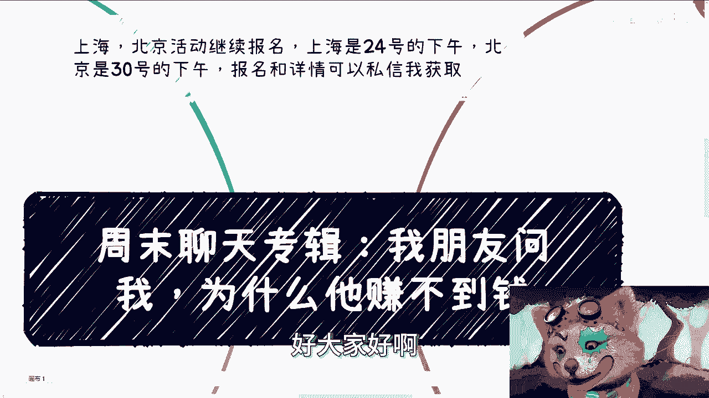
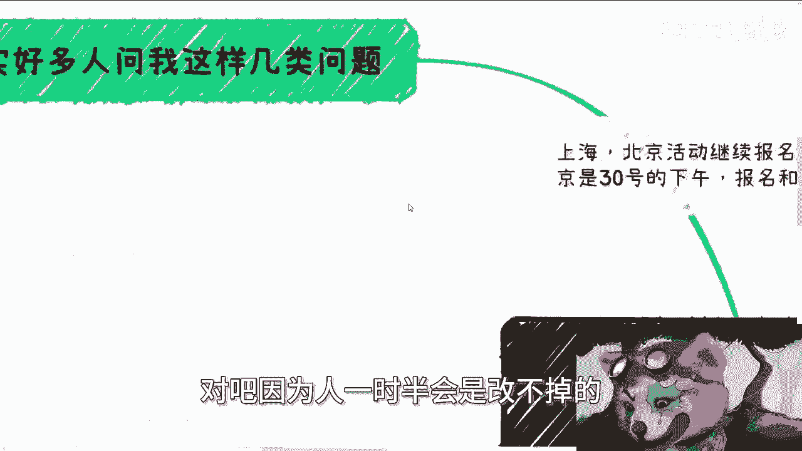
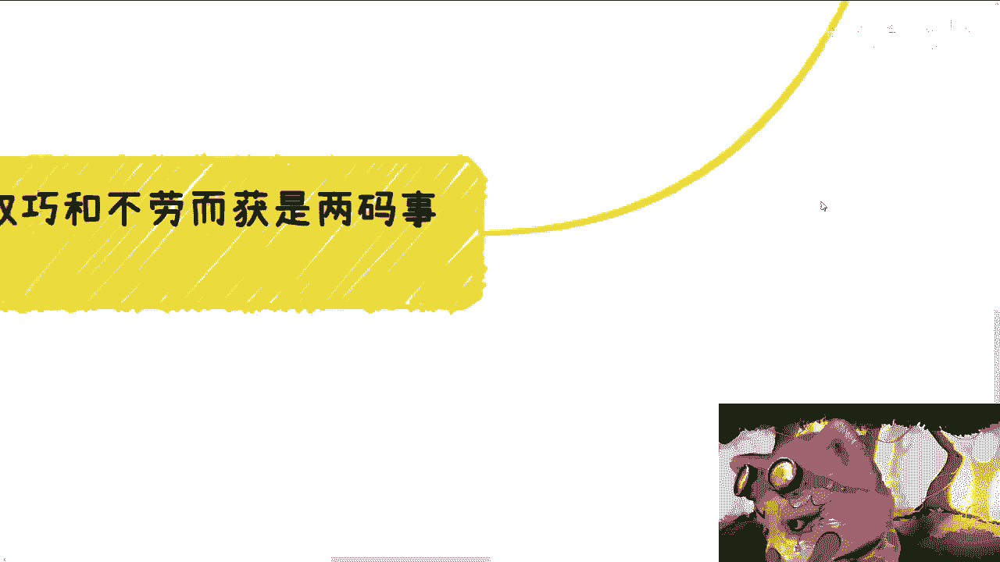

# 周末聊天专辑：我朋友问我，为什么他赚不到钱 - P1 - 赏味不足 - BV192421N7uw

好大家好呃。

我跟你们讲，现在给你们讲内容。

他妈越来越晚了，现在已经凌晨一点，我本来不太想讲，我想想算了，你说我取了一个周末聊天专辑对吧，你要放到礼拜一讲话也不太好啊。

首先这样子啊，上海北京活动我们继续报名啊，上海是24号的下午啊，礼拜天北京是30号的，下午应该是礼拜六对。

然后报名和详情可以私信我啊。

今天我们这个专题呢讲的叫做这个，我之前有个朋友问我。

他为什么他赚不到钱啊，我分开来啊，我说我这个分了几项啊，第一好多人问我这么几类问题啊。

他说啊我就是首先啊我有个朋友不是问我吗，他说赏总为啥我赚不到钱啊，我说你赚不到钱，或者你赚的很辛苦的原因是什么，是因为你是个好人啊，你太有良心啊，我说你就这么想啊，我说你给别人做服务啊。

呃你不要跟别人怎么说这么多对吧，你比如说你说啊，我我考虑到你的学历，考虑到你的家庭，考虑到你的性格对吧，考虑到各种各样的东西，你别考虑了，你就跟他说，你妈的先给我40万，先给我50万对吧。

我给你做没问题啊对吧，我说你之所以觉得赚的累，你之所以觉得你赚的少，或者你赚不到，就是因为你跟人家说这么多对吧，我说你说这么多，你从我角度来讲，我能明白你是为别人好，但是你要明就是我跟你们这么说啊。

无论你们是谁啊，你们要明白用户用什么叫用户啊，用户大多都是，就是说你为他好，他是不领情的啊，就是说他们只会觉得你跟他分析半天，分析来分析去，他会觉得你不专业，然后呢你收他钱收少了吧，他还来跟你说啊。

一分价钱一分货怎么办呢，你只能心中默念他是，但是你有没有想过一个问题，你默念他是，但是你又赚不到他的钱，到底谁是对吧，那么很多时候我给你讲，任何的实行任何行业都是这样子的，你比如说啊很多很多人跟我说。

陈老师我不会包装，我不敢包装，那我问题来了，你今天如果有机会啊，我们说如果有机会，你跟一些大佬或者跟一些什么领导啊，跟一些其他人吃饭对吧，或者见面，你说你不会包装，不敢包装，那别人就觉得你不行啊。

那另外一个人敢包装，敢敢去那个呃这个说话敢去吹吹，那领导就会觉得他行了，怎么办呢，对吧你你你今天不会包装，不敢包装你行，领导也觉得你不行，不就这么个逻辑吗，啊你包括一些小伙伴咨询我的收益。

问他说陈老师是不是我们先从社交啊对吧，或者说做一些小的业务开始，我说也不全是对吧，但是我为什么就是说我看人下菜嘛对吧，我说我为什么不是每个人都会跟你们讲一遍，因为有的人有一些非常野路子的对吧。

你说我听上去你学历就很比较高对吧，或者你的认知可能比较高，当然啊我我说你学历比较高和认知比较高，其实并不是个贬义词，而不是个褒义词，是贬义词，你知道吗，就是我说你学历比较高。

跟认知比较高的潜那个潜台词是什么，就是你不接地气，你不接地气，你怎么去野路子对吧，你不接地气，我基本上就不提，因为我知道我提了，你也拉不下脸，你也认不得这个良心。

我有啥好提的呢对吧，因为人一时半会是改不掉的。

没办法的，你说你说你说直白一点，今天一个三本或者职校技校。

可一个清华的来问我，我给出建议会一样吗，那肯定不一样啊对吧。

那第二你们说谁更应该剑走偏锋啊，你看啊你看首先我先说结论，其实那些我们一俗话说得好，叫做最危险的地方，就是最安全的地方对吧，你会发现，最觉得应该安安稳稳去就过这一生的人，其实最应该剑走偏见，剑走偏锋。

因为什么，因为你之所以会这么觉得，是因为你的家庭，你的背景，你的各方面可能给不了你安安稳稳的东西，所以你希望通过你的努力，通过你的怎么样得到一个安安稳稳的，就是一代一代一代进步嘛对吧。

但是你有没有想过一个问题，你越是这样，你不剑走偏锋，你怎么可能会有新的发展对吧，因为一代一代就像我们昨天说的那个问题，就是说孩子教育和发展的问题，你一代一代这样子，你父母给你的认知。

你现在如果不冲出象牙塔，你给回头给你孩子的认知，你孩子不冲出相声，他回头再给你的这个孙子的认知，不都是一样的吗，有什么区别呢，对吧，你想想看，每次都说啊，我们没有关系，我们家庭很普通，我们就是普通背景。

对呀，你越是这么说，难道不是因为就是难道不是正因为这些原因，你更应该剑走偏锋，去走一些不寻常的路吗，你再去走独木桥，你指望有啥改变，你想想看对吧，是不是这个逻辑啊，你你你呃。

我漏了一个就是你比如说前天有一个咨询做的，我跟你讲，我血压都炸了啊，就是对方跟我说唱啥，我是一个非常普通的人啊，然后软性硬性技能呢我也没有啊，这个学历很普通啊，OK好，然后我就问他，我说你想追求什么。

或者你这个希望未来的，比如说30岁，35岁，你希望自己达到一个什么样的目的啊，他说我想赚钱，我想稳定，我说大哥，我们先一步步来说，在当下这种情况，你稳定肯定是稳定不下来的，赚钱呢大概率你也赚不到啊。

那么我说我给的建议是什么，我只我给的建议就是你要剑走偏锋，但是呢你你你不是说不找工作，你随便找个工作，你随便就是有一个暂时性的稳定的收入对吧，然后什么叫剑走偏锋，就是你找一些野路子的人都来合作合作。

比如说抖音，你做该做做起来，培训班该做做起来对吧，然后呃你要跑到线下下沉市场去，就是我你要我把话说明是什么意思，就是你既然都说了，就是哎我学历不行，我家庭也一般，我软硬性技能都没有，然后你要告诉我。

你要赚钱，你要稳定，那你你你不走遍不见左偏后，你要怎么办对吧，你你让我话来讲，那如果我不是说我看不起他对吧，就我跟他这么说，我说如果你今天能在中国，找到一个很稳定又赚钱的工作。

那我说老百姓都他妈稳定赚钱会到今天了，有这么简单的了，我们做事情不能不切实际的呀对吧，那我就问还能怎么样，就现在这种经济情况，就现在这种全球情况，你要赚钱又要稳定怎么走啊。

难道你你难道是希望比如说我就跟你说说，来你从现在开始去补个学历，然后找个好工作，这他妈像人说出来的话吗，啊我我我跟你们说啊，我但凡这么讲，有的人还真的会觉得陈老师讲的对，对你妈个蛋对，然后第三就是赚钱。

我跟你们讲啊，看思维，看模式，看落地能力，从来不看环境，不看学历的啊，就是因为你仔细想想啊，赚钱本身是什么，是滚雪球啊，和行业和城市和稳定的环境，还有学历没有啥关系，这就像很多人说的，比如说我要出国。

我要换个环境，我要换个专业，你仔细想想，看任何任何一个行业，我不管你今天365行，你在哪个地方，你但凡要赚到钱，其实就是商业模式，就是你要摸到用户的痛点，就是要营就是营造商业闭环，就是这些你都要明白。

你然后去落地才有可能赚到钱，你但凡了解不了，你说我今天在一个行业，我都不知道用户痛点是什么，我都不知道政府痛点是什么，我都不知道有哪些商业模型对吧，那么我不知道怎么了解，那你想想看啊。

你但凡了解不了或者不知道怎么了解，的去哪不是一样吗，对不对，你就好像出国，我跟很多人都说过，你比如说我说我以前其实可以签证出去，但在我高中的时候，但都失败了啊，那也可能上天不让我出去。

但是我现在回过头去看看，你想想看啊，我出去了我又能咋样呢，啊我又能咋样啊，我我在一个语言文化叫什么，语言文化也好，包括各种各样习俗也好，各种地方都不通的一个地方，我能在外面赚到钱对吧。

就是我出去我只能被外面的环境所PUA，就以我当时高中的时候，我能赚到什么东西啊，你包括你们现在出国也是一样的，我就跟你们这么说，中国就是中国再怎么样啊，都还是就是说你们至少是语言文化，各个方面都通的。

你要折腾不出个123来，你跟我说，你要出国折腾能折腾出123来，这他妈谁信啊，对不对啊，然后学历跟赚钱就更没关系了，因为什么你说学历跟你打工给你赚窝囊废，有一那么点点点点点点的关联，我还是能接受的。

但是你说赚钱，你告诉我，你先告诉我中国有哪个学校，哪个专业是教你怎么赚钱的，有吗，有没有啊，有他妈屁关系啊，对不对，好，然后最后一点啊，就是投机取巧跟不劳而获啊，我跟你讲，我真的发现了。

我他妈发现很多人真的就是，我不知道他们懂不懂，就他们到底是傻呢还是坏，我分不清楚啊，但是我先说一下这个问题，就是所有人都想走捷径，这没问题，这是人性啊，但是问题是什么，我们说的剑走偏锋也好。

投机取巧也好，他还是要付出劳动的，它只不过就是一种就是说可能赚到钱的，叫做非主流方式而已，不是不劳动，你知道吗，诶我发现我发现很多人现在想的，你说他嘴里说的是投机取巧，但他心里想的是不劳而获。

就我们打个比方，比如说抖音那种公益流量到私域流量引流，然后变现，那他妈你也要去做啊，你懂吗，你也要去运营啊，也要包装的，也要讲究话术的，也要讲究套路的，就很多人就想着说我要赚钱，我到处抄啊。

我就抄那些赚钱的，我跟你这么说啊，我先不说，你尊重不尊重别人的劳动成果和版权的问题，你就算超了，你不去花心思运营，整套上上下下的东西都不做，你赚不到钱的呀对吧，这就好像比如说俗话说得好，台上10分钟。

台下10年功，你觉得一个人在台上很轻松，你觉得你也行，然后你去做，但问题来了，这10分钟背后可能包括了各种各样的积累，各种各样的关系，各种各样的沉淀，那你没有啊对吧，那你仔细想想看啊。

所谓投机取巧是什么意思，就是你觉得一个人做的不错，方向不错，你可以直接无脑的，就是就是不用思考的去走这个方向，或者来说去走他的某种模式，但不是说你不思考啊对吧，就想着好，我今天复制粘贴。

我复制粘贴有用了没用的呀对吧，然后你复制粘贴之后吧，还要抱怨哎呀，我的，我跟人家做的一样啊，为什么别人赚不到钱，我赚不到钱，你想看为什么。

好吧行那也不早了，我就今天就不废话了啊，嗯然后那个职业规划商业规划啊，然后合同额融资，包括你们手上有什么牌怎么打的，或者你们对于接下来发展有些细节上的问题，不清楚的，你们可以整理好，整理好。

我们再走咨询好吧，然后那个活动报名继续报。

继续报。