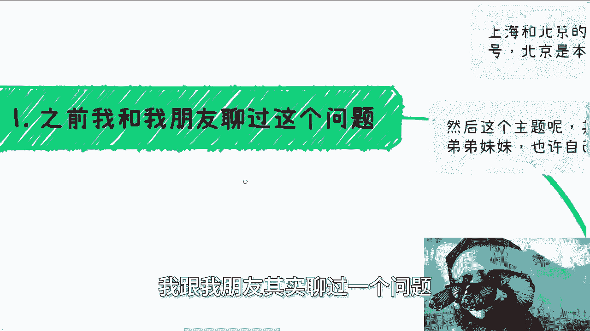
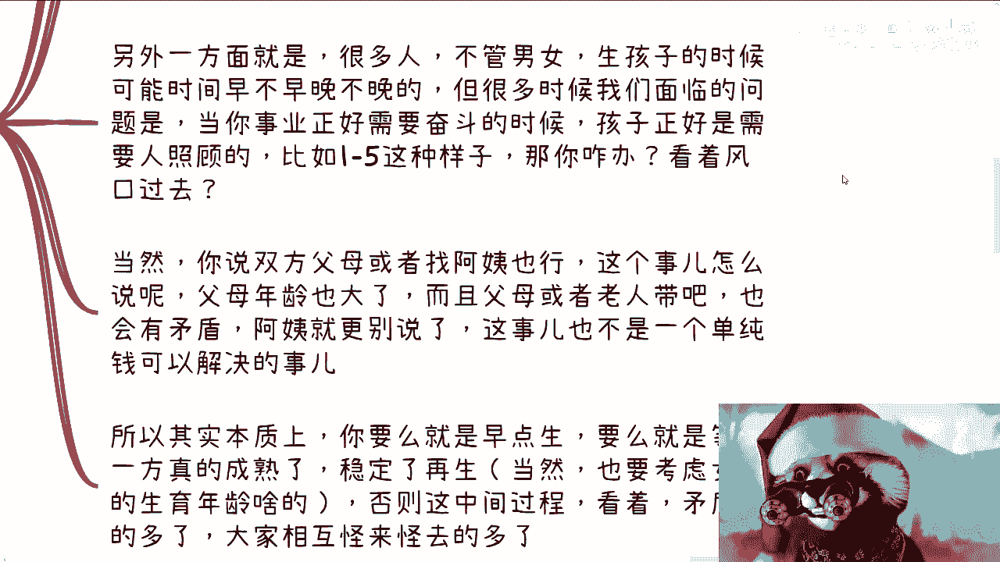
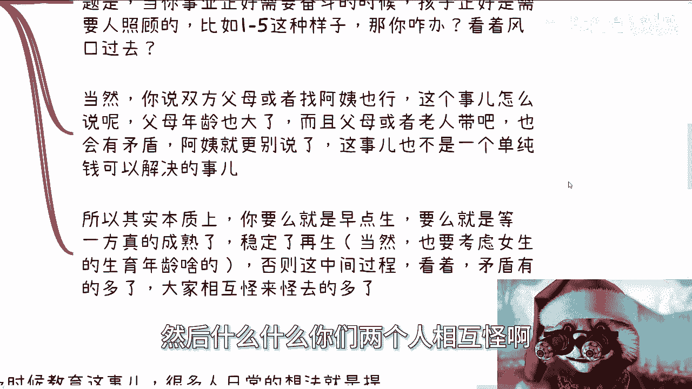
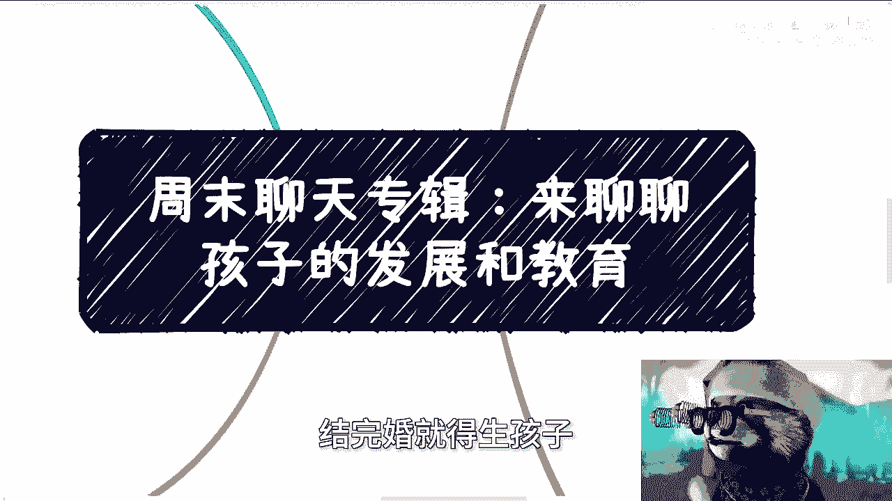
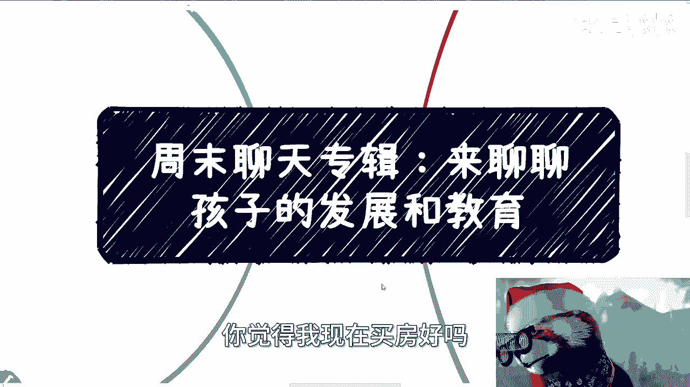
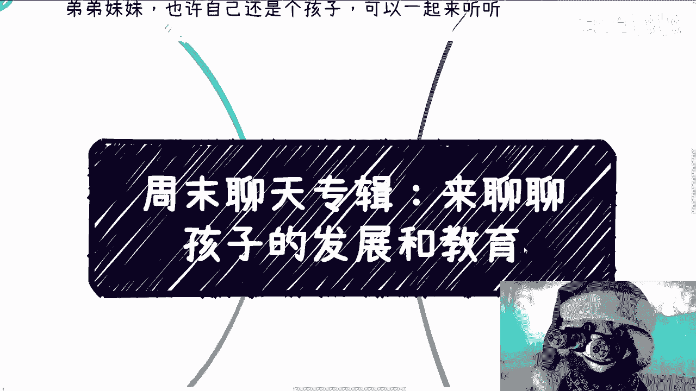
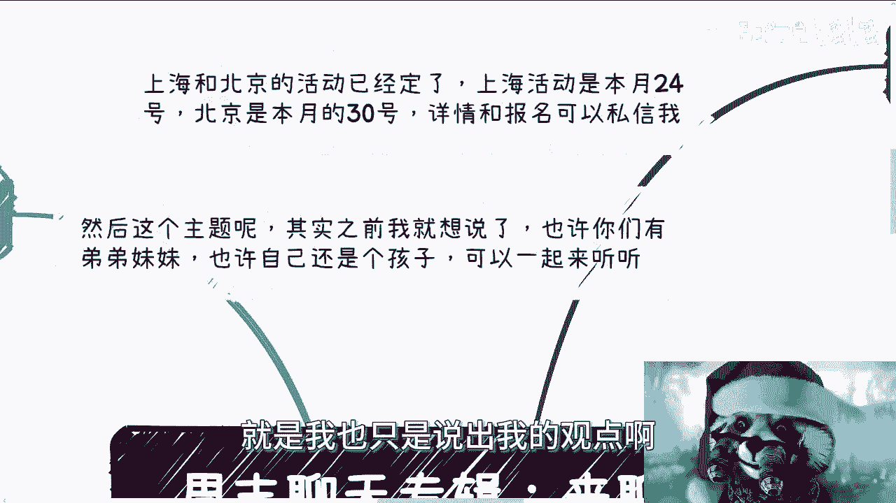

# 周末聊天专辑：聊聊孩子的教育发展 - P1 - 赏味不足 - BV1Wp421U7BG

好今天我们继续这个周末聊天专辑啊。

首先我这个装束很久很久没装了，我发现这眼珠子弹的，怎么感觉跟我以前看的不太一样呃，首先上海跟北京活动已经定了啊，继续报名，上海活动是本月24号，北京是本月30号呃，北京的话由于场地的限制。

应该是有人数限制的啊，可能会相对少一点。

然后上海这边的话放得下好吧，大家可以尽量报，然后这个主题呢其实之前我就想说了嗯。

我觉得也许你们有弟弟妹妹，也许也许自己也还是个孩子。

可以一起听听啊，这无所谓，关系不大。

呃首先是这样子的啊，就是之前呢我跟我朋友聊过一个问题。

就是呃我先说一个大前提啊，首先我觉得疫情前和疫情后，它的确有很大的差别，网课也好啊，老师的态度也好啊，我觉得这里面是决定性的因素，但是这个后面我们再来谈啊，呃之前大概是去年年初，就2023年年初。

我一个朋友跟我说，他说他2023年要生孩子啊，然后他是个男生硕士毕业啊，去年30岁，然后晚上呢就在讨论这个事儿啊，我呢当时原话是这么说的，我说呃你要么就2023年，2024年上半年快点升。

你要么就别升了，为什么呢，因为我跟他说，我说生孩子这事其实很麻烦，你需要考虑到未来各种各样的变数跟情况，呃。

你这当然这个详细我们后面会来说啊，然后呢他也跟我说，就讨论，比如说未来孩子去什么公立学校啊，私立学校啊，大概怎么个思考方式啊，我说以前吧就是无论从什么市重点区重点啊，还是什么公立学校，私立学校去讨论呃。

去思考都没啥问题啊，但是现在不太一样啊，其实就跟我跟你们讲学历是一个道理啊，呃嗯我们继续往下看啊。

那首先先说生孩子这个事儿，我觉得生孩子这事呢一方面优先级最高的，你肯定是考虑到女方的年龄，当然啊我身边有钱的这些女生，越来越多的选择去冻卵，然后一方面考虑到对方的年龄，考虑到对方的健康。

考虑到对方的生育情况，各种考虑啊，那么另外还要考虑到金钱的支出和时间的支出，那么金钱的支出对于未来的一些预算和估算啊，就是包括就是说孩子本身身上的，包括孩子本身教育上的对吧，你都得去算好啊。

呃你就跟其实其实就跟大家，就是对于未来这个风险评估是一样的，就是说你就算当下经济很好，或者你觉得很好，比如说你因为有很多咨询我的时候，他会这么说，他说宋老师，我现在每年对吧，稳定比如说60万。

那我说你们每年稳定60万，你能保证稳定几年呢，你不知道啊对吧，而且我说你要这么想，就算你每年真的稳定60万，你现在年龄小，你精力够，你回头你能保证吗，你不能保证吗，我不说别的呃。

这个问题你身体上万一有些什么对吧，所以啊而且你随着年龄增长，本来就是这个是自然规律嘛对吧，我说你到时候还能保证吗，没人保证的良，那所以我说既然没人保证的量，你就不能拿这个东西作为一个依据啊。

然后说我因为每年都能赚60万，所以我预就是预计未来每年，比如说10年我都能每年60万，这个这个这个结论是不成立的，所以说呢你你你得对未来的，比如说孩子这个预算啊，包括就是说这个金钱的支出。

包括是不是有备选方案，你得有比较完善的一套方案，一套完善的东西，而不是说你拿现在的东西去平移到未来，你说嗯我未来怎么样怎么样，那他妈谁知道啊啊那当然啊家里面有家底的啊，或者说这个呃叫什么啃老的。

当我没说啊，那么另外一方面呢，很多人不管男女啊，我觉得生孩子的时候，可能时间就早不早晚不晚呃，因为很多人他是这么思考的啊，他觉得就是说啊，因为我现在年龄还小或者没什么积累啊，所以我不生啊。

然后呢等到就说好像事业有一定起步了，或者两个人有一定积蓄了，然后来顺，其实我说实话这种这种想法反而是不对的，因为什么。

因为我跟你讲，你早不早晚不晚的，你很多时候面临的问题是什么，就是你当刚好事业正好需要奋斗的时候，或者刚好有些风口的时候，你孩子需要照顾，比如说1~5岁这种样子，你怎么办，我就问你怎么办。

你是看着从风口过去，还是说就就就跟家里闹掰啊，你说我他妈要去赚钱，对你没有办法的，而且很多时候你你你现在是没法预估未来的，对吧啊，那当然你说双方父母对吧，去照顾或者找阿姨照顾对吧也行啊。

但是这个对于很多人来讲，包括你们现在看这个视频的人来讲，你大部分人来讲，这叫什么，这叫纸上谈兵啊，这叫理论派啊，但这个事我跟你们讲怎么说呢，很简单，你们哼就是就是双方父母来带。

那双方父母年龄也大了呀对吧，这是一方面啊，那包括你说老人带就上上一代再来带对吧，那那不管谁来带，你都会有矛盾，你更别说外面找找到阿姨或者菲佣来对吧，你别去想了啊，这事儿呢我跟你讲，这就不就本质上。

它就不是一个钱可以解决的事儿啊，那么所以说本质上来讲呢，你要么就是早点生，要么就是说等你双方有一方啊，在资金上面，在在一些未来的发展方面已经成熟了，稳定了之后，你再审，当然啊。

这个还是要考虑女生的生育年龄啥的，这个我一而再再而三的强调啊，就是别的东西可以优先级降低，但是你你你要为这个这个生育的一方，这个身身体去考虑啊，那么否则这个中间过程我跟你讲啊。

看着就到时候你会发现就是说到时候什么啊，矛盾的多了去了啊，然后呢大家相互怪来怪去啊，你怪父母，父母怪你啊，你怪阿姨对吧，然后什么什么你们两个人相互关啊。

反正就是这种事情多了去了，你反正自己想好啊。

那么第三点呢就来说这个教育，其实很多时候吧，我觉得教育这个事啊，很多人日常的想法就是说提前干涉啊，比如说什么很想去寄宿学校啦，很想要送出国了对吧，然后最常见的就是什么报这个班那个班啊。

呃当然我其实是个人想法，你们可以参考啊，就我不代表我的想法是对的，我觉得就是说孩子在自己拥有一个，相对比较成熟的三观之前，或者说呃就是说就是说相对比较成熟啊，我不敢说。

就是说这个孩子对社会能有多少认知的，不太现实啊，就是说自己大概知道，比如说感兴趣的，或者或者想想呃，自己天性或者性格怎么样子的，或者说大概知道自己是个怎么样的人，之前啊。

我觉得没有过过多的干预是没有意义的啊，你说私立或者出国没有问题啊，我觉得没问题，但除非你是那种很有钱的，就是你跟我说，比如说他妈的我一路啊，从幼儿园到小学到中学到大学，我他妈一路可以付钱。

通过付钱可以这个汤平趟过去精英化教育，那我觉得没问题啊，我觉得没问题，但凡不是这样子的，我觉得都没有意义啊，你说甘雨去什么私立学校对吧，然后比如说也不是那种特别好的，上不上下不下的，你我跟你讲。

这就这就是自己卷自，而且说不好听点，就是这是你自己为了满足装逼和自我的满足，你说孩子能得到什么吗，能得到什么没有，啊这就好像这就好像自己安慰自己说，哎我付了钱对吧，就有成果，我跟你讲，说直白一点。

你们每个人我也好，其他人也好，大家每个人不都这么走过来的吗，啊你们自己想想，你们小时候，你们想你们在这个成长的过程当中，你们但凡有被过于的干涉或者怎么样，你觉得会有什么实质性变化吗。

讲我说不好听的就讲不听的，你觉得能有什么实质性变化，或者说你的你的所谓的变化，跟投入真正的成正比吗，对吧，就是当然你身边，我身边一定会有那种就是说投入了有变化的，并且被环境影响的案例。

但是我们又回到那个商业上的问题，这是幸存者偏差呀，这能有多大的影响呢对吧，这跟环境有关，跟你的钱有关，跟你孩子本身的天赋潜力也有关系，这他妈不是说一个环境中的影响啊对吧，你就如我刚刚说的，影响之后呢。

你有足够的钱给孩子铺垫下的路吗，对吧哦你说好，我要么幼儿园去个精英化教育，小学去个精英化教育，然后呢，然后呢初中去过公立的，高中去过公立的还是大学，去过公立的，你教育是断档的，他教育的风格。

教育的这个方式都不一样的，有意味了没有意义的呀，你这种路去铺一段路，你还不如不铺，就顺其自然对吧，然后还有一些就是过早的去寄书啦，或者说什么出于别的原因，说什么为了锻炼，因为很多东西以你们的撵人啊。

我觉得很多东西不是你们决定的，是你们父母决定的对吧，父母说啊要锻炼对吧，当然怎么样怎么样啊，那我跟你们讲，这个时候就又到了什么，到了中国人的这种劣根性的地方，就是又到了锻炼跟吃苦论的时候。

但其实没有必要啊对吧，或者说强行的锻炼和吃苦是没有意义的，这就好像我觉得以你们现在的认知啊，你们多多少少应该会明白，就是就像我们说要赚钱，那你说你但凡想赚钱，你在打工上吃再多的苦跟锻炼再多有用的啦。

没有用的呀，你那叫赚钱了，叫辛苦，钱，叫窝囊废，对不对哦，你说你如果今天在打工上吃足够多的苦，断足够多的练，你就能赚到钱的话，那大家都去吃苦了对吧，而且在打工的能比你吃苦的人多了去了。

你觉得是这样的吧对吧。

你这过多的干预或者说锻炼和吃苦，除了留下心理创伤，没有别的作用，就这么简单啊，好，然后最后再来说一下这个疫情前疫情后的事啊。

虽然敏感了一点，但还是可以讲啊，我觉得学生减负啥的我就不去说了对吧，这政策上就没啥好说的，我觉得现在的减负已经减的，基本上就是就是不是减负了，他他妈就没有负，那么但是疫情本身呢我觉得还是有蛮大变化的。

但是这个只是我前提说一下，这个只是我上海看到的，别的地方我是真不知道啊，我也没交流过，我是真不知道啊，但是我看下来最大的变化是什么呢，就是孩子的网课，对于网络和移动设备的依赖变多了。

同时网络的交流也变多了，而且同时因为网络交流变多了，所以导致老师现在TMD越来越摸鱼了，然后就是我开始说的，我朋友就在跟我说什么，哎到时候是不是找个区重点市重点了，我说意义不大，你放10年前。

15年前当然有区别，区别很大，但是你放现在，其实就跟我一开始跟你们说的学历是一样的，泛滥区重点升市重点市重点再往上升对吧，然后什么什么什么什么职业学校，升本的也有很多，这质量能能他妈跟以前一样吗对吧。

更何况老师也的确越来越水，越来越水，沐浴的越来越多，你重点不重点能差多少，你跟以前有差这么多吗，说白了就是什么呢，就是你要么真的就有本事，卷到各个学校的尖子班，就各个学，这就跟我们在社会上一样的。

就是你说你打工赚钱吗，可以啊，那你有本事卷到那1%啊，卷到5%啊，可以啊，这不是吃不吃苦的问题啊，啊那那你其实那个教育也是一样的，你要么就卷到尖子班，否则你单纯去说哎我去个什么区重点市重点。

什么省重点怎么怎么样，有用了，我觉得意义已经不大了。

你们现在就意义不大了，不要说到你们孩子那一代，那更意义不大了是吧。

就真的要顺其自然，就是说我的个人观点是什么，就是你要去干涉没问题，包括你们的父母干涉你们也是的，就是什么叫干涉，就是等到你们有足够的这个认知，足够的三观的时候，什么叫干涉，就是给予你们一定资金的支持。

然后针对你们的意见说，比如说啊是不是啊做什么方向的东西，或者是不是出国对吧，或者怎么样子啊，不是说强行跟你讲来，不能有选择的，给我考公啊，你妈给我考研，给我考读博，这不叫干涉，这叫什么。

这是哈这这这这怎么说呢，这个就是就是就是控制欲对吧，这个就是说你人生不是你的，是你父母的，唉其实这两就是就是基本上我觉得每次咨询啊，其实都会聊到这个问题，就你说聊孩子，其实你们相对你父母也是孩子。

你们过过了一段时间，你们现在比如说大部分人可能刚工作对吧，那过了一段时间面临结婚，结完婚就得生孩子一样的道理。

当然啊关于要不要生这个话题，我觉得不在这里考虑啊，我不在这里讨论，你要不要生，我就看你自己，这没啥好讨论的是吧，就跟很多人买不买房车的时候，你觉得我现在买房好吗。

这这有啥好讨论的呢，是吧好吧行啊。

那个活动好吧，你们要来的，你们继续私信我，然后呃职业规划商业规划啊，然后什么合同啊，呃股权分配啊，啊包括你们觉得有什么项目摸不清楚的，或者你们觉得，你们不知道自己的牌应该怎么打的啊。

未来的职业规划应该怎么走的，你们可以整理好啊，我们叫做咨询好吧，哎呀我他妈的聊的内容真的越来越广了，不过怎么说呢，这些事情也不能说跟大家无关啊，只能说很有关系，但是啧唉能能像我这样跟你们聊的可能也少啊。

当然我最后还提醒一点，就是我也只是说出我的观点呃。

