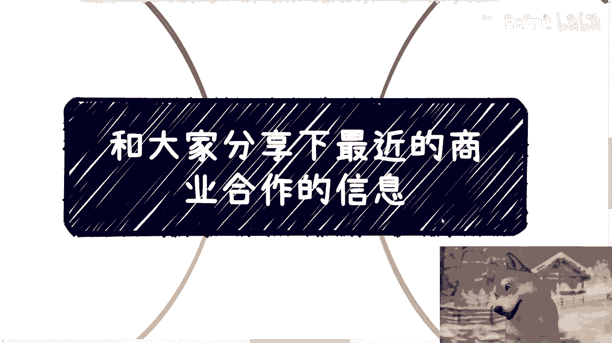
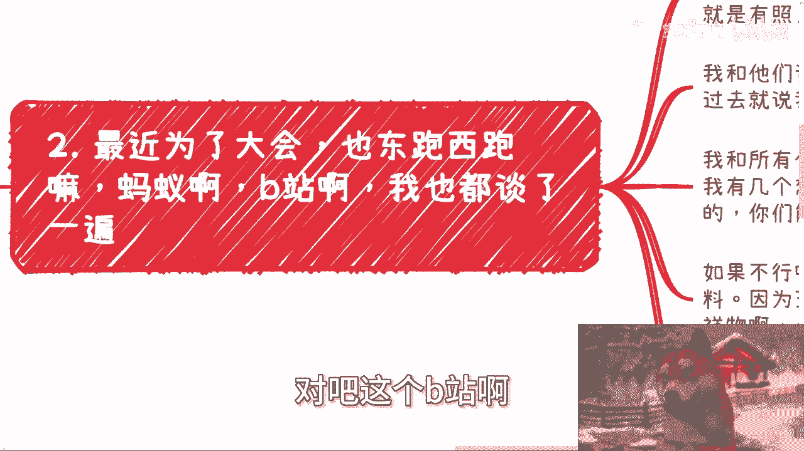
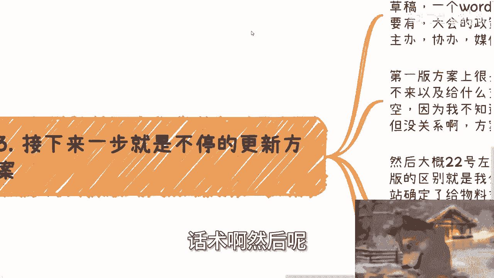
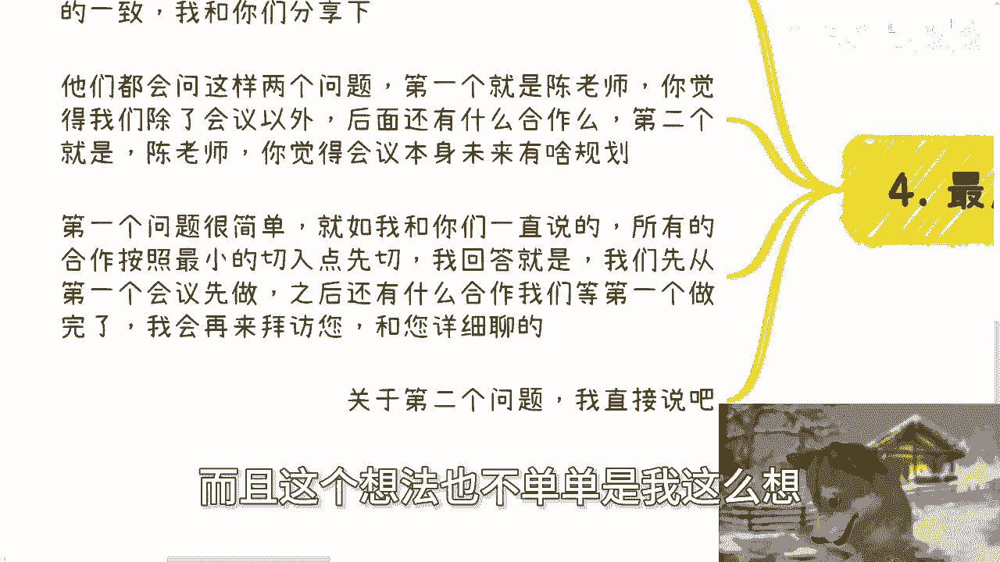
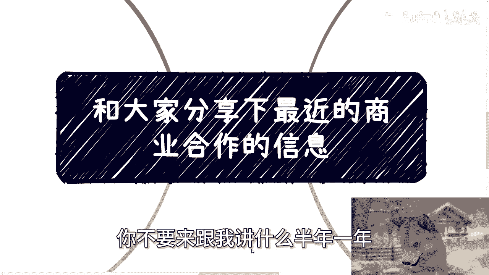
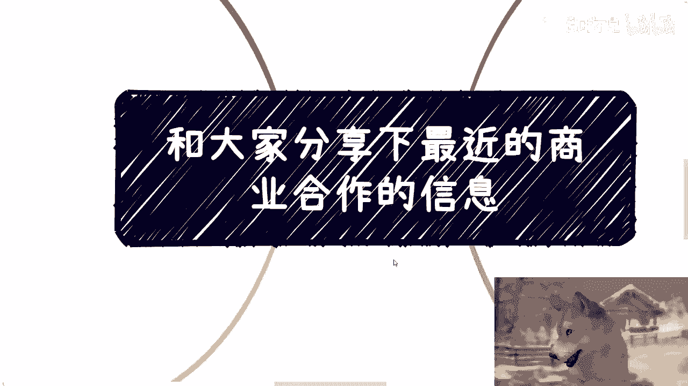
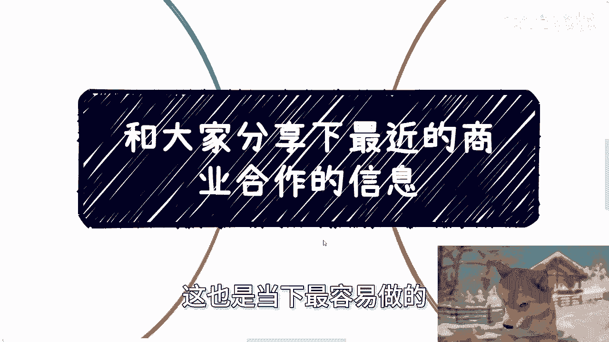
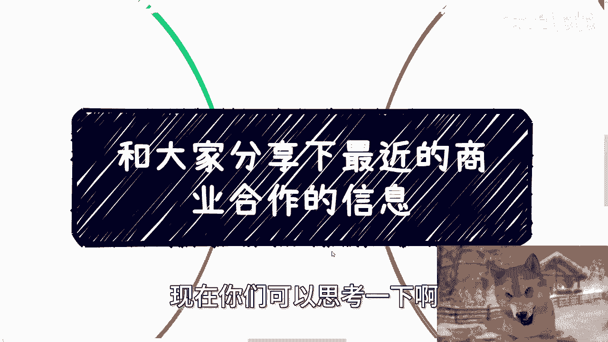
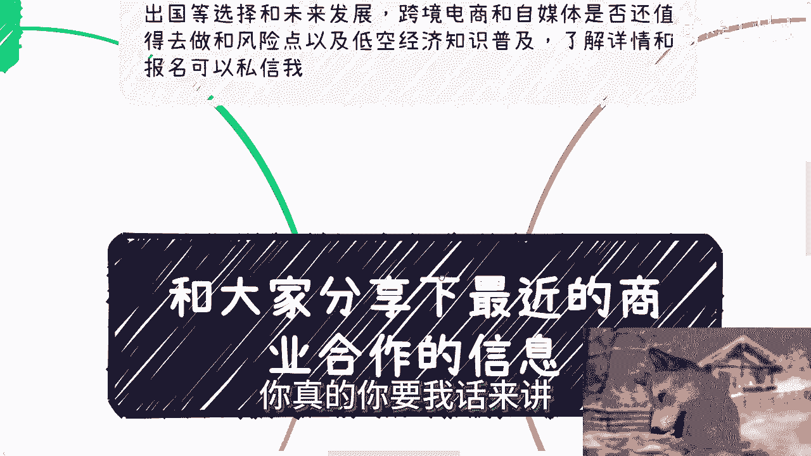
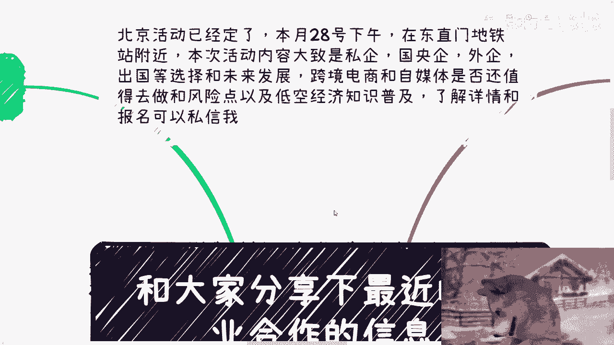

# 和大家分享下我和陌生的合作方怎么谈合作的 - P1 - 赏味不足 - BV1K4421S7az

好大家好呃，今天呢我觉得这个内容很重要。

非常的重要，为什么呢，因为你们不是说没有案例吗，对吧，你们不是这个，很多人也自己可能跑不出什么案例嘛对吧，或者怎么样啊，啧我就拿最近啊我正好在跑啊，包括就是有很多也有些新的合作方啊，第一次见面的。

我就把我最近啊跑的这些情况啊，我就是抽象了一些跟你们分享一下好吧，你们也可以听一下我是怎么跟别人谈的对吧，实在再不济，你们就模仿我的方式去谈不就也好了嘛，对不对啊，额首先呢是这样子的啊。

我先说一下这个活动的事情啊，北京活动已经定了好吧，7月28号下午，就下周日下午在北京东直门地铁站附近好吧，本次活动内容呢大致是呃我会跟大家讲一下，就私企啊，国央企啊，外企啊，包括出国啊对吧。

当下一些offer的选择跟一些未来的发展，第二点就是说很多人自己会选择比较多的，一个是跨境电商，一个是自媒体啊，是否还值得去做和一些风险点，以及啊低空经济的一些知识普及啊，那么希望了解详情跟报名的。

你们可以去私继续私信我啊。

好那么我们今天来讲这个东西啊，首先我先讲一个题外话啊，先讲第一个案例是，前两天有个小伙伴找我合作啊，就很神奇啊，甚至无敌啊，我觉得哼我我我我我就不说好跟坏了吧，啊就大家反正引以为戒啊，呃事情是什么样呢。

他想找我帮忙带货啊，当然了也是正经货啊，我说我B站啊连商业广告都不接啊，所有找我的呢我都是拒绝的，我肯定不带啊，我我目标我态度也很明确，我说我就是不带嘛，对不对，那我不带怎么了呢，对吧。

这又不是说我那我对事不对人啊，啊然后他就说分润啊，分润给我多少呢，给我20%，然后就说按照我现在的这个基数呢，其实也也肯定能转化不少的量，那我还是拒绝啊，然后你知道吗，他字里行间啊，就是就是沟通当中啊。

因为约我吃个饭，你知道吧，他就是那个那个过程，沟通过程当中，他就觉得我是个，为什么，因为他觉得我有钱不赚啊，他说他说你就发个广告啊，你就发怎么样子，总会有人买单呢对吧，那你为什么不做呢，他妈傻吧对吧。

我觉得我都不知道怎么说法，就是我跟你们这么说啊，我的态度是这样子的，对我来讲，我只关心我的投入产出比对吧，哦那我帮忙带货是很容易啊，你说你让我插个广告，你发个动态是很容易啊，但问题是流量是我的对吧。

我也得对，我也得对你们负责，对不对，那凭什么我帮别人赚80%呢，哦就这投入百分额，投入产出比20%吗，我是吗，对不对，然后他后来还说哎呀他他他他后来还跟我讲，他说哎呀我没有在就他没有啊。

在里面拿回扣或者什么地的，我我也是气笑了我，我后来当面我跟他讲，我说我还是那句话，你拿不拿钱，关我吊事，对不对，我说我只关心我的投入产出比你明白吗，对吧啊好，所以我就跟你们说一下啊，这就当一个案例。

反正你们就听一下啊。

你们去听一下，反正就是学习学习啊，引以为戒好，那么我们切入主题啊，就最近为了做大会对吧，也东跑西跑啊，包括蚂蚁啊对吧。

这个B站啊，包括我那个昨天去杭州嘛，也谈了很多，就是说新的一些合作方我没见过，那么我弹的时候呢，基本上我是没有方案的，还是空对空的，因为一开始弹的时候我没法有方案嘛对吧，那唯一的区别就是说我有深圳。

就6月30号第一个落地的案例啊，就是无非就是有些照片有易拉宝啊，有以前的一些以前的一些方案，就文字啊或者什么东西啊，我跟他们谈的时候呢很简单啊，就像我之前跟你们讲的，我给选择题。

而不是说跑过去说我们合作，这他妈太空了对吧，我给选择题是什么呢，我是这么说的啊，我跟所有合作方都是一个套路，就是第一我说我有几个想法，你们可以看看啊，我说第一个就是最理想的状态，就是你们能挂名啊。

能挂个协办，能挂个合办啊，或者能挂个合作单位对吧，我我而且第一次合作，你看我是不跟他们谈赞助的，因为我说不好听的，我就算谈又如何呢，我心里知道谈不下来，我他妈自取其辱干嘛呢，对不对啊。

然后呃这是第一个方案啊，第二个呢我说不行的话啊，我说要不这样，你们也可以给我出点嘉宾啊，我说我也不要钱啊，我给你们减加宾加宾费啊，我说还有就是说给我些宣传物料啊，因为这种东西呢很多公司都有啊。

包括自己的IP啊，吉祥物啊对吧，也算给你，我也也也算是我这个大会给你们做些宣传吧，啊我说如果这两个都不行啊，那么我说最差的是什么呢，我说最差的要么你们就帮我宣传宣传对吧，就在你们的这个权限范围内啊。

呃可可可宣传的范围内啊，帮我拉点人对吧，撑撑场子也好的对吧。

你看啊，我就给他们基本上是这三种说话术啊，然后呢接下来一步呢就是不停的更新方案啊。

就是我差不多呢是在上上周全部聊了一遍，然后这周呢开始给方案草稿啊，就是一个word，还是那句话啊，你不要来问我word上该有什么东西，做个活动，做过大会该有什么东西，你不知道吗，你不无非就那些东西啊。

对不对，那大会的政策背景啊，时间地点，嘉宾流程，主办协办媒体嘛，对不对，好，那么说到这里呢，有人就要问我了，他说那不是没有吗，不是空嘛，对不对是啊，所以说第一版方案上面很多都是你腰，你懂吗。

什么叫你腰你懂吗，就是我联系过了，我沟通过了，但对方来不来，我不知道，以及对方到底给我哪些支持，我也不知道，对不对，那你们可以理解为我这个时候左手也没有，右手也没有，我就想左手套右手啊，但没有关系啊。

因为我以前跟政府跟企业，跟高校跟这么多年合作下来，我很清楚所有的方案，第一版都他妈这么做的，对不对，那我头上也不长角，我干嘛不这么做呢，啊对吧好，然后大概22号左右，也就是下周一左右啊，我会更新第二版。

那么第二版呢跟第一版的区别在什么地方啊，在于我会把确定的东西写上去，因为经过了两周，我总归有些东西能确定嘛，对不对，比如说啊，那也不是，比如啊，就事实上啊，现在B站也确定给我物料支持。

我大概问他要大概100~150个物料，然后给网络流量支持，到时候怎么支持，反正你们也能看得到啊，然后上海市这边区司法可以挂合作，你们到时候也可以砍他们可以，现在可以出两个嘉宾。

然后上海这边的律所可以提供场地支持啊，那么杭州的一些联合会，包括产业联盟，还有一些产业园，包括一些企业可以挂合作方，这些都是确定的，那我第二版出来，不就是已经至少左手右手有了吗，那我再去继续套呗。

对不对，然后再接下来我可能出第三版，第四版等里面所有的信息，包括嘉宾啊，流程啊，全部定了，我就出海报，这不就这么个流程吗，有什么区别呢，你你说你们很多人要关心啊，空对空，那我也空对空的有什么区别。

对吧啊，那么第四也就是分最重要的一个信息是什么，就是我这次合作方，很多合作方也是第一次见面，他们啊都提出一个问题来问我，他说哦，而且同时啊他们也说了他们的想法，而且非常出奇的一致啊，我跟你们分享一下。

他们会问我两个问题，第一他说陈老师，你觉得我们除了会议以外，后面后续还有什么别的合作吗，啊，那么这个问题的言外之意，就是他们觉得会议的合作太浅啊，那么第二个就是说他说陈老师。

你觉得会议本身未来有什么规划对吧，就是他们也希望听听我对于这个东西的定义，因为他们也不希望是111锤子买卖，对不对，好，那么第一个问题很简单啊，就如我一直跟你们讲的，所有的合作，按照最小的切入点切切。

我的回答就是这样子的，我说我们呢可以先从第一个会议先做啊，之后呢还有什么合作呢，我说等第一个会议做完了，我会再来拜访您啊，和您详细再聊，对不对，这就是我第一个问题我回答，那么第二个问题的回答呢。

我就直接说了，我就懒得打了啊，我就直接跟你们讲啊，第二个问题的回答是这样子的，我说会议本身的方案啊，规划我希望的是我们能够通过上海的这次大会，把它抽象出来，变成一个打包，一个通用的一个方案。

然后放到比如说什么盐城啊对吧，长沙啊对吧，或者说陕西啊，多或其他地方啊，我说拿一个完整方案，以你们现在有的企业端，政府端，高校端资源去谈谈，看能不能拉些赞助和补贴啊，然后我们在当地做啊。

而且这个想法也不单单是我这么想。

我聊下来，所有的企业跟最近的合作方也都是这么想的，我跟你们讲，为什么很简单，因为当下想要去赚钱，想要从甲方拿钱，营销口，媒体口去走，你但凡走项目口，你明白吗，就是就算啊项目口有钱，他会按照政府。

按照企业端，按照就是这种什么高效端的逻辑啊，他跟你合作，一合作就就就可能一拖，我不是说他有意啊，就是一般他一做可能就是做个半年，做个一年，但问题是我们现在我也好，我的合作方也好，我们的目标是什么。

我们的目标是赚钱，我们拖不起，你不要来跟我讲什么，半年一年。

谁他妈知道半年或一年会怎么样子，对不对，所以说这个也是现在当下，我们所有人对于整个市场的一个判断。

就是如果真的像这种会议要做，就是打包成一个方案。

而且也要先做出一个案例，然后打包出来之后问政府要补贴，而这个补贴不会多，但是为什么政府要补贴，是因为政府要拿这个钱来让我们干活，然后满足他们的KPI，这也是当下最容易做的。

也是最好切的，别的东西很难切啊，我也就是正好就是通过最近一些合作，跟你们分享一下，好吧行啊，你们可以思考一下啊。

真的思考一下就有什么，哎呀你真的你要我话来讲有什么花头呢。

没花头的，那我我充，我之前充电视频里面跟你们怎么讲的对吧，跟别人合作怎么合作的对吧，跟那么会议怎么合作的，跟别人谈怎么谈的，我也是这么弹的呀。

有什么区别呢，能有什么花头呢对吧好行吧啊就这么着啊，然后那个活动也定了好吧，就是下周日28号下午啊，嗯然后要报名或者了解私信的。

你们继续私信我呃，然后另外一方面就是那个职业规划，商业规划啊，包括你们现在在做什么呃，比如说自己的一些副业啊，或者做些什么跟别人合作一些案例呃，或者来说怎么样，你们在这当中有些分红啊，分润啊。

合同啊对吧，包括有些商业计划书啊等等相关问题啊，呃包括啊，就是说你们呃现在不知道怎么去做规划的，包括你们也也是希望通过跟我的沟通啊，通过我的视野，通过我的一些视角，能够给你们整理出来更好的一些。

这个接近地气的一些规划，能够让你们少走一些弯路的话，那么你们可以整理好对应的问题和个人背景，好吧，我们再来做咨询啊。

行啊。

