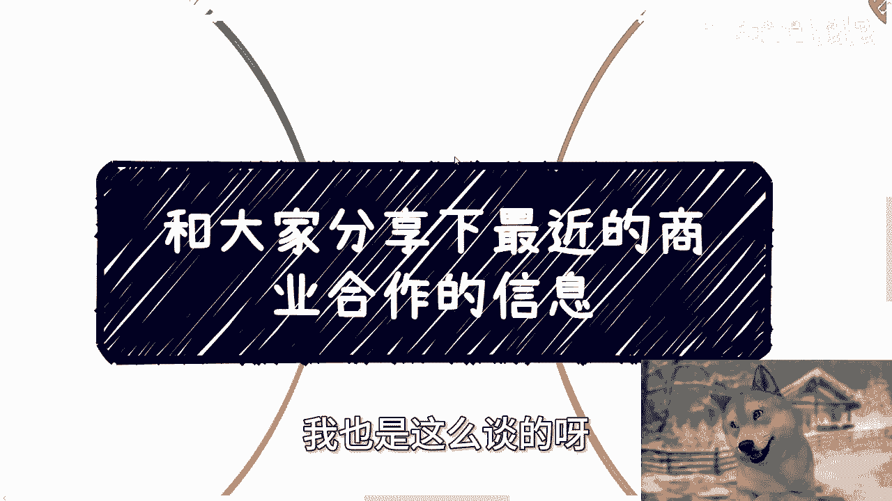

# 和大家分享下我和陌生的合作方怎么谈合作的---P1---赏味不足---BV1K4421S7az_no

在本节课中，我们将学习如何与初次见面的合作方进行有效沟通和洽谈。课程将分享一个真实的合作洽谈案例，并提炼出核心的策略与步骤，帮助你理解从零开始建立合作关系的完整流程。

---

## 活动通知 📢

北京线下活动已确定。活动时间为7月28日（下周）下午，地点在北京东直门地铁站附近。

本次活动主要内容包括：
1.  分析私企、国央企、外企及出国等不同方向的工作机会选择与未来发展。
2.  探讨跨境电商和自媒体这两个热门方向是否仍值得投入，并分析其风险点。
3.  普及低空经济的相关知识。

希望了解详情或报名参加活动的朋友，请通过私信联系我。

---

## 一个反面案例：关于投入产出比的思考 💡

在进入正题前，我想先分享一个近期遇到的反面案例，希望大家能引以为戒。

前两天，一位小伙伴找我合作带货。我明确表示我的B站账号不接商业广告，因此拒绝了。对方提出分润20%，并认为以我的流量基数能转化不少订单，但我依然拒绝。

在沟通中，对方感到不解，认为我有钱不赚。我的核心观点是：**我只关心我的投入产出比**。虽然发布一条动态看似简单，但消耗的是我积累的流量和信誉，我需要为我的观众负责。对方获得80%的收益，而我只有20%，这个比例在我看来并不合理。

后来对方解释自己并未从中拿回扣，我的回应是：这与我的决策无关，我的决策依据始终是**投入产出比**。

这个案例告诉我们，在合作中，明确并坚守自己的核心利益与原则至关重要。

---

## 核心洽谈策略：从“空对空”到逐步落地 🎯

上一节我们看了一个需要避免的反面案例，本节中我们来看看我是如何与陌生合作方进行有效洽谈的。最近为了筹备大会，我与蚂蚁、B站等许多新合作方进行了初次会面。

在最初接触时，我手上并没有成型的方案，处于“空对空”的状态。我唯一的优势是6月30日在深圳成功举办过一场活动，有一些照片、易拉宝和文字方案作为参考。

我的核心策略是：**不给开放式问题，而是提供选择题**。我不会空泛地说“我们合作吧”，而是会向对方陈述几个具体的合作构想。

以下是我与所有合作方沟通时使用的标准话术框架：

1.  **理想方案**：邀请对方作为会议的协办方、合办方或合作单位挂名。在初次合作时，我通常不主动谈赞助，因为我知道成功率不高，避免自取其辱。
2.  **备选方案**：如果挂名不行，可以请对方派出嘉宾（我承担嘉宾费用），或提供一些宣传物料（如公司IP、吉祥物），这也能为对方起到宣传作用。
3.  **保底方案**：如果以上都不行，可以请对方在其宣传渠道和权限范围内，帮忙推广活动，吸引人气。

抛出这些选择题后，下一步就是**持续更新和推进方案**。

---

## 方案推进流程：从草案到定稿 📝

上一节我们介绍了初次接触时的话术框架，本节中我们来看看如何将口头约定落实为具体方案。

我通常在上周完成所有初步洽谈，本周开始提供第一版方案草稿（一个Word文档）。一份活动方案应包含：政策背景、时间地点、嘉宾、流程、主办/协办/媒体名单等基本要素。

有人会问：很多信息不是还没确定吗？是的，所以**第一版方案中很多内容是“预留位置”的**。我联系过某些单位，但对方是否参与、提供何种支持都尚未确定。这没有关系，这就像“左手套右手”，是所有复杂项目启动时的常态做法。

大约在22号（下周一）左右，我会更新第二版方案。这一版与第一版的区别在于，我会将**已经确定的信息**写上去。经过两周的沟通，一些合作已经敲定。例如，B站确定提供物料和流量支持；上海某区司法局确定挂名合作并派出嘉宾；上海某律所提供场地支持；杭州的一些联合会和企业也确定作为合作方。

当左手和右手都有了实质内容，我就可以用这个更充实的方案去争取更多资源，如此循环。之后可能会出第三版、第四版，直到所有信息（嘉宾、流程等）全部确定，最终产出宣传海报。整个流程就是如此。

---

## 合作方的深层关切与未来规划 🌐

在洽谈中，几乎所有初次见面的合作方都会提出两个高度一致的问题，这反映了他们的深层关切。

1.  **问题一**：“陈老师，除了这次会议，我们后续还有什么其他合作可能？”  
    **言外之意**：他们认为单次会议的合作深度不够。  
    **我的回答**：我始终坚持，合作应从最小的切入点开始。我会说：“我们可以先从这次会议做起。会议结束后，我会再来拜访您，详细探讨后续的合作可能。”

2.  **问题二**：“陈老师，你对这个会议本身有什么长远规划？”  
    **言外之意**：他们不希望这是一锤子买卖。  
    **我的回答**：我会直接说明我的规划：“我希望通过上海这次大会，抽象出一套**通用的、可复制的标准化方案**。然后带着这套完整方案，结合你们的企业、政府、高校资源，去其他城市（如盐城、长沙、陕西等地）洽谈，争取当地的赞助和政府补贴，复制落地。”

这个想法并非我独有，我接触的许多合作方也持相同观点。原因在于当前市场环境下，如果想从甲方（尤其是政府、国企）那里获得资金，走传统的“项目制”路线周期太长（可能半年到一年），变数大，大家“拖不起”。

因此，当下的共识是：将活动**打包成一个标准化、可复制的产品方案**，并先做出一个成功案例。然后以此案例向地方政府申请补贴。政府之所以愿意补贴，是为了让我们干活来完成他们的KPI。这是当前最容易切入、最高效的合作模式。

---

## 总结与咨询服务 📞

本节课中，我们一起学习了与陌生合作方洽谈的全过程：

1.  首先，要明确自身原则，如**投入产出比**，并敢于拒绝不合理的提议。
2.  其次，在初次接触时，使用**提供选择题**的话术框架，降低对方的决策门槛。
3.  然后，通过**持续迭代方案**，从预留位置的草案逐步推进到信息完整的定稿，实现“空对空”到“实打实”的转变。
4.  最后，要理解并回应合作方对**合作深度与未来规划**的关切，提出可复制、可持续的合作蓝图，例如打造标准化方案并向政府争取补贴的模式。

洽谈合作本身并无太多玄妙的“花头”，核心在于清晰的策略、持续的推进和对双方利益的透彻理解。

---

### 其他服务告知

此外，关于个人职业规划、商业规划（包括副业、合作案例中的分红/分润、合同、商业计划书等问题），或者你希望借助我的经验和视角，整理出更接地气、能让你少走弯路的规划，可以进行咨询。

如有需要，请整理好你的具体问题和个人背景，通过私信联系我。