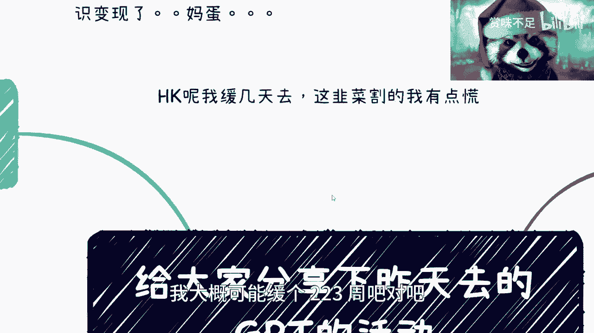
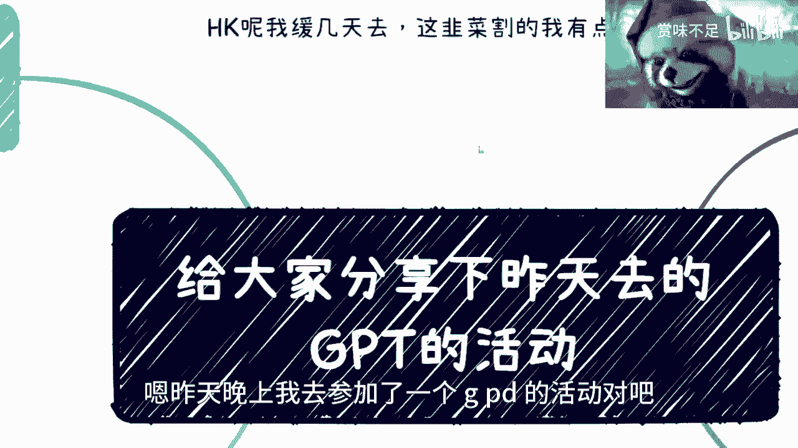
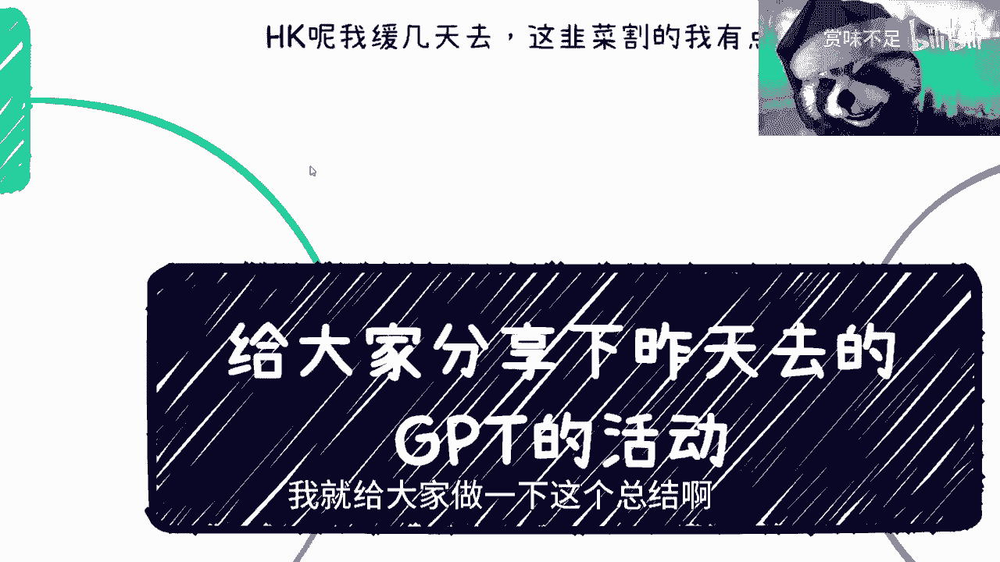
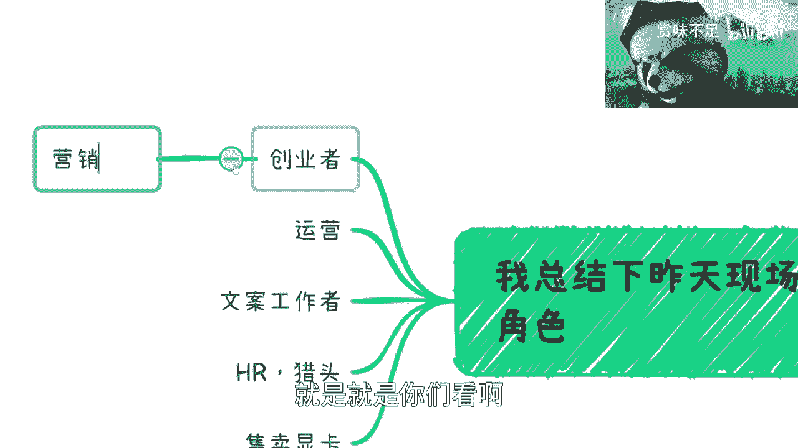
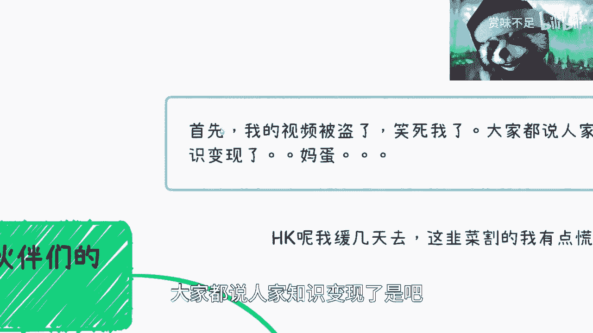
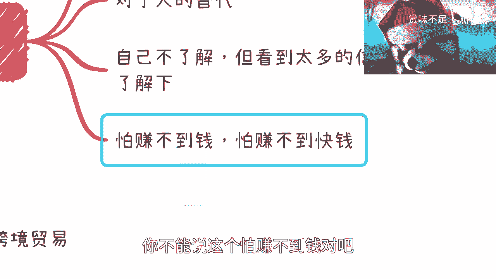
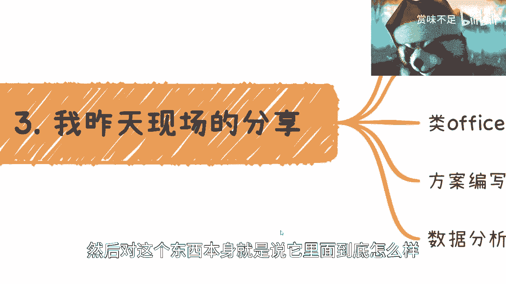
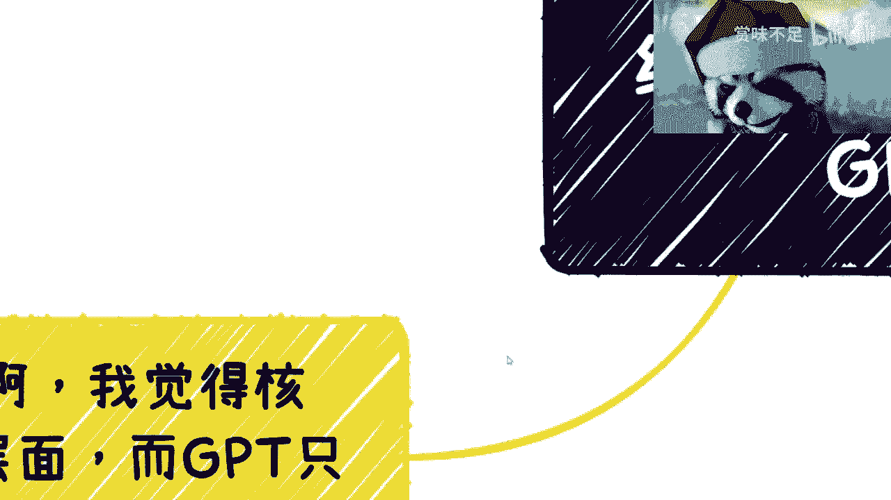

# 和大家分享下昨天我线下参加的ChatGPT的活动 - P1 - 赏味不足 - BV1QN411w7nF

好大家好，这个很可惜你们今天不能放假是吧，呵呵哎呀。

我跟你们说，你们都知道了，对不对，昨天我那个视频被盗了对吧，然后就非常奥妙的是，人家到这个视频呢还有2万多的播放量，我都没有2万多的播放量，哎呀真的是伤心的很啊，然后那个hk呢我缓几天去啊。

我因为我那边这韭菜割的我也有点慌。

我也觉得没有必要没必要去凑这个热闹，我大概可能缓个223周吧对吧。

也我反正这个通行证也不过期啊。

嗯昨天晚上我去参加了一个g pd的活动对吧，那么就就着这个。

因为还有一些小伙伴说这个时间太紧了，也没有空过来啊，我就给大家做一下这个总结啊。

呃活动呢来了六七十号人啊，在上海那个黄埔的k 11就新天地过去一点。

我过去，因为近嘛，因为我家基本上就在新天地这边。

就也因为比较近呃，我总结一下昨天来的小伙伴的角色，你们看啊，创业者对吧，运营啊，文案工作者啊，hr猎头啊，售卖显卡对吧，好这个事儿呢，我觉得我就算不说啊，你们多多少也能够看得出来点端倪是吧。

你看啊创业者来干嘛的呢，那肯定要推广产品对吧，毫无疑问啊，我觉得这个没什么问题，因为我对哎呀。

我真的，我我我觉得在这个地方我得跟你们说一下，就这个营销的事，就是就是你们看啊。

你像昨天我这个视频被盗了对吧，就搞笑了。

大家都说人家知识变性了是吧，对对对，我觉得你们说的对啊，然后那个啊然后那个我跟你们说啊，创业者这个东西呢，这里面有个东西叫营销，对不对，我跟你们讲，你们大部分人对于这个营销呢。

可能就抱有这种不是很有好感啊，包括就是说这种贬义相关的啊，但是呢你们经过了对吧，像我昨天讲的知识变现以后，你们但凡仔细去听，你们仔细去想，你们就会明白核心是什么，核心就是营销啊，核心是你的产品嘛。

并不是，对不对啊，核心是营销，你回头我不是说了吗，你卖坨屎你也卖得出去，你管他这么多呢，对不对啊，那当然了，我在这地方也跟你们说一点吧，就是因为这两天那个私信的时候，也有一个小伙伴跟我说嘛。

就说这个这个啊，就觉得他他觉得市场上面很多事情都割韭菜啊，然后他觉得这样不好啊，但是呢他又觉得呃这个人家营销做得好对吧，我就跟他讲，我说这个事情是这样子的啊，回头那呃我到时候再详细跟你们说吧。

就是简单来讲就是说割不割韭菜这种事情，你得辩证的去看，就是你看任何的事情，你都要辩证的去看对吧，就是你要是坚定的认为什么什么东西割韭菜，我觉得没问题，但是你得想办法去这个取其精华，去其糟粕对吧。

你不能说啊，我觉得这些都是垃圾，那不行对吧，为什么，因为你在这个世界上，你在这个这个大的这个条条框框里面，你就要遵守它的规则对吧，那你说你又没办法去定制这个规则，你不是只能遵循吗，那你在遵循的过程当中。

你别去割韭菜不就好了嘛对吧，你不能你不能说老师觉得啊，我就我觉得我就看不起割韭菜的，我就觉得我这个啊我觉得他们割韭菜对吧，但是你做的没人家好，那你能怎么说呢对吧，而且另外一方面是你觉得格。

那有可能我觉得不是歌对吧，或者他的受众觉得不是歌，那你怎么说呢对吧，千人千面是吧，你要辩证的看这个叫什么，就是就并不是一个非黑即白，甚至这个不知道几千种颜色的这个世界是吧，这第一个第二个呢。

你看啊运营文案工作者这两个为什么会来呢，是因为他们严重的啊，觉得gpdd他们造成了威胁对吧，就不管是文案运营啊对吧还是什么，就不管它有没有用过啊，他只是提那个讹传讹对吧，各种道听途说他也知道啊。

可能对他产生了这个哎呀，产生这个叫什么呃威胁是吧，好第三个呢就是hr猎头，那那很简单嘛对吧，我要来找人，我要来招人对吧，好售卖显卡更不要说了对吧，你你是大模型训练训练要显卡吗对吧，要要要算力吧对吧好。

所以你发现了啊，其实来的所有人啊，大家都是各有目的性的，但是呢你通过不同的维度，就像我们刚刚说的，你站在不同的高度，你站在不同的维度，你会发现他们里面有些人既是镰刀，也是韭菜。

那么如果你站在一个更高的维度，那他妈这些人都是韭菜。

对不对啊，好这是第一点，第二点啊，我来总结一下这个来的小伙伴的这些焦虑啊，诶我的这个小浣熊，我是不是可以拉大一点哈对吧，焦虑啊，第一呢就我跟你们讲啊，g b d跟哲学，这个东西。

我已经听到无数人跟我在我旁边弹过来，简单来讲是什么呢，就他们的核心思想是说gbt是一个工具啊，它是不会具有人的意识啊，当然我觉得对我来讲我并不care，因为我我不是一个拥有任何信仰的这么一个人，对吧。

你跟我说有没有这个意识，我就以我的技术的底子对吧，因为毕竟我做了这么多年开发对吧，以我的技术的理解，他现在就是个大模型训练，你不要来跟我谈什么意识，不意识，这他妈的不是一件事。

你知道吗啊这个这是第一个啊，第二个呢我觉得对于人的替代呢，也没有这么多的那个那个可能性，或者说近期短期内不会有这么大的可能性，为什么呢，因为还是那句话嘛，就是一呢它只是个工具啊。

二呢就是说你说呃就是还是太过于焦虑，为什么呢，因为你要说真的替代，那你得在整个公司里面人这个产生价值对吧，要产生真正的价值，因为现在很多g p t的内容，他还是就是说啊胡言乱语啊对吧。

偏娱乐化的或者偏怎么样的，他还是在一个发展过程当中，你说这个东西大家做成作为一个噱头对吧，去骗骗补贴啊，呸去申请申请补贴就算了对吧，你说你对人的替代，我个人觉得你你要但凡焦虑这个东西，我觉得你太对自己。

太看不起你自己，你知道吧，就是就你这个价值过于低呀，你说是吧啊，这是第二点，第三点呢，我觉得呃还有一部分人呢是他自己不了解啊，然后看到了很多信息，那这些信息里面有的危言耸听对吧，因为因为还是那句话。

就是我是一个做技术的，我能知道里面核心是什么样子对吧，那外面人不知道，然后他就在那边说啊，这个什么什么什么人工智能要来了对吧，人类要毁灭了，地球要毁灭干嘛呢，啊明天不过了吗，啊我也不明白了，真的是是吧。

那你你他贩卖这个焦虑，我觉得最后就是让你加他知识星球嘛啊，哎真的是我也他妈绝了，真的对吧，所以他很焦虑啊，来了解一下，最后呢就是一类人呢就怕赚不到钱啊，怕赚不到快钱，哎呀怎么说呢。

就是这个东西我后面对吧，我也可以理解啊，我也可以理解，但是有一点是什么呢，就是你怕赚不到钱，谁都怕对吧，你就像我这次现在这两天不去hk，我不就是怕被割吗是吧，但是问题是你你怕赚不到钱。

你你自己还是得要靠你自己的，你不能说这个怕赚不到钱对吧。

然后就就啊这个我们啊参加个活动对吧，然后认识一些人对吧。

然后怎么样哎，没用的，哥哥们是吧，第三呢我说一下我昨天在现场分享对吧，虽然我不是唯一的嘉宾单啊，但是我至少也是个嘉宾吧，啊啊坐在角落里的嘉宾是吧，哈哈有几点啊，我觉得你比如说我举了我举了几个例子啊。

第一个就跨境电商，跨境贸易对吧，你比如说跨境贸易呢，有哪些那个能增加效率的地方，你比如说多国语言，对不对啊，这个产品的这个就是商品的描述对吧，然后商品的一些商品的一些体验对吧。

包括你比如说那个那个那个刷评论对吧，你想嘛这些东西是不是你都要做对吧，我们假设你都要做啊，那你都要做，你想嘛，你不做，你得雇人做对吧，那现在相当于g b d这些东西都能做。

你不要你先不去说它这个东西说讲出来，对不对啊，这个这个这个多多么的就像像不像人，或者像不像机器人，不重要啊，就这些东西他都都能做，那么你的效率就会提升很多很多对吧，那么你要这么想，你在一个跨境贸易上面。

你挂一个，比如你做一个多国的这个商店对吧，然后你把这些东西以高效的方式，用gp的方式来做，哪怕你现在接了g pd 3。5啊，g p4 啊对吧，都去做，那你这个效率就会很高啊，对吧。

因为你会发现在跨就跨境贸易这个叫什么呃，变现逻辑里面这些东西不是最重要的，但这些东西要有吗，一定要有，你明白吧，就在商业闭环里面，那么你把一个一定要有，但是并不是那么重要的一个东西。

你用ai来增加你的效率，没有毛病啊，对不对，但是你话又说回来，你说这个里面的这个核心是什么，核心是比如说我要赚差价对吧，比如说我要我要那个更好的发物流，发快递对吧，我我要更好的跟客户沟通。

就我们刚刚说的那几个里面，目前你有哪几个东西你能够很放心交给ai的，没有吧对吧，我就算告诉你，我有个很好的量化模型，它能够去这个计算，整个全球各个不同平台之间的差价，你也不见得放心交给他吧对吧。

所以说你会发现就是说在整个商业闭环里面，极其痛点的东西，你还是需要你去做的是吧，你不可能说啊这个啊gb t替代我了呢，哈对吧，那就就就有一种就是你不了解他，但是你还要无限放大他的这种感觉对吧。

那第二文案编写更类office的工具呢，我觉得就是说你们就把它认认为就是个工具，对吧，你比如说我现在发条微博，我我甚至有可能你只要告诉我主题对吧，或者我我想了一个主题，我甚至都不想自己写。

我就给gp去写，不是结束了嘛，对不对，因为在这个就是说我刚刚跟你们讲了吗，在这个整个的社会里面，整个的这个网络世界里面，除非你比如说像我现在给你们录视频对吧，我是希望我录的这个东西是能够有价值的。

那么是由我来讲的对吧，而不是说我后面怎么让jb申请了一个文字，然后我用ai的语音给你们播放对吧，那那那对我来讲，我可能是这么做的，就是全平台所有的网站对吧，所有的地方我就无差别去发对吧，我就是积累流量。

我根本就不要质量，那也可以，那那看你们每个人的初衷对不对，但是如果来说你你就是就是你今天有一个商业，整个商业闭环里面，我们刚刚说的那种全平台去刷的，他就有点像什么，就以前那种就是刷广告的对吧。

我我比如说面前放了100台手机，就在那边不停刷广告，然后然后骗补贴对吧，就就就那个薅羊毛对吧，但是问题是你薅羊毛去无差别的去发，它只是所有的变现逻辑里面之一吧对吧，你没有看到说全球的人都在刷吧对吧。

他只能说是你赚钱的逻辑之一，但是并不是全部，那么剩下的你但凡想输出点有质量的东西，但凡你要让别人觉得你做的产品是有质量的，那你还是说把这个东西会ai，会变成你的一个工具，而你要去产出有质量的东西。

对不对，那你又要说了啊对吧，有小伙伴因为昨天晚上也有小伙伴说，他说他说那gb t4 现在按道理来讲，他可能是一个藤校对吧，就比如mit啊对吧，多多论那个叫什么，就是那个啊个哥伦比各大对吧。

这种毕业的这种也那个那个学生对吧，这这么一个水平，那问题是无论它是怎么个水平对吧，它的质量他他要去知道，就像我今天跟你们讲这个视频，我得知道你们想要什么对吧，或者我得知道我我怎么表达出来。

是你们能够听得懂的对吧，但是我觉得gp t或者从ai角度，他要秒，他要达到这个类目还早得很啊，还早得很，就没有必要去是过于焦虑这件事情对吧，过于焦虑就是我昨天不是写了嘛对吧，你们要但凡去变现，过于焦虑。

你们不会变现的，你们你们只会变穷，你知道吗啊，然后包括数据分析，现在数据分析啊，文案编写，还有很多的岗位，觉得自己好像要失业了，也没有啊对吧，你们就把它理解为，这就好像你们今天要去做个文案编辑对吧。

然后你跟老板说，你不会用office，这不一个道理嘛，对不对，那你就把它当一个工具，别想这么多对吧，这个，而且更何况，就是就是你们大部分人不做技术的啊，然后对这个东西本身就是说它里面到底怎么样。

没有一个正正确的认知，所以导致有非常多的这种这种信息差。

在这里面对吧，然后嗯嗯看看谁谁谁找我，下周下周回坡县嗯，然后你比如说最后我和你们说对吧，核心是什么，我觉得核心是我们要去看战略层面的东西，而不是一直盯着战略战术上的东西，你知道吗，这个我跟你们讲一讲。

就分享一下这个以前的一些经历了，就是你看啊，我昨天因为有个咨询，所以我早回家了对吧，我走之前是这么说的，第一呢我说有个大前提对吧，就是如果我们要像一群绵羊对吧，像一群sheep一直跟着各种战术哦。

那么如果我们在国内，你就得看好国内的大战略跟方向，为什么，因为你不看好，你赚不到钱，我可以很明确跟你们讲对吧，那你要不看好，那你在国内干嘛呢，你就出去了算了，对不对啊，第二点呢就是说a i的事呢。

我觉得我们要会用，但是你们就走一步看一步就好了，别去想太多，就是你们的经历不应该像一只绵羊一样，就是跟着这么一个东西，那你要这么想，就是说你不停的去跟对吧，热点永远是有的，明永远会有人制造热点。

永远是有资本会来扶持热点，但是我们就跟着他，对我们没有任何帮助，对不对，第二点是国产化是大的趋势，你比如说微软的那个copilot，那个microsoft的那个office对吧。

那我觉得国内很有可能是什么，可能是那个呃那个叫什么w ps加百度对吧，或者w ps加啊阿里对吧，那你国产化是一个大趋势，不管是做什么，它一定是未来国产化的，这是不可能动摇的趋势，我可以很明确告诉你们啊。

这第二点，第三点是我跟你讲，从我来讲呢，虽然啊这个我年纪也不轻对吧，但我年纪也不大啊，就我个人来讲，我看到过就是我也创过业，我也看到过太多的东西，我看到是说这么说吧。

就是所有的人跟着一个战术不停的跟你说，他会不会成功，会不会赚到钱，会啊，我不可能跟你们说，有一棒子打死都不会，但是还是那句话，99%的人我看到是不会对吧，毫无积累，毫无建树。

然后一直是像一个sheep一样，一会呃，一一直跟着，正好一会跟着那个对吧，然后出来个什么东西，就我之前跟你们说的，一会儿嘛，改名字，一会儿嘛，怎么样没有用的对吧，就是哎呀就是怎么说呢。

就是说你要说他能赚到钱，我觉得能你要说它实现价值吧，也实现价值，但是我觉得从一个人活着的一个角度来讲，你到底积累了什么，就看似你好像都掺和了，但是你好像也都不懂，就这么个情况，你知道吗。

然后第四个呢就是我其实后面也说了，就是说啊不管是参加活动啊，还是别的东西，你还是要有一就是就是坚定自己的三观，坚定自己的想法，但是坚定自己的三观和想法，不是把自己锁在象牙塔里面，你明白吧。

就是说就是说今天，比如说你们觉得吕老师讲的不对吧，没问题，那大家辩辩证的可以来辩论对吧，而不是说我就觉得吕老师讲的不对，我觉得这样就是不对的，那我觉得对我来讲没有无我无所谓的，但是你在束缚你自己。

你再把你框在一个象牙塔里面，你限制了绝绝大多数可能性，没有必要啊对吧，而且这世界哪里来的，绝对没有绝对的呀，我以前就说过，30年河东，30年河西哪来的绝对呀，你现在觉得对的，可能三个月后就不对了对吧。

那还有大家要随机应变是吧，然后别想着就是找救命稻草，这个心态我跟你讲很不好，就是千万别想着说啊，我今天有一个项目对吧，或者有个id啊，或者怎么样，我好像觉得诶这个我很擅长啊，我能赚钱了或者怎么样子。

你们千万别这么想，所有东西放平心态，然后另外一方面是你要用，你要有足够的知识储备和认知去判断这件事情，就是就像我跟你们说啊，我我最后再说一点，就是，你看蝙蝠侠啊，蝙蝠侠很多人应该都知道对吧。

我其实一直是很推崇这一点的，是什么呢，就是不要相信任何人，包括自己啊，包括自己，然后呢定所有的事情的时候，一定要有backup plan，就是你可以有plan a plan b。

但同时也要有针对于plan a plan b的backup的，备选的plan a和plan b啊，就是说你做事情一定要这样子，为什么，因为世界变化太快，很多东西不是你能预料得到的，没有办法的哦。

然后我为什么说，你不要把很多事情当成一个救命稻草呢，是因为你把他当成救救救命稻草，你就会变成一个就是说孤注一掷，你很容易孤注一掷，很容易头脑发热，你知道吗，那然后你你就很多事情就就不靠谱了啊。

所以就是我真的觉得这个多年啊，真的多年这个总结下来经验哦，行就这么着吧啊这个大家没这么快放假好吧。