# 课程 P1：ChatGPT线下活动分享与思考 🤖

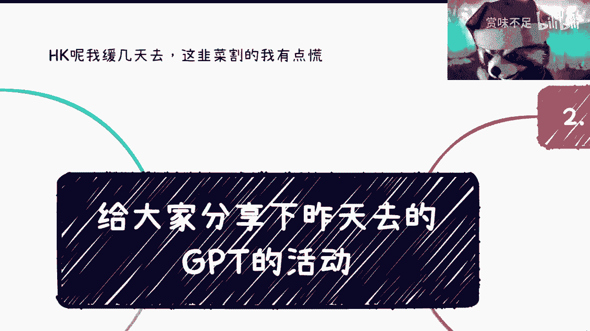

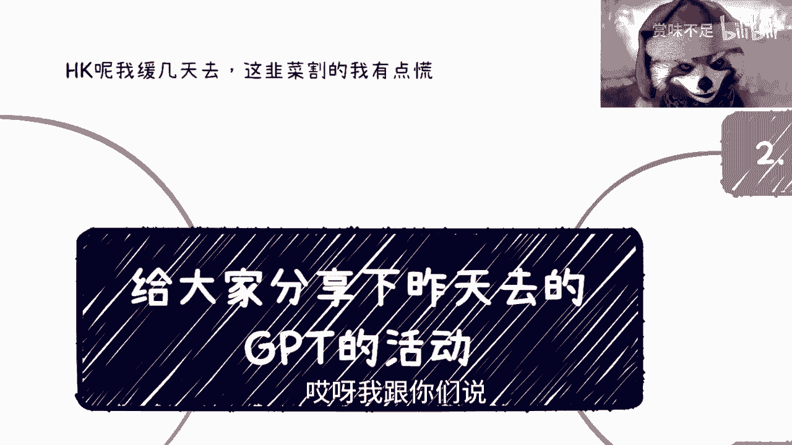

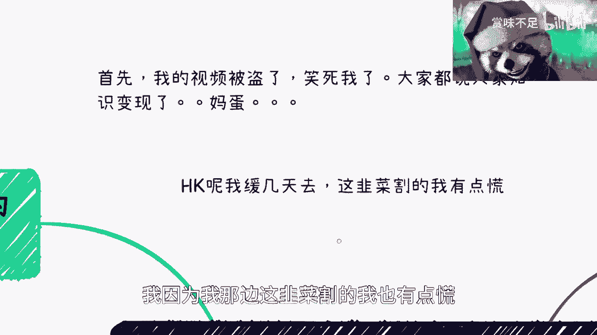

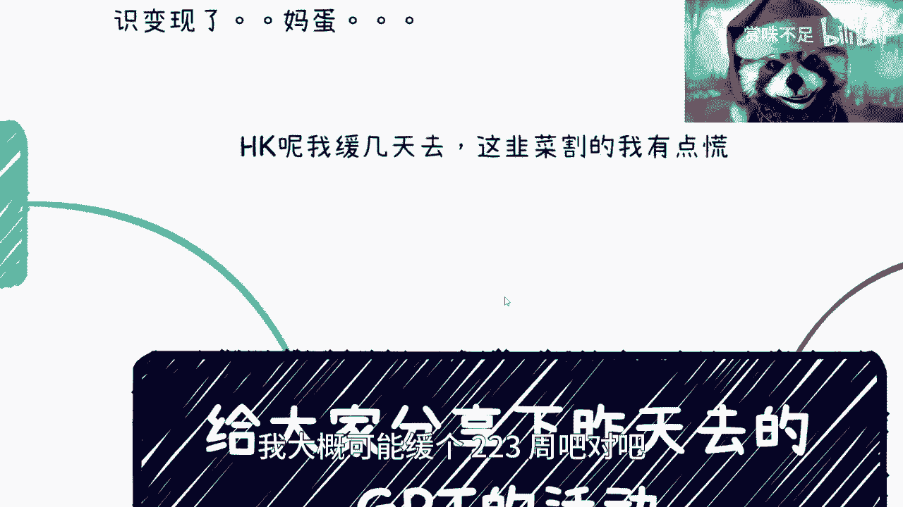

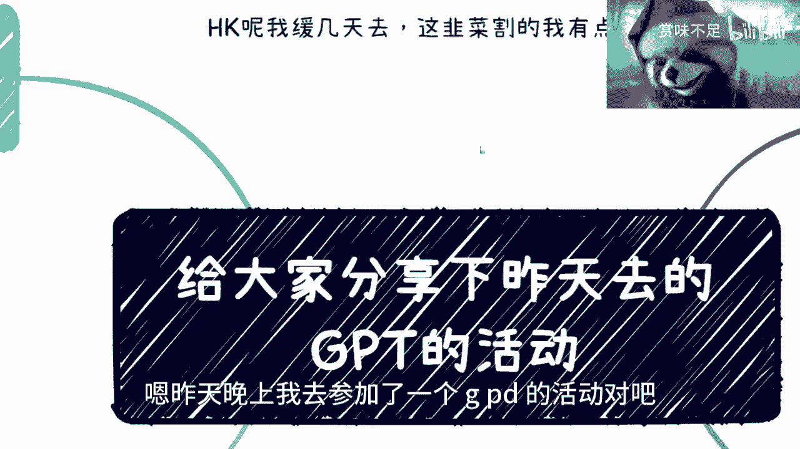

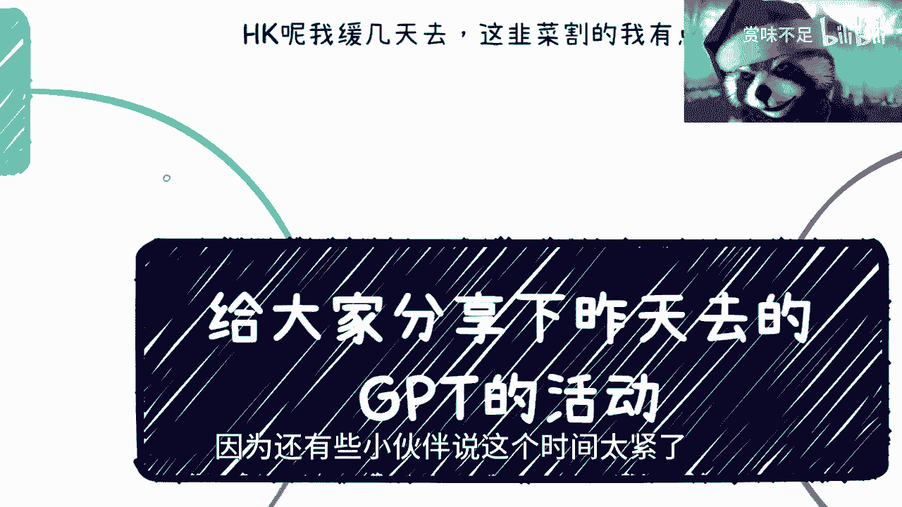

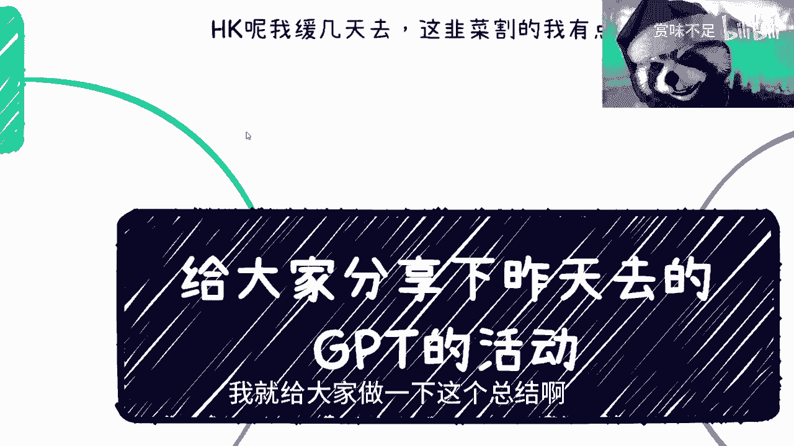

在本节课中，我们将一起回顾一次关于ChatGPT的线下活动，并探讨与会者的不同动机、普遍存在的焦虑，以及如何理性看待AI技术带来的机遇与挑战。我们将从多个维度分析，帮助你建立对AI工具更清晰的认知。

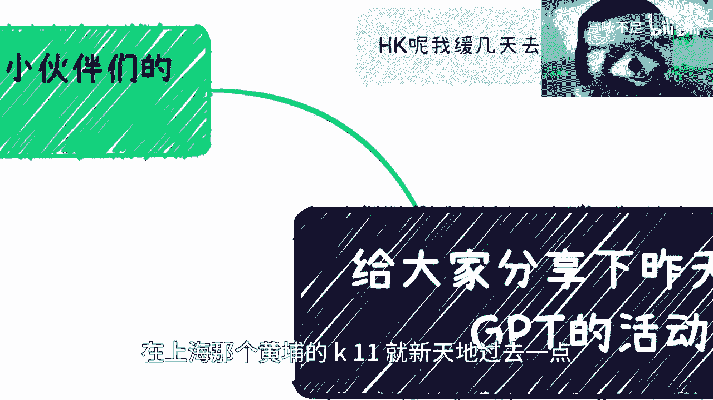

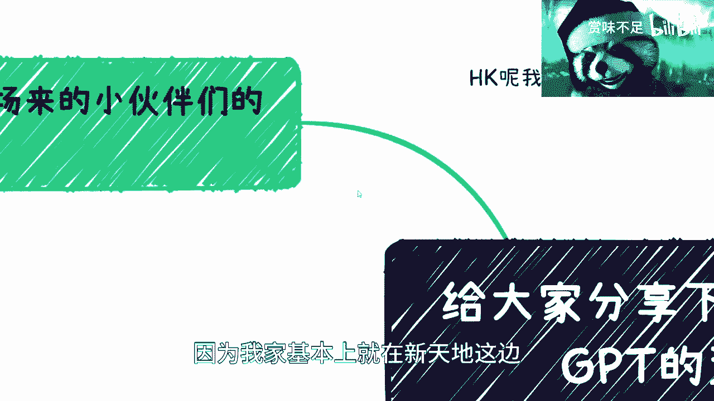

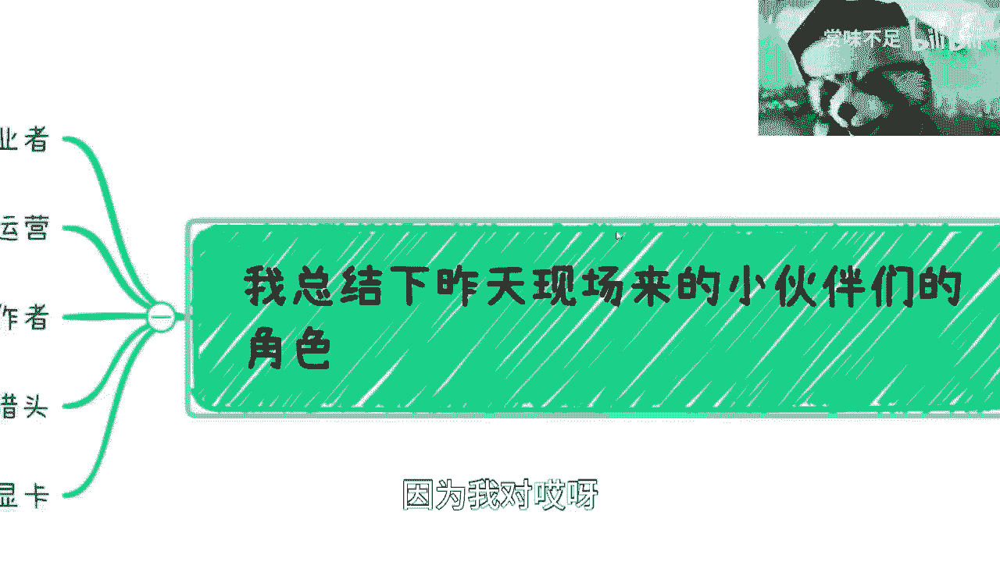

## 活动参与者分析

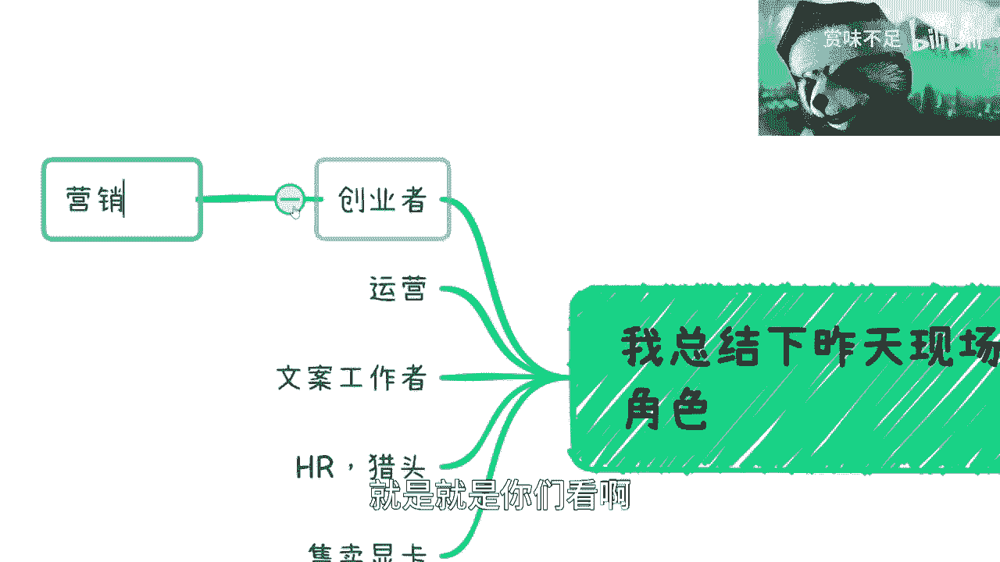

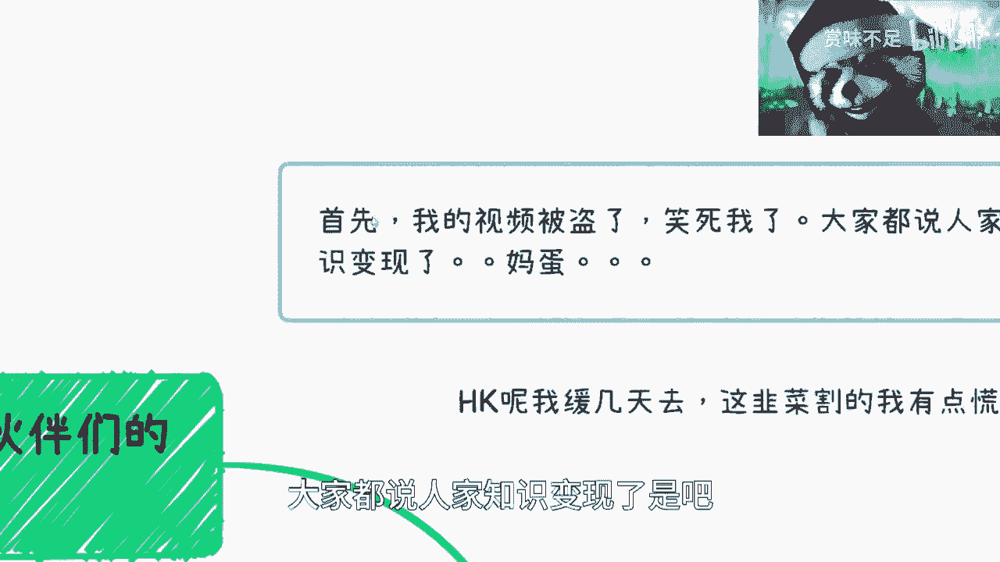

上一节我们介绍了课程概述，本节中我们来看看活动参与者的构成。活动在上海黄浦区K11举办，共有六七十人参加。

以下是到场人员的职业角色分析：

*   **创业者**：旨在推广自己的产品或服务。
*   **运营与文案工作者**：因担忧ChatGPT等工具对其工作构成威胁而前来了解。
*   **HR与猎头**：希望寻找相关领域的人才或了解行业动态。
*   **显卡售卖从业者**：关注大模型训练带来的算力与硬件需求。

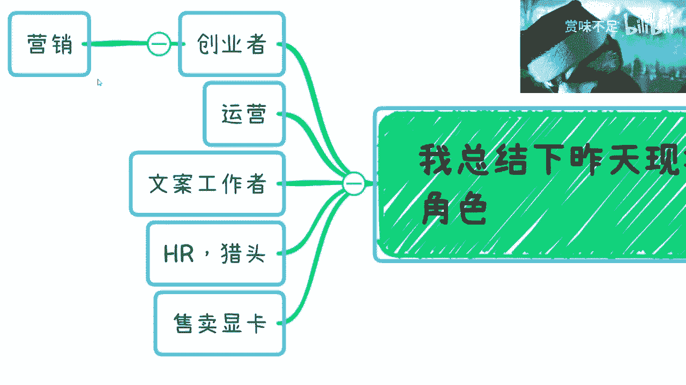

从不同维度观察，这些角色可能同时具备“提供价值”和“寻求机会”的双重属性。若站在更高维度审视，所有人的行为都可能被视为在特定市场规则下的互动。

## 现场观察到的普遍焦虑

了解了参与者的构成后，我们来看看活动中反映出的几种普遍焦虑情绪。

以下是几种主要的焦虑类型：

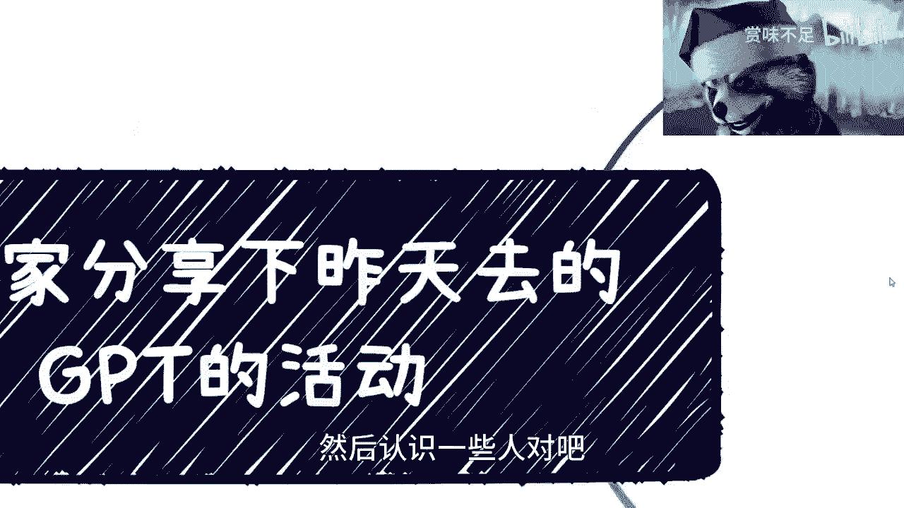

1.  **AI与哲学/意识的讨论**：部分人过度探讨ChatGPT是否具备人类意识。从技术角度看，当前的大语言模型本质上是基于海量数据训练的复杂数学模型，其运作原理与人类意识有本质区别。核心公式可简化为：`输出 = 模型(输入)`。
2.  **对人类岗位的替代恐惧**：担心AI会迅速取代人类工作。目前AI更多是提升效率的工具，而非完整的替代方案。它擅长处理模式化任务，但在需要深度理解、复杂决策和情感交互的领域，人类仍不可或缺。
3.  **信息不对称导致的恐慌**：由于不了解技术原理，容易受到夸大其词的信息影响，产生不必要的恐慌。
4.  **对错过赚钱机会的焦虑**：急于寻找利用AI快速获利的途径，担心落后于趋势。

## AI作为效率工具的应用场景

面对这些焦虑，我们该如何务实看待AI？本节中我们来看看AI在具体场景中如何扮演效率工具的角色。

以下是几个AI提升效率的实例：

*   **跨境电商**：AI可以高效完成多语言商品描述、营销文案撰写、用户评论分析等标准化内容创作工作，从而让从业者更专注于供应链管理、客户沟通等核心业务环节。
*   **文案与办公辅助**：将AI视为类似Office的高级工具。例如，它可以辅助生成邮件初稿、社交媒体文案、报告摘要等，但最终的质量把控、创意方向和策略制定仍需人类主导。
*   **数据分析**：AI可以快速处理大量数据，进行初步的清洗、分析和可视化，但如何定义问题、解读数据背后的商业意义以及做出决策，仍然依赖人的专业判断。

核心在于：**AI负责“执行”，人类负责“指挥”与“评判”**。在商业闭环中，AI目前更适合处理那些“必须有但非核心痛点”的环节。

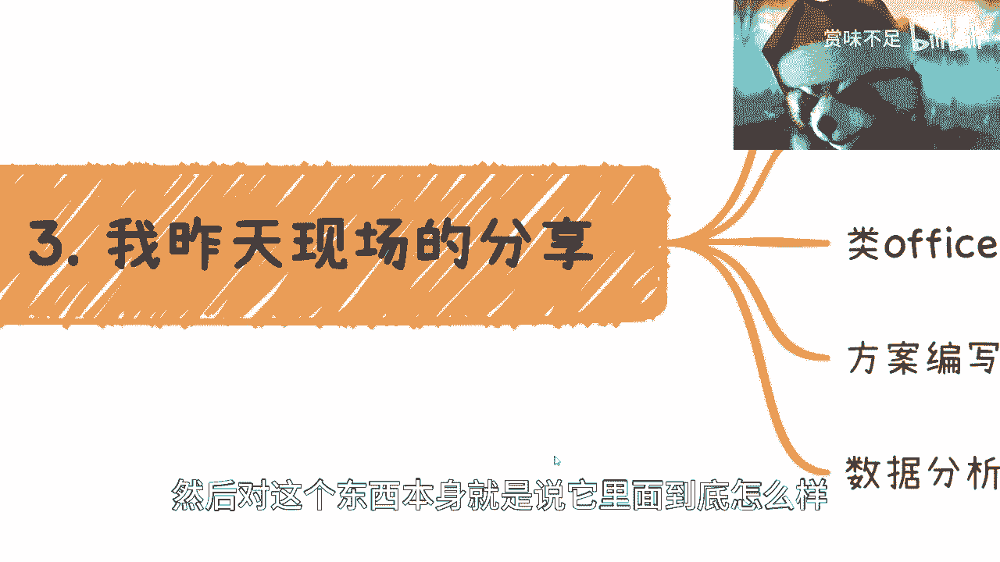

## 战略层面思考与行动建议

最后，我们不应只局限于具体工具的使用，更需从战略层面进行思考。本节我们将探讨如何在AI时代调整心态与策略。

以下是一些行动建议：

1.  **关注宏观趋势**：在国内发展，需关注国家在AI领域的战略方向与政策。全球范围内，国产化替代是一个重要趋势，例如办公软件与AI能力的结合。
2.  **保持开放与辩证**：避免陷入非黑即白的思维。对新技术、新观点保持开放心态，同时运用自己的知识进行独立判断，取其精华。
3.  **避免“救命稻草”心态**：不要将任何单一技术或机会视为唯一的出路。保持平和心态，持续积累知识和能力。
4.  **制定备用计划**：在任何决策中，都应考虑备用方案。世界变化迅速，拥有`Plan B`甚至`Plan C`能让你更加从容。核心策略是：`主要计划 + 备用计划`。
5.  **坚定核心三观但不自我封闭**：在快速变化的环境中，保持自己的核心价值观和判断力至关重要，但同时要避免因此将自己隔绝于新事物之外，错失学习和成长的机会。

## 课程总结

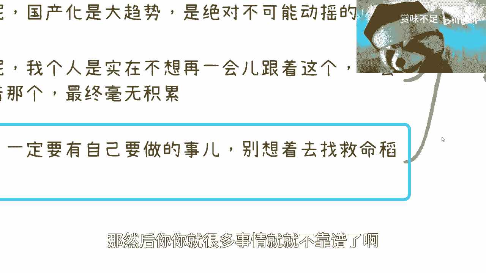

本节课中我们一起学习了对一次ChatGPT线下活动的复盘。我们分析了参与者的多元动机，剖析了常见的几类焦虑，并探讨了将AI视为效率工具在跨境电商、内容创作等场景的实际应用。最重要的是，我们强调了应从战略高度理性看待AI发展，保持开放辩证的思维，注重长期积累，并避免急于求成的“救命稻草”心态。希望本课程能帮助你更从容地面对技术变革，找到属于自己的行动节奏。