# 和大家分享下最近找我合作的经历和经验 - P1 - 赏味不足 - BV1Yi421i7wi

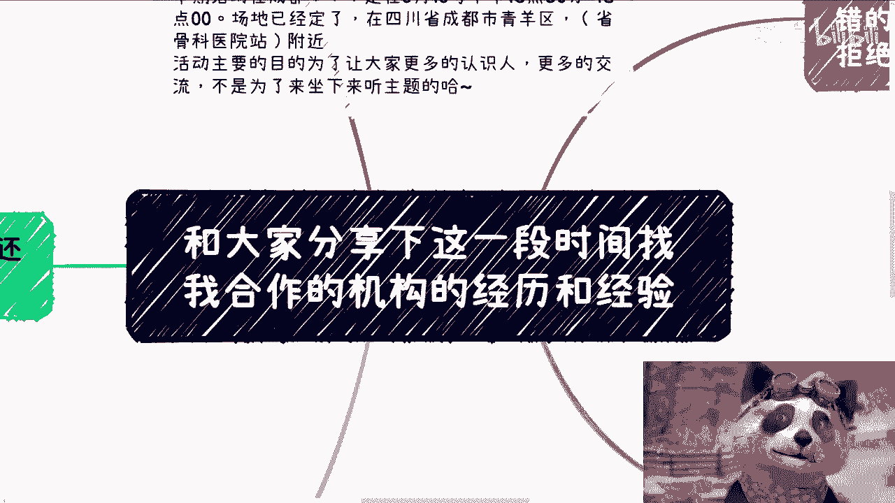

啊大家好啊，呃今天这个主题呢就稍微换一下啊，就是我跟大家分享一下，这一段时间可能近半年一年以来啊，找我合作的这个机构的一些经历啊，和一些经验啊，你们从这些这个发生过的。

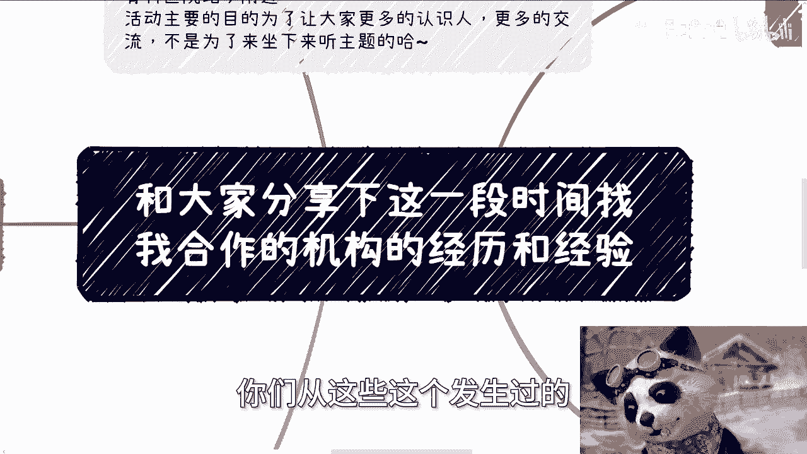

真真切切的这个事情上面呢，你们肯定也能得到一些这个经验的增长啊，那么首先呢成都活动已经定了，在6月16号就是本周日啊，本周日哎是本周日啊，本周日对，因为15号我要给那个上交，上上海数据交易所上课呃。

本周日啊，下午01：30到六点好吧，场地已经定了，然后在青阳区附近好吧，然后要报名或者了解详情的，你们可以咨询我啊，啊可以私信我啊，首先第一啊。

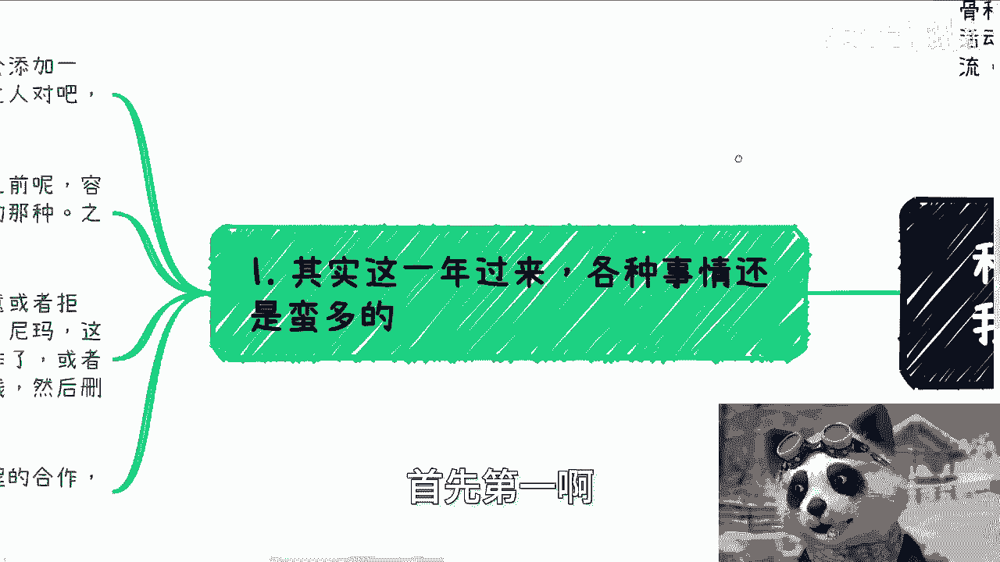

呃其实这一年以来呢各种事情蛮多的啊，就我们一个个来说，哎这故事嘛说来很长，就现在呢我每次活动啊，其实参加过的都知道，我给大家发详情的时候呢，都会添加一句，就说你们在见面之前尽量不要添加陌生人啊。

这个是有原因的，什么原因啊，首先在我看来啊，大家见完面了都有自己的判断，都是成年人啊，你们想怎么被骗，想怎么被骗，跟我没关系啊，但是见面之前容易出现一些销售，无脑推销或者说骗局的这种。

我觉得我还是有责任的啊，所以说呃而且之前活动还出现过一次啊。

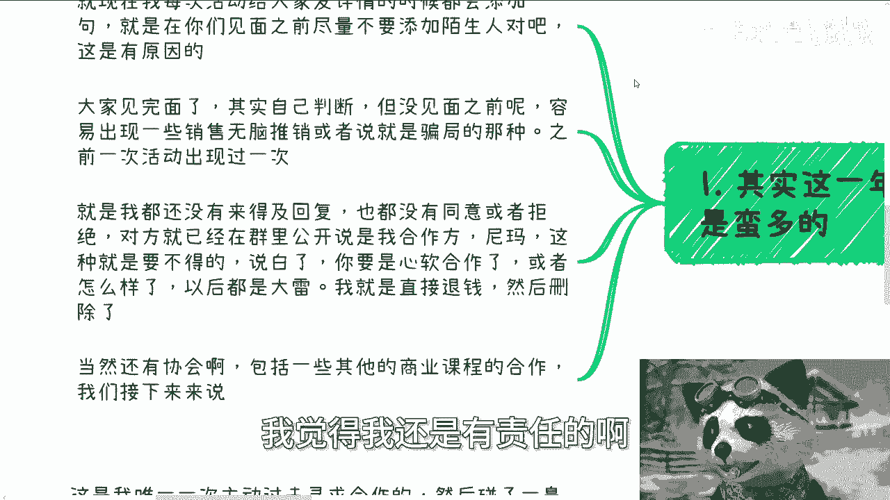

就是我都还没有来得及回复啊，那个人给我发了一条微信啊。

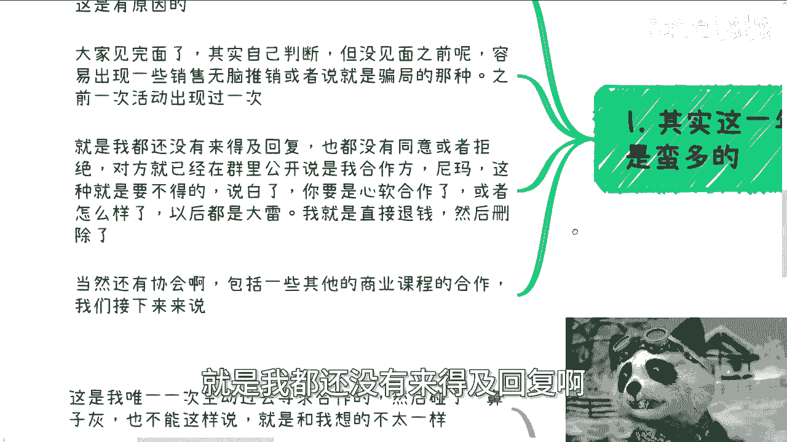

N条微信应该说我还没来得及回复，也就是说我都没有同意或者拒绝啊，对方就已经在群里面公开说是我的合作方，卧槽卧槽牛逼啊对吧，我跟你讲这种就是要不得哦，要果断，我跟你讲，你要是心软了或者怎么样。

以后就是大雷啊，我跟你讲，我先在微信，我跟他说了，OK删掉拉黑钱我也退了，然后群里面退踢掉，结束了。

我一句话都不想BB啊，当然啊额这过程当中呢找我合作的还有协会啊。

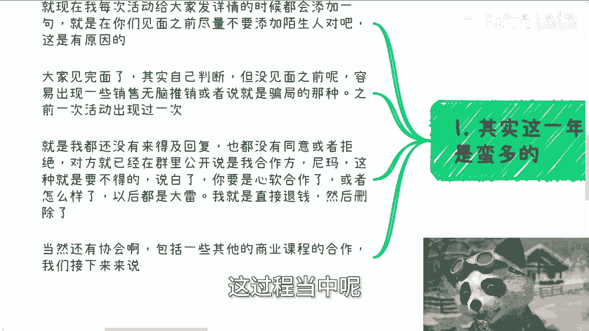

包括一些什么商业课程的合作啊，我们接下来慢慢来说额机构的合作啊，其实一开始呢我跟你们讲，真的谈的不错的，都已经谈了有七八十了。

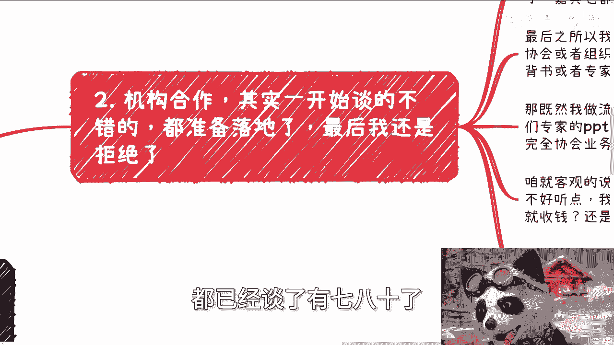

最后我还是没做呃，其实大概之前有一次就上一期上海的活动，那一期啊，呃大家可能会看到我跟和协会的合作，然后呢会做一个线下活动，而且呢我都已经去过两次了啊，登门拜访两次了，嘉宾都订好了。

但是最后你们在线下看到的上海的活动，还是没有这个协会啊，最终我为什么没有做呢，是因为对方协会或者组织呢，虽然啊对方是一个协会或者组织，但是合作的本质还是我需要他们出一些背书，或者需要一些专家啊。

我来做流量。

因为我本来想法是什么呢，就是他们能给我，比如说啊带来一些，就是就是我个人带不来的一些服务对吧，或者说能够给大家带来一些申报项目啊，或者怎么样子啊。

那我想想拉他们入拉进来一起做嘛对吧，那大家做做大嘛啊，那既然我做流量，那他们出的内容出的东西我还得把关嘛啊，我提前审核了他们的PPT，怎么说呢，我跟你们讲这个PPT他妈的审核完。

我就我就直接他妈的一大概四五条语音，就直接我我跟你们讲，真的我一点面子都没有给直接骂过去啊，就是他妈的这PPT从头到尾，就是一个完全的协会的业务，跟一个服务的业务的介绍，说白了就他妈是一个商业的。

一个一个一个推广啊，然后甚至他来了还要问你们收钱啊，我就咱就这么客观的说，我认为你协会要收钱没问题，但是你要循序渐进吧，你不是他妈的上来就割吧啊而且说不好听点，我是熟悉的，就你们对我是熟悉的啊。

但是你们对协会不熟悉啊，哦第一次跑过来就收收钱，还他妈线下手，卧槽这他妈怕不是传销啊，对吧，第二就算真的要收哦，我他妈我自己不会收吗，怎么了呢，我他妈非要把这个钱分给别人，对不对，就是我觉得合作没问题。

收钱也没问题，但是你收的要有名就收的，要让别人有价值，对不对，你你合作就好好合作，讲内容就讲内容，你不要他妈的内容不讲了，上来就是个纯商业推广，那我觉得就是吃相太难看了，所以我最后就是没有让他们来啊。

就可能可能我也可以告诉你们，就就最后就属于就直接翻脸翻脸的啊。

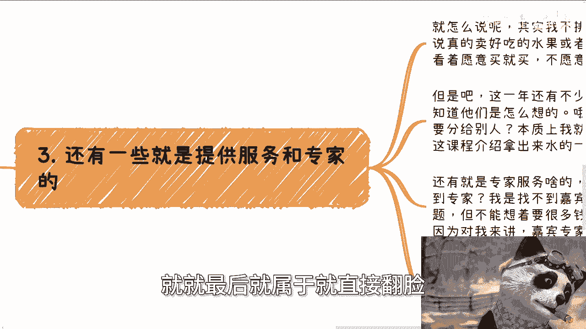

第三还有一些呢就提供服务跟专家的，就怎么说呢，其实我不排斥合作来卖东西，比如说你说你真的有个很好吃的水果，或者说是一个日日日用品，我也可以卖啊对吧，比如说你们所有人哎，你看着愿意买就买。

不愿意买拉倒没问题啊，但是啊这一年还有不少来卖课的，我说真的啊，第一我又不是看不出这些课程的这个品质对吧，第二要真的卖，是他妈我不会卖呢，还是我他妈卖不来呢，还是说我我我我怎么地呢，对吧哦。

还是说我卖了非非得非得把这钱分给别人呢，我早就说过了，本质上我就不愿意卖，这种叫什么，就是就是就是就是一个东西解决1万个人。

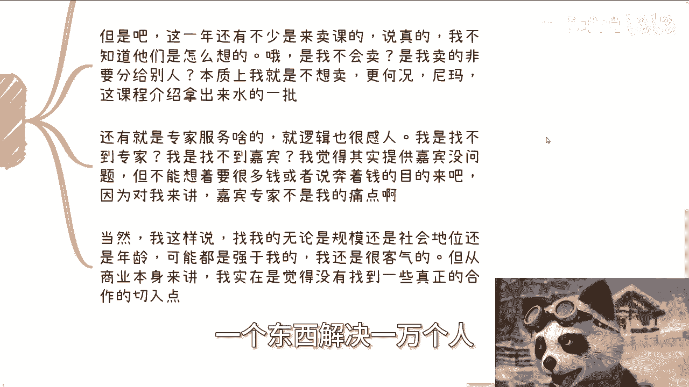

解决10万个人的问题，他解决不了啊对吧，更何况这些课程他妈介绍跟课程内容拿出来。

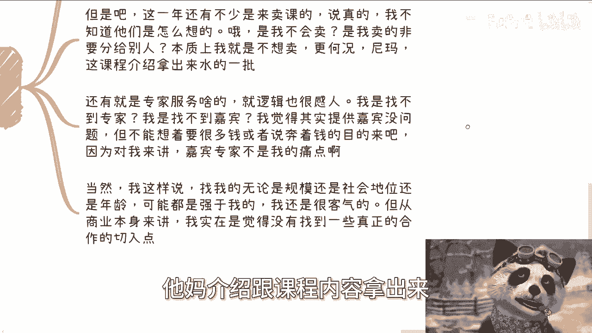

他妈水的一逼对吧，还有就是专家服务啥的，我跟你讲啊，逻辑也很感人，哎我是找不到专家吗，啊我是找不到嘉宾吗，还是说我觉得我觉得一些别的问题呢，就是说提提供嘉宾，我觉得没问题，但是你不能想着哦。

因为你提供嘉宾了，所以你想从我这边拉很拿很多的钱，或者说你就为了奔着来割我韭菜的目的来吧啊，因为对我来讲，对我的整个商业逻辑来讲。

嘉宾不是我的痛点啊，我缺嘉宾吗，我不缺啊，啊当然我这样说，找我的，无论是额规模啊，无论是规模还是社会地位还是年龄上，都是强于我的人哦，我还是很客气的，但是从商业本身来讲，我觉得我实在是觉得。

没有找到一个真正能合作的切入点。

就是我跟他们有的可能的确啊，之前闹了些矛盾，或者说有的呢就是说还是你好我好。

大家好的，但是最终都是没有合作起来，因为合作起来你们肯定会看到我推广的嘛对吧。

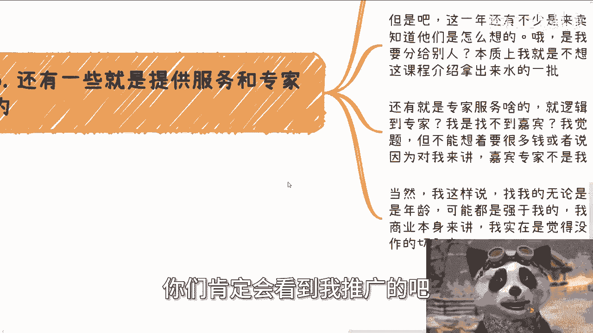

我到现在什么都没推广过。

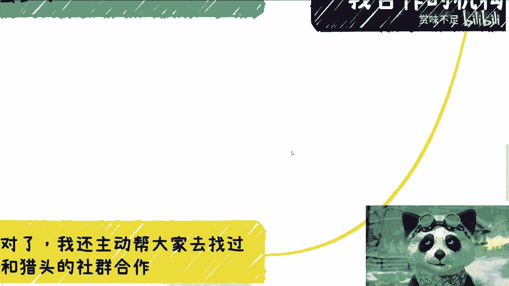

好那么第四我还主动帮大家去找了hr跟猎头啊，我跟你们讲啊，这是我唯一的一次主动出去寻求合作的，然后碰了一鼻子灰啊，当然也不能这么说啊，也不能说碰了一鼻子灰，就是说可能跟我想的不太一样，我原本想的是什么。

就是好好介绍一下现在的进展，大家聊一聊，然后比如说聊一下，比如说我这边可以给大家给他提供一些啊，这个流量对吧，然后他那边呢可以给我提供一些，hr跟跟猎头的这个服务对吧，然后聊一下可能怎么合作对吧。

然后包括怎么分润啊，怎么样子啊，那么我想着可能比如说聊半个小时一个小时嘛，卧槽结果我去了10分钟就解决战斗了，我跟你们讲，为什么，因为对方直接上来就否定了我的想法，然后呢我也认可，我也认可，为什么呢。

原因很简单，因为不赚钱以及周期很长，他跟我说了，他说陈老师，你不太了解目前当下猎头跟hr的这个行业情况，呃，首先HC就head account很少介绍，也很难承担给钱的门槛很高。

你比如说啊你说要过试用期额。

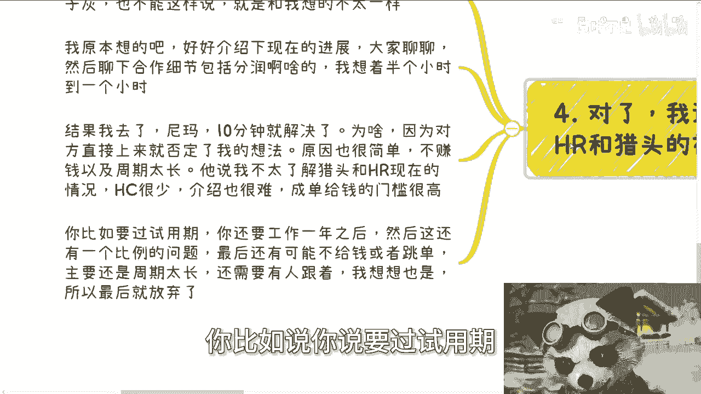

有的小的试用期三个月，大的试用期六个月对吧，你还要工作，甚至有的要工作一年之后，然后呢你拿的钱呃，你工作一年之后，你想要能过试用期，并且能供能能留到一年之后，这已经是个比例问题了，已经是个漏斗了对吧。

然后呢在这些漏斗里面呃，还有可能不给钱或者跳单，主要还是周期太长，比如说要半年一年啊，还是有人跟跟着对吧，那么这个成本到底我出他出呢啊。

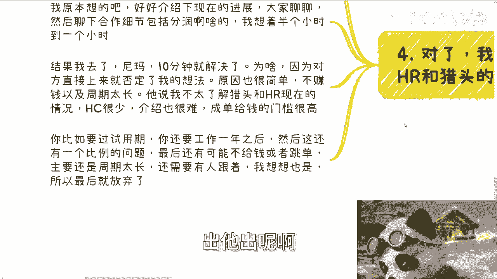

那我想想也是，那最后就谈了10分钟就就就放弃了啊，那么第五点就是总体来讲啊，我觉得目前我身边和呃沟通下来，合作下来的都在摸索更多的变现逻辑呃。

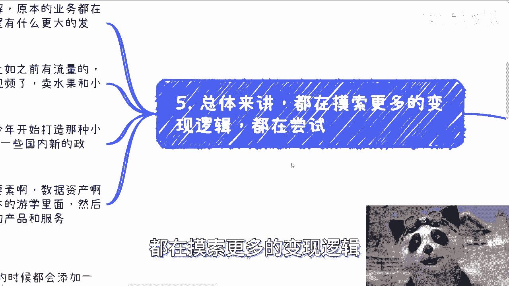

都在开拓新的市场，就我聊下来啊，大家可以这么理解，原本的业务都在做，或者还说都在正常的做，但是他们已经不指望，原本的业务有更大的发展了。

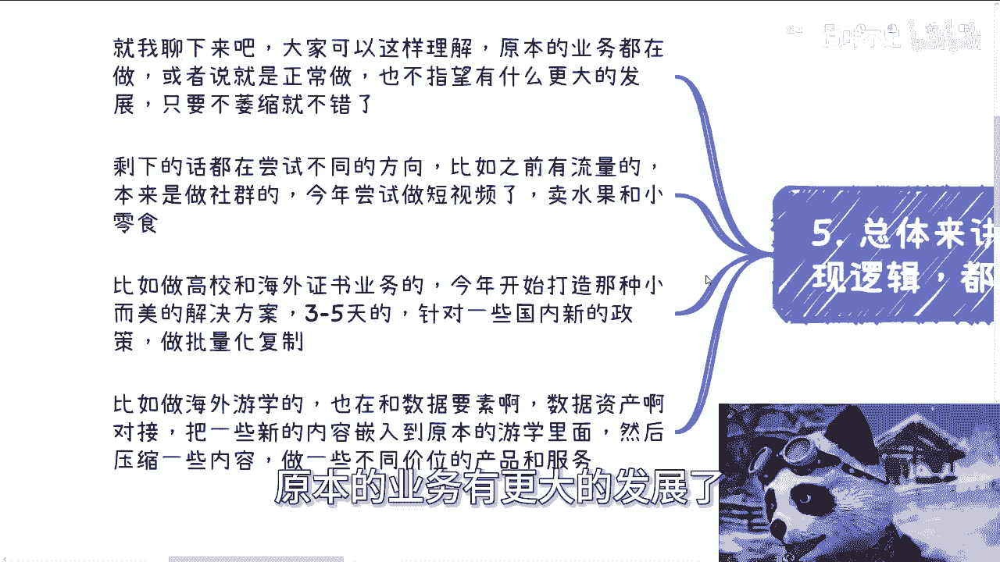

只要不萎缩就好就不错了，那么剩下的话都在尝试不同的方向，比如说之前有流量的，本来是做社群的，今年开始尝试做短视频啊，去年开始做尝试做短视频。

卖水果和卖小零食啊，比如说做高校跟海外证书业务的，今年开始打造那种小而美的解决方案，3~5天的，然后针对国内一些新的政策，比如说数据要素啊对吧，数据经济啊，数字经济啊，做批量化复制啊。

比如说做海外游学的，也在和数据要素，数据资产对接哦，把一些新的这种叫什么，就是前言之类的，这些内容呢劝到原本的这个游学里面，然后压缩一部分的内容，比如说它原本内容是50呃，是是80万啊。

做大概呃这个这个留学，然后国内做几天，海外做几天呢，那么他把一些新的东西这个欠进去之后呢，他比如说把80万做到那个1万啊，或者说做到5万就就压缩一点，把把把这个钱单价做低一点啊，然后他要组合出。

就是不同的这个价位跟服务的这个产品，就是说白了原本的业务呢，其实都在都放着继续做，但是呢都在寻求在原本的业务之上，或者在原本业务的积累之前提之下，看看能不能有些新的业务的拓展，现在都是这个样子。

等好吧，那么所以说我觉得就是说嗯反正到目前为止，你们也看到了，就是商单我也不接的啊，就接了两个，就是那个之前卖书的，反正也很早了呃，都是清华大学出版社的，然后那个前两天给那个书交所打了个广告对吧。

因为毕竟我要去上课嘛，那么给他们打个广告也没什么问题嘛，啊剩下的你们就看嘛，到现在我一个单子都没打过对吧，我我一个一个什么卖东西，我也没卖过，什么都没有，为什么，因为我实在觉得不合适，就是我觉得两方面。

一方面是我觉得不合适，另一方面是他妈的他们提供的东西的确没价值，他但凡有一个有价值的，我哎其实我觉得也蛮好的，有啥呢对吧，那赚钱有啥呢，对不对，那他妈没有啊，哎呀我也很苦恼啊，知道吗啊行好吧。

那就这么着啊，然后那个成都活动6月16号好吧，下午01：30到六点啊，那个报名和详情的你们可以咨询呃，私信我啊，然后那个啊商业规划啊，商业规划和职业规划啊，分红啊，分润啊，呃期权啊，合同啊。

商业计划书啊，呃呃白皮书啊对吧，包括就是说你们有手上有什么牌，你们没有什么牌，你们希望通过跟我的沟通，跟我的一些呃这个这个咨询啊，能够给你们定出来，或者找到一些更符合当下中国接地气的发展的。

一些道路跟方向的话，那么你们可以这个整理好个人的问题跟背景，我们再来走咨询好吧，那如果来说你们想通过单纯的通过咨询啊，什么财务自由，然后什么什么什么想伸手党对吧，不不就是不劳而获。

那你们就别来找我了好吧，我我也没这个本事啊。

