# 课程一：创作者合作避坑指南 🚫

在本节课中，我们将要学习一位创作者在过去一年中，与各类机构、个人寻求合作时所遇到的各种情况、陷阱和决策逻辑。通过分析这些真实案例，你将了解在寻求商业合作时，如何识别不靠谱的伙伴、坚守自身原则，并找到真正有价值的合作模式。

---

## 活动通知与背景

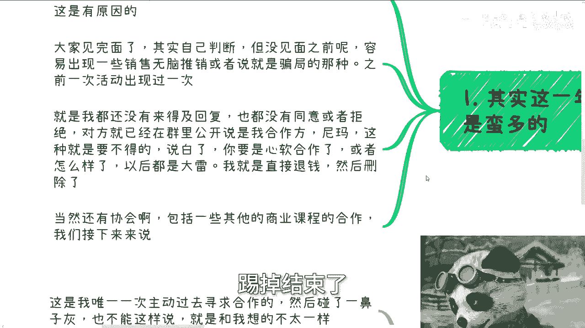

成都线下活动已确定于6月16日（本周日）下午1:30至6点举行，地点在青羊区附近。如需报名或了解详情，可以私信咨询。

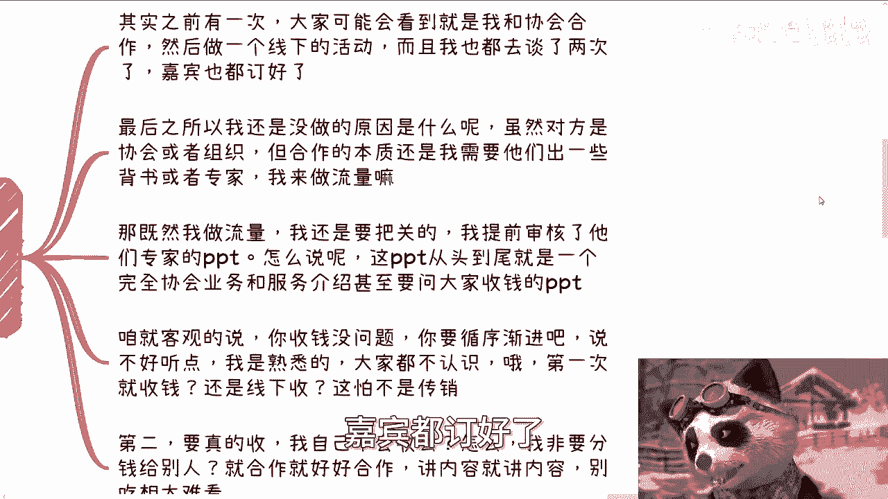

近期，有合作方在未经我明确同意的情况下，便在社群中宣称是我的合作伙伴。对于此类行为，我的处理方式是：**在微信中明确拒绝、退款、删除拉黑，并将此人移出社群**。我认为，在大家见面形成自己的判断之前，我有责任防止此类推销或骗局的发生。

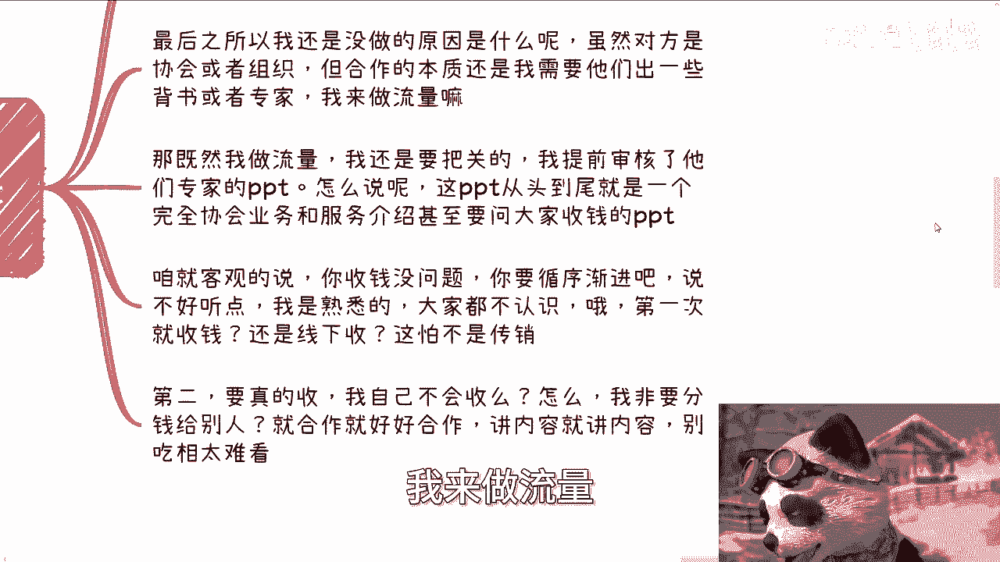

## 与协会合作的失败案例

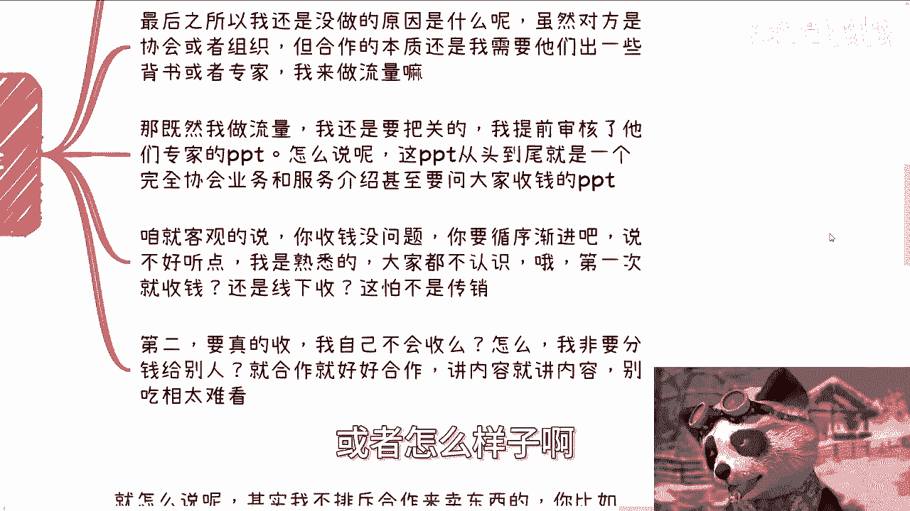

上一节我们介绍了处理不靠谱合作方的基本态度，本节中我们来看看一个更具体的、与正规协会合作却最终失败的案例。

我曾与一个协会深入洽谈合作，甚至登门拜访两次并确定了嘉宾。合作初衷是：他们提供我无法单独提供的**背书、专家或项目申报服务**，而我提供**流量**。公式可以简单表示为：

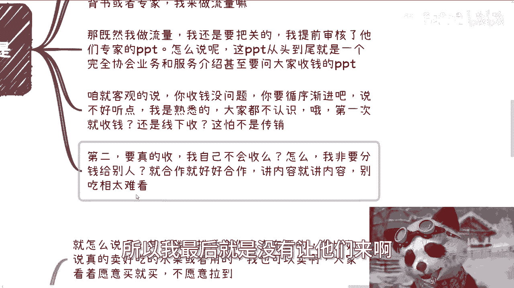

**理想合作模式 = 他们的独特资源 + 我的流量**

然而，在审核他们为活动准备的PPT时，我发现内容完全偏离了初衷。

以下是该PPT存在的主要问题：
*   **内容变质**：PPT从头到尾只是其协会业务和服务的商业推广，而非有价值的分享内容。
*   **急于变现**：计划在第一次线下见面时就向参与者收费，方式激进。
*   **价值缺失**：未能提供与我流量相匹配的独特价值，吃相难看。

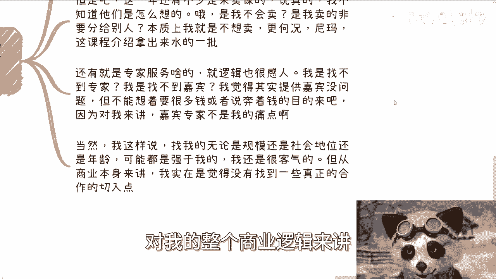

因此，我最终拒绝了这次合作。核心在于：**合作与收费都需要建立在提供明确价值的基础上，否则就失去了合作的意义**。

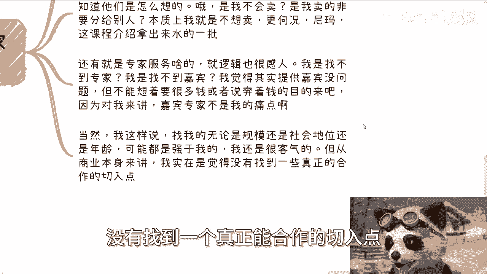

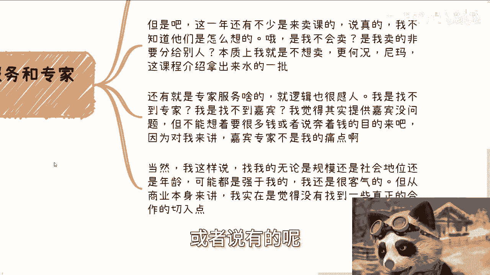

## 其他常见的合作类型与拒绝原因

在拒绝了协会合作后，我还遇到了多种其他类型的合作邀约。以下是几种典型情况及其被我拒绝的原因：

*   **售卖低质课程**：对方希望借助我的渠道售卖课程。我拒绝的原因有二：第一，我能判断课程质量不佳；第二，如果真要售卖，我自己完全有能力操作，无需让他人分利。更重要的是，我**不相信单一课程能解决大量人群的个性化问题**。
*   **提供专家服务**：对方提议提供嘉宾或专家资源。但问题在于，**嘉宾并非我的核心痛点**，我本身不缺嘉宾。这类合作往往伴随着不合理的分润要求，实质上是想收割我的流量，而非提供我需要的互补价值。
*   **主动寻求的HR/猎头合作**：这是我唯一一次主动出击寻求合作，希望对接我的社群与招聘服务。但会谈仅10分钟就结束了，因为对方指出了该模式的根本缺陷：**周期长、成单率低、收益不确定**。用公式表示其商业逻辑的脆弱性：
    **潜在收益 = (入职人数 × 佣金) × 过试用期概率 × 回款概率**
    由于每个环节都存在漏斗和不确定性，导致最终难以形成稳定盈利模式，因此合作未能继续。

## 市场现状与个人原则

上一节我们分析了几类具体的合作陷阱，本节我们来从更宏观的视角看看当前市场的普遍状态。

根据我的观察和交流，目前我身边的创作者和机构都在摸索新的变现路径，开拓新市场。大家普遍的状态是：**维持原有业务，但不指望其有大的增长；同时，积极尝试基于现有资源的新业务方向**。

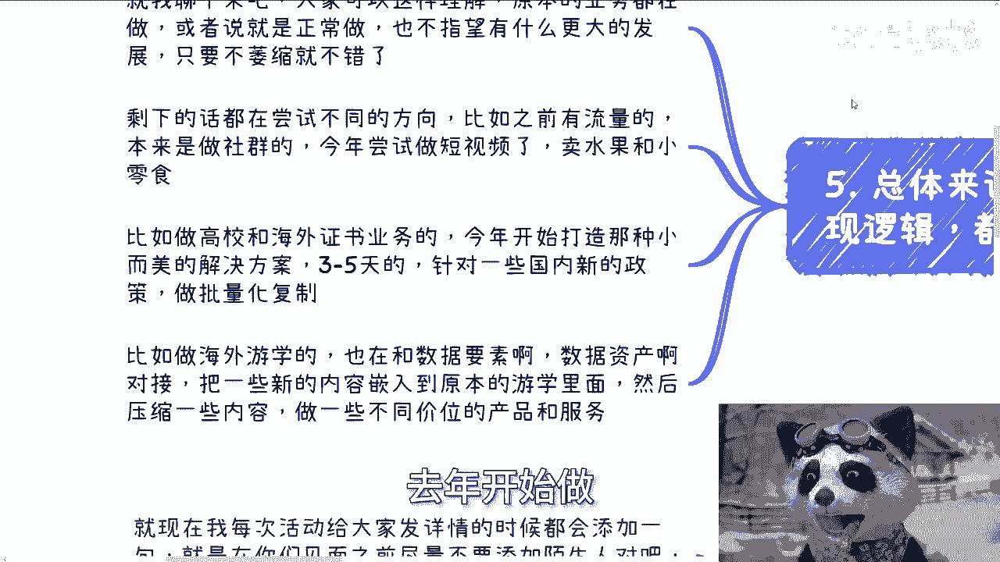

例如：
*   做社群的，开始尝试短视频带货（如卖水果、零食）。
*   做证书培训的，开始打造针对新政策（如数据要素）的短期、轻量解决方案。
*   做高端游学的，尝试将新概念融入产品，推出不同价位的组合套餐，以覆盖更广人群。

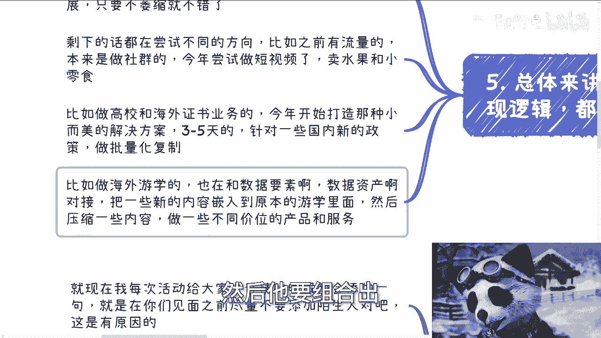

在这种环境下，我对于商业合作非常谨慎。至今为止，我仅接过两个商业推广（均为早期与清华大学出版社的合作，以及因授课而为上海数据交易所做的宣传）。我拒绝其他合作的原因很明确：
1.  **我觉得不合适**：合作模式或调性与我的社群不符。
2.  **对方提供的价值不足**：未能提供让我觉得值得为其背书的产品或服务。

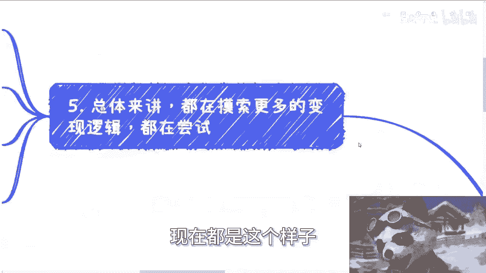

## 课程总结与咨询服务

本节课中我们一起学习了如何甄别商业合作中的陷阱。总结起来，关键在于：**明确自身核心价值与需求，对合作方提供的价值进行严格审视，警惕任何急于变现、价值模糊或试图收割你流量的提案**。

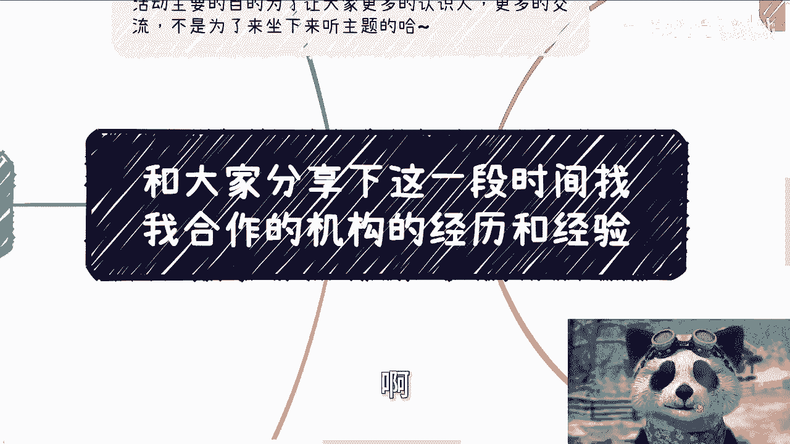

最后，关于个人咨询：如果你在**商业规划、职业发展、股权设计、合同或商业计划书**等方面需要针对性的建议，希望找到更接地气的发展方向，可以整理好个人问题和背景后联系我。请注意，咨询旨在提供思路和方法，无法实现“不劳而获”或保证“财务自由”，伸手党请勿扰。

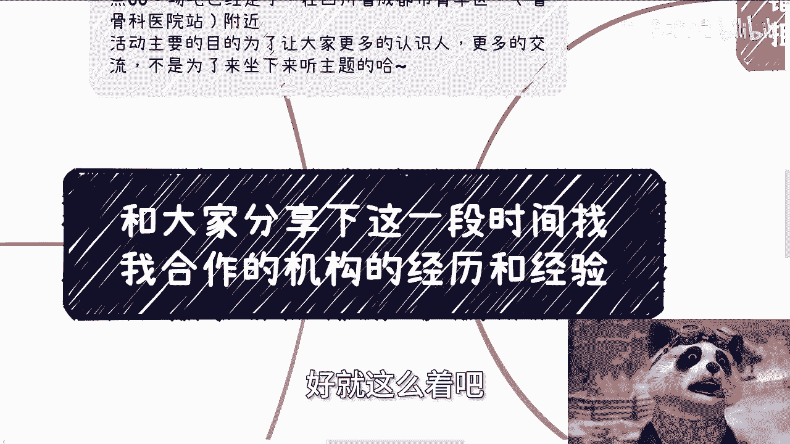

成都活动再次提醒：6月16日，周日下午1:30-6点，青羊区附近，欢迎私信报名。