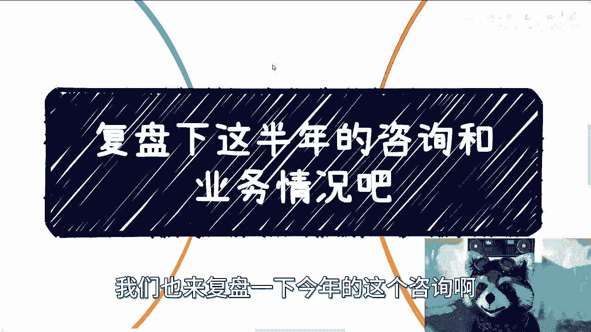
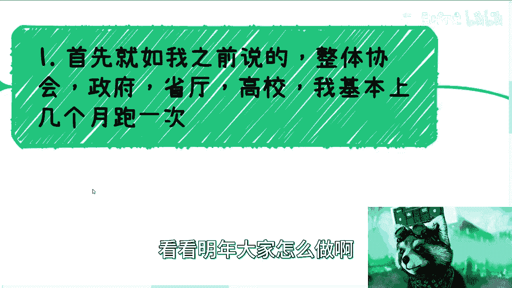
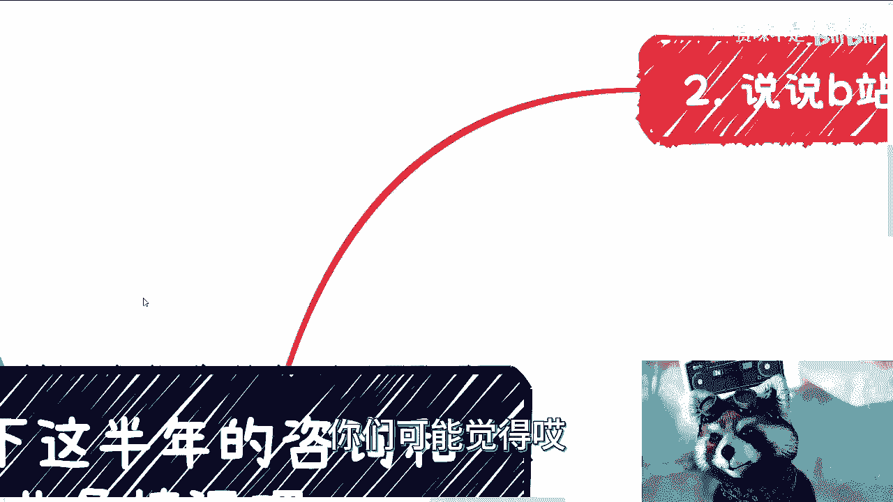
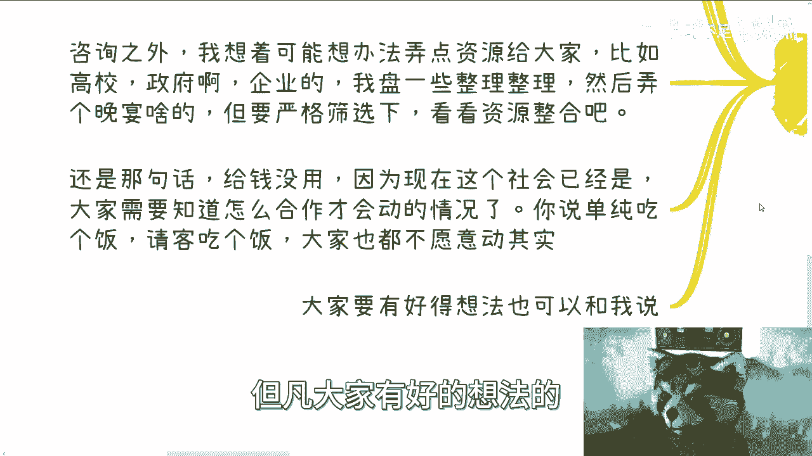
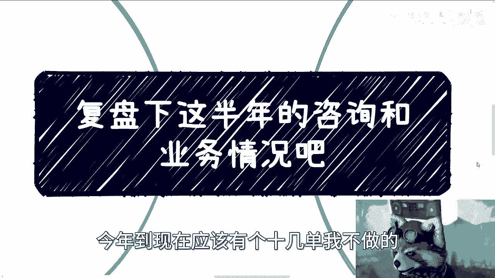
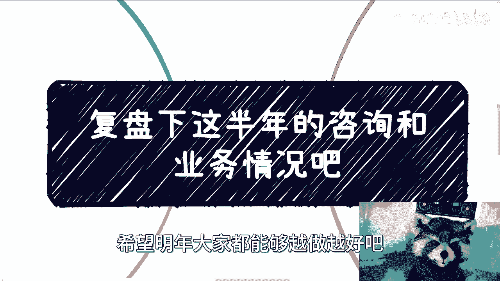

# 和大家复盘下这半年的咨询和业务情况 - P1 - 赏味不足 - BV1Wc41117fS

大家好，我回上海了，据说刚回来就下雪了，我想着多看一天，唉真想着上海应该也能下啊，呃我这个年底了，我们也来复盘一下今年的这个咨询啊。

还有一些业务情况呃，首先呢就如我之前说的啊，整体呢呃我差不多每隔一两个月啊，这个协会啊，政府啊，省厅啊，高校啊，我基本上就是可能会跑一下，跑一下呢，呃也没有什么具体业务啊。

就是过去聊一聊有没有什么最新政策好，看看明年大家怎么做啊。

反正也谈得7788了啊，呃我觉得呢本质上是什么呢，就是我要去同步情况，因为最终呃我这边也写了，就是我们作为老百姓，作为个人最需要的就是时时刻刻去跟政府，高校机构啊，协会啊，资本啊等各方面的这些人呢。

保持高度的信任以及合作的关系，因为我们那就像我一直说的，我们自己心里得有B数嘛，就是说我从合作上面来讲，大家是互帮互助的，但是你从整个链路上面来讲，本质上我还是他们的工具人对吧。

那么同样的你要我这边提供给他们什么信息吧，说实话很少，因为我这边很多信息对他们没有什么帮助，更多的是我只能从他们这边获取信息，那么当然了，就是说他们给我信息之后呢，我可以作为他们相互之间的桥梁。

因为他们之间是不会沟通，不会交流的啊，那么我可以给他们一些信息啊，那也算我的价值啊，那么整体情况呢我也一直跟大家讲，就是要预算没预算，要case没case啊，要么就是各种已经计划好的项目呢。

呃不停的delay啊，不停的延期，这就是现状啊，你还是那句话啊，就是你们要是觉得呃这个是悲观，那就悲观无所谓，我不想去说服任何人，我也乏了啊，累了啊，你们要是觉得这是客观情况，我愿意跟你们讲的对吧。

然后你们愿意听的啊，你们就听啊，那么不过业务上呢对我来讲呢，我觉得本质上都差不多，今年呢呃虽然差做还是做了一些的，比如说深圳这边的这个深港澳的金融科技师啊，这个我做的啊，上师呃。

当然里面区块链的部分我做的啊，上师大的前沿科技的这个培训啊，也做了，那中观村的元宇宙啊，广东省出版相关的这个课程，反正也做了啊，也都是我做的呃，只不过整体来讲呢比去年少很多啊。

那么说实话呢今年呢其实蛮多呃，其实是多了蛮多的合作方的，但是大家蓄蓄势待发嘛，就跟我跟你们讲的，就是大家可能都是在磨啊，都是在讨论，比如说2024年应该怎么个做法，什么什么玩意嗯。

OKOK然后呢就是这个呃啊对，然后就说满足的合作方，为什么啊，因为就如我之前也跟大家说过，大形势不好，很多呢以前不愿意合作的呢，其实现在愿意合作的，为什么呢，是因为大家要抱团呢，不报团不报团都活不下去。

怎么怎么怎么搞，对不对啊，那么部分呢以前做国内业务的合作的人呢，其实从下半年开始也也陆续开始撤离了，呃，慢慢慢慢的做一些这个国际的业务，这个事呢我觉得也算一个方向啊，我觉得倒也没什么毛病啊。

也算是给大家一个怎么说呢，也算是给大家一个一个一个一个一个切入点吧，啊然后最后就像我说的，就是说为什么我一直跟你们强调的要去社交，为什么我一直强调的要高举高打对吧。

就是因为就是说我们真正能获取有用的信息的，其实是从这一部分人身上获取的啊，你每天在那边听他妈这个人吹逼，那个人吹逼没有用的啊。

当然了，就是我只能说你们年轻的时候，你们可能觉得哎呀这个人说的有道理。

那个人说的有道理，但实际上本质上等你们稍微有点经验之后，你们就会知道没什么用啊，那么第二呢我们说说B站的这个咨询，首先啊我以前也说过大锅饭的内容呢没有用啊，因为你同一套解决方案，比如说我今天出一门课啊。

我说什么什么什么，比如说商商业365行对吧，或者什么东西啊，这个东西没有用，为什么，因为你说不好听点，我给你们卖，卖99也好，199也好，哪怕卖999也好，你们买了去，其实对你们每个人用处多大吧。

我觉得微乎其微，为什么，因为你同一套东西对于每一个人，他不可能都有用的是吧，你比如说今天如果100个人买了啊，那可能比如说30个人觉得有用，那你回头我跟你说，这种东西是这样子的，但凡比如说有1亿。

也不要一一百万人买，我跟你讲，可能30万人都没有的，就是可能也是小几千人，几万人对吧，觉得有用，因为这种东西没有办法的，每个人的情况天差地别啊，然后所以说我一般就咨询之前呢。

我都会问大家要一个word去介绍自己啊，然后通过沟通啊，通过我们的交流对吧，因为呃这个交流其实无所谓，面面对面的，因为本身就是大家通过这个语音上的这个沟通，我也基本上能知道，就是你是怎么样一个人嘛对吧。

包括呃是否强势啊，是否弱势啊，是否就自信啊，还是怎么样的，是怎样一个人嘛对吧，那当然做到现在基本上还是男性居多，男性居多，但是比例其实不是特别悬殊，那么基本上从对方的这个语言组织能力，声音啊。

话术综合思考能力以及过去的一些情况呃，就能判断出来啊，所以说呢就是我为什么需要很多人提供给我，更多的信息，其实啊那不提供也没关系，就是我我我咨询的时候我会去问啊，就是嗯我为什么要去问呢。

是因为我不希望我得到的信息是主观性的哦，也就是说我更多的会去通过你的组织能力，你的声音，你的话术，你的综合思考能力对吧，因为大家对话一来一往，其实都是看怎么思考的嘛对吧。

包括就是说你你过往那不是说学历啊，就是你过往有没有组织过一些东西啊，你过往做的事情啊对吧，因为从各种各样的经历上面是能看得出来，你是个保守的人，还是一个呃能闯的人还是怎么样的人，就是呃沟通的时候啊。

其实我很多时候会跟对方说，我说你说的话呢，我不信的，我姓什么，我只信的是，我从你现在沟通当中感觉出来的情况，以及你过去的历史，因为你的历史代表真实的你，你给我说的东西很多的时候不代表真实的你。

因为因为很简单，就是你可能已经被PUA了，或者你自己可能自己陷在某一个地方，那如果来说我以你给我讲的东西对吧，或者你给我感觉的东西为基础去判断，那大概率判断也是不对的啊。

那么第三再来说说B站的这个咨询类型啊，呃大家比较关心这个这个B站的咨询类型呢，目前来看我做下来有分成这么几类，一类呢就是非常明确目标的，就是说他说我就是要去做政府企业，高校的这个这个业务相关的东西啊。

或者说呢他有自己创业的啊，直接就说拿着合同，拿着方案来找我讨论的也有的啊，当然这地方呢我也是非常，每次我都是非常严谨的，就是我会问他，我说你要不要签保密协议，你要觉得你要签，那我跟你签对吧。

那大部分人其实觉得也无所谓嘛，关系不大嘛对吧，或者来说也比较信任我，对吧啊，所以说呢就说这种呢我是比较喜欢的，更像一种头脑风暴，因为价值，因为我做事情是这样子，我是比较起这个看重这件事情的价值啊。

就是你说如果今天你给我一笔钱，但是做的事情我毫无成就感，我我是不开心的，真不开心呢，这跟你给我多少钱没有关系，而且我说不好听的，你也不会给我多少多么多的钱对吧，那另外一类呢就是有明确的未来的方向和目标。

但是呃现就同样的，他可能现在选择比较多啊，当然这种选择可能都比较杂，就不是说什么很很很好的选择，因为他自己也判断不了哪些好哪些不好啊，都比较杂，那么不知道该怎么过滤或者怎么利用啊，那么这种呢。

我觉得就相当于我能够，很好的帮他们去做一个排除法，或者说呢更更多的去聊聊说，在这里面怎么去选择一些呃，在剩下的这些选项里面，怎么去更好的去做这个开展，那么还有一类呢，是属于没有明确的目标和方向的。

那么这个时候就相当于说，我从他们现在和过往的历史上面呢，啊包括他个人的一些这个能力上面啊，综合的我会去给他们一些方向哦，或者说一些一些可能，能够把他们的长板变得更长的，因为在我看来。

其实弥补短板没有意义，说实话弥补短板没有意义，因为弥补短板是让你的合作方来弥补的，而不是说你去弥补短板，你要做的就是把你的长板尽可能的放长好，那么还有呢就是纯粹来了解这个市场情况呢。

就比如说了解我做的一些业务啊对吧，看看这个自己有哪些可以做的或者合作的等等，那这个也行啊，也可以，那剩下还有一小撮啊，那么可能是自己比较Emo啊，找我聊聊天也蛮好，基本上动漫啊，游戏啊。

或者最近的一些这个这个这个怎么说呢，不开心的东西都可以啊，因为我觉得怎么说呢，就是我只是提供这么一个口子，大家有什么需求看大家啊，我不排斥啊，我不排斥，但是你从我个人角度来讲。

我的这个成就感可能会有些差别啊，呃OK那么在这当中呢，就是还有一点就是关于，就是说有没有可能出现一种说啊，你有一个需求，但是我不收的，有没有单啊，那么首先先放在先说一个前提啊，就明年暂时的想法。

首先是继续做呢，还是要继续做的，但是我要涨价啊，我要涨价，我觉得以还是要尊重我个人的价值啊，我会涨十到20%，但具体我还没想好啊，过完年也不过完年嘛，明年开始啊，那么有一种情况呢我是不收的啊。

什么情况呢，就是说白了就是说我在一开始的过程当中，我就能感受得到，就说啊对方呢他是不接受，不接不接受别人建议的同时非常的固守己见啊，这个我不收的啊，然后呢还有一种就是说是那种他完全想不清楚。

就是那种就是说哎呀我我我就是很不清楚，然后呢我就觉得我就想咨询啊，然后呢就说你他也很可能这个人也蛮好的，就跟我说，唉，其实陈老师你要是给不出具体建议也无所谓啊，这种我不说的，为什么呢。

因为第一我觉得我不是很想赚这种钱，第二呢就是说我觉得我根本就帮不上你，那我去收这个钱干嘛呢，对啊所以说这种我是不收的，那么咨询之外呢，我想着就是说有可能再弄点资源啊，就比如说高校政府企业的。

我要去盘一下啊，我去整理一下，然后弄个晚宴或者弄个闭门的交流会都行啊，但是这个可能严格筛选一下，就是看看来的人到底怎么样子，就是还是那句话，就是说现在的整个社会，其实不是说我把一些人叫出来对吧。

大家收点钱啊，然后给点钱就好打理的，其实现在已经不是这个样子了，就是现在的这个整个社会已经到了，就是说我哪怕把他们请出来，我也得告诉他们，我们的目的是什么对吧，就说我们到底能怎么合作，包括你们来。

你们能怎么合作，也是一样的哦，大家都是需要怎么合作才会去动的，你说单纯吃个饭，请客吃个饭，或者说见一面，我说实话他们不缺我这顿饭，他们也不缺我这点钱，他们远不缺，就是我们这种合作。

那只能说就说看看有没有可能性对吧，碰一下，那如果没有的话，那就算了好吧，然后同样的，我觉得就是就是但凡大家有好的想法。

也可以跟我讲啊，嗯昨天那个微软这边呢其实也蛮好的，因为微软这边最近在做一个就是微软官方的啊，就出了一个那个copilot的啊，那个AI相关的这个课，其实我觉得这个蛮好的，就我也跟你们说。

直白一点，就是一般的内容我都不接单，就是我做到现在，你们看到我有接过什么B站的那个什么火花，火花火火火花什么东西的，就是商单，你看他有吗，没有的，就两个清华大学出版社的书，我接过的，别的没有的。

但是别的找我的很多，我可以告诉你们，一今年到现在应该有个十几单，我不做的。

为什么，因为说实话，我觉得第一我这种逻辑，就这种脑图的逻辑不适合接这种商单啊，第二呢我觉得我接这种商单，其实你们作为受众对你们帮助不大，因为我看了一下那些商单，对对我可以赚这个钱。

但是我做出来对你们真的帮助不大，所以你们就看到现在我没有做过啊，这是第二点，第三点是什么呢，就是嗯这个商单本身，我觉得这个可能价值不是特别高啊，所以说啊就是我觉得大家也可以想想看，在这当中就是有哪些啊。

这个想做的或者说想合作的其实也都可以，因为到现在为止的话蛮多的，就是有场地合作的啊，有内容合作的，包括就是说呃，就是就是有些，其实想在活动上面去这个分享内容的，或者怎么样，其实呃我这么跟你们讲啊。

所有的到目前为止跟我提出来，要在那个活动上面去呃，自己做一个topic的，都被我拒绝了，为什么，因为我不想节外生枝，很简单，因为我对你们不熟悉，我对你们不了解，我也不知道你们以前有做过哪些单子。

我也不知道你们以前有没有做过哪些case对吧，就是做有没有相关的经验，你说我我我今天哪怕你们是付费啊，你说我我陈老师，我倒贴，我倒贴个什么五六百七八百一千的，他说你能不能不能在活动上做个什么东西。

我也不愿意，为什么，因为我我我怕风险啊，当然这个风险其实不是因为对我我没什么风险，我怕的是什么，我怕的是这个人对吧，就是在上面胡言乱语对吧，然后呢，比如说有些政治红线对吧，甚至别的东西。

这个已经不是对我的问题了，可能对所有来的人都会有风险啊，都会不负责，所以我索性就一刀切，你们其实在这里面有些人是跟我提过的，我都拒绝的，为什么，因为这就是这个原因好吧，因为商业上面没有办法嘛。

在商言商嘛，我没有什么说难听点，除了合同，除了法律以外没什么可信的，真没什么可信的啊。

嗯OK所以就是我回过头来讲吧，就是说我也希望就是说大家如果来说有嗯，更多的啊，就自己业务相关的找我咨询咨询聊聊，诶，这个蛮开心的啊，嗯我相信我也能帮你们赚到钱啊，然后呢我也收笔咨询费。

有什么不开心的呢对吧，那剩下的呢我觉得就是说如果你们比较迷茫，不清楚这个牌怎么打啊，你们也可以找我啊，然后我帮你们再理一下，然后慢慢慢慢，其实我反而觉得其实我理得越多，我能够给你的建议就越多。

因为其实到现在为止，就是之前有蛮多的人已经有一定成果了，而且不管是他们考研还是怎么样子，嗯我这么讲吧，就是从面上来讲，我是支不支持考研的，我也不支持考公的，但是就个体来讲，因为每个人情况不一样。

有很多时候个体我了解下来的情况，我就很支持考研，我也很支持考公，为什么，因为在他的所在情况下面，在他的这个背景下面，这就是他最优解啊，哦难道一个人不适合他，他比如说家庭也不是很富裕的吧，怎么样。

我非要跟他说，来你妈出去干，这他妈不是脑子有病，对不对，好吧OK行啊，就这么着。

