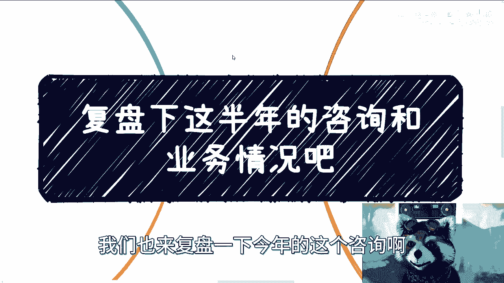
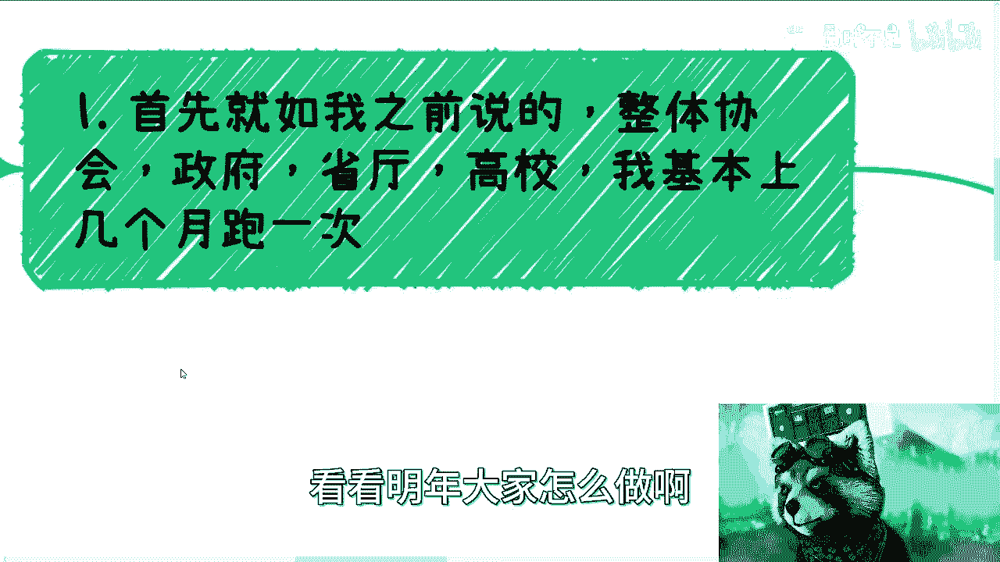
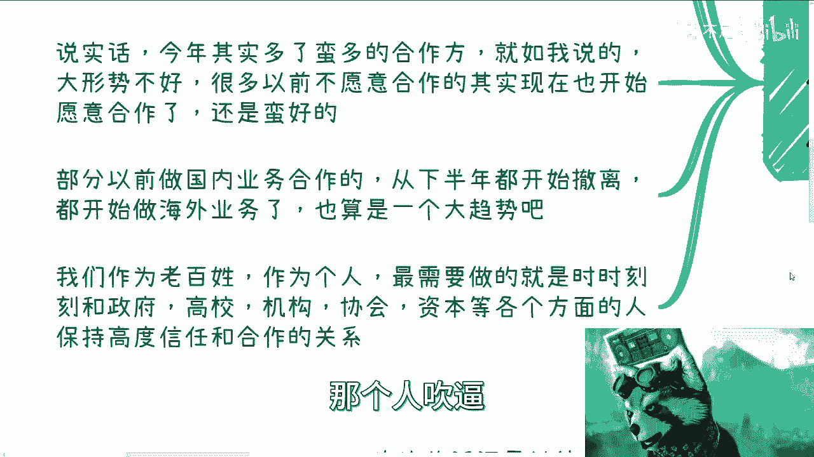
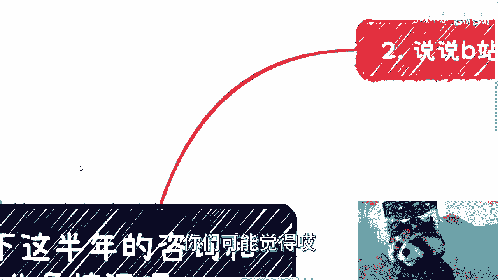
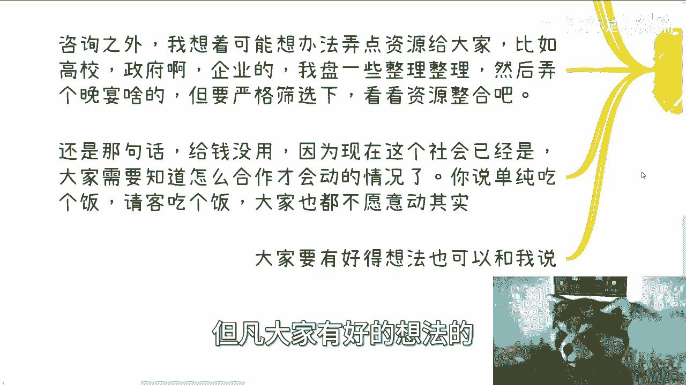
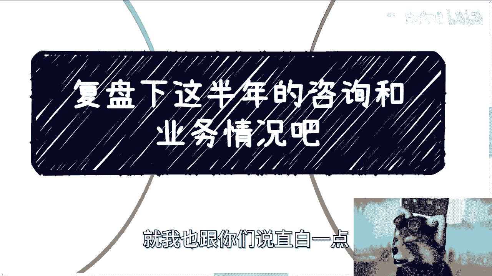
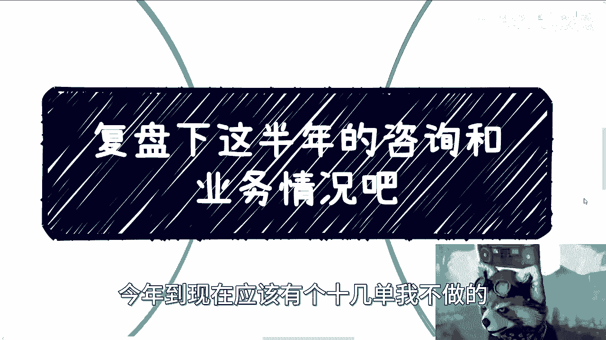
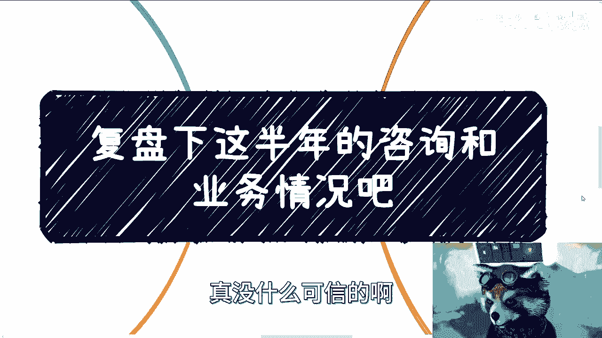
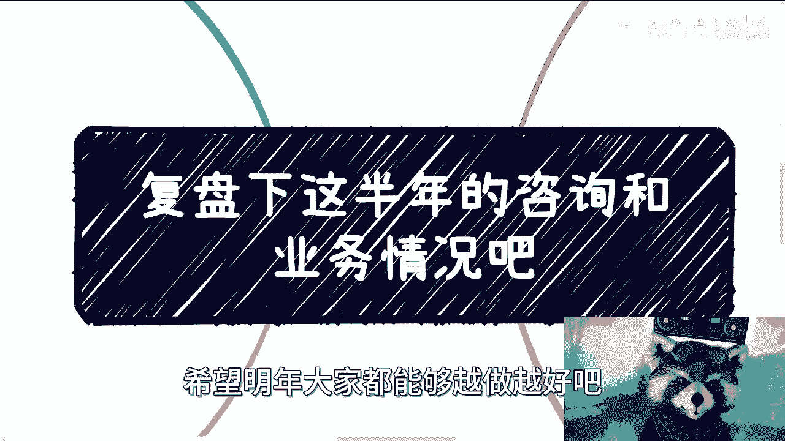

# 课程01：个人业务复盘与咨询策略解析 📊

在本节课中，我们将复盘过去半年的业务与咨询情况，并解析其中的核心策略与逻辑。课程将涵盖外部合作、信息获取、咨询类型分析以及个人价值定位等多个方面。

---

## 业务合作现状与信息同步策略

上一节我们介绍了课程概述，本节中我们来看看外部业务合作的现状。

我定期与协会、政府、省厅、高校等机构进行交流。这些交流没有具体的业务目标，主要是为了同步信息，了解最新政策，并探讨未来的合作方向。

本质上，这是一个建立并维护信任与合作关系的过程。作为个人，我们需要与政府、高校、协会、资本等各方保持高度信任与合作。从合作层面看，双方是互帮互助的；但从整个链路看，我本质上充当了他们的“工具人”。

我能够提供给他们的信息很少，更多时候是从他们那里获取信息。我的价值在于成为他们之间信息沟通的桥梁，因为他们彼此之间通常缺乏直接交流。

当前的普遍现状是：预算紧张、项目稀少，已有的计划项目也经常被延迟或延期。这是客观情况。

---

## 年度项目执行与市场变化

上一节我们讨论了合作现状，本节中我们来看看今年具体执行了哪些项目。

今年完成的项目包括：
*   深圳的深港澳金融科技师项目（我负责区块链部分）。
*   上海师范大学的前沿科技培训项目。
*   中关村的元宇宙项目。
*   广东省出版相关的课程项目。

总体来看，项目数量比去年减少。今年新增了许多合作方，但大家更多处于“蓄势待发”的讨论和规划阶段，例如探讨2024年的合作模式。

市场环境的变化促使更多以前不愿合作的人选择抱团取暖。同时，部分原本专注于国内业务的合作方，从下半年开始逐渐转向国际业务，这也不失为一个新的方向。

---

## 有效信息获取与社交策略

上一节我们分析了市场变化，本节中我们来探讨如何获取有效信息。

我一直强调社交和“高举高打”策略的重要性。真正有用的信息往往来自特定圈层的人士。每天听无关人士夸夸其谈没有实际用处。

年轻时可能觉得很多人讲得有道理，但积累一定经验后就会明白，那些信息大多无效。

---

## B站咨询的逻辑与价值

上一节我们探讨了信息获取，本节中我们聚焦于B站咨询服务的核心逻辑。

普适性的“大锅饭”式内容价值有限。例如，一门标价99、199甚至999元的通用课程，不可能对每个购买者都产生同等效用。因为每个人的具体情况天差地别。

因此，在咨询前，我通常会要求咨询者提供一份个人介绍的Word文档。通过语音沟通，我可以综合判断一个人的语言组织能力、声音状态、话术、综合思考能力以及过往经历。

我重视在沟通中感知到的客观信息，而非咨询者主观描述的内容。因为个人描述可能受到PUA或自我认知局限的影响，不一定反映真实情况。我相信的是沟通中展现出的状态以及过往的历史事实。

---

## 咨询类型分析与案例

上一节我们介绍了咨询的评估逻辑，本节中我们来具体看看咨询有哪些类型。

根据我的经验，B站的咨询主要分为以下几类：

以下是主要的咨询类型：
1.  **目标明确型**：咨询者有非常明确的目标，例如开拓政府、企业、高校业务，或就已有的创业合同、方案进行讨论。对于涉及商业机密的内容，我会主动询问是否需要签署保密协议。这类咨询更接近有价值的头脑风暴。
2.  **方向明确但选择杂乱型**：咨询者对未来有大致方向，但面临多个杂乱的选择，自身难以判断优劣和如何利用。我的作用主要是帮助做排除法，或在剩余的选项中探讨如何更好地开展。
3.  **缺乏明确方向型**：咨询者没有明确目标和方向。我会根据其现状、过往历史和个人能力，给出可能的发展方向，或建议如何将其长板变得更长。我认为弥补短板意义不大，应该让合作方来弥补，个人应专注于延长长板。
4.  **市场了解型**：纯粹为了解市场情况、我做的业务，寻找潜在合作机会。
5.  **情感交流型**：一小部分咨询者情绪较低落，希望聊聊天，话题可涉及动漫、游戏或近期烦恼。我提供这样一个倾诉的渠道，并不排斥。

从个人角度，不同类型的咨询带来的成就感有所不同。

---

## 咨询原则与未来规划

上一节我们分类讨论了咨询类型，本节中我们来明确咨询的原则与未来计划。

首先，明年咨询业务会继续，但价格计划上涨10-20%，以更尊重我个人付出的价值。

有两种情况我会拒绝接收咨询：
1.  咨询者在沟通初期就表现出完全不接受他人建议且固守己见。
2.  咨询者自身思路极度不清晰，且表示“即使给不出具体建议也没关系”。我不愿赚取这种无法提供实质帮助的钱。

除了咨询，我计划整合高校、政府、企业方面的资源，举办晚宴或闭门交流会。但参会者需经过严格筛选。现在的合作必须基于明确的目的和共赢的可能性，而非简单的饭局。

---

## 内容合作原则与风险管控

上一节我们谈了咨询的规划，本节中我们来看看在内容合作上的原则。

我很少承接商业广告合作。今年以来拒绝了十几单商业合作。原因如下：

以下是拒绝商业合作的主要原因：
1.  我以脑图为基础的逻辑表达方式不适合大多数商单形式。
2.  多数商单内容对受众的实际帮助不大，尽管我可以因此获利。
3.  许多商单本身的价值我认为不高。

对于所有提出想在活动中进行主题分享的合作请求，我都予以拒绝。原因在于风险控制：我对合作者不熟悉，不了解其过往案例和经验。即使对方付费或我倒贴钱，我也担心其在分享中出现胡言乱语、触碰政治红线等问题，这会给所有参与者带来风险。因此我选择一刀切，在商言商，除了合同与法律，没有其他绝对可信的保障。

---

## 总结与建议

本节课中我们一起复盘了业务现状、信息获取策略、咨询服务的类型与逻辑，以及内容合作的原则。

最后，我希望大家：
*   如果有具体的业务问题，欢迎找我咨询探讨，我相信能帮助你们创造价值。
*   如果感到迷茫，不知如何规划，也可以找我梳理。我梳理的案例越多，能给出的建议就越具参考性。
*   需要强调的是，我的建议基于个体情况。例如，从宏观层面我不支持盲目考研或考公，但对于具体个人，在其特定背景和条件下，这很可能就是最优解。决策必须因人而异。

---
**本节课中我们一起学习了**：如何分析业务合作现状、通过有效社交获取信息、理解个性化咨询的价值与分类、明确内容合作的风险控制原则，以及认识到所有建议都必须基于深入的个体情况分析。