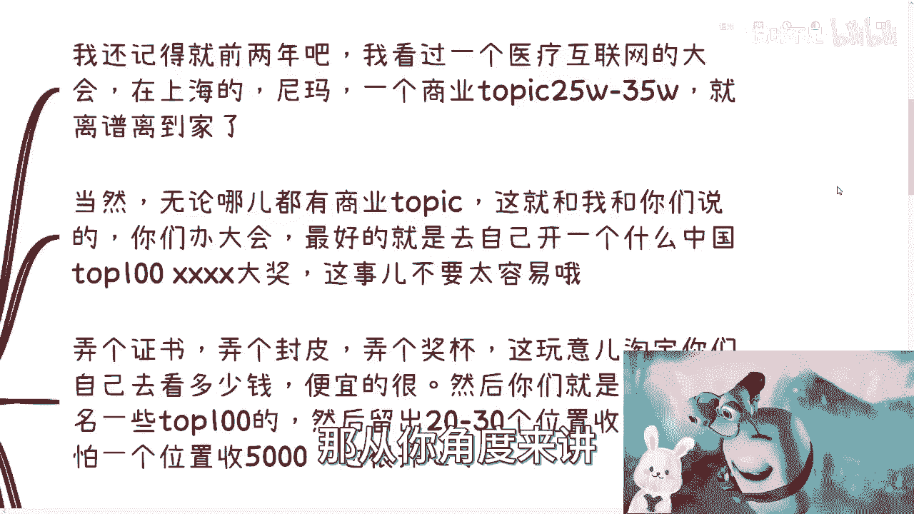

# 咨询到底是需要理论派还是实战派 - P1 - 赏味不足 - BV1Du4y1N7n9

啊大家好，今天礼拜天是吧，嗯中午的时候给大家发了一个那个充电视频啊，就是我把那个移动互联网这边的，整个的发展历程，还有我我我经历过的整个发展历程。

我给大家列了一下啊，嗯然后呢就是前两天呢我翻视频了。

突然翻到关于刘润的事情啊，不知道大家有没有知道呃，然后呢在刘润那个视频下面呢，就很多人在吵啊，吵的是什么呢，他意思就是说啊咨询到底是怎么一个角色啊，然后呢。

也把乔布斯以前喷咨询的这个，这个视频发出来啊，就是哎呀我也说一下啊。

首先前情提要对吧，就前几天我看到留任大会翻车的这个视频，然后一看吧，好多人他顺带着啊就说啊大佬是骗子哦，大佬的光环褪去了啊，然后还有很多人呢顺带着就开始喷咨询，那么大致的意思就是说刘润。

刘润在自己第二次大会，就全国大会上面说的就是东西翻车了啊，一方面说的是数据不对啊，另外一方面说他接了商业的topic，变成了一个传话筒啊，那么我作为咨询了好吧，其实我也不是什么。

就跟普遍咨询比较一样的咨询对吧，我还比较剑走偏锋的啊，但也算也算咨询啊，那我就来说说看，就是说关于这个问题所衍生出来的。

这几个事情啊，第一个事情呢就是说商业topic是非常常见的啊。

因为很赚钱啊，首先我跟你说啊，我还记得我前两年疫情的时候呢，我看过上海这边，就在上海，然后呢他一个topic我如果没记错的话，应该就是25万到35万啊，应该在35万左右一个商业topic呃。

你说离不离谱吧，我觉得其实离谱的，但是你要说合不合理吧，我觉得合理的，为什么呢，因为这就像这就像我跟你们说，那个我让你们去卖那个GPT账号一样的，就是有些人卖就卖了对吧，然后他说哎呀，我不敢卖。

我卖个99，卖个49，我说卖都卖了，就应该卖个9999，为什么，因为中国14亿人总有，对不对，你割到一个是一个，那他就要说了，吕老师，我不想割，我又不是这种人对吧，那卖它干嘛呢，你卖它干嘛呢。

你卖这个东西在我看来不就割吗，那你割你你割都割了，你不如好好割呢，对不对，我跟你讲这种商业topic也是一个道理，你知道吗，就是你收一块钱跟你收他一个亿是没有区别的，为什么，因为你要知道付钱的人是甲方。

对不对，好，那付钱的人他会告诉你，我他妈出钱了，我是上帝啊，我哪怕给你一块钱，你也要尊重我，我就要开始打广告，你看他出一个亿是打广告有什么区别呢，对啊那从你角度来讲。

你为什么收钱啊，你收钱不就是为了让对方打广告嘛，对不对，你否则收钱干什么，对不对，所以说本质上就是说你收就收的，上海话叫什么叫三更啊，什么叫萨根，就是你要收就收，收的就是就是彻底一点对吧。

你别那种就是上不上下不下的啊，就看似别人好，看似好像你想割对吧，但是好像又没信心，哥哎呀，我跟你讲重心千万别做，你知道吗，那当然啊无论到哪都有上面的topic，这就我跟你们说的，比如说你们办大会。

我之前跟你们说过，最好的呢就是自己去开一个什么，打个比方啊，以你们大会的名义去开一个什么东，什么大奖哎呦随便随便吹。

随便吹这个东西无所谓的啊，我哥明显明确告诉你们，这东西没有什么不会犯法的，你放心吧啊，这连擦边都不算啊，这事不要太容易啊，你弄个证书，弄个封皮，弄个奖杯，I这玩意儿我跟你说，你们自己去查淘宝多少钱一套。

埃及便宜到地板价，这个地下是假啊，然后你们就是先免费报报，让让就让大众免费先报一些，比如说呃那个里面的，比如说top呃，30到top100，剩下你留出前30或者前20的位置收费。

你哪怕一个位置收5000，你也很开心啊，对不对，而且我告诉你们这个事情，这个事情在中国这片土地上，几乎每一个官方的办会的，只要有这种top叉叉叉的，都他妈是这么做的，你懂吗啊，商业topic。

本质讲它的模式就是一个叫花钱买广告的事啊，只不过就是说这个广告位吧，有的时候是付钱的人上去讲对吧，比如说今天阿里付了钱，那阿里上去讲对，有的人是别人去传达你，比如说以前老罗，老罗也被人家碰过对吧。

那比如说老罗对吧，就是就是比如说有些APP对吧，或者有些厂厂家出了钱，那么他不可能让这家上去讲，那就老罗去讲，刘润这次也是一样的啊，那么商业topic这个东西其实没有什么。

但你要看你的影响力以及你的内容是什么，因为你比如说啊，我今天一个广告位收100万对吧，好那你就上来卖，你就直白一点，你就你就比如说在以比如说啊，你借助流润这个影响力对吧，你说我就上来卖产品。

你把别逼逼了啊，你也别跟大家吹什么，我融资多少啊，我有多少用户啊，不不重要，你就吹你就直接推，我跟你说倒无所谓了，你知道吗，但是最好就是别出现一些，就像这次你比如说讲数据的对吧。

或者有可能有意夸大数据或者模糊数据的，这种就容易翻车，为什么，因为你要记住任何一件事情对吧，只要不在你的认知范围内，因为什么叫商业topic卡，就是你比如说我今天做打个比方，你说我做的是数字经济。

我做的是区块链对吧，我做的是比如说元宇宙对吧，相关的啊，好那么你今天有一个人付我钱，他说唉吕老师，我给你20万对吧，我我这边讲一个什么东西，那他讲的东西一定不在我的专业范围内啊对吧。

那么我怎么去判断这个东西真的还是假的呢，我不知道啊，而且大概率我没法去验证啊。

对不对，那么这种翻车的情况就很容易出现了对吧，那么第二点啊，我们说咨询到底是找理论派还是实战派啊，这个问题也是在刘润的那些视频下面，就是被喷的老多老多老多。

对吧，那么这个问题吧，我们就说啊，就是说很多人在下面开始battle有一说一，就如我之前说的非黑即白，那没有意义，就是你说找理论派对吧好那么我作为甲方，我找理论派吗啊那我可以挑刺啊。

我可以说这个人没有实战经验，这个人就是纸上谈兵根本就不行啊，就是骗子啊，对不对，那么你说实战牌对吧，好，那我作为甲方，我也可以说这种人只会做对吧，不会说根本不会表达讲的东西，大家根本就听不懂。

根本不是那个不知所以然对吧，这个钱就他妈花了冤枉钱啊，他也不知道怎么真正解决大家问题，他根本就不理解大家碰到的问题，根本就不行啊，也是个骗子，你看到没有，反正就不行啊对吧，所以说你看你看都不行，为什么。

因为咨询本身就不是一个，需要去找理论派或者实战派的这么一个问题，核心是在于甲方要什么，甲方想找这个咨询达到的目的是什么，对吧，你会发现，世界上之所以大家都在非黑即白的去讨论问题，或者去争论问题。

就是因为大家觉得问题是线性的，就是说我今天你要给出怎么样的东西，然后我给出这个东西呢，无非就是理论或者实战对吧，或者理论加实战，无非就这三种东西，但是问题并不是这样做的，因为你真正接地气讨论问题。

你是要从甲方出发的对吧，你不从甲方出发，整个商业都不闭环，你在那边就讨论，就自己闷头在那边讨论有什么用啊，没有用的，你炒的带再厉害也没有用啊，因为你们吵吵的这些东西都是不接地气的，对吧好。

那么我们来说第三点，甲方需求是什么，这个我以前其实提到过，就是很多，你比如说有的甲方就是为了内部内内部的制衡，什么意思呢，就是说他就是为了让让外来的和尚，说出自己的话，他就是个传话筒，因为什么。

因为里面人讲话，大家都不听，他只有外来的和尚好念经，这件事情无论在哪都是一样的，我告诉你啊，那这是一种有有的呢就是说咨询呢是战略咨询，也就是说他需要更多的历史案例和，和看到过更多的案例。

以及咨询师本身经历过更多的案例对吧，你说他是不是比如说他跟这两家创业公司，或者跟着跟着五六家国企对吧，他经历过对吧，那你说他有没有自己做过国企呢，没有他自己有没有做过创业公司呢，没有，那他有没有做过。

无所谓啊对吧，因为他至少跟着经历过这种东西，对于甲方来讲就是有用的，那么同样的咨询师，他也可以做成一个翻译师，也就是说你说他有没有做过案例，不重要啊，因为重要的是他可以认真去审核每一个案例，每一个数据。

然后找到有经验的真正那些，比如说我们称之为实战派的人，他可以合合作啊，对吧，他可以让实战派的人来考证来审核，然后这个咨询师最终用甲方听得懂的人，话来说出来，那么这也是它的价值对吧。

那么咨询这种角色存在呢，我觉得是非常合理的，因为为什么，因为大部分的人他是平庸的，你甭管他创意还是不创业，你甭你甭管他工作，工作就是说好还是不好对吧，或者说现在这个业务做的这个这个流水大不大，你知道吧。

这个并不重要，因为大部分的人无论他做的好不好，同时又非常成功的这么一个人，这种人是很少的对吧，微乎其微，那么也就是说很多人他哪怕比如说现在能赚钱，他赚的其实不多对吧。

呃但是很多时候这个人或者团队或者公司，他就是需要外力，或者说他需要一个客观的一个人给出建议，但为什么，因为当局者迷啊，没有办法的，你们但凡自己做过业务，你们就会明白，很多时候。

就是就是当你们没有达到一定的label之前，你们很容易上头，你们一旦上头，我跟你说，就你们身边的朋友或者其他人劝不回来的，你就像很多之前呃，很多那个有些小伙伴私信我说，我要做个APP对吧。

做个什么东西我也跟他说了，我说你根本就不了解，你做他干嘛呢，你做什么东西呢，你有什么资格做呢，你有什么底气做呢对吧，但是哪怕我跟他讲的很直接，他也不会听我的，因为他上头呢他就觉得卧槽他妈的。

老子做完我他妈就财富自由了，怎么办呢，你说不听呢，这就跟这就跟很多人以前投资是一样的，我非要投哎呀，你你这不让我投，就是眼红我对吧，就是就是为什么，就是因为他就是对对对，整个的这个世界。

对整个的这个这个商业他一点都不了解，然后他自己也没有达到某一个，就是说非常呃也不叫害，非常高吧，就是稍微中等偏上一点的这个级别对吧，因为你但凡你level足够高的时候，你会发现很多事情你是很坦然的。

为什么，因为你会明白所有的事情都有它的道理，所有的东西都有它的逻辑性，不存在说你纯粹碰运气的，你要碰可以，但是碰的前提是你在你自己的理论范围内，在你们团队的理论范围内，它是成立的，然后你去碰，你知道吧。

不是说我什么都不知道，我就感觉我要去碰啊，我碰碰中就是十倍收益，碰不中我就是打水漂，那这种就是赌博，你赌博你跟我讲什么呢，对不对，我们以前那句话说的很好的，说的很很对的，赌狗不得好死，对不对啊。

所以啊就是说本质上就是这么个逻辑，好吧嗯OK好吧，这个东西我就讲这么多，我觉得大家看问题辩证一点，不要非黑即白的去看啊，好，那么反正大家有任何的这种商业上的问题，或者合同啊。

或者其他的就是你们未来的这个规划啊，包括你们手上有什么牌，不知道怎么打的，反正你们整理好整理好。

