# 咨询到底是需要理论派还是实战派---P1---赏味不足---BV1Du4y1N7n9

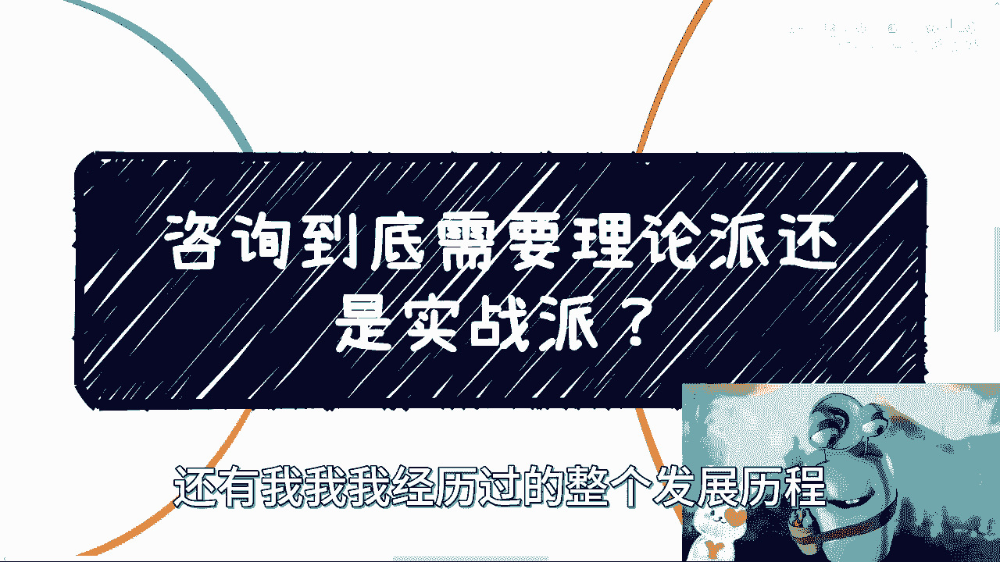

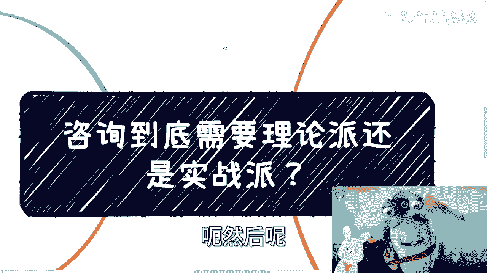

在本节课中，我们将探讨咨询行业的本质，分析“理论派”与“实战派”咨询师的区别，并理解商业话题（商业Topic）的运作逻辑。课程将帮助你建立对咨询角色的辩证认识，避免非黑即白的片面观点。

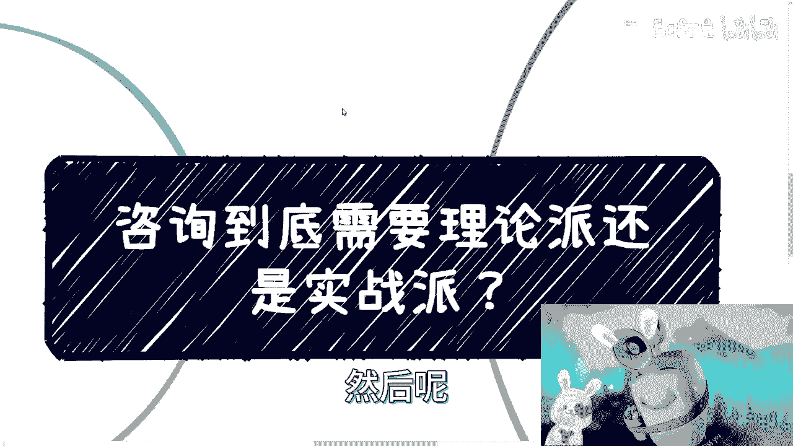

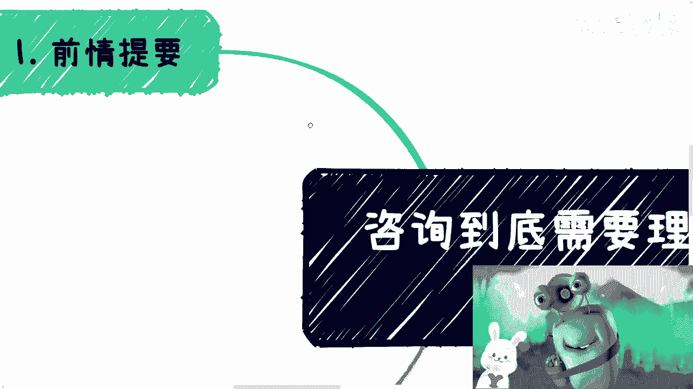

---

上一节我们概述了课程目标，本节中我们来看看引发讨论的背景事件。

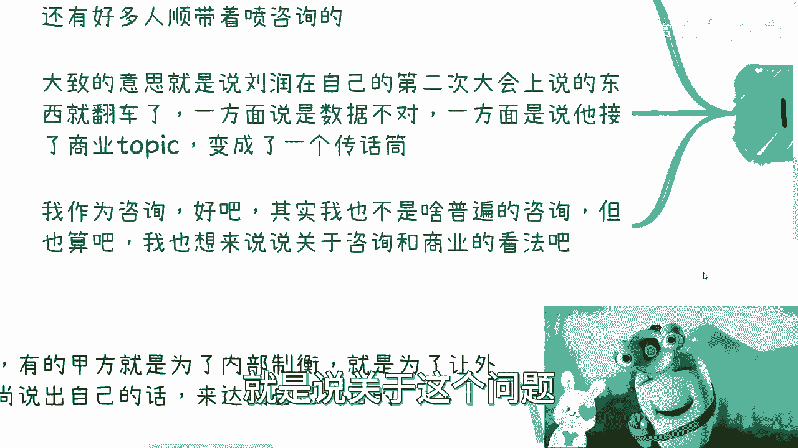

近期，关于知名商业顾问刘润在某次大会上演讲“翻车”的讨论很多。争议点主要围绕两方面：一是其引用的数据被指不准确；二是其演讲内容被质疑为付费企业的“传话筒”，即承接了**商业Topic**。

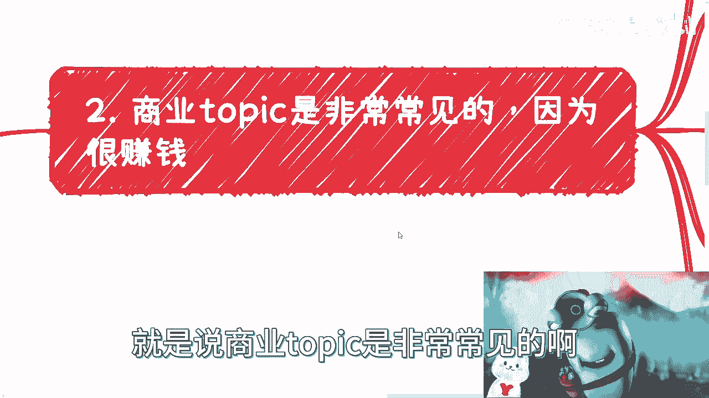

这件事引发了一个更广泛的争论：企业到底应该寻找理论派还是实战派的咨询顾问？作为咨询行业的一员，我将对以下几个衍生问题进行拆解。

---

## 1. 商业Topic的本质与合理性 💼

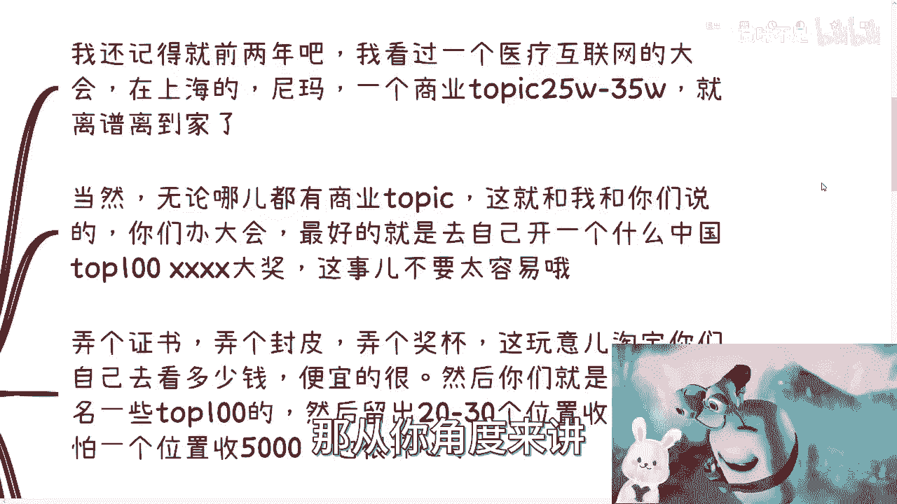

商业Topic在各类行业大会中非常普遍。其核心模式是：付费方（甲方）购买演讲或展示机会，以达到品牌曝光或产品推广的目的。

以下是商业Topic的几个关键点：

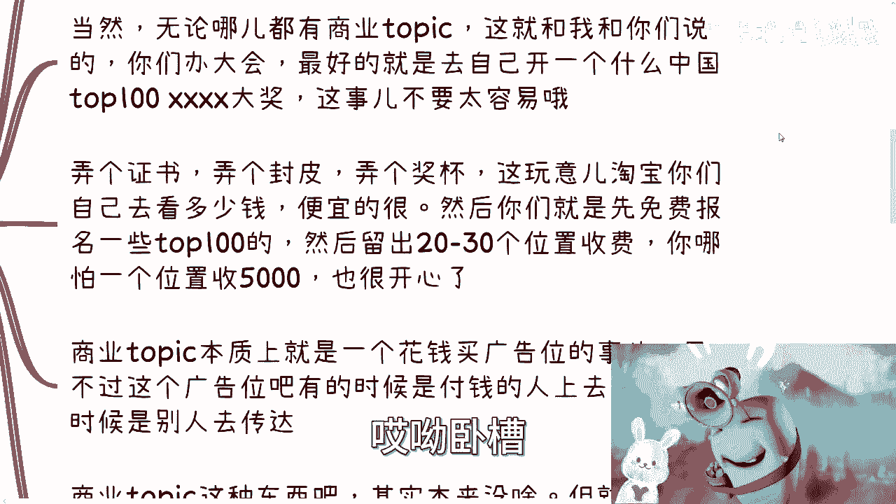

*   **商业模式**：本质是**花钱买广告**。付费方获得的是一个面向特定受众的广告位。
*   **收费逻辑**：收费高低取决于咨询师或大会的影响力。从咨询师角度看，既然承接了广告业务，收费目标就应明确。
*   **常见形式**：
    1.  甲方代表直接上台宣讲。
    2.  由大会的演讲者（如知名顾问、主持人）代为传达甲方信息。刘润此次事件被认为属于这种形式。

承接商业Topic本身并无原罪，但风险在于内容把控。如果演讲内容涉及自身专业领域之外的数据或断言，而咨询师又无法亲自验证，就极易出现“翻车”情况。

**核心公式**：
`商业Topic = 广告位售卖 = 影响力 × 报价`

---

上一节我们分析了商业Topic，本节中我们来看看争论的核心：咨询师的选择。

## 2. 理论派 vs. 实战派：一个伪命题？⚖️

在刘润事件的讨论中，很多人陷入“找理论派还是实战派”的非黑即白争论。这种线性思维忽略了问题的本质。

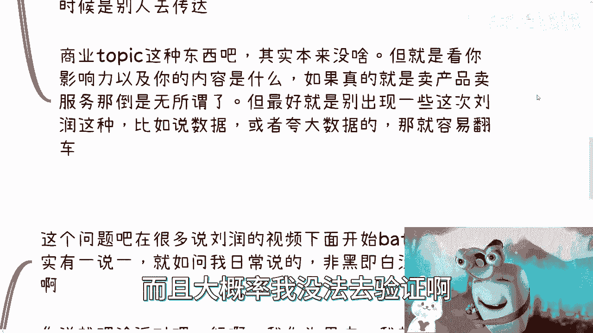

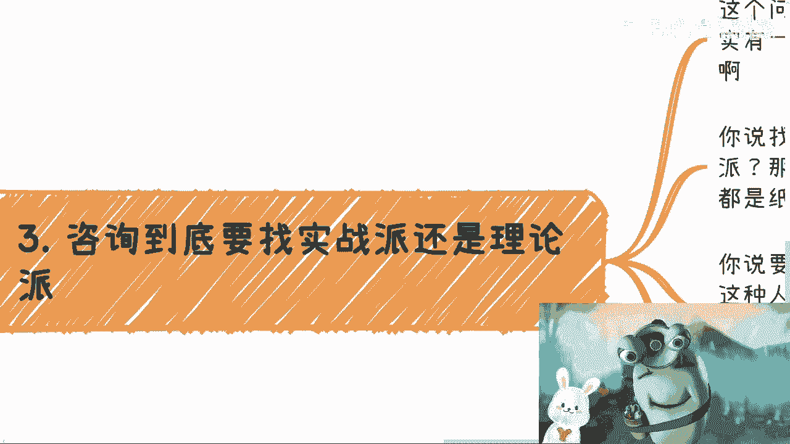

*   **批判理论派**：甲方可以指责其“纸上谈兵”，缺乏实战经验，是骗子。
*   **批判实战派**：甲方也可以指责其“只会做不会说”，表达不清，无法提炼方法论，钱花得冤枉。

你会发现，无论选择哪一方，都可以被挑出毛病。因为**咨询的核心不在于顾问本身的属性，而在于甲方的具体需求是什么**。脱离甲方目标去争论顾问类型，是“不接地气”的。

---

上一节我们指出了争论的误区，本节中我们回归本质，看看甲方究竟有哪些真实需求。

## 3. 甲方的核心需求是什么？🎯

咨询顾问的价值根据甲方的不同需求而多样化，绝非“理论”或“实战”一词可以概括。

以下是几种常见的甲方需求及对应的顾问价值：

*   **需求一：外部背书与内部制衡**
    *   **场景**：公司内部意见僵持，需要“外来的和尚好念经”。
    *   **顾问角色**：**传话筒**。顾问的核心价值在于其第三方身份，用于说出内部人难以推动的话。

*   **需求二：案例库与战略视野**
    *   **场景**：企业需要借鉴跨行业、跨周期的历史案例来制定战略。
    *   **顾问角色**：**案例库与连接器**。顾问未必亲自创业或运营过国企，但其跟随或深度研究过大量企业案例，这种视野对甲方具有重要价值。

*   **需求三：信息翻译与整合**
    *   **场景**：甲方需要理解复杂领域，但内部缺乏专业人才。
    *   **顾问角色**：**翻译师与整合者**。顾问可以组织真正的实战专家进行审核与背调，然后将专业信息转化为甲方管理层能听懂的语言和方案。

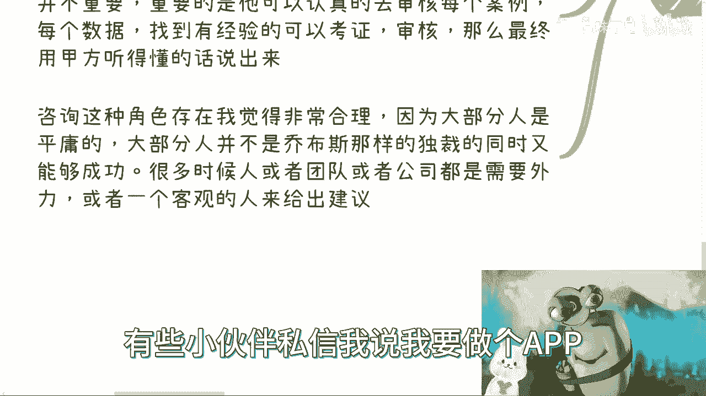

咨询角色存在的根本原因在于“当局者迷”。大多数个人或团队在成长过程中，都需要一个客观的外部视角来提供建议，避免因认知局限或情绪上头而做出错误决策。

**代码描述核心逻辑**：
```python
def 选择咨询师(甲方需求):
    if 甲方需求 == “打破内部僵局”:
        return 寻找“具有公信力的外部背书者”
    elif 甲方需求 == “获取战略视野”:
        return 寻找“拥有丰富案例库的研究者”
    elif 甲方需求 == “理解专业领域”:
        return 寻找“优秀的跨领域翻译与整合者”
    else:
        return 首先厘清自身核心需求
```

---

## 总结 📝

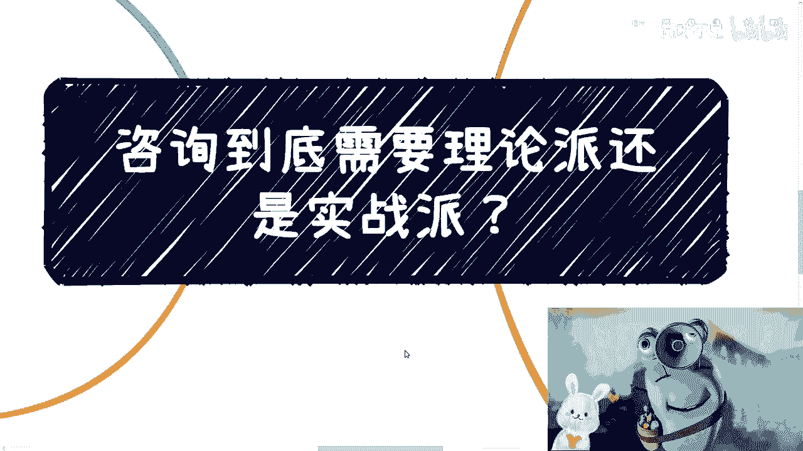

本节课中我们一起学习了：
1.  **商业Topic**是一种合理的广告商业模式，其风险在于对非专业领域内容的把控。
2.  争论咨询该找“理论派”还是“实战派”是一个**伪命题**。选择的标准应基于甲方的具体需求，而非顾问的单一标签。
3.  甲方的需求是多元的，可能包括**外部制衡、战略视野、信息翻译**等。咨询顾问的价值正是根据这些需求，扮演不同的角色（如传话筒、案例库、翻译师）。
4.  看待商业问题应**辩证**，避免非黑即白的线性思维。核心在于理解事物背后的具体逻辑和场景。

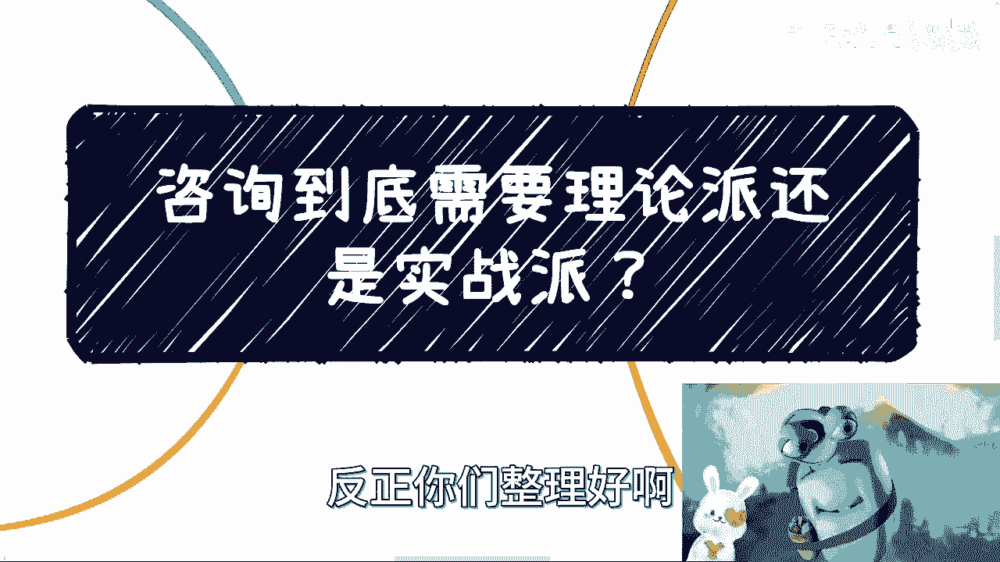

商业世界复杂多变，有效的咨询始于对自身需求的清晰认知，而非寻找一个完美的“理论”或“实战”答案。