# 咱们做点增加自己主动权筹码的事儿吧 - P1 - 赏味不足 - BV1z2421Z7B7

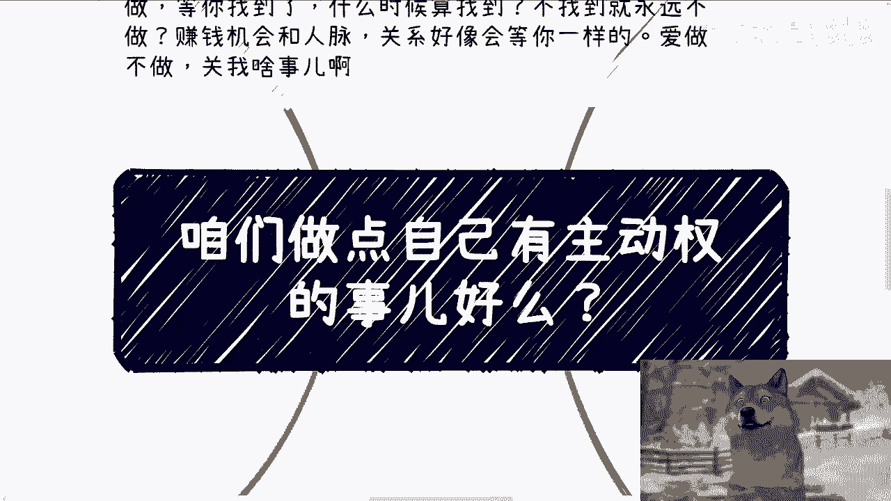

哈大家好，咳咳，今天这评论区把我看的看笑了。

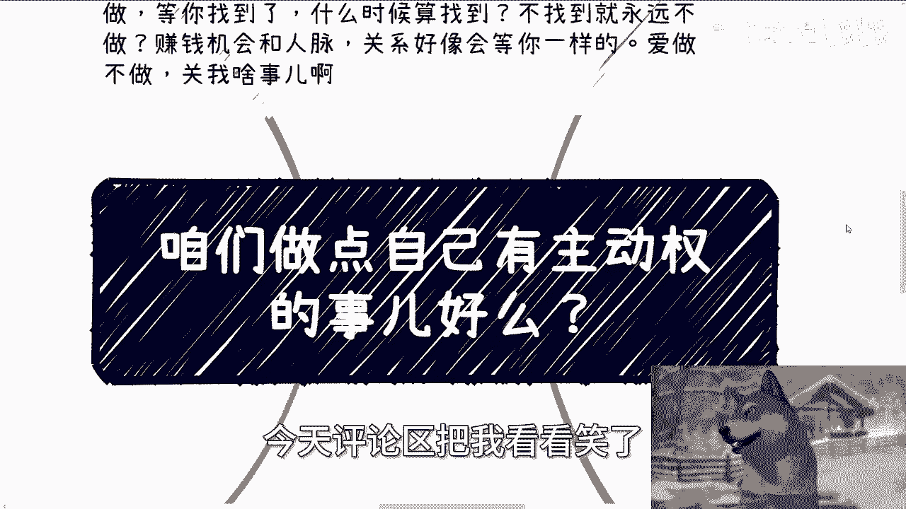

看笑了还不止一两次，正好跟你们来讲点笑话是吧，哎呀好玩的很啊，今天我们来讲的呢叫做咱们真的，我我看完评论区，我就发出这个感叹。

我说咱们能不能做点自己有主动权的事啊，什么意思啊，就首先我跟你们讲真的蛮好玩的啊，有评论区这么说，他说我现在呢你要问我有什么，我就没有啊，你要问我会做什么，我就不会，为什么呢，他也说了。

他说我要等到我找到合适的地方啊，比如说低的房，低价的房租对吧，好的工作对吧，少呃比较少加班的对吧，怎么样子，同时呢也这样也能让我看到更多的世界啊，然后等我有了这些资本，我再去踹对吧。

他的意思就是说等他有了资本再去踹，我跟你们讲的啊，若干节一些事情对吧，哼就把我气笑了啊，然后他还补了一句，他说如果他现在去做，他就找死哈，我就想这么说，第一你现在去做是找死对吧好。

那你现在不做事也是找死，有什么区别呢，你觉得你早死晚死有区别吗，如果你觉得你早死晚死有区别，那你就不要来跟我讲这些东西，为什么，因为一个就觉得自己判死判死刑，判现在判死刑跟判缓刑的是觉得是一样的人。

那有什么好说的呢，对不对，这是第一点，第二点是如果啊我就这么说，大家现在连生存都生存不下去，比如说你说啊我我房租都交不起对吧，怎么样子，我就告诉你们，那你你就两个选择，你要么就不要去想赚钱的事。

你就好好苟着对吧，能苟一天是一天，你要么就去搏呀，对不对，就是要去出去，要博那种赚钱的概率，就是要去参与更多的赚钱的事情啊，那你还要干嘛呢，难道你现在连吃饭都吃不饱，工作都找不到。

或者还说房租都交不起的情况下面，你还指望你在这种经济情经济情况下面，你打工，然后能能解决你现在这些问题吗，你解决不了的呀，那搞笑了，我也觉得是对不对，你你你你24年能解决，25年能解决吗。

26年能解决吗，你无非就是把这些问题的暴露时间，往后推了而已，没有本质上的区别的呀，对不对，再说了，你爱做不做，关我吊事啊对吧，我觉得做出说出这种话来的人，就是就你按我的说法，就是你就是不想做。

其实你就是不想做，你有各种原因你不去做对吧，那等你找到了，什么时候算找到呢对吧，那你要是找不到，永远不做呗，而赚钱的机会跟整个人脉关系，整个世界的格局，整个整个这个全国的，各种一些资源的这种对接啊。

资源的一种变化，好像会等你找到一样，他妈奇了怪了，地球不围着你转，嘿爱做不做，他妈关我吊事呢，你说对不对对吧，你在我这边说这种就是怎么说呢，毫无价值，嗯嗯毫无这种论点，也没有任何想法的。

就看似他好像好像自己很有特点，但其实哼哟哟这这有啥特点，这不还是被PUA出来的吗，对不对，理直气壮的懒哦好。

然后第一点啊，我给你们讲，又被气笑了啊，昨天评论区呢有小伙伴这么说，他说陈老师我看了很久，但我不知道怎么开始，我就回复我说，那你开始啊，你不知道怎么开始，对吧好，那你做了啥，我就问你开始了啥。

你既然都没有做啥。

没有开始啥，你你你跟我说，你开你你你跟我说，你不知道怎么开始，那这个问题我也搞不懂啊对吧，这就好像呃曾经有一次活动上面有人问我，他说陈老师我不知道怎么社交，我也不知道怎么认识人以及怎么积累。

我当我当时啊就当着所有人面，因为他问了嘛，那我总会回答嘛，对不对，既然你已经诚心诚意的问了，那我总归要回你嘛对吧，我就回了，我说那你做了啥，你就告诉我，你到至今为止你做了点什么。

他说我还没有开始做吼，然后我就笑了，我都不知道这该怎么回对吧，然后昨天我写了一条微博，是这么写的，我说很多人问我，他们应该做点什么，还能干点什么，我也奇了怪了，你有手有脚也没，也没让坐牢，也没人绑住。

你们怎么了呢，怎么不知道干点什么呢对吧，那你说到底不是不知道干点什么，他他妈就是不想干，你要么就是懒，要么就是没有野心对吧，在懒跟没有野心，同时还期待自己能中彩票，能走运，能有大佬带你。

这不就是这么个潜台词吗，有什么好说的呢，对不对，而且很多人还厚着脸皮在呃，还还还还还还为了维护那一丢丢的自尊心，还他妈不愿承认，有什么好说的呢，还是那句话，你骗来骗去，骗到最后不是骗自己吗。

你这不影响我们跟我们吊关系啊，你说是吧，然后还有很多人还问我要X麦的，我也很奇了怪的哎，你视频看一遍最多就10分钟，你这一边看视频一边整理一个不行吗，连这个都不愿意整理，我他妈还指望你能干嘛。

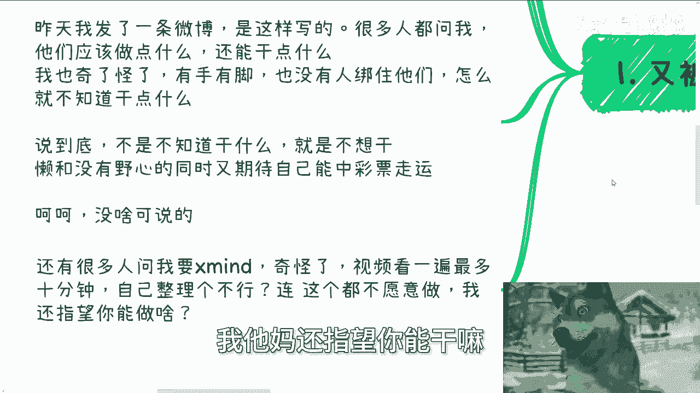

我就说啊，你还能指望你能干嘛，我他妈也服了，对不对，啧就唉就有时候我真的很感叹，大家已经活的这么累了，为什么还不我为什么不能直截了当一点呢，装有什么好装的对吧，第二啊。

真的很多时候我都我我我真的都不知道，大家作为高材生啊，作为所谓的人才。

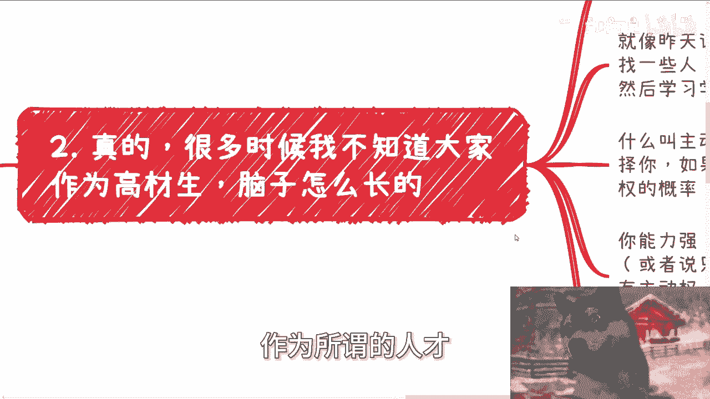

作为所谓的大学生，脑子怎么长的，我是真不明白啊，就是做的事情都是没有任何主动权的，全部都是被动等待施舍，而且还是那种跪着舔别人来施舍的。

唉别人是不是身，你还不知道对吧，就像昨天评论区还有个小伙伴说，哎陈老师。

我现在就想找一些人，找一些大佬啊，领导啊，参与到他们的这个业务里面，然后学习学习，那我也奇了怪了，你知道要学习什么吗，你也不知道对吧，什么叫主动权，主动权就是你永远在选择别人，不是别人选择你对吧。

如果这个主动权不够，那就通过量，通过数量去增加你这个主动权的概率。

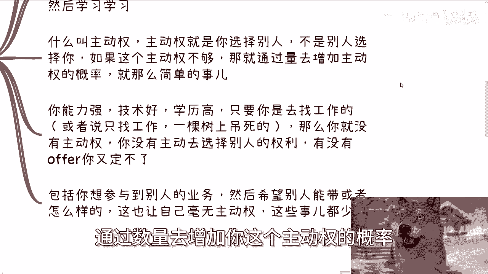

就这么简，单件事没了呀，对不对，你能力强，技术好，而能力强，技术好，学历高，那只要你是去找工作的，或者还说你你仅仅只是找工作在找工作，这棵树上单独的吊死的话，那你永远没有主动权啊。

你没有主动去选择别人的权利啊，对吧，我早就说过了，有没有offer是你定的吗，不是你定的呀，你可以说你找很多种工作，你手上有很多offer没问题，那我就这么问，随随着时间推移，随着你年龄的增大。

你手上会还有这么多offer吗，不会的呀，你有什么主动权啊，没有的呀，还是我刚刚说的判判缓刑的问题啊。

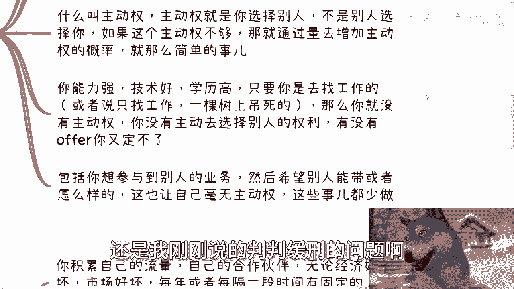

有什么区别啊，对不对，你包括你想参与到别人的业务，然后希望别人带你或者怎么样子，你这也是让自己毫无主动权，你希望别人带你，凭又凭什么带你啊，哎奇了怪了对吧，所以说这种事情少做做这种想法少有啊。

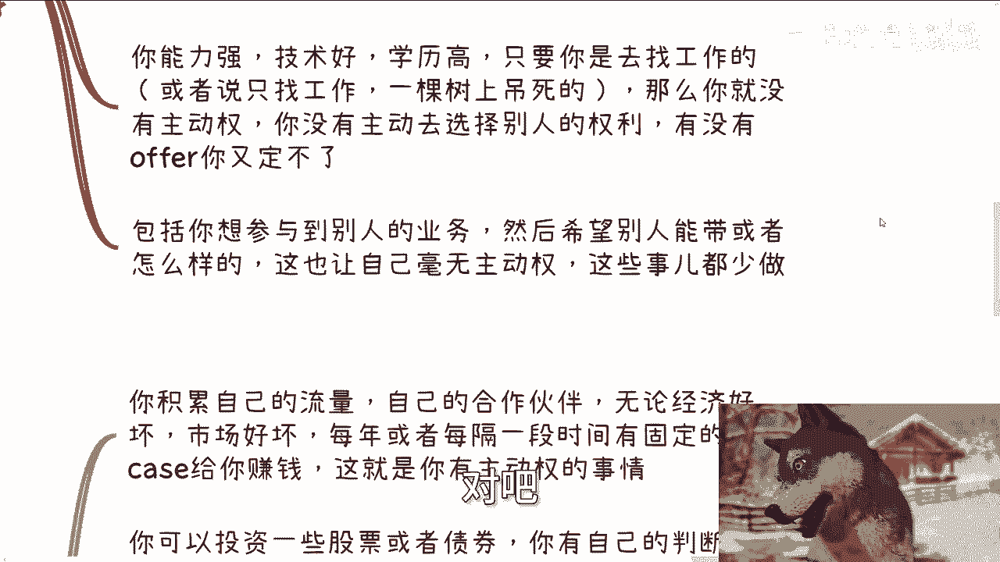

不要有有没有意义的啊。

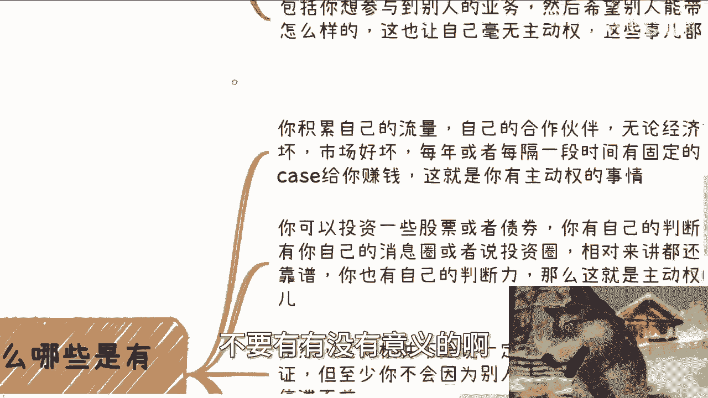

第三有的人要说了，那么哪些是有主动权的对吧，好你比如说你积累自己的私域流量，自己积累自己的公寓流量，积累自己的合作伙伴，无论经济好坏，市场好坏，每年或者每隔一段时间有固定合作伙伴，有固定的项目给你赚钱。

这些都是你有主动权的事情对吧，你可以投资一些股票或者债券，你也有自，而且前提是你有自己的判断，或者你有自己可靠的消息圈或者投资圈，相对来讲还是比较靠谱的，你也有自己的判断能力，那么这也是有主动权对吧。

那当然啊主动权是代表有脑子啊，不是说你无脑的说，哎陈老师说这个投资有主动权对吧，我他妈all in，那他妈叫对吧，什么叫主动权，就是你能明白你在做什么事情，这叫主动权，你在做的所有就是你在做的事情里面。

只要有你不清楚的事情，这就不叫有主动权，这他妈叫赌博对吧啊当然啊你也要明白主，你就算明白你在做什么，主动权也不代表一定都是有好的结果，没人能保证，但至少你不会因为别人。

或者除你以自己以外的因素而停滞不前对吧，当然你也可以认为，你也可以认为你找工作也是有主动权的对吧，你说诶那我也有主动权啊，不开心我就换啊，是可以，但是找工作这个事本身。

这件事情本身的出发点跟DNA劳动合同本身，劳动合同这个本身这个事情，他就是让你不可能频繁的去换，你一旦频繁的去换，那别人就可能对你产生非常多的意义对吧，对你产生影响，那么你从大规则来讲。

你还是没有主动权的，你有本事一直换吗，啊一两个月换，我看看对吧，但是我做项目我就可以一两个月换，我甚至可以一个礼拜还怎么了呢，谁来管我，对不对对吧，包括你自己去做一些你赚钱的事情，怎么了呢。

哦我他妈做一件事情还必须做一年啊，啊谁有这种规定的啊，所以我就说了，你们自己去做事情，但是没有束缚的对吧，你多一多积累一些关系链，多一些合作的，多一些赚钱的合作。

自然主动权就会越来越大，不要老是在那边说啊，我都不知道我做什么对吧。

或者说我我好像就是说啊，没有东西可以做什么，没有东西可以，你所有都能做啊，你只是不想做啊，对吧，第四主动权是一个过程，主动权就是让自己的筹码越来越多的过程对吧。

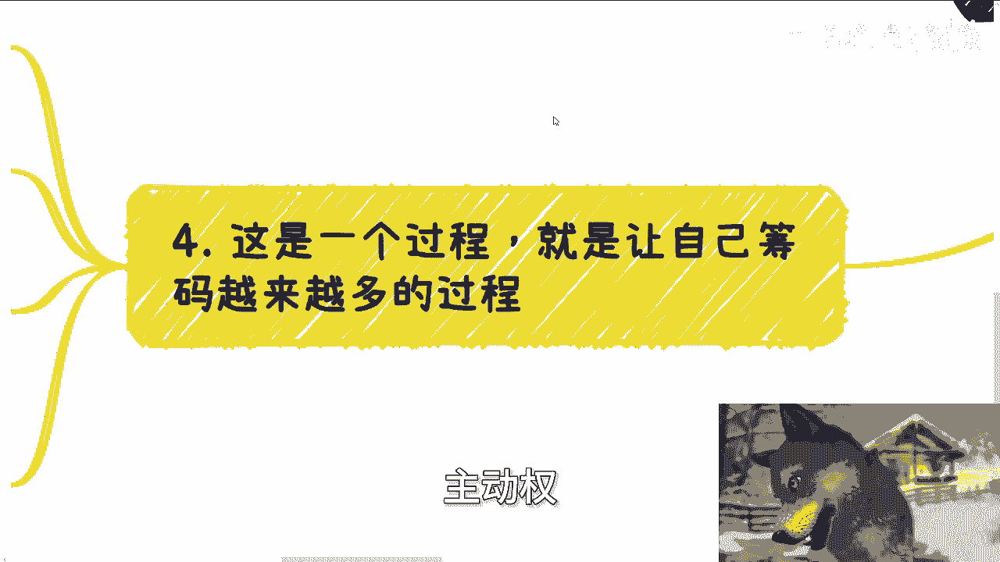

当然啊我们就这么这么说啊，并不是说你今天开始改变自己，开始做自己的事情，就算有主动权。

那肯定不是对吧，你需要通过一个漫长的过程，这个要看每个人的天赋跟做事情方式，以及所在领域对吧，通过这个过程你给自己积累资源，积累人脉，积累关系，积累案例，积累品牌等等等等等，当你的合作方越来越多。

资源越来越多，同时赚到的钱的频率和投入产出比，比例越来越高的时候，那么你的主动权也自然会越来越大对吧，那试想一下，你有一部分资金在二级市场可靠的消息，可以让你赚到一些指数级别的资金。

同时你还有若干条三四，就是比如说三四条四五条业务线，通过日常的合作可以赚到一小部分钱对吧，甚至可以让你有一定的被动收入，那么这个时候可以说，你就拥有很强的主动权了对吧，但是一样的道理。

这些二级市场的业务，或者这些所谓的若干条的这个业务线，也有可能断掉，也有可能没有，但是你至少有抗风险，有对冲对吧，同时你在拥有这些东西的时候，你还会不停的去扩展你的新的渠道，那么这样的话。

你才有你相对来讲不就拥有无限的主动权嘛。

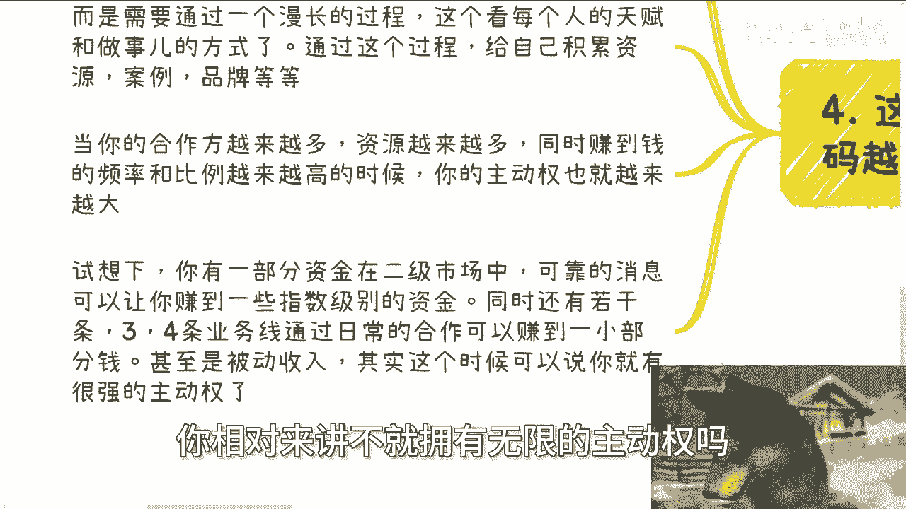

对不对，我就发现很多人做事情是非常非常死板的，他就是想着就是说哎我今天就想做一件事情。

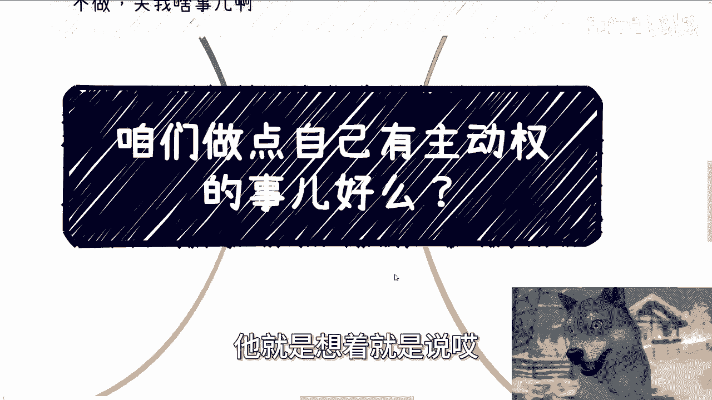

这件事情就可以给我做到那个叫什么，就是退休能够给我养一辈子，可能吗，可能吗。

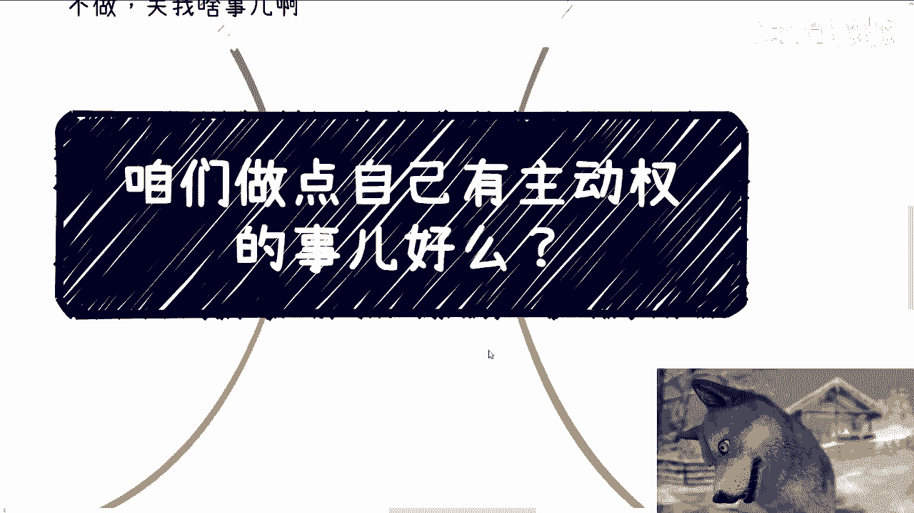

对不对，我还是那句话，你们要有以上一开始我说的那些想法的人，你们就别去赚钱，你们赚不到钱，不要浪费时间，你明白吗，如果你想赚钱，请你一定要改掉这种想法，你有这种想法，你既赚不到钱，也内耗，唉。

搞得还好啊，搞得自己很牛逼，黑玛奇了怪了，你牛逼啥啊，除了你自己觉得你很牛逼，整个世界不会围着你转的呀，有什么用呢，对吧啊。

好吧行，那就这么着啊，嗯然后你们自己在职业上面啊，在自己做副业或者跟别人合作上面啊，然后有哪些啊，比如说合同啊对吧，这个分红分润啊，股权期权啊啊股份啊，分红啊啊项目计划书白皮书啊。

你们希望通过我的一些视野啊，给结合你们个人的背景更新问题啊，能够呃给给予一些建议或者规划的话，或者让你们少走点弯路的话，那么你们可以整理好对应的问题和个人背景，好吧。

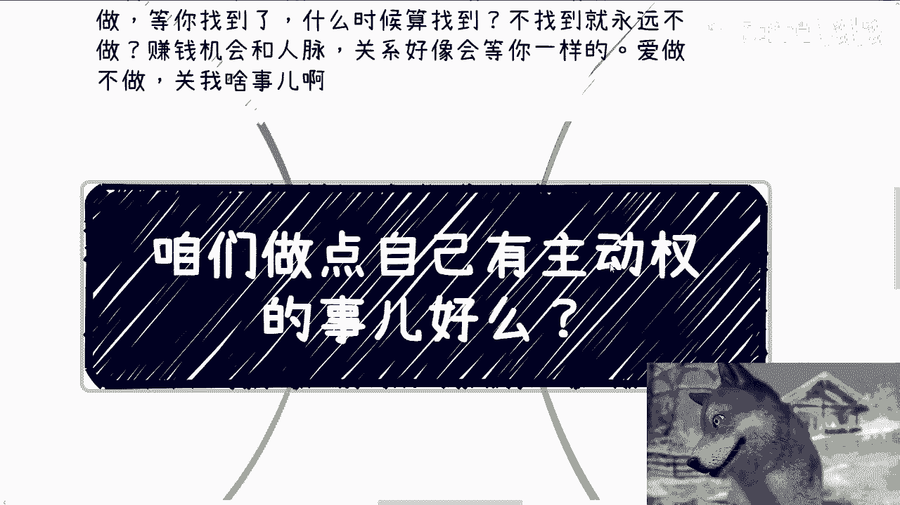