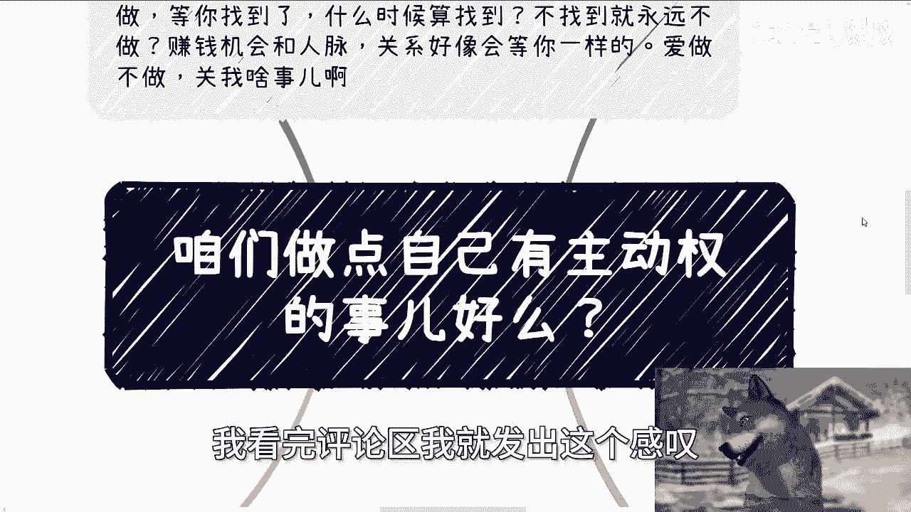
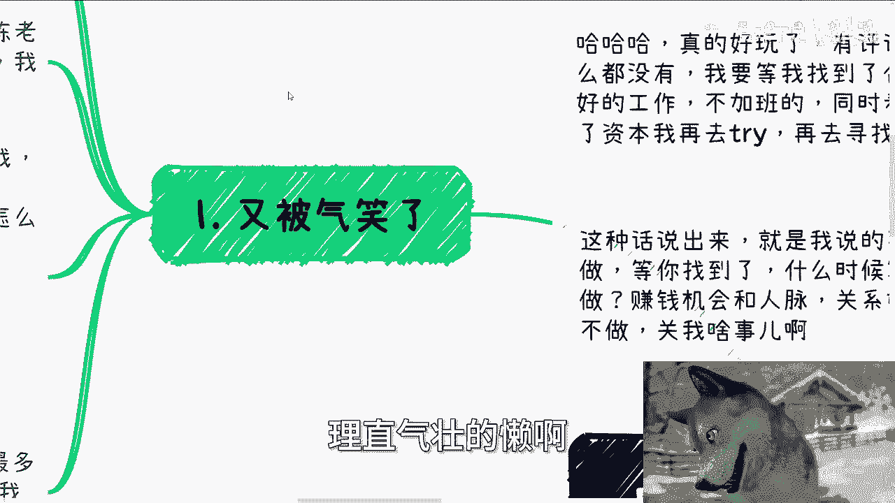
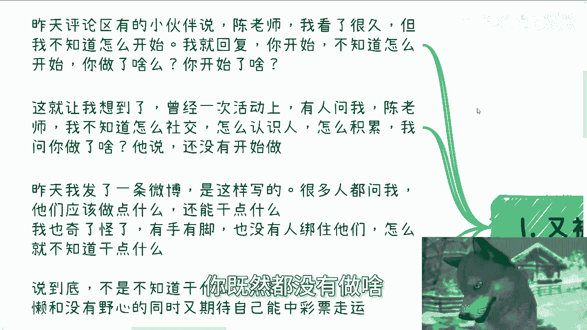
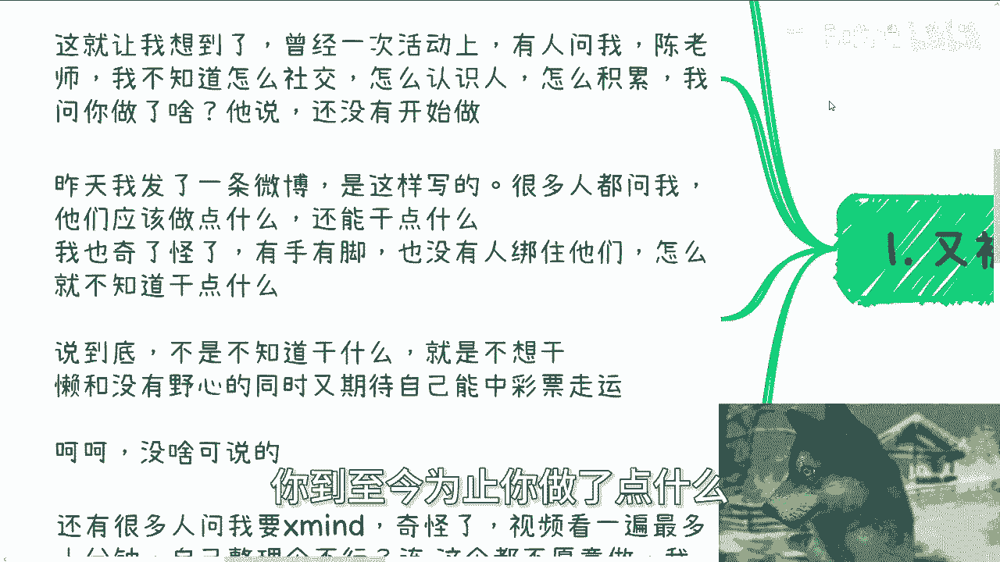
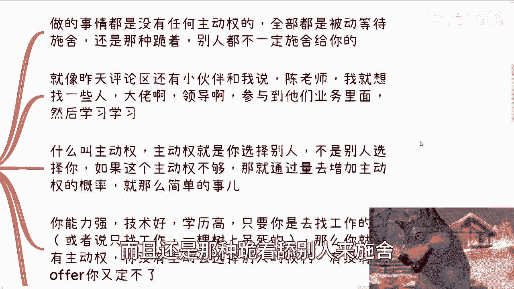
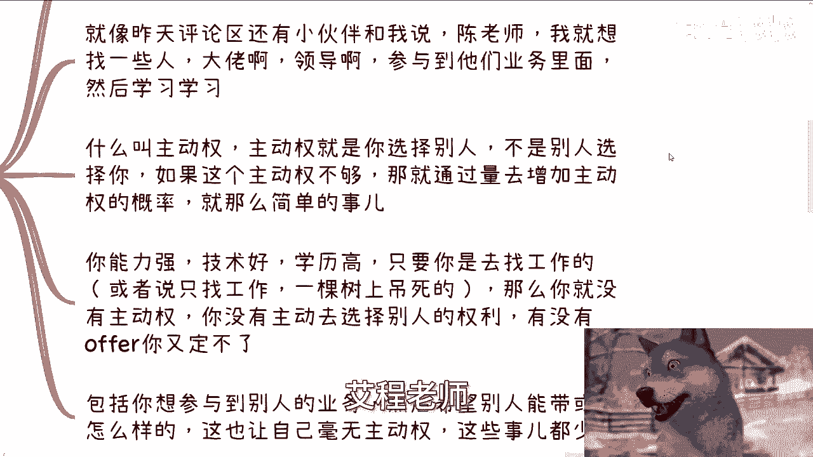
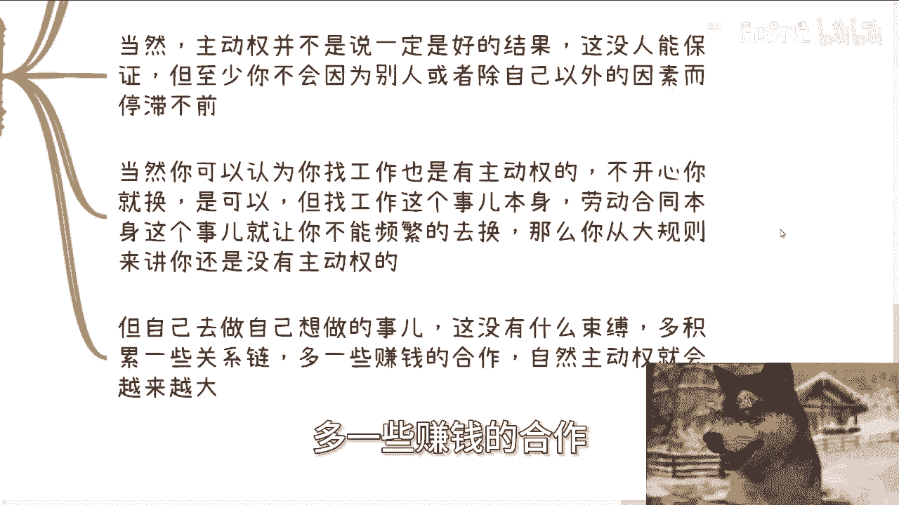
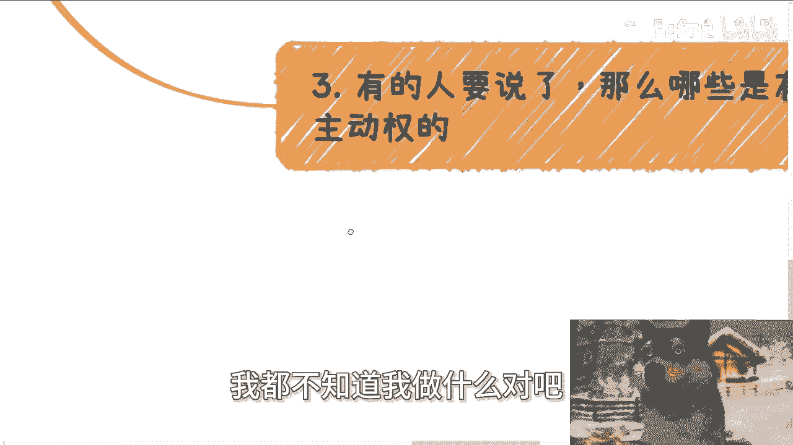
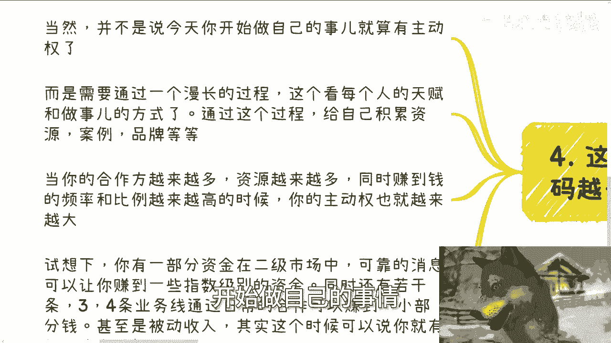
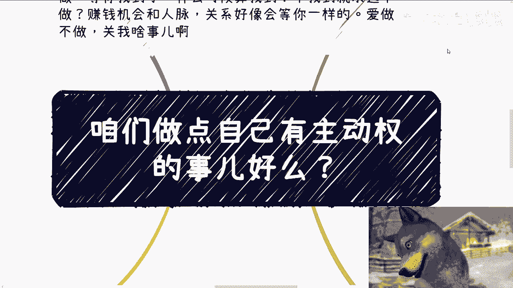

# 咱们做点增加自己主动权筹码的事儿吧---P1---赏味不足---BV1z2421Z7B7

在本节课中，我们将探讨一个核心问题：如何摆脱被动等待的困境，通过主动行动来增加自己的人生筹码。我们将分析常见的思维误区，并学习如何构建属于自己的主动权。

---

## 一、破除“等待完美时机”的幻想

上一节我们介绍了课程主题，本节中我们来看看第一个常见的思维误区。

许多人在评论区表达了这样的观点：他们需要等到拥有“低价房租”、“理想工作”、“充足资本”等完美条件后，才开始行动。他们认为现在行动是“找死”，而等待则是在“缓刑”。

这种思维存在两个根本问题：
1.  如果现状已危及生存（如交不起房租），那么等待无法解决问题，只是将危机爆发的时间推迟。
2.  世界不会为任何人暂停。赚钱的机会、人脉资源的流动、市场格局的变化，都不会等待你“准备好”。

**核心公式**：`被动等待 ≈ 慢性失败`。主动尝试或许有风险，但原地不动注定没有出路。

---

## 二、从“不知道如何开始”到“立刻开始行动”

我们分析了等待的弊端，接下来看看另一个阻碍行动的借口。

很多人声称“看了很久，但不知道如何开始”。当被问及“你为此做了什么”时，答案往往是“什么都没做”。

这暴露了问题的本质：
*   **问题不在于“不知道”**，而在于“没有开始做任何事”。
*   这种状态背后的潜台词往往是懒惰、缺乏野心，却又幻想好运降临或贵人相助。
*   真正的改变始于微小的行动，哪怕是整理一份课程笔记，也比空想更有价值。

**核心行动准则**：`行动 > 空想`。不要用“不知道如何开始”作为不开始的理由。

---

## 三、识别并放弃“乞求式”被动思维

明白了行动的重要性后，我们需要审视自己思维中的被动模式。

许多高学历人才习惯于被动等待“被选择”和“被施舍”，例如：
*   只盯着找工作，将选择权完全交给雇主。
*   希望“大佬”带自己参与业务，却不思考自己能提供什么价值。

这种思维毫无主动权。主动权意味着**你主动选择别人和机会**，而非被动等待挑选。即使初期能力不足，也可以通过增加尝试的“数量”来提升获得主动权的概率。

**核心概念**：`主动权 = 选择权`。你的目标是成为选择方，而不是被选择方。

---

## 四、构建属于你的“主动权”体系

认识到问题后，本节我们来看看哪些是真正能带来主动权的事情。

以下是具有主动权特征的事情：
*   **积累自有流量**：运营私域或公域流量，建立直接触达用户的渠道。
*   **发展合作网络**：积累稳定的合作伙伴，无论经济周期如何，都能获得项目和收入。
*   **进行自主投资**：在拥有独立判断能力或可靠信息圈的前提下，投资股票、债券等。**注意**：有脑子的分析叫投资，无脑跟风叫赌博。
*   **开展多元业务**：同时运作多条小型业务线，即使单条线波动，整体也能保持稳定。

与之相对，传统“找工作”在DNA上就缺乏主动权，因为它受制于劳动合同和雇主评价体系，难以让你自由、频繁地切换。

**核心策略**：`主动权体系 = 自有渠道 + 合作网络 + 多元业务`。这个组合能让你不被单一因素束缚。

---

## 五、理解主动权是一个动态积累的过程

最后，我们要明确，主动权不是一蹴而就的。

主动权是一个**通过长期积累，不断增加自身筹码的过程**。这需要时间，并取决于个人天赋、方法和所在领域。

你需要积累：
1.  **资源与人脉**
2.  **成功案例与个人品牌**
3.  **多元化的收入渠道**

想象一个理想状态：你有一部分资金在可靠的二级市场信息下增值，同时还有几条能产生稳定现金流的业务线。即使个别渠道失效，你也有抗风险和对冲能力，并且还在不断开拓新渠道。

**核心认知**：`主动权 = 持续积累的动态过程`。不要幻想找到一件能做一辈子的事，而要构建一个能不断适应变化的系统。

---

## 总结

本节课中我们一起学习了掌握人生主动权的核心思想。

我们首先破除了“等待完美时机”的幻想，指出被动等待等于慢性失败。接着，我们戳穿了“不知道如何开始”的借口，强调行动远比空想重要。然后，我们识别了“乞求式”被动思维，明确了主动权的本质是选择权。进而，我们学习了如何通过积累自有流量、发展合作网络和开展多元业务来构建主动权体系。最后，我们认识到主动权是一个需要长期动态积累的过程，而非静态目标。

请记住：如果你抱有等待、空想、乞求施舍的心态，那么你很难赚到钱，只会陷入内耗。改变，从承认现状并迈出第一步开始。