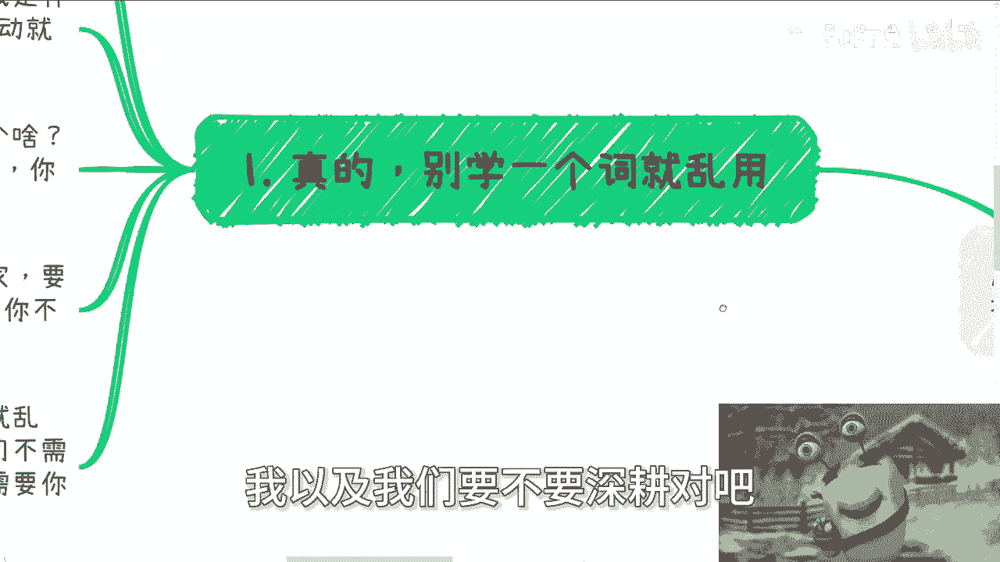
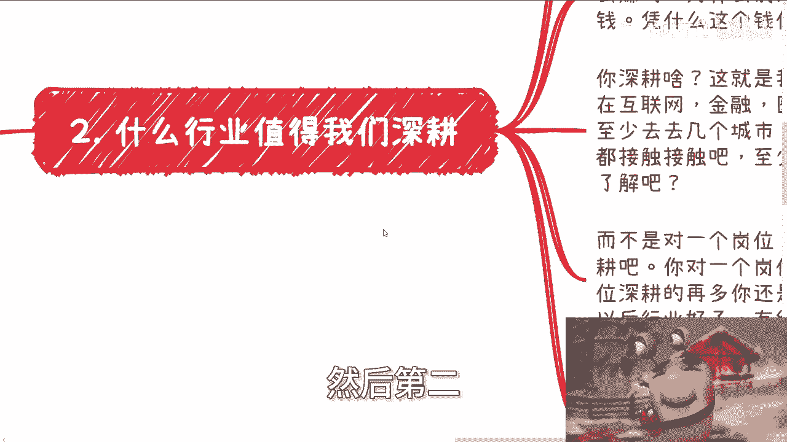
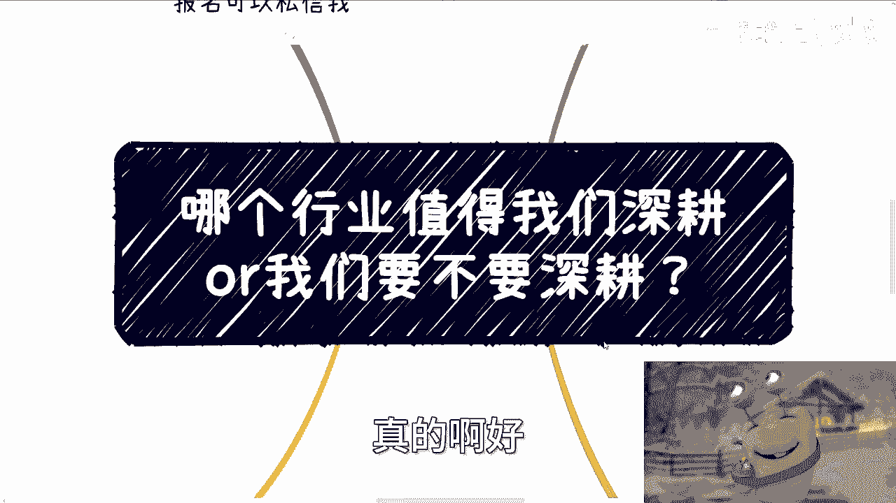
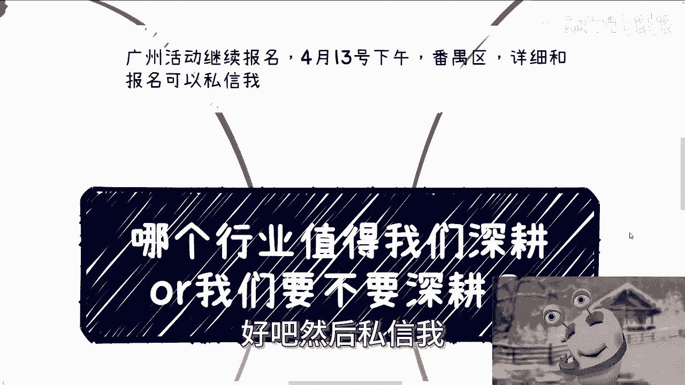

# 哪个行业值得我们深耕 - P1 - 赏味不足 - BV1e1421m7jP

好大家好啊，这个我准备喷了，我跟你们讲真的，我准备喷了啊，哼广州活动继续报名，4月13号下午在番禺区好吧。

然后详情跟报名你们都可以私信我哦，呃今天这个主题呢就是准备喷的主题对吧。

就是哪个行业值得我们深耕哇，我以及我们要不要深耕对吧。

我跟你们讲啊，真的学一个词就他妈乱用啊，我跟你讲，这个词儿我他妈都PTSD了啊，就是你别动不动就生根啊，有啥好生根，我就问你啊，我们先说你是谁，我是谁啊，你是什么人，我是什么人，我不是人吗。

啊你不想想看，你自己不对，自己有点逼数吗，啊我操谁呀，你动不动就他妈生根，谁需要你深耕啊，啊另外我就问你，你会啥，你别搞一个学校毕业，你就牛逼了，你会啥，你告诉我你会啥，我会啥啊，我们会啥。

我们深耕个啥啊，你比如说你说互联网金融，或者说某某某其他行业或者公司，你深耕个啥，你能深耕个啥，你会深耕个啥，你深耕了的啥，你能得到个啥，你知道个啥，对不对，你就好像你从小从小学你就喊喊口号，然后问你。

你你长大要干嘛，然后长大要当科学家，要考清华，懂什么叫科学家啊，什么是清华，你不懂，你就跟着别人喊，有什么意义啊，人家说要生根，你妈就生根生根个屁呀，生根对不对，我跟你讲，我今天开场就先提一嘴啊。

别听到个词就他妈乱用啊，神他妈生根，我就这么说了。

不好意思，这个公司这个社会都不需要你生根，你自己都不需要你生根啊，我就这么告诉你啊，别太当把自己当个人啊，然后第二什么行业值得我们深根对吧好。

我说直白一点，你生根为了什么，你要是为了用爱发电，为了实现自己自己价值，你随便什么行业都可以，只要你热爱对吧，别谈钱，谈钱多俗啊，俗不可耐啊，俗你知道吗，那如果你为了钱，那你就好好了解钱从哪来。

钱怎么赚的，为什么别人会给你单子，为什么别人会给你赚钱，凭什么这个钱你来赚，而不要在那边他妈的每天想什么生根生根，什么玩意儿生根啊，对不对，你这就是我说的战略和战术方向，比如说啊你在互联网行业。

金融行业，医疗行业，农业行业对吧，那你深耕什么东西啊，你深刻的是技术吗，包括很多人跟我说，哎陈老师，我去学个甲板，学个Rest，学学个学个VEE，对吧，学个什么东西，然后呢能赚钱吗，能吗，怎么赚啊。

什么叫是什么，叫那个学习，什么叫战略方向，你首先需要对全局了解，你至少去过几个城市吧对吧，你至少业务C端啊，企业政府的，你得接触接触吧，啊你至少对一些宏观层面的那个案例落地啊。

技术细节你要有所了解吧对吧，这叫学习，这叫了解，这叫为了赚钱做准备啊，而不是说对一个岗位，做什么开发运营销售去深耕，深耕个完蛋啊，深耕你对一个岗位深耕，那就是战略上的错误，你岗位深耕再多。

你还是个工具人，请问跟赚钱有什么关系呢，对吧，以后行业好了，有红利期了，跟你有什么关系呢，你你难道跟别人说，唉老子生根过来，谁他妈吊你啊，搞笑是蛮搞笑的，你知道吗，再说了，战略上你问我哪个行业值得深耕。

我就告诉你都他妈不值得，为什么，因为没有什么东西，你我就问嘛，你生根能得到什么对吧，你就算得到答案，说某某行业值得深根，然后呢我比如说我跟你说医疗行业值得生根，然后呢，你难道K你难道跟我说哎。

那那我去找个路，找找个公司入职，干你入职你能了解多少啊，我早就说过了，劳务关系你能了解多少啊，你这种深耕除了自我感动屁用没有啊。

好第三，我给你讲坦诚点啊。

什么意思，就是你活着你干嘛，你骗别人也可以，骗自己也可以，你有啥好骗的呢，骗到最后不是一无所有吗对吧，那句话怎么说来着，一无所有不好吗是吧，那么大部分人包括我对吧，我告诉你，社会不需要我们深耕。

因为我们不是人啊，我们就是nobody，尼玛搞得好像个人一样的对吧，社会需要的是我们996007，需要的只不过是劳动力，我告诉你们脑力都不算，我早就说过了，大部分岗位谁他妈来了三个月都是熟练工。

哪他妈有脑子。

不需要脑子啊，你们自己扪心自问看看你们的工作有脑子吗，需要脑子吗，所以你要么就是个劳动力，别谈深耕了，自己去PUA，自己就做好一个工具的觉悟，你看看我说工具都不是工具人吗，你们连人都不是，你知道吧。

别去额外的加班，别去额外的付出感情，别去额外的觉得我靠，我他妈要为了这个公司要做做好对吧，我不做好怎么样怎么样，我跟你们说，我现在碰到别人，我跟他们说的最多一句话是什么，就是你们怎么了呢。

你们他妈不加班，公司倒闭了啊，卧槽，太他妈把你们当个人了，你要觉得钱少，我告诉你，你就别去卷工作，你卷工作让你走人，都是别人一句话的事，你再卷也没用，你就认清楚自己，搞得好像我们他妈是个人物一样的啊。

不存在的，我告诉你啊，你要觉得人少啊，你要觉得钱少，你又不自己去赚钱，说自己不知道怎么赚钱，然后又在那边找工作，然后又晋升不了对吧，薪资又没有太大的变化，然后就抱怨工作不好，然后再去跳槽，有用的啦。

这就是个恶性循环啊，你要是觉得钱少，你就去深耕，怎么赚钱，不要好高骛远对吧，你就踏踏实实去了解别人怎么赚的，了解行业怎么赚钱的，了解细节对吧，你不管你什么个人原因还是什么家庭原因，还是什么狗屁原因。

你但凡只要不了解，你不去做，你不去实践，你最终就是整个社会给你定义的炮灰的一员，你就不是一个人，对不对，有什么用呢，你除了在年轻时候20多岁在那边抱怨，抱怨有什么用呢，没有用的啊。

好然后最后一点也是最重要的。

就是做事之前你问问自己的目的，我跟你讲啊，真的做事之前多问自己几个问题，到底为了什么目的，不能模棱两可，然后从目的去反推，你知道吗，就是你看看逻辑成不成立，就比如说你们说要写项目计划书。

对目的是融资对吧，好没问题，那你看看哎呦，你看看你写的项目计划书，那你觉得别人会因为这个项目计划书给你钱吗，对吧，是因为你写的项目计划书别人给你钱吗，还是因为项目计划书上面，你自己在那边YY的那些字。

就是你如果来说没有任何的说服性，没有任何的依据，你觉得别人为什么给你钱呢，你觉得逻辑成立吗，你仔细看看，你就知道不成立对吧，你说要深耕，深耕的目的是什么好，你说目的是赚钱，那么因为你深耕你就能赚到钱吗。

你想想因果关系成立吗，就好像很多人说，因为你吃苦了，你就能怎么样怎么样肯定不能吧对吧，那你深耕什么能赚钱吗，不能吧，你技术提升了能赚钱吗，也不能吧，怎么赚呢对吧，你比如说你告诉我。

你从一个初级到一个到一个高级对吧，或者怎么样子，你能赚钱吗对吧，你告诉别人老子技术牛逼了啊，别人给你钱吗，不可能的，就像我们刚刚说的，你跟别人说啊，老老老老子生根了有用的对吧。

然后最近问我跨境电商也很多，咱就这样说，我说不能做吧，大家肯定不认可对吧，因为你们肯定也看到这么多人赚钱，那我说能做吧，我觉得我良心过不去，为什么呢，因为我知道这种做出来的比例其实很低。

而且前期投入其实也不少对吧，但没办法啊，老百姓不懂，你明白吧，就他们只想知道能或不能，他妈他妈就想知道二极管的答案怎么办呢。

对不对，那还是那句话，你很多人我跟你讲啊，看着他妈的像个人，但其实没有逻辑性的啊，看似有脑子，但其实没有判断力的，所以总结出来就两个字，我跟你讲真的，我跟我跟你们说，你们但凡接触多了，你就会明白。

很多时候很多人就他妈活该真的就是活该对吧，就是就是你你你说值得同情吗，这就是你会发现有些人其实很可怜对吧，你也会发现有些人可能爱他，他觉得就是的确不懂啊，或者来说怎么样，但是你一旦深挖了。

你一旦深深入了解他，你就会发现他妈可怜之人必有可恨之处啊，因为他现在的无知，他现在可怜是什么，这谁造成的，他自己造成怪谁呢对吧，真的我觉得现在还能问出来，说哪个行业我要不要去深耕的这种问题的。

我真的觉得非常的离谱，真正说实话我就觉得很离谱，就是它是既对行业不了解，对产业不了解，对国家也不了解，对整个趋势也不了解，对经济也不了解，对什么东西都不了解，你生根啥，当然了，你要从资本家来讲。

我觉得蛮好的，为什么深耕呗，你跟的越多，就这么简单，嗯哼哎呀，没有意义点，这真的我真的有时候想想就搞笑也蛮搞笑的，真的啊好。

那就这么着啊啊，然后那个那个广州这边活动，你们报名去报好吧，然后剩下的话就是说职业规划产业呃，那个商业规划，然后呢就是包括什么融资啊，股权啊，合同啊对吧，包括你们你们觉得自己有什么牌。

但是呢你们可能觉得不知道怎么打的啊，或者你们希望从我的这个视角来帮你们看看牌，怎么打，牌怎么打的话，你们可以整理好好吧，然后私信我。

