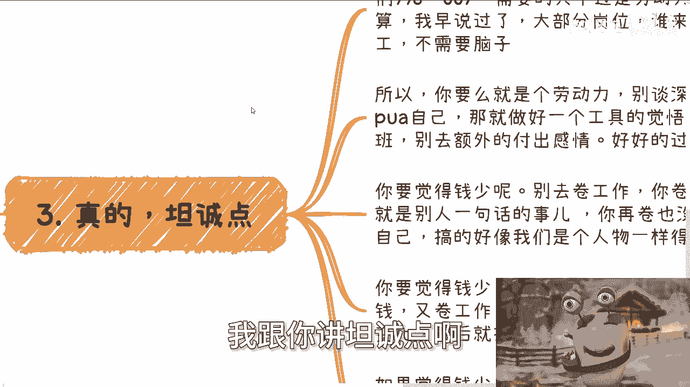
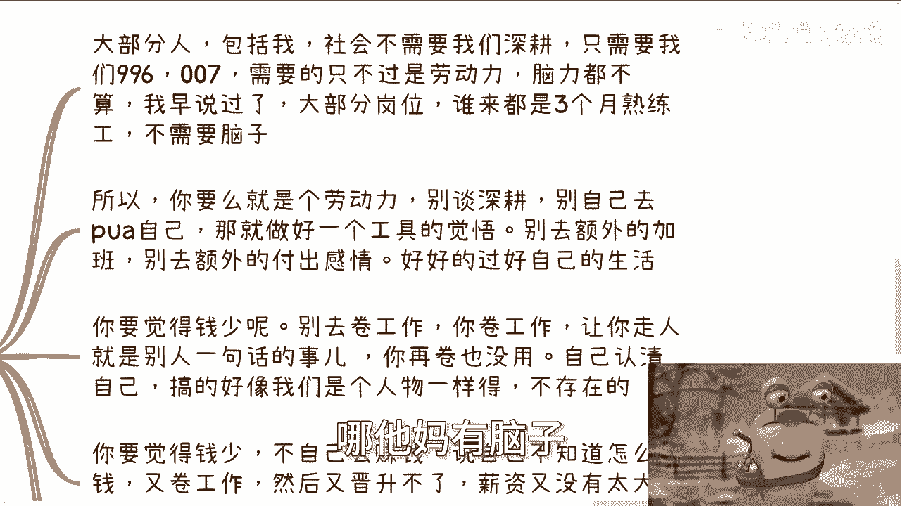

# 课程 P1：哪个行业值得我们深耕？ 🤔

在本节课中，我们将探讨一个常见的职业困惑：“哪个行业值得我们深耕？” 我们将分析“深耕”这个概念本身，并讨论在职业发展中，什么才是真正重要的战略方向。

---

## 概述：对“深耕”的批判性思考

“深耕”是一个被广泛使用的词汇，但我们需要先理解它的真实含义和适用场景。许多人盲目追求“深耕”，却忽略了背后的目的和逻辑。

---

## 第一部分：警惕“深耕”这个词的滥用 🚫

上一节我们概述了课程主题，本节中我们来看看为什么“深耕”这个词需要被谨慎使用。

许多人听到“深耕”就盲目跟风使用。但首先需要问自己：你是谁？你会什么？社会或公司真的需要你“深耕”吗？大多数情况下，答案是否定的。盲目追求对一个岗位或技术的“深耕”，就像小时候空喊“要当科学家”的口号，却不理解其真正含义，毫无意义。

社会并不需要大多数人去“深耕”，个人也未必需要通过“深耕”来实现价值。别把自己太当回事。

---

## 第二部分：明确你的根本目的 🎯

上一部分我们批判了“深耕”的滥用，这一部分我们来探讨行动的根本目的。

做事之前必须明确目的。如果你的目的是“用爱发电”或实现个人价值，那么任何你热爱的行业都可以。但如果目的是赚钱，那么重点就应该放在了解**钱从哪里来**以及**如何赚钱**上。

以下是需要思考的核心问题：
*   别人为什么会给你订单？
*   别人为什么会付钱给你？
*   凭什么这个钱由你来赚？

思考这些问题，比空想“深耕”某个行业更有意义。这涉及到**战略方向**与**战术执行**的区别。例如，在互联网、金融等行业，你需要的是对全局、业务模式（C端、企业、政府）和宏观案例的了解，而不是仅仅对一个具体岗位（如开发、运营）进行“深耕”。

对一个岗位“深耕”再多，你也可能只是一个“工具人”，这与赚钱没有必然的因果关系。即使行业有红利，也未必与你相关。

---

## 第三部分：认清现实与自我定位 🧐

上一节我们讨论了明确目的的重要性，本节我们将坦诚地分析个人在社会中的实际定位。

我们需要认清一个现实：对大部分岗位而言，社会需要的只是劳动力，甚至是无需太多脑力的熟练工。许多工作三个月就能上手，并不需要所谓的“深耕”。

因此，不必额外加班、付出感情或自我感动式地“为公司奉献”。如果你觉得钱少，正确的方向不是在工作内卷，而是去研究**如何赚钱**。不了解、不实践赚钱的逻辑，只会陷入抱怨、跳槽、再抱怨的恶性循环，最终成为社会定义的“炮灰”。

---

## 第四部分：从目的反推逻辑的合理性 🔄

上一节我们强调了认清现实，本节我们学习一个重要的思维方法：用目的检验行动的逻辑。

做事前要多问自己“为了什么目的”，并从目的反向推导逻辑是否成立。这是一个关键的判断方法。

例如：
*   **目的**：写项目计划书是为了融资。
*   **反推**：别人给你钱，是因为你写的计划书，还是因为计划书背后有说服力的依据和逻辑？如果计划书只是你的空想，逻辑就不成立。

同样地：
*   **目的**：“深耕”是为了赚钱。
*   **反推**：因为你“深耕”了，所以你就能赚到钱吗？这个因果关系成立吗？技术提升了就等于能赚钱吗？

很多人看似有脑子，但缺乏这种基本的逻辑判断力。就像很多人问“跨境电商能不能做”，只想要“能”或“不能”的二极管答案，却不自己去研究其赚钱的比例、前期投入和具体方法。

---

## 总结与行动建议 📝

本节课我们一起学习了如何理性看待“深耕”这个概念。

总结如下：
1.  **慎用“深耕”**：不要盲目追求词汇，先审视自身和社会需求。
2.  **目的先行**：明确你做事的根本目的是实现价值还是赚钱。
3.  **聚焦赚钱逻辑**：如果为了赚钱，就去研究钱从哪里来、如何获取，而不是局限于岗位技能。
4.  **认清定位**：大部分工作是重复性劳动，避免不必要的自我感动和内卷。
5.  **逻辑反推**：用“从目的反推”的方法检验任何计划或行动的合理性。

最终，许多人的困境源于对行业、产业、经济趋势的不了解。改变的第一步是停止空想，开始基于明确的目的和严谨的逻辑去了解和实践。

---

**附：活动与咨询信息**
广州线下活动开放报名。如有职业规划、商业规划、融资股权、合同法律等问题，或不知如何发挥自身优势（“打牌”），可整理好具体情况私信咨询。