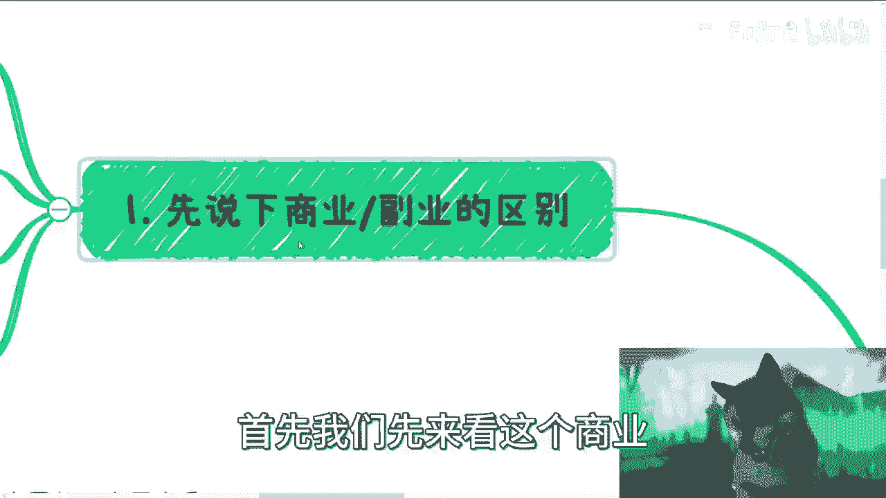
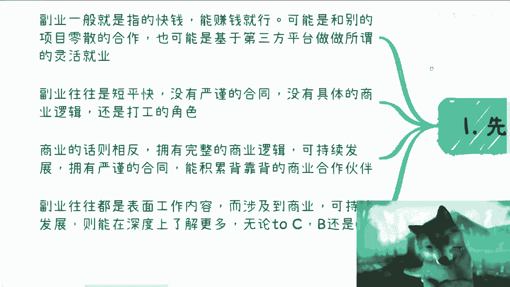
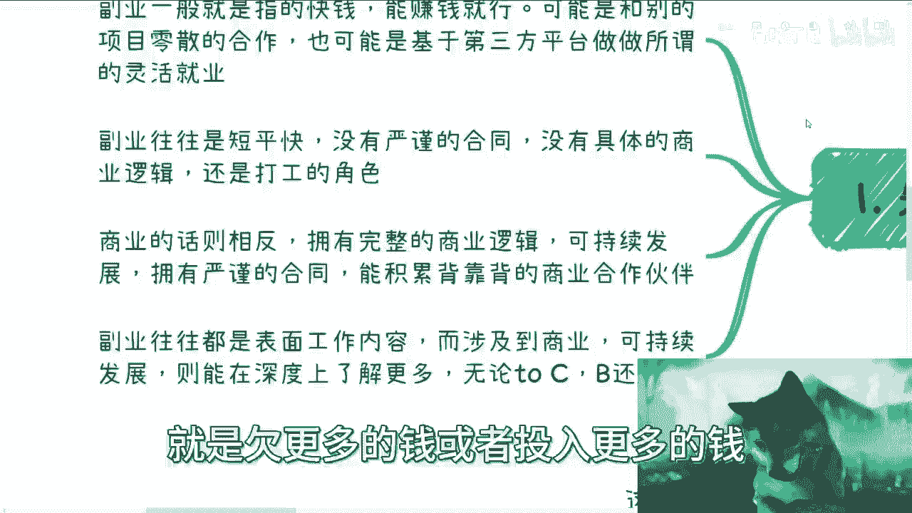
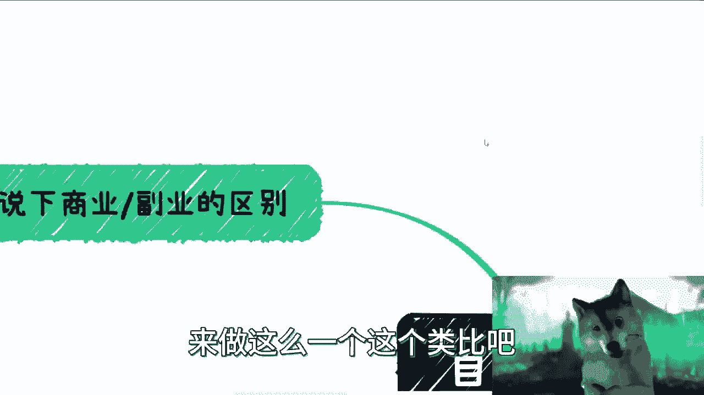
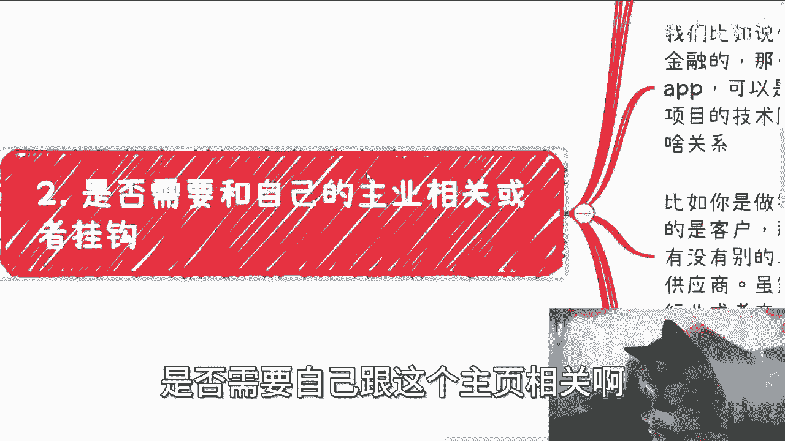

# 商业副业规划指南 P1：关联度与全职选择 🧭

在本节课中，我们将探讨一个常见问题：开展商业或副业时，是否需要与主业保持关联，以及是否需要全职投入。我们将从定义出发，分析不同情况下的考量因素，并提供清晰的决策思路。

## 1. 商业与副业的区别 📊

上一节我们提出了核心问题，本节中我们来看看商业与副业的基本区别。理解这两者的差异是后续决策的基础。

副业通常是商业的一个子集，其核心特征是追求“快钱”。副业的目标是能赚钱即可，其合作模式往往是零散、非紧密且不可持续发展的。合作通常是“case by case”，做一笔算一笔。许多副业基于第三方平台（如抖音、B站、微博）开展。

相比之下，真正的商业需要拥有**完整的商业逻辑**。虽然具体业务也是逐个开展，但与合作伙伴、上下游的关系是**可持续发展**的。商业合作具有可复制性，并依靠严谨的合同来积累背靠背的商业伙伴。

以下是两者核心特征的对比：

*   **副业**：点状业务，横向纵向扩展有限；合作零散；通常不涉及严谨的合同；从业者可能处于商业链路的“散户”或“打工”角色。
*   **商业**：涉及完整的商业链路；横向纵向扩展性强；合作可持续、可复制；从业者更像“庄家”或项目主导者，能深度参与价值分配。

简单类比：做商业如同成为某个生态中的“庄家”，而做副业则更像其中的“散户”。

## 2. 是否需要与主业关联？🔗

理解了商业与副业的区别后，我们来看看它们是否必须与主业相关。这一点没有绝对标准，但可以根据行业和岗位特性来判断。

如果所在行业广阔，路径宽，且不涉及核心机密，那么在做好信息脱敏和保密工作的前提下，关联与否并不重要。反之，如果行业窄、公司是头部企业或上下游公司高度集中，则最好避免强关联，以减少潜在风险（如被举报）。

关键在于，你发挥的往往是岗位上的**通用能力**，而非必须与主业内容强绑定。

以下是几个基于通用能力开展副业/商业的例子：

*   **开发岗位**：你的核心能力是编程与逻辑。你可以开发独立App、从事K12数学教育、承接外包项目或提供技术咨询。这些运用了你的开发能力，但与你是做农业开发还是金融开发的主业无关。
*   **销售岗位**：你的核心能力是客户积累与关系拓展。你可以为客户对接其所需的其他产品或服务（如英语教育、私教、高尔夫），只要不与本公司产品产生直接竞争即可。你发挥的是销售能力，而非绑定于特定行业。
*   **金融岗位**：你的优势可能在于口才、商业认知及对合同、法务的理解。你可以在任何行业构建关系网，发起或组织项目，承担更多“离钱近”的职责。

寻找机会的方法可以很灵活，例如通过定期的小型聚会进行头脑风暴，现场组合团队，尝试项目合作，并定期复盘。这种方式本身就可以孵化出商业逻辑。

## 3. 是否需要全职投入？⏰

接下来，我们探讨全职投入的必要性。全职与否和能否赚大钱没有直接的因果关系，它更多影响的是他人对你的认知和合作效率。

兼职会给合作方一种“这只是你众多业务线之一”的感觉，对方可能认为你不够上心，从而更倾向于寻找全职的合作者。此外，商业沟通讲究时效，兼职者可能因主业工作时间冲突而错失机会，许多客户沟通也无法仅安排在周末。

更重要的是，全职与否决定了你在行业内的“身份”。全职打工，别人对你的印象就是“打工者”；兼职做业务，你可能被视为“非核心人员”。只有全职投入自己的业务，别人才更可能认为你在该领域深耕，是值得合作的对象。一旦选择全职打工，可能会与原有行业的关系网脱节，因为合作方会因各种潜在风险（如竞争关系、公司立场）而避免与你进行深度商业合作。

本质上，打工是为公司创造价值，难以积累个人在行业内的独特价值。你更像是行业里的一个“执行单元”，而非拥有自身商业节点的参与者。

## 4. 核心：能力认知与资源整合 🤝

最后，我们需要认清一个核心逻辑：你自己会什么并不绝对重要，**别人认为你会什么才重要**。关联度与是否全职都是表象，关键在于你如何呈现自己和整合资源。

如果你擅长“画饼”和包装，即使兼职，也可以通过强大的人格魅力或资源整合能力（比如找到全职伙伴执行）来推进业务。你可以通过整合身边有解决方案、咨询或投行资源的朋友，来包装自己的服务能力。

关于全职，理想情况是你能“决胜于千里之外”，但这通常需要你有全职的合作伙伴或执行团队。对于大多数人起步而言，从“资源撮合”做起是务实的选择。商业中存在许多通过撮合资源赚取渠道费（如10%-20%）的模式，并且这个过程可以复制。关键在于寻找愿意与你合作的人，而不是纠结于那些拒绝你的人。

从赚钱的角度出发，路径应该是**怎么简单怎么来**。

## 总结 📝

本节课我们一起学习了如何规划商业副业，特别是关于关联度与全职选择的决策。

1.  **商业与副业有别**：副业求快钱、合作散；商业重逻辑、求可持续。
2.  **关联度无定论**：发挥通用能力，而非绑定主业内容；注意行业特性，做好风险规避。
3.  **全职影响认知与效率**：全职投入有助于树立行业专业形象，保障合作响应速度。
4.  **核心是价值呈现与整合**：别人对你的认知比你的实际技能更重要；从资源撮合起步是可行路径，关键在于行动起来，寻找合作者。

最稳妥的路径通常是：保持主业稳定，同时积极探索副业/商业。待新业务稳定后，再考虑将主业转为副业或全职投入新业务。请记住，能伴随你一生的，是你在商业世界中积累的合作伙伴、关系网络以及行业对你的定位和认知，这才是真正的个人价值与稳定性所在。