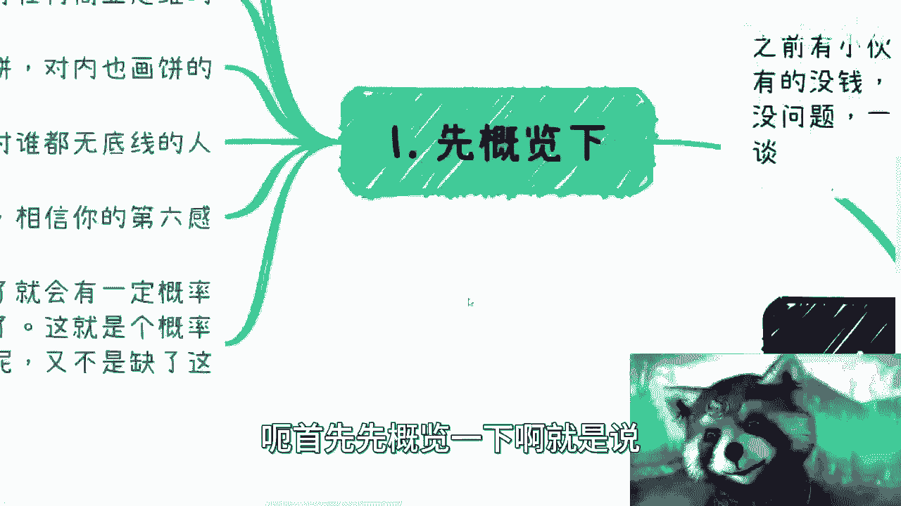
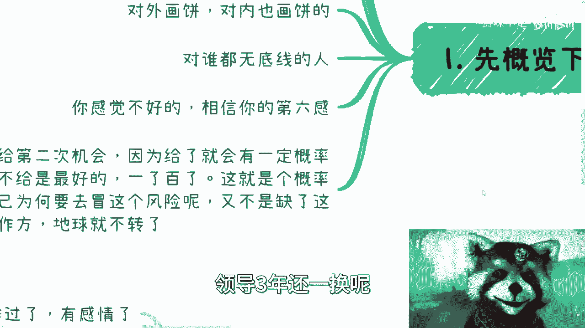
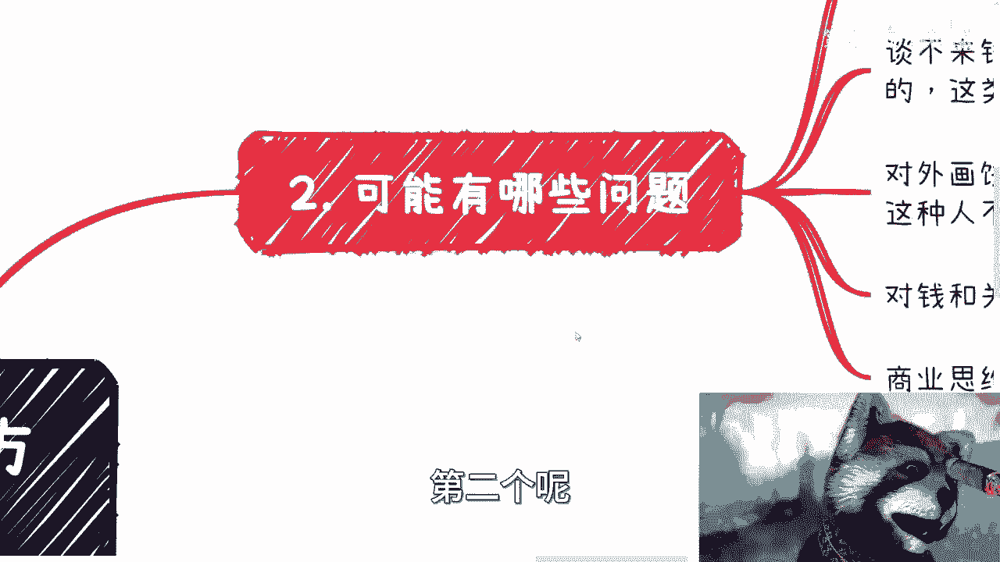
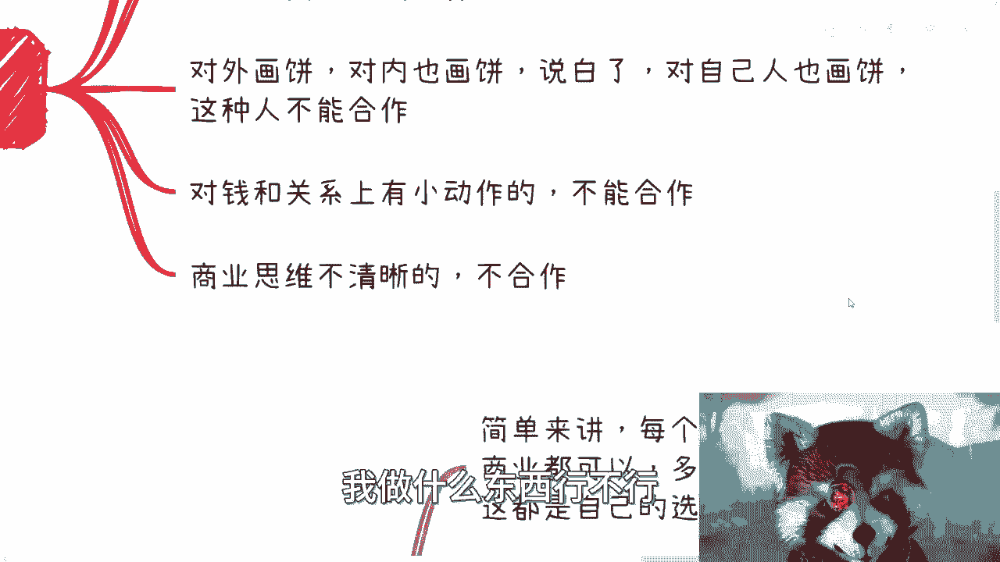
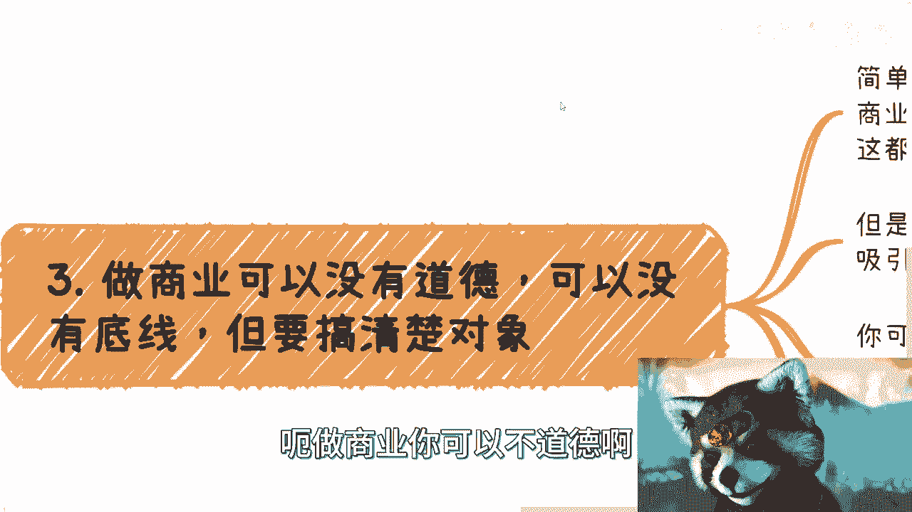
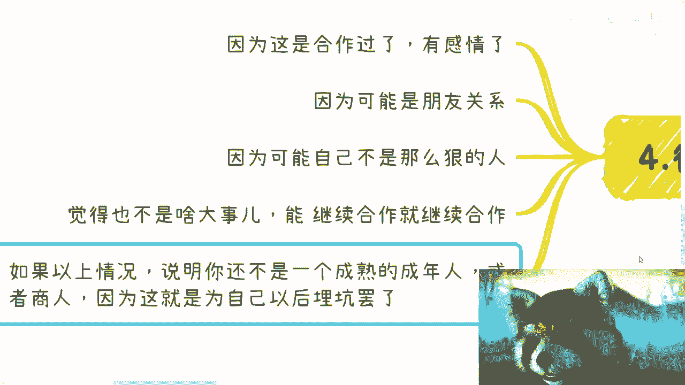
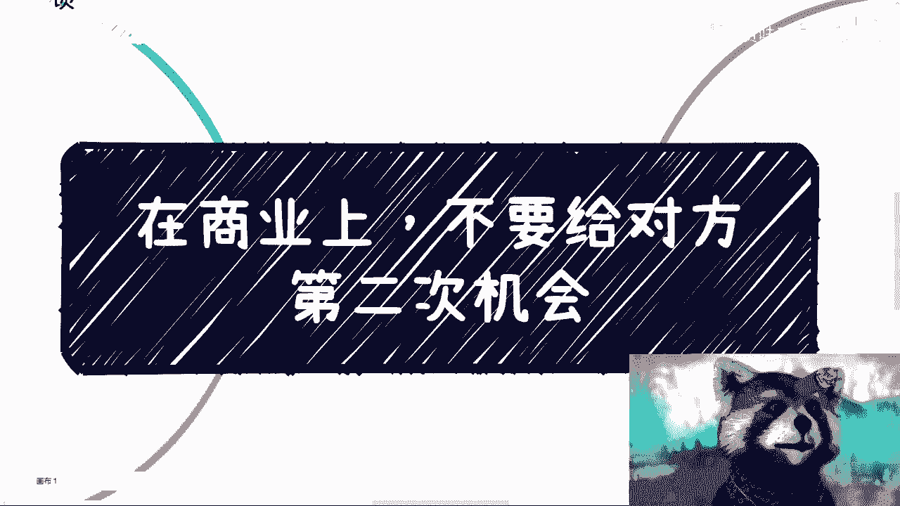

# 商业合作避坑指南 - P1 - 不要给对方第二次机会 🚫

在本节课中，我们将要学习一个核心的商业合作原则：**不要给对方第二次机会**。我们将探讨为何要坚守这一原则，识别哪些合作对象需要警惕，并理解商业思维的本质，以帮助你在商业决策中保护自己的利益。



---

## 概述：为何要警惕“第二次机会”？

在商业合作中，感性决策往往带来风险。本节将概述一个核心观点：一旦发现合作方存在问题，最安全的做法是终止合作，而非给予其修正的机会。这并非冷酷，而是基于概率和风险控制的理性选择。

---





## 识别需要警惕的合作对象

上一节我们介绍了核心原则，本节中我们来看看哪些具体的信号表明你应该停止合作。以下是几种需要警惕的合作对象类型：

1.  **长期合作但不赚钱**：双方态度良好，持续有合作，但始终无法产生实际利润。签订的合同也常是“不痛不痒”、缺乏直接金钱约束的类型。这种合作消耗资源却无回报。
2.  **无法有效谈论金钱**：无论其沟通能力多强，一旦涉及具体利益分配、报价等金钱话题，就变得支支吾吾、不痛快。这种人可能在合作后因内心不平衡而引发矛盾。
3.  **无差别“画饼”**：对外和对内（包括合伙人）都习惯性夸大其词、承诺无法兑现的事情。在商业合作中，对利益共同体“画饼”无异于欺骗，会彻底破坏信任基础。
4.  **在金钱或关系上搞“小动作”**：例如，不直接沟通，却在背后向第三方抱怨合伙人或合作细节。这种行为表明其关注点不在共同赚钱，而在搞内部斗争，缺乏格局和商业敏感度。
5.  **商业思维不清晰**：这是一个综合判断。例如，无法理清赚钱模式、合作逻辑、投入产出比或完整的商业变现链路。简单问出“做XX行不行”而缺乏自身分析，也是思维不清晰的表现。

---

## 商业中的道德与规则边界

识别了危险信号后，我们需要理解商业行为的边界。你可以选择你的商业道德水准，但必须明白其后果。

**核心公式**：**你的行为模式 → 吸引同频的合作群体**

这意味着：
*   你可以采取一些激进的商业策略。
*   但绝不能破坏某些成文或不成文的**行业基本规则**。
*   尤其不能欺骗或损害**潜在未来合作方**或**竞争对手**的利益。

因为商业世界没有永恒的朋友或敌人，只有永恒的利益。破坏规则、毫无底线的行为，会切断你未来所有的合作可能性和上升空间。**赚钱的前提是路越走越宽，而不是越走越窄。**

---

## 为何人们总会心软？






尽管道理清楚，但很多人仍会心软，给予第二次机会。常见原因包括：顾及旧情、朋友关系、自我感觉“不够狠”、或认为问题“微不足道”。

**核心代码逻辑**：
```python
if 合作方出现警示信号：
    if 决策基于“感情”、“不好意思”或“侥幸心理”：
        结果 = “为未来埋下风险”
    else if 决策基于“商业利益”与“风险控制”：
        结果 = “终止合作，规避风险”
```
成熟的商业决策者必须明白：一切应以商业成功和规避风险为重。抱有侥幸心理，就等于在为自己的事业埋雷。

---

## 什么是真正的商业思维？


最后，我们来总结一下何为成熟的商业思维。它不仅仅是“赚钱”，而是拥有一套完整的系统化思考方式。

以下是判断商业思维是否清晰的清单：
*   **变现链路**：是否想清楚了钱从何处来、由谁支付？
*   **稳定性**：是否有稳定的客户来源、合作渠道或产品？
*   **执行细节**：合同如何签？税务如何处理？资金如何交割？
*   **积累性**：所做之事是可持续、可积累的“商业”，还是不可复制的“外快”？




真正的商业在于构建可沉淀、可增长的系统，而非追逐一次性的零散收益。在做选择时，**应先确保有一个稳定的基础（A），再考虑是否叠加其他机会（B、C、D）**。

---


## 总结与行动建议

本节课中我们一起学习了商业合作的核心避险原则。记住以下几点：
1.  **果断止损**：遇到有问题的合作方，不要给予第二次机会。
2.  **理性识别**：警惕不赚钱、谈不来钱、爱画饼、搞小动作、思维不清的合作对象。
3.  **遵守规则**：在规则范围内行事，为未来留出合作空间。
4.  **强化思维**：用系统性的商业思维（变现、稳定、细节、积累）替代感性和侥幸心理。

在商业世界，保护好自己的利益和事业，是走向成功的第一步。



---
*（注：关于亲戚间的合作，核心建议是：涉及金钱务必签署正规商业合同，否则免谈。）*